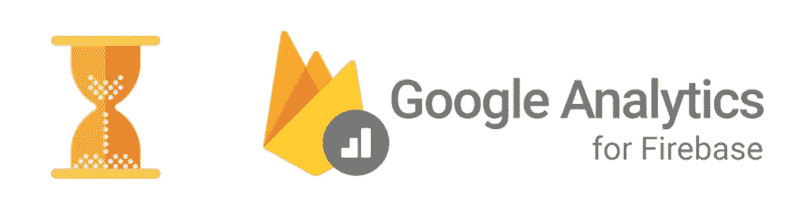
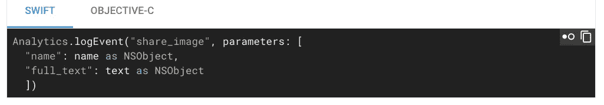
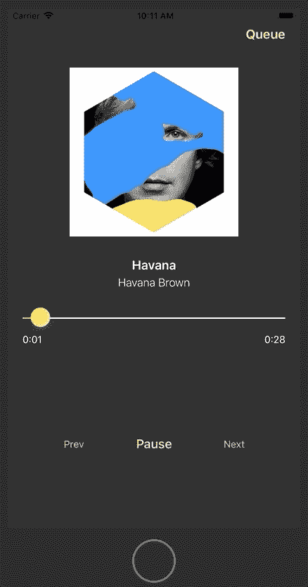
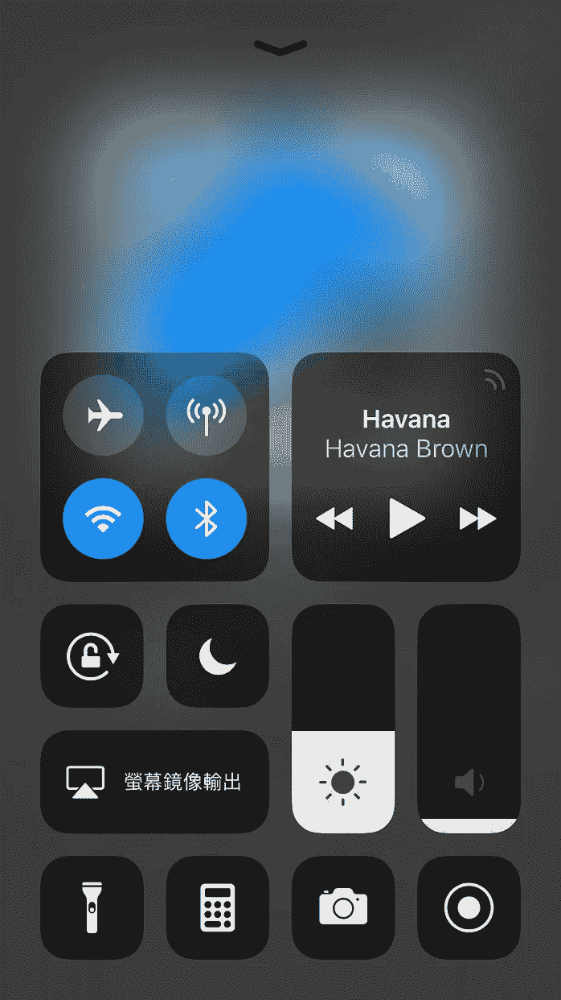
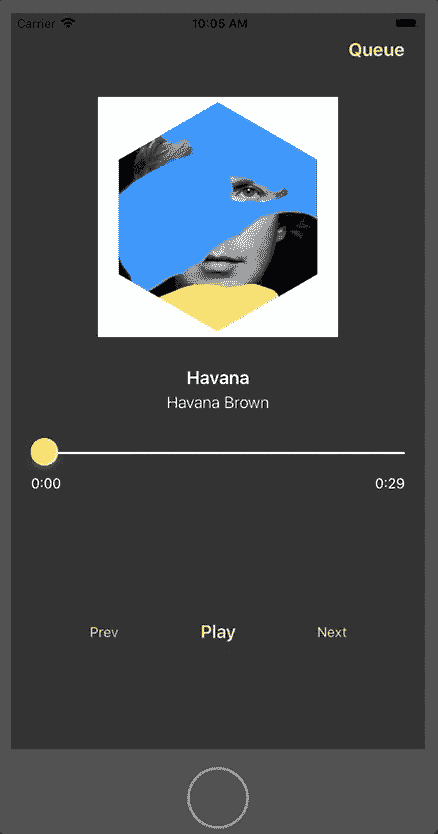
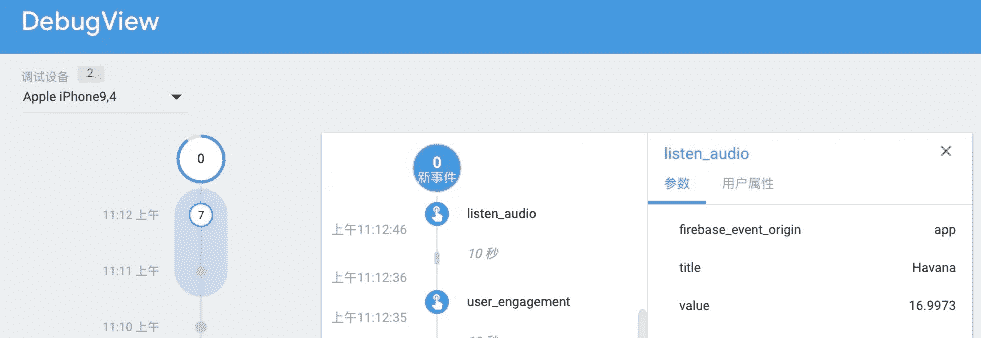

# 记录媒体持续时间，并将其发送至 Firebase Analytics

> 原文：<https://itnext.io/record-media-duration-and-send-it-to-firebase-analytics-89943077a078?source=collection_archive---------4----------------------->

有一件事 Flurry 做得比 Firebase 好:记录时间。只要简单的看一下`logEvent` API，然后马上就明白了。

Firebase 日志事件

我们的经理已经决定使用 Firebase，所以我的目标是创造一种方法，可以帮助记录“在一个会话中音频播放了多长时间。”

要使这个框架正常工作，有三个主要要求:

1.  **精确合理的持续时间:**用户可以通过拖动滑块，或者按下暂停按钮⏸️然后按下播放按钮▶️.前者可以给你错误的持续时间，如果你使用音频的`currentTime`；后者会导致持续时间被分割成小的定时事件。我们必须把这些时间段加起来，得到一个合理的持续时间。
2.  **后台工作:**用户经常在后台模式下播放音频，包括命令中心。然而，`Timer` [在后台模式](https://www.raywenderlich.com/5817-background-modes-tutorial-getting-started)下不起作用。

> 你的应用程序只允许在非常特殊的情况下在后台继续运行。例如，这些包括播放音频、获取位置更新或从服务器获取最新内容。

3.**处理不当终止:**有些用户干脆在音频还在播放的时候就把 app 干掉。在这种情况下，我们必须自动记录持续时间。

对应于上面列出的情况。

## 我的解决方案——记录时间戳

经过一些尝试后，我通过记录音频播放和暂停的时间戳找到了答案。减去开始时间戳的总和和暂停时间戳的总和，我们得到正在播放的音频的持续时间。

## 其他需要知道的事情

`**withoutSpecialCharacters**` **:** Firebase 在`logEvent`事件中不接受特殊字符和空格。我们必须自己处理。

`**popTimeArrayOf**` **:** 由于应用程序在音频播放机制上有不同的问题，我提供了一个弹出最后一条记录的方法。例如，在用户按下播放 button▶️之前，一些应用程序可能会经历`loading` → `pause`，因此开发人员必须弹出意外的暂停时间戳。

唯一的缺点是 Firebase 在应用程序终止`applicationWillTerminate`时不工作，所以我们决定在用户下次打开应用程序`application(: UIApplication, :didFinishLaunchingWithOptions)`时发送 Firebase 事件。

最后，如果你在 Firebase 的 DebugView 中看到你的记录，你就成功了。🎊

演示项目可以在我的 GitHub 下载[。](https://github.com/ji3g4kami/AudioPlayer)