# Reddit 的投票用户界面 Vanilla vs React vs Vue vs Hyperapp:阐明前端框架的目的

> 原文：<https://itnext.io/reddits-voting-ui-in-vanilla-vs-react-vs-vue-vs-hyperapp-shedding-light-on-the-purpose-of-spa-ee6b6ac9a8cc?source=collection_archive---------0----------------------->

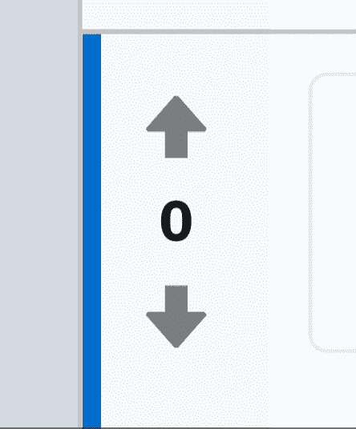

Reddit 投票用户界面

许多初学者可能想知道 SPA(单页应用程序)库/框架的目的是什么。为什么他们不能使用普通的旧 JavaScript，因为它可以实现同样的事情而不会膨胀？它们的目的是什么，为什么被如此炒作？

从本质上讲，这些库旨在简化交互式 web 应用程序的构建。用户经常以喜欢帖子、上传图片、与朋友聊天、发表评论等形式与网站互动。这种交互性包括在用户与页面交互时更新 DOM 元素以反映新数据。

例如，“喜欢”按钮可能有两种 JavaScript 状态:不喜欢和喜欢。它可能还定义了 CSS 状态，比如:hover，:active 和:focus。CSS 状态很容易管理，但是 JavaScript 状态可能会很棘手。为了让用户知道他们成功地按下了“喜欢”，按钮会永久地改变外观，不管他们是悬停在它上面、按下它还是聚焦它。他们还需要能够撤销这个操作，同时将数据发送到服务器，让应用程序知道用户做了什么。这种更新元素的过程通常很耗时，而且容易出错，尤其是在大中型应用程序中。

但是，你不能只相信我的话。你需要通过实例体验才能真正理解*为什么*。这就是这篇文章的内容！此外，还将对这些库进行比较，看它们如何实现相同的目标，以及哪一个最出色🌟。

# 香草

让我们从一个实际的例子开始，从我们可靠的原生库 Vanilla.js 开始。

reddit.com 网站有一个投票界面，由两个按钮和一个分数组成:一个向上投票按钮将分数增加 1，一个向下投票按钮将分数减少 1。分数是由用户投票给帖子或评论的数字，作为其质量的指标。这个 UI 元素背后的逻辑实际上比您最初设想的要复杂。为了简单起见，这个 UI 的服务器请求方面将被省略。

在最基本的情况下，HTML 标记可能如下所示:

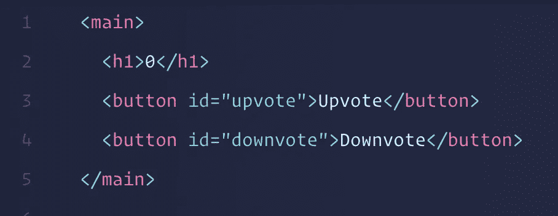

Reddit 投票标记

当用户按下 upvote 按钮时，我们希望`h1`元素中的文本增加 1。相反，当他们按下 downvote 按钮时，我们希望它减少 1。

要对这些元素做任何事情，我们需要使用`document.querySelector()`选择它们，这样我们就可以在 JavaScript 代码中使用它们。

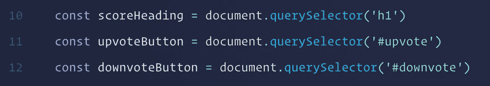

我们想在用户点击按钮时做出反应。为此，我们需要向它们添加一些事件侦听器。

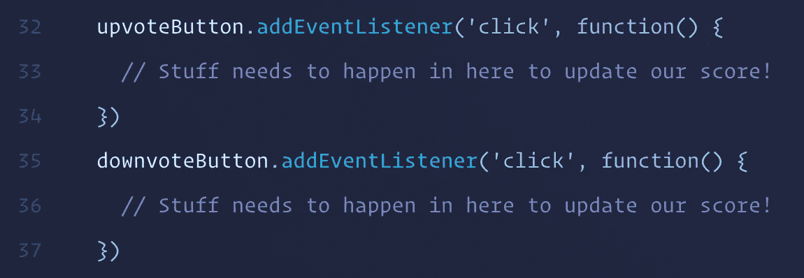

现在，这些侦听器函数中应该包含什么？为了理解，让我们来分解一下当我们与 UI 交互时会发生什么。

假设我们有一个得分为`0`的帖子。

*   我们按下 upvote。会发生什么？现在比分是`1`。
*   **我们再次按下 up vote**会发生什么？比分现在是`0`。为什么？因为我们不能像计数器一样永远向上投票。再次按下它意味着我们正在“撤销”我们的投票，重新设置它。
*   这次我们按下反对票。会发生什么？现在比分是`-1`。
*   我们再次投票。会发生什么？比分现在是`1`。注意分数增加了`2`，从`-1`到`1`。这部分可能有点棘手。

在整个交互过程中，我们需要保持两个变量:分数和用户自己的投票。这两个值共同决定了当他们按下其中一个按钮时会发生什么。这个概念被称为**状态，**，它描述了我们的应用程序的数据或内存。事情如何运作取决于应用程序的当前状态。

## 逻辑🔮

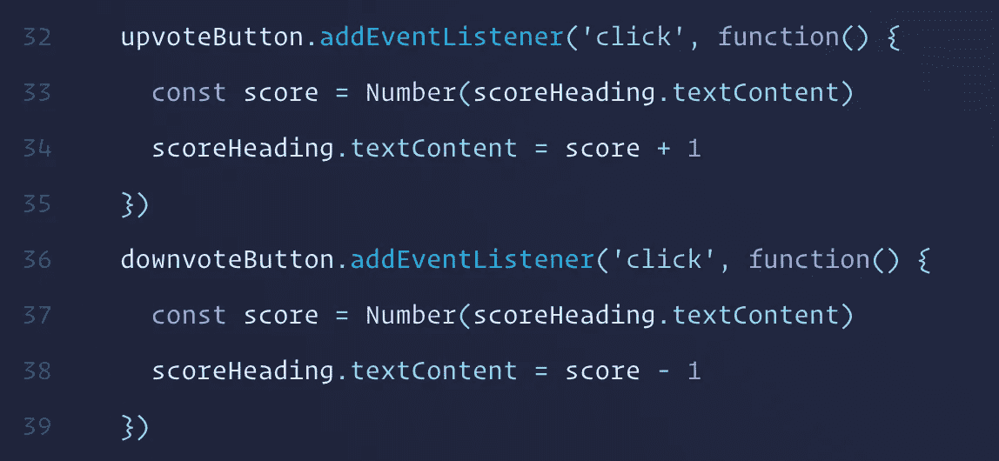

现在这就像一个计数器，但是我们会慢慢开始。我们通过将`scoreHeading`元素的`textContent`抛出到`Number()`构造函数中来获得当前分数，这确保了我们有一个与数学运算符`+`和`-`一起工作的数字。然后我们将`textContent`设置为当前分数加 1 或减 1，这取决于我们点击了哪个按钮。

但是这还不是我们想要的😢。

我们需要能够“撤销”我们投票表决的内容。这就是国家发挥作用的地方。我们需要一些“真实”的来源来告诉我们应用程序的当前状态。使用 vanilla，这通常是通过将数据存储在 DOM 本身来实现的，通常作为一个类。那么，为什么不呢？

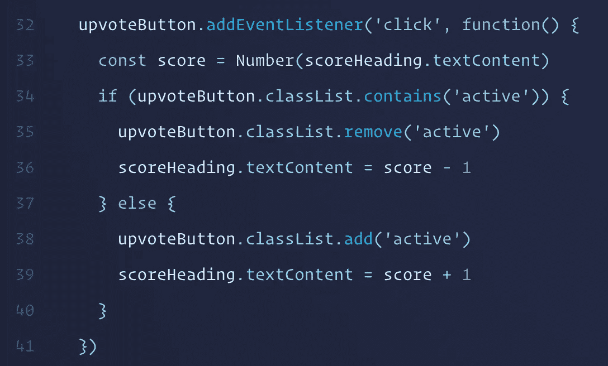

我们将使用类`active`来确定按钮是否被按下，以及是否是用户当前的投票。

如果按钮的`class`包含`active`，那么我们知道他们在撤销他们的投票，所以我们需要把`1`去掉。如果没有，我们知道他们还没按，我们就加课，把`1`加到分数上。

现在是拼图的第二块。当他们已经投票了，但现在选择了相反的投票，我们该如何处理？如前所述，这会导致分数相差 2 分。

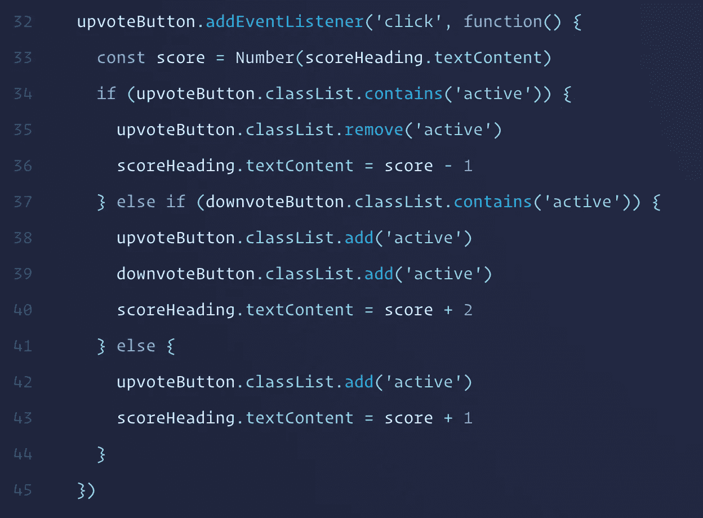

如您所见，我们需要另一个分支来检查对面的按钮当前是否处于活动状态。如果是，我们需要删除它的类，将添加到我们的 upvote 中，然后将`2`添加到分数中。我们还需要以相反的方式对 downvote 按钮重复这一过程，最终我们会得到这段很长的代码。

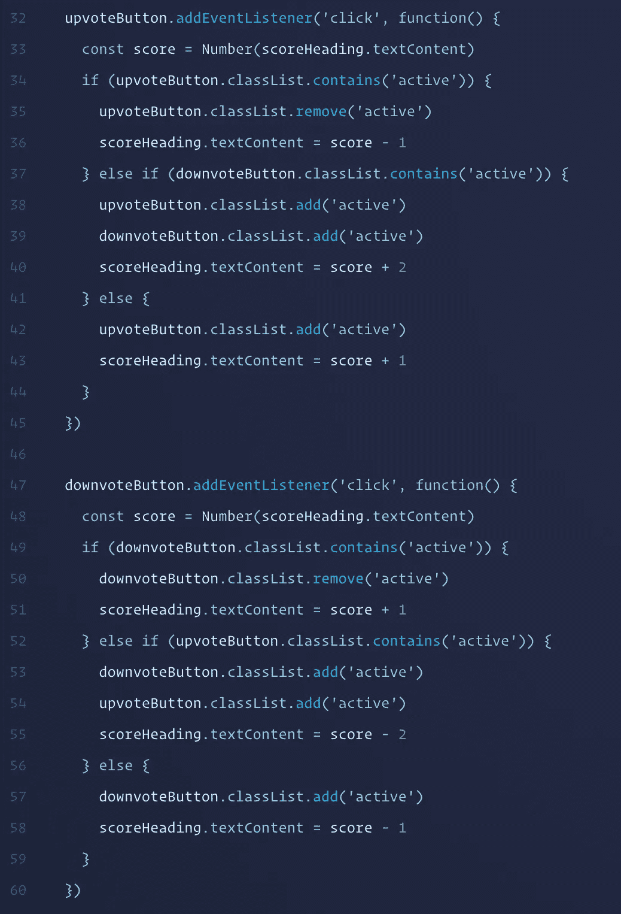

嗯，那有很多代码，而且是重复的。我们不能把它弄干(不要重复你的话)吗？是的。

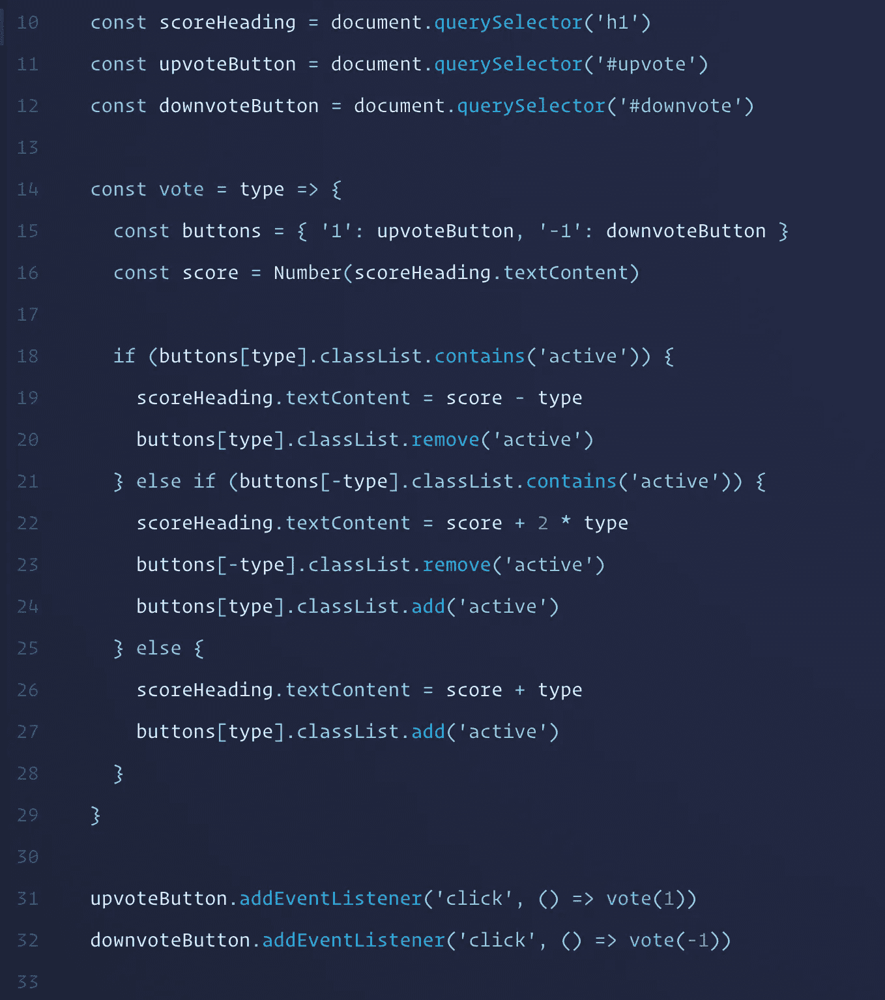

这是我们的全部代码，干干净净的(除了重复`active`类)。

普通 Reddit 投票用户界面

你可能想知道这有什么不好。许多软件开发人员认为这种被称为**命令式编程**的方法远不如它的表亲**声明式编程**。这些看起来像是花哨的术语，但实际上并非如此:

*   **命令式编程**:如何用涉及到的步骤做一些事情。
*   **声明式编程**:某样东西应该是什么或者做什么。这些步骤被抽象掉了。

正如您所看到的，我们的方法属于前一类，因为我们必须在用户与按钮交互时手动更新 DOM 元素，以反映这些变化。这是一个循序渐进的过程，涉及大量的人工检查和分配。这种类型的编程会导致更多的错误，因为有更多的工作要做。

如果我们可以说，“当某些变量是这些值时，我们希望 UI 看起来像这样”，这不是很好吗？您已经用 CSS 做到了这一点。

```
transition: opacity 0.5s;
```

你所需要做的就是声明你想让元素的不透明度属性在它改变值的时候转换半秒钟。就像那样，它工作了。你不需要用某种补间算法和`requestAnimationFrame`来手动更新不透明度。浏览器为你做了所有艰苦的工作，你不需要担心任何事情(除了有浏览器错误的时候，可悲的是这些年已经有很多了)。

# 反应，Vue，Hyperapp 等。

回到这些事情上。他们如何使我们的代码更具声明性，这样我们在更新数据时就不需要接触 DOM 了？了解 API🤓。

在每一个中，都有四个基本概念被它们的 API 所掩盖:

*   **状态**:包含我们 app 的数据/内存/原始信息的对象。
*   **动作**:更新状态的函数或方法。
*   **视图:**呈现给用户的状态的 UI 或可视化表示。
*   **DOM 生命周期:**我们的应用程序被挂载到 DOM，当用户与应用程序交互时，元素会发生变化(创建、更新、销毁)。每当状态改变时，视图就会更新，DOM 也需要改变来反映它。

现在我们已经有了这些核心概念，让我们直接进入投票 UI 的 React 版本，因为根据 npm 下载量，这是最受欢迎的。

# 反应

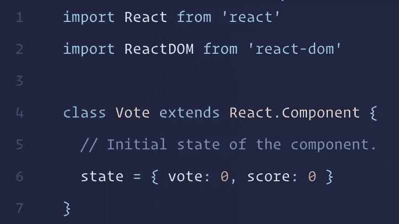

导入必要的 React 模块后，我们创建一个类并初始化组件的状态。

*   `vote`是用户当前的投票。`0`无票，`-1`投反对票，`1`投赞成票。
*   `score`是帖子的配乐。

我们现在有了一个表示应用程序的状态对象，但是我们没有办法向用户显示它。让我们使用 React 组件的`render()`方法。

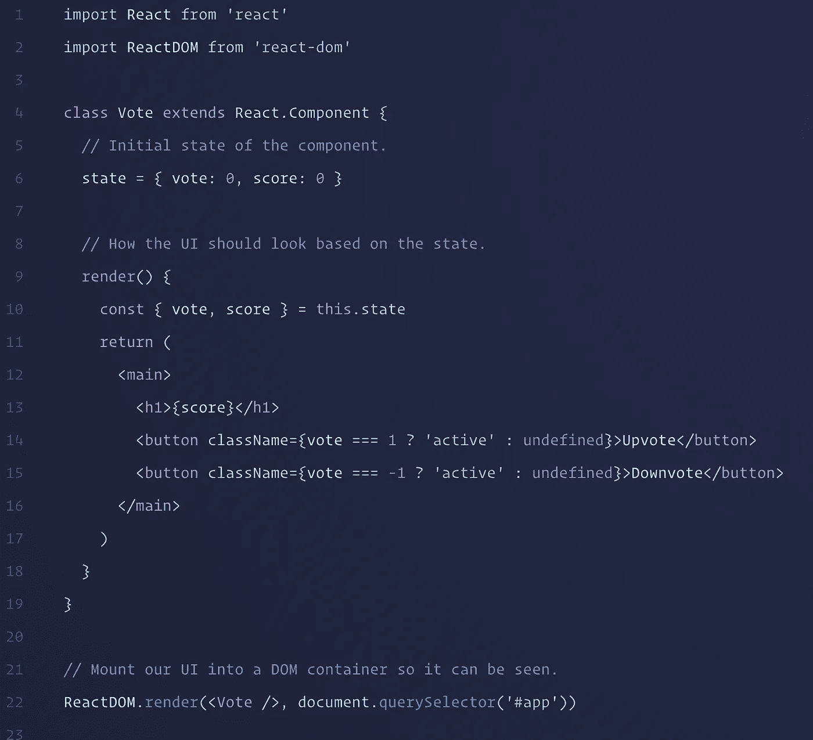

进行析构是为了最小化演示的线宽，这并不是真正必要的。

React 有一些特性，比如在 JavaScript 中使用类似 HTML 的语法，称为 JSX，并使用 DOM 属性名，如`className`而不是`class`。这是因为那些小小的 HTML 标签实际上是伪装的 JavaScript🤡。现在，您不需要知道为什么，我们稍后会谈到这一点。

这可能看起来有点奇怪:

`className={vote === 1 ? 'active' : undefined}`

它包含了一个重要的概念:基于状态，按钮的`class`是一些字符串。我们使用一个三元运算符，如果用户的投票与按钮匹配，那么这个类就是`'active'`，或者根本没有类，因为它的值是`undefined`。这是声明性的，因为我们描述的是基于状态的类，而不是如何手动更新它。

无论如何，一旦我们将组件安装到 DOM 中，这样我们就可以实际看到它了，我们将会看到熟悉的景象。除了什么也没发生，因为我们没有互动！我们还没有向按钮添加事件监听器，当用户按下按钮时，事件监听器会改变按钮的状态，这是关键所在。

要在 React 中添加一个事件监听器，您可以在我们的 sneaky HTML 元素上使用一个属性，其形式为`onEvent`。在我们的例子中，我们关心的是`click`，所以我们想要`onClick`。这是语义上的，所以它是这样写的，“在[用户]点击时，运行这个功能来做一些事情”。在我们的例子中,“某物”是一个改变投票组件状态的函数，我们的 UI 将把它反映给用户。

我们需要给我们的组件添加一个名为`vote()`的方法，这是一个很好的描述正在发生什么的动词。我们应该将一个`onClick`侦听器绑定到我们的元素，该元素将调用这个方法并传入一个值，要么是代表向上投票的`1`，要么是代表向下投票的`-1`。

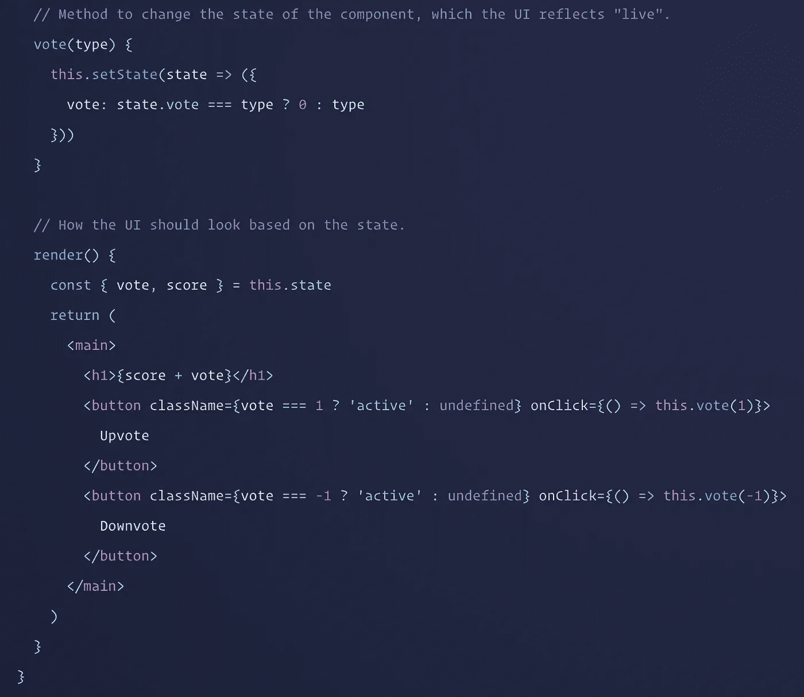

为了更新状态，反过来总是更新 UI，我们使用了一个继承自`React.Component`的方法，名为`setState()`(这就是我们扩展组件的原因)。当我们调用这个函数并传入一个对象时，它会将其与当前状态对象合并以产生一个新的状态。在我们的例子中，我们传入一个返回新的部分状态对象的函数，因为这样访问当前状态是最可靠的。

## 解释逻辑

设置`state.vote`:

```
vote: state.vote === type ? 0 : type
```

注意`type`(我们`vote()`方法的参数)总是`1`(向上投票)或者`-1`(向下投票)。而`vote`是描述用户当前投票的状态属性，可以是三个值:`0`如果没有投票，`1`如果他们已经投了赞成票，以及`-1`如果他们已经投了反对票。

考虑到*当前的*状态，我们希望将`state.vote`设置为一个新值。如果当前的投票与我们刚刚传递给该方法的投票相同，这意味着用户正在撤销他们的投票，因此应该将其重置回`0`以指示他们不再拥有投票。否则，我们应该将它设置为那个值。

通过将他们的投票加到原始分数上，我们得到了分数的最终结果+他们影响分数的投票。

这留给我们相对简洁的代码，我们的投票组件是完整的。

React Reddit 投票用户界面

# 某视频剪辑软件

现在转到 Vue。尽管它的基本概念与 React 相同，但它的工作方式却有点不同。

由于我们已经使用 React 示例一步一步地介绍了这些概念，所以我将直接展示整个 Vue 实例。

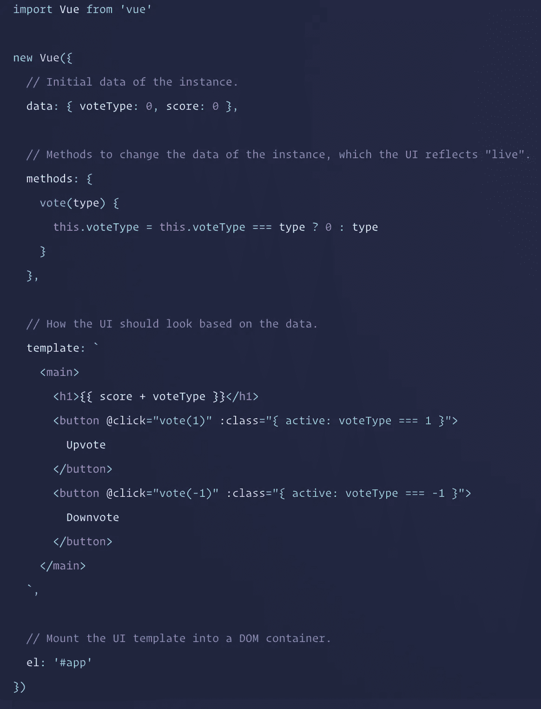

Vue 不使用类语法，而是使用普通对象。在我们的例子中，我们将对象直接传递给`Vue()`构造函数，而不是用`Vue.component()`指定组件或使用单文件组件。不管怎样，核心意识形态保持不变。

*   `data`相当于`state`。它包含的原始信息可以转换成漂亮的用户界面。
*   `methods`是一个包含用于更新数据的函数的对象。在 React 中，您可以将它们定义为类本身的方法。
*   `template`相当于`render()`。它是 UI——数据的一种表示。然而，核心的区别在于，Vue 的是一个包含带有 Vue 插件的 HTML 的字符串模板，而 React 的实际上是伪装成 HTML 的 JavaScript 函数调用，基本上是 React 插件。这样做的结果是 Vue 使用像`@`这样的特殊属性来添加事件监听器。在 React 中，JavaScript 表达式放在花括号`{}`中，而在 Vue 中，表达式与绑定属性`:`一起存在，并放在属性的字符串内容中。
*   `el`是安装应用程序的元素。这个语法比必须调用`ReactDOM.render()`要简洁得多，但是它们服务于相同的目的。

除了模板的不同，您还会注意到`vote()`方法的不同。

```
vote(type) {
  this.voteType = this.voteType === type ? 0 : type
}
```

它与我们的 React 组件基本上是相同的逻辑，只是包装在不同的涂层中。你会注意到 Vue 依赖于**突变**。它使用“watchers”(getter/setter)来确定对象的属性何时改变。我们没有像 React 那样调用一个叫做`setState()`的特殊方法，而是直接对实例本身进行变异。

此外，我们不能只使用`vote`作为我们的数据属性名，因为我们的`vote()`方法在实例的名称空间中占用了它。Vue 将所有数据属性和方法都放在实例的同一个顶级名称空间中。这其实没什么大不了的，但这仍然是一个你需要注意的名称冲突。

Vue Reddit 投票用户界面

# 超 app

最后但同样重要的是。(我知道还有很多其他的，但这一个值得关注)。

Hyperapp 是一个新的 SPA 框架，其第一个版本于 2017 年初发布。与 React (2013)和 Vue (2014)相比，它相当新，还没有获得那么多的社区关注。但是对于寻求漂亮的 API 和简洁的软件开发体验的人来说，Hyperapp 是构建 web 应用程序的最佳体验之一。

Hyperapp 的核心是一种功能性的、几乎纯粹的构建 web 应用程序的方法。没有有状态或类组件——它们没有自己的本地状态(它们像 React 的功能组件一样工作)。应用程序的整个状态由一个普通的 JavaScript 对象描述，在整个应用程序中全局表示。

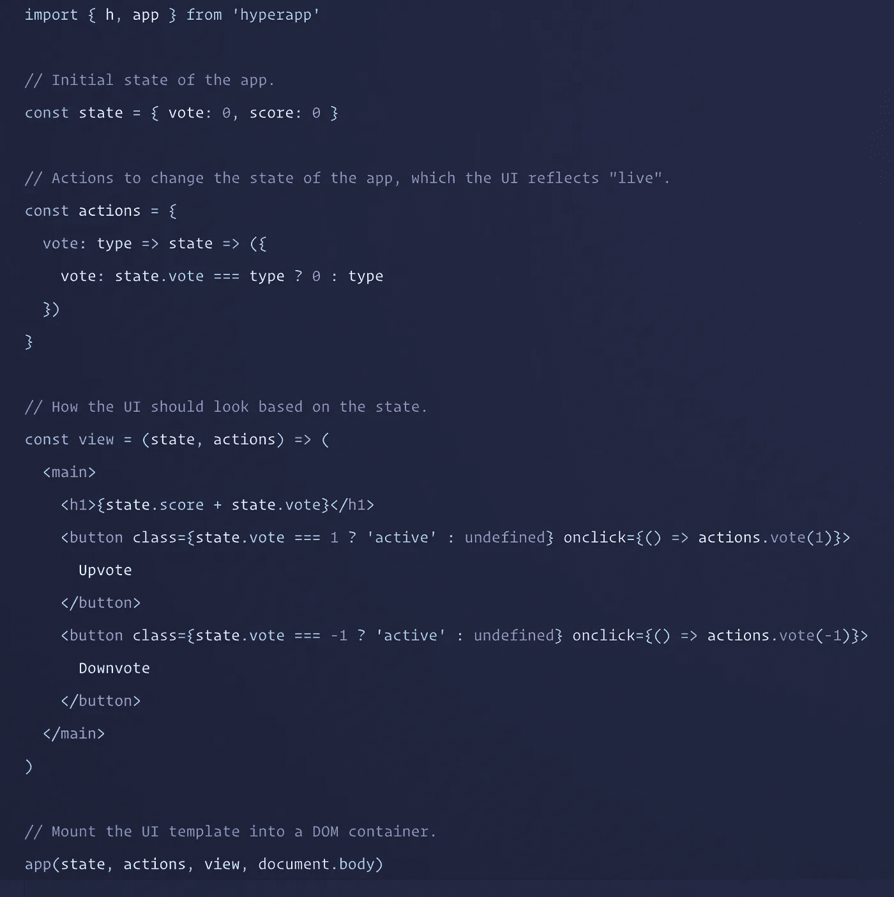

再一次，Reddit 投票 UI 的逻辑基本上是一样的，只是裹上了一层新的油漆。

应用程序的状态和用来更新它的动作都是普通的 JavaScript 对象。视图是一个接收状态和关联动作的函数(调用它们会导致视图更新)。因此，没有使用在作用域之外定义的变量。

该视图使用了 React 之类的 JSX，但试图通过偏爱`class`而不是`className`、`onclick`而不是`onClick`等来更接近实际的 HTML。虽然像 React 一样，JSX 实际上并不是必需的，但通常更受欢迎，因为 React 比`React.createElement()`更推崇它。

Hyperapp Reddit 投票用户界面

## 全局与本地状态

与 React 和 Vue 不同，Hyperapp 中没有“本地状态”的概念。它是全局状态驱动的:你不能创建一个组件的多个实例，它们都有自己的封装数据。

Hyperapp 避免了这种隐藏状态。它希望应用程序中的所有内容都清晰可见。它通过使用全局状态来实现这一点。这有两个后果:

*   **全知视图**:视图中任何地方的组件在任何给定时间都知道应用程序状态的任何部分。组件之间的状态通信没有问题，因为它们都有相同的知识。
*   **状态驱动:**在 React 和 Vue 中，你通常只需在应用程序中的任何地方放置一个组件，它就会因为本地状态而工作。在 Hyperapp 中，在将组件放到某个地方之前，您需要确保在全局状态中定义了它的状态。

# 结论

*   普通技术涉及预先存在的元素或 SSR 元素，这些元素由 JavaScript 选择，并被赋予“钩子”(事件监听器)以进行反应。元素被强制更新以匹配新的状态，状态存储在 DOM 本身中。另一种方法是使用普通 JS 创建元素，拥有一个状态对象等，但是您很快就会意识到使用`Element.append()`构建视图是冗长的，并且您会失去所有声明性的好处。
*   React，Vue 和 Hyperapp 都有一个相似的思想:状态驱动的应用程序，当状态改变时，UI 由库自动有效地更新。不再需要强制操作 DOM 元素来匹配状态。
*   React 和 Hyperapp 有相似之处，比如使用普通的 JavaScript(函数调用，通常用 JSX)来构造视图。这给了您 JavaScript 表达式和逻辑的全部自由。另一方面，Vue 选择了自己的模板语言，使用 HTML 模板中的指令来决定视图应该是什么样子，这让初学者感觉更传统、更容易理解。
*   React 和 Hyperapp 鼓励不变性，而 Vue 鼓励突变。众所周知，不可变操作比可变操作更可靠，导致的错误也更少，所以这是 Vue 最大的缺陷之一。尤其是新手，当他们的视图似乎没有更新时，可能会花几个小时挠头。
*   React 和 Vue 允许本地状态——封装的数据不影响其他组件实例，并对其他组件隐藏。另一方面，Hyperapp 只有代表整个视图的全局状态。使用这种方法，状态管理变得更加容易，但是当需要更新单个项目的状态时，您可能会发现管理列表之类的东西很困难。