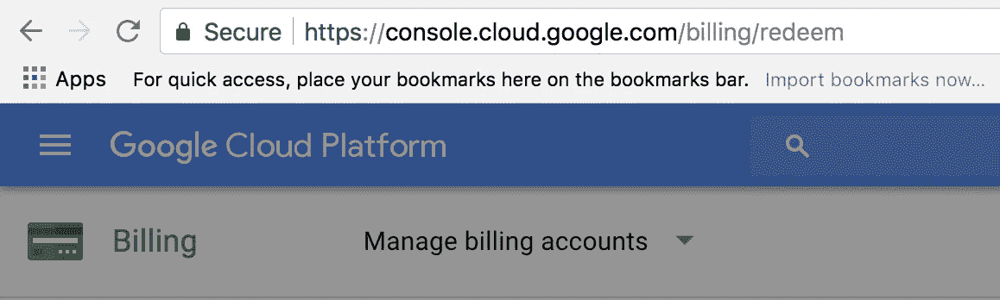
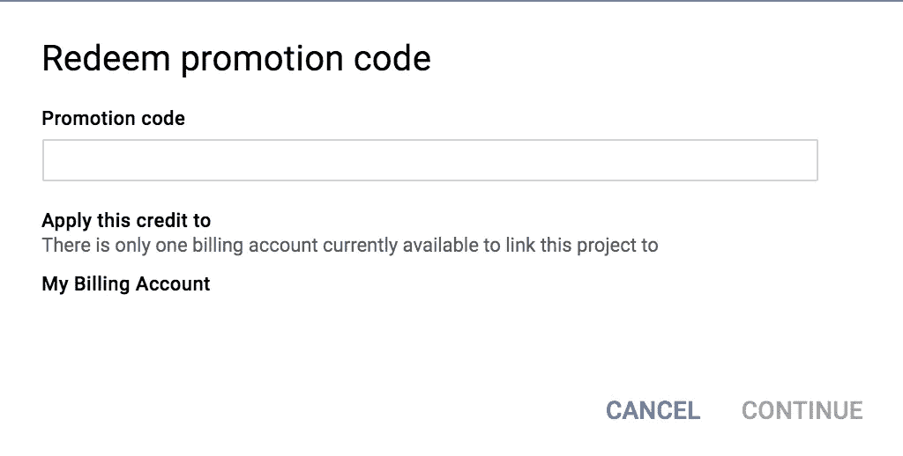
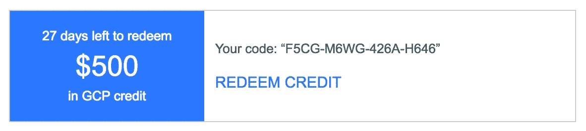
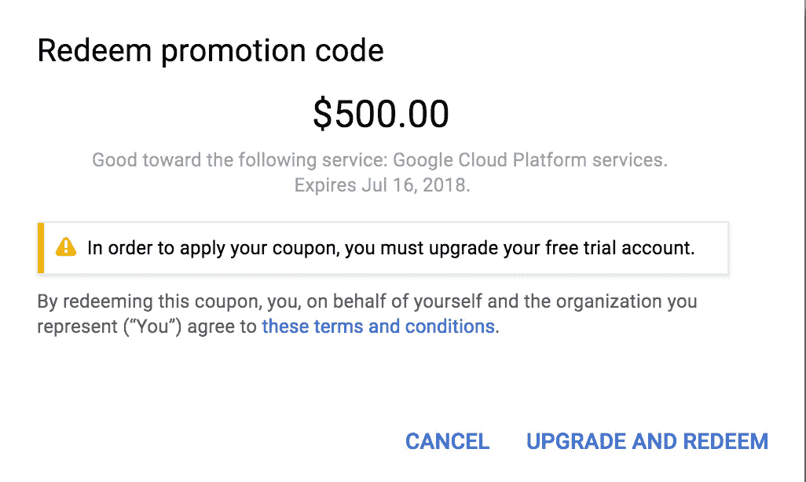

# 在谷歌云平台信用到期前赎回并使用

> 原文：<https://itnext.io/redeem-and-use-google-cloud-platform-credit-before-it-expires-f1c0151b5016?source=collection_archive---------6----------------------->

看似简单，实则不然。谷歌云平台的计费部分没有点击兑换积分的地方。

兑换 GCP 积分的网址:[https://console.cloud.google.com/billing/redeem](https://console.cloud.google.com/billing/redeem)

兑换 GCP 点数的 URL

将出现一个弹出窗口来兑换:

输入要兑换的促销代码

申请你的代码赎回-下面是样本，我已经赎回；-)

恭喜你！！！

下一步是什么？也许你想启动 Google Kubernetes 引擎，开始你的云之旅。

请查看[“启动并运行:谷歌 Kubernetes 引擎驾驶舱”。](https://medium.com/@hellocloud/up-and-running-cockpit-for-google-kubernetes-engine-gke-4aca68f182bf)