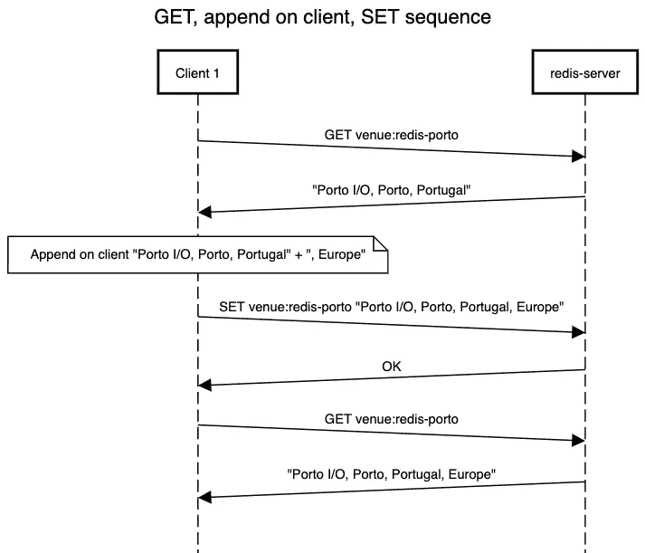
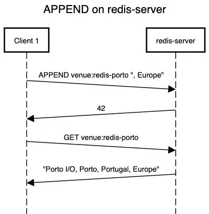
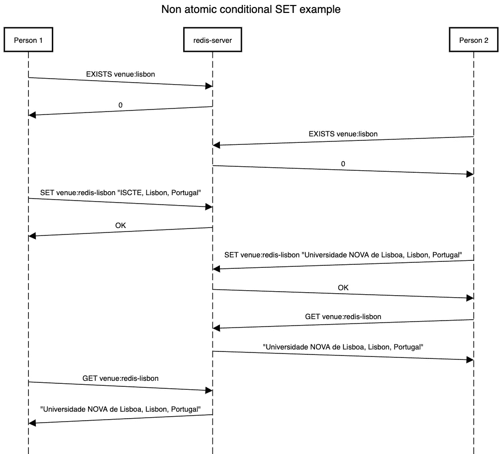
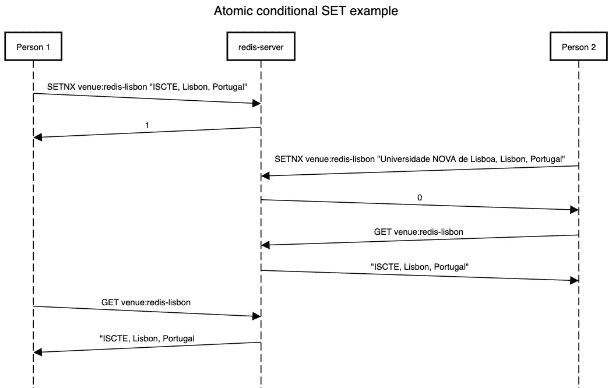

# Redis 5。引擎盖下的 x:2—Redis 命令和数据结构介绍—第 1 部分

> 原文：<https://itnext.io/redis-5-x-under-the-hood-2-intro-to-redis-commands-and-data-structures-part-1-41f05501cb52?source=collection_archive---------4----------------------->


在本文中，我们将研究 Redis 数据类型和重要操作，将它们与适合它们的用例结合起来。

*   在本文的第 1 部分，我们将讨论为什么在使用 Redis 时需要考虑如何存储、访问和转换数据，同时讨论 STRING 数据类型。
*   列表和散列数据类型将在第 2 部分讨论。
*   第 3 部分将介绍集合、排序集合和地理数据类型。

每种数据类型都提供不同的操作，每种操作都伴随着更高的复杂性和/或性能。

牢记了解每种数据类型的注意事项的极端重要性，因为 ***“如果你只有一把锤子，一切看起来都像钉子”。***

我们将认为您有一个 Redis 服务器实例已经启动并正在运行，如本系列的前一篇文章[https://medium . com/@ fcosta _ Oliveira/Redis-5-x-under-the-hood-1-download-and-installing-Redis-locally-3373 Fe 67 a 154](https://medium.com/@fcosta_oliveira/redis-5-x-under-the-hood-1-downloading-and-installing-redis-locally-3373fe67a154)所述。

# 2.1 在我们深入研究数据类型之前:

在深入研究数据类型之前，我们需要理解另一个重要的概念，即键空间。它本质上是一个字典——键-值模式——键和它们各自的值。

*   这些键是唯一的，可以是任何有效的 Redis 字符串。
*   这些值可以是任何一种 Redis 核心模块数据类型，并且只能通过它们的名称来访问。

# 2.2 还有一名顾问:

每种数据类型都提供不同的操作，每种操作都伴随着更高的复杂性和/或性能，操作的复杂性在文档中有所描述。

以 [**SET**](https://redis.io/commands/set) 命令为例，带有一个**时间复杂度:** O(1)，表示一个常数时间操作。记住，我的 O(1)和你的 O(1)不一定相同。这只意味着操作的时间与键空间中的项目数量无关。

# 2.3 Redis 不是什么:

Redis 事务不是完全符合 ACID 的(原子性、一致性、隔离性和持久性)。如果预期有 ACID 交易，Redis 不是最佳选择，不应使用。在这些情况下，应该使用 RDBMS 或其他数据库系统。

Redis 是一个非关系数据库，不适合为关系数据服务。为了保持外键、引用完整性约束、回滚和关系数据库中的持久性等概念，您必须处理的复杂性远远超出了您应该考虑的范围，如果不是不可能的话。你可以实现其中的一些，但是需要权衡效率、复杂性和数据量。

为了了解 Redis 如何适应各种可用的数据库和缓存软件，您可以在下面的链接中看到一些不同类型的缓存或数据库服务器的介绍性列表:[https://Redis labs . com/ebook/part-1-getting-started/chapter-1-getting-to-know-Redis/1-1-what-is-Redis/1-1-1-Redis-comparated-to-other-databases-and-software/](https://redislabs.com/ebook/part-1-getting-started/chapter-1-getting-to-know-redis/1-1-what-is-redis/1-1-1-redis-compared-to-other-databases-and-software/)

# 2.4 字符串数据类型:

字符串是 Redis 的基本数据类型，用于存储:

*   字符串:[追加](https://redis.io/commands/append)，[获取范围](https://redis.io/commands/getrange)，[设置范围](https://redis.io/commands/setrange)， [STRLEN](https://redis.io/commands/strlen)
*   整数: [INCR](https://redis.io/commands/incr) ， [INCRBY](https://redis.io/commands/incrby) ， [DECR](https://redis.io/commands/decr) ， [DECRBY](https://redis.io/commands/decrby)
*   浮动: [INCRBYFLOAT](https://redis.io/commands/incrbyfloat)
*   位: [SETBIT](https://redis.io/commands/setbit) ， [GETBIT](https://redis.io/commands/getbit) ， [BITPOS](https://redis.io/commands/bitpos) ， [BITCOUNT](https://redis.io/commands/bitcount) ， [BITOP](https://redis.io/commands/bitop)

使用 [SET](https://redis.io/commands/set) 命令将一个字符串值关联到一个键。例如，如果我们想为我们的聚会设置场地:

```
127.0.0.1:6379> SET venue:redis-porto "Porto I/O, Porto, Portugal"OK
```

只需使用 [GET](https://redis.io/commands/get) 命令就可以检索字符串值:

```
127.0.0.1:6379> GET venue:redis-porto"Porto I/O, Porto, Portugal"
```

Redis 命令返回对所有常用命令的确认。在不存在的键上执行 [GET](https://redis.io/commands/get) 将返回(nil):

```
127.0.0.1:6379> GET venue:redis-lisbon(nil)
```

[STRLEN](https://redis.io/commands/strlen) 命令返回字符串的长度。例如，如果我们想知道雷迪斯-波尔图的场地长度:

```
127.0.0.1:6379> STRLEN venue:redis-porto
(integer) 26
```

Redis 提供了几个命令来操作字符串键内容，而不需要执行两个不同的操作。让我们来理解这些特性的重要性。例如，如果我们想将字符串" Europe "附加到包含 redis-porto 地点的字符串中，可以选择执行 [GET](https://redis.io/commands/get) ，附加到客户端，并将结果设置回 redis，如下图所示:



这种方法有几个缺点:

*   尽管每个操作都是原子操作，但由于 GET 和 SET 是两个不同的操作，如果有人在 GET 之后 SET 之前更改了键，这可能会导致不一致。
*   客户端上需要工作。

在单个原子操作中，有几个命令可以直接操作字符串，而不需要使用 [GET](https://redis.io/commands/get) 检索值和 [SET](https://redis.io/commands/set) 将其赋回，如 [APPEND](https://redis.io/commands/append) 和 [SETRANGE](https://redis.io/commands/setrange) 。

[APPEND](https://redis.io/commands/append) 有名字点，在字符串末尾追加值。如果我们想要追加的键不存在，那么在追加操作之前，它被创建并设置为一个空字符串。 [SETRANGE](https://redis.io/commands/setrange) 覆盖存储在指定键的字符串的一部分，从定义的偏移量开始，覆盖指定的长度。

下图说明了我们如何以推荐的方式从前面的 [GET](https://redis.io/commands/get) 和 [SET](https://redis.io/commands/set) 中获得相同的输出(以便添加到字符串中)。



## 2.4.1 另一个原子用例，NX 的原子条件集

如果已经有一个值与密钥相关联，则 [SET](https://redis.io/commands/set) 命令会覆盖该值。有时，如果键存在，我们不希望盲目地覆盖值。我们可以做的一件事是在执行[设置](https://redis.io/commands/set)之前使用【T2 存在】命令来测试密钥的存在，然而，如果我们在两个独立的命令中进行检查和设置，它们将不会是导致潜在的不期望状态的原子操作。

举个例子，假设我们有两个人在里斯本布置场地，我们已经同意只在场地还没有布置好的情况下布置场地。人员 1 和人员 2 将以相同的顺序执行以下命令。

```
EXISTS {key}
SET {key} {value}
GET {key}
```

人员 1 看到以下输出，这不是他所期望的:

```
127.0.0.1:6379> EXISTS venue:redis-lisbon(integer) 0127.0.0.1:6379> SET venue:redis-lisbon "ISCTE, Lisbon, Portugal"OK127.0.0.1:6379> GET venue:redis-lisbon"Universidade NOVA de Lisboa, Lisbon, Portugal"
```

但是，第二个人看到了以下输出，这是他的预期输出:

```
127.0.0.1:6379> EXISTS venue:redis-lisbon(integer) 0127.0.0.1:6379> SET venue:redis-lisbon "Universidade NOVA de Lisboa, Lisbon, Portugal"OK127.0.0.1:6379> GET venue:redis-lisbon"Universidade NOVA de Lisboa, Lisbon, Portugal"
```

人员 1 使用 [GET](https://redis.io/commands/get) 命令检索的结果不是预期的结果。这可能发生，因为在[存在的时间与](https://redis.io/commands/exists)命令由人 1 执行的时间和设置命令由人 1 执行的时间之间，有人设置了密钥。下图正好说明了这一点:



Redis 提供了一个命令[SETNX](https://redis.io/commands/setnx)(SET if not exists 的缩写)，可以用来设置一个键的值，但是只有在键不存在的情况下，在原子操作中，如果键设置成功，返回 1，如果键已经存在，返回 0，所以旧值不会被覆盖。

当人员 1 执行[SETNX](https://redis.io/commands/setnx)venue:redis-Lisbon 将看到:

```
127.0.0.1:6379> SETNX venue:redis-lisbon "ISCTE, Lisbon, Portugal"(integer) 1
```

和人员 2，因为条件检查和设置是由 [SETNX](https://redis.io/commands/setnx) 命令自动完成的，所以将会看到:

```
127.0.0.1:6379> SETNX venue:redis-lisbon "Universidade NOVA de Lisboa, Lisbon, Portugal"(integer) 0
```

导致不会覆盖先前设置的密钥，如下图所示:



## 2.4.2 原子、二进制安全和高性能

如果您认为 redis 在没有管道的情况下每秒可以处理高达 [80K 的事件](https://redis.io/topics/benchmarks)，每分钟大约 5M 的事件，而在有管道的情况下每秒可以处理高达 400K 的事件，每分钟大约 24M 的事件(我们将在后面看到管道的含义)，那么在一个**单个低端、未调优的 Redis 服务器上，**以二进制安全和原子的每操作方式，STRING 数据类型有许多用例。

STRING 数据类型非常适合将简单的字符串(如“meetup ”)存储到整个文件(如 JPEG 文件)的内容中，并对 int、floats 和 bit 进行简单但高吞吐量的数字运算。

## 2.4.3 数值运算的竞争结束条件:

如前所述，Redis 为数据类型字符串的数值运算提供了命令。 [INCR](https://redis.io/commands/incr) 、 [INCRBY](https://redis.io/commands/incrby) 、 [DECR](https://redis.io/commands/decr) 和 [DECRBY](https://redis.io/commands/decrby) 和 [INCRBYFLOAT](https://redis.io/commands/incrbyfloat) 命令将字符串值解析为整数/浮点数，按指定值递增，最后将获得的值设置为新值，无需在客户端上进行任何数值运算，同时保持每个客户端访问的数据的良好性能和一致性。

针对同一个密钥发布 [INCR](https://redis.io/commands/incr) 的多个客户端将永远不会进入竞争状态。例如，永远不会发生客户端 1 读取“10”，客户端 2 同时读取“10”，两者都增加到 11，并将新值设置为 11。最终值总是正确的，不需要对数据访问和操作进行隐式锁定。

## 2.4.4 位和字节级操作:

位和字节级运算实现了快速和极度内存优化的数值运算。假设您想要描述二元运算(只能是真或假的东西),比如用户是否参加了 meetup，或者查看了这篇中型文章。如果我们有 100 万用户，我们只需要 122KB 的 RAM 来表示整个数据集。

以 100 万用户为例，我们可以使用 [SETBIT](https://redis.io/commands/setbit) 命令，该命令将位数作为第一个参数，将该位的设置值(1 或 0)作为第二个参数。如果寻址位超出当前字符串长度，该命令会自动放大字符串。

```
127.0.0.1:6379> SETBIT redis-porto:article:2 1000000 1(integer) 0
```

为了访问指定用户的值，我们将使用 [GETBIT](https://redis.io/commands/getbit) :

```
127.0.0.1:6379> GETBIT redis-porto:article:2 1000000(integer) 1
```

如果我们想访问用户 10000 的值，我们将:

```
127.0.0.1:6379> GETBIT redis-porto:article:2 10000(integer) 0
```

索引之外的范围(存储在目标键中的字符串长度之外)总是被认为是零。如果我们想统计已经阅读文章的用户数量，我们可以使用 BITCOUNT，它报告为指定键设置为 1 的位数。

```
127.0.0.1:6379> BITCOUNT redis-porto:article:2(integer) 1
```

除了 [BITCOUNT](https://redis.io/commands/bitcount) 之外，还有 [BITOP](https://redis.io/commands/bitop) 可以在不同的字符串之间执行逐位运算(AND、OR、XOR 和 NOT)，还有 [BITPOS](https://redis.io/commands/bitpos) 可以让您找到具有指定值 0 或 1 的第一位。

Redis 数据库中的任何键都可以存储高达 512MB 的信息(2-1 位)。这意味着每个键可以设置 4 294 967 295 个数据点。如果把它放到用户的信息场景中，您可以在一个 Redis 键中表示多达 40 亿用户的信息。

## 2.4.5 在 Redis 中字符串是如何编码的:

值得一提的是字符串在 Redis 对象内部是如何编码的。Redis 使用三种不同的编码来存储 string 对象，并将自动决定每个字符串值的编码。在描述每种编码方式的同时，我们将利用命令[对象](https://redis.io/commands/object)，允许您检查 Redis 对象的内部:

*   **REDIS_ENCODING_INT ( int )—** 对于表示 64 位有符号整数的字符串，换句话说，如果对于类型为 **long int** 的对象，值被转换为最小和最大值范围内的 long，则字符串可以以这种形式存储。

```
127.0.0.1:6379> SET key "12"OK127.0.0.1:6379> OBJECT encoding key"int"
```

*   **REDIS _ ENCODING _ EMBSTR(EMBSTR)—**用于长度不超过 44 字节的字符串，这意味着 REDIS 对象结构和字符串结构放在内存的单个区域，从而提高内存使用效率和性能。

```
127.0.0.1:6379> SET key "redis-porto"OK127.0.0.1:6379> OBJECT encoding key"embstr"
```

*   **REDIS _ ENCODING _ RAW****(RAW)—**用于所有长度超过 44 字节的字符串。使用我们从 SETRANGE 文档中学到的知识，让我们以一种“干净”的方式创建一个大于 44 字节的字符串:

```
127.0.0.1:6379> SETRANGE key 44 "redis-porto"(integer) 55127.0.0.1:6379> OBJECT encoding key"raw"
```

# 2.5 瞬态数据:

在深入研究其他 Redis 数据结构之前，我们需要讨论另一个命令，该命令不管数据类型如何都有效，名为**Redis**[**EXPIRE**](https://redis.io/commands/expire)。

当 Redis 键上设置了超时，并且指定的生存时间( [TTL](https://redis.io/commands/ttl) )过去时，该键会自动销毁，就像用户用该键调用 [DEL](https://redis.io/commands/del) 命令一样。您可以使用 [TTL](https://redis.io/commands/ttl) 来检查一个密钥的生存时间。

```
127.0.0.1:6379> SET "venue:redis-porto" "Porto I/O"OK127.0.0.1:6379> TTL "venue:redis-porto"(integer) -1
```

现在，让我们将 120 秒的生存时间应用于密钥。

```
127.0.0.1:6379> EXPIRE "venue:redis-porto" 120(integer) 1127.0.0.1:6379> TTL "venue:redis-porto"(integer) 108
```

如果我们想要更新密钥的生存时间，我们可以再次使用 [EXPIRE](https://redis.io/commands/expire) 。

如果我们想完全删除生存时间，我们可以使用 [PERSIST](https://redis.io/commands/persist) 。

# 2.6 关于数据大小的考虑

当使用以太网访问 redis 时，将数据大小保持在以太网数据包大小(约 1500 字节)之下可以保持总体峰值性能，这意味着对于 Redis 服务器来说，处理 10 个字节、100 个字节或 1000 个字节会在吞吐量方面产生几乎相同的结果。尽管如此，您应该始终考虑您自己的应用程序(进行查询的应用程序)中数据大小的影响。参见下面链接的名为“每个数据大小的吞吐量”的图表:[https://redis.io/topics/benchmarks](https://redis.io/topics/benchmarks)。

# 2.7 后续步骤:

我们这一系列文章的目的是介绍一个主题和主要关注点，希望您能深入了解在[https://redis.io/commands](https://redis.io/commands)上可用和有据可查的操作范围。关于所有 Redis 字符串命令，请参考[https://redis.io/commands#string](https://redis.io/commands#string)。我们希望在这篇文章和我们的聚会上看到关于你最喜欢的项目和关注点的评论。

本文的第 2 部分将是对 Redis 列表和 HASHs 数据类型的介绍，让您对可用的操作有一个基本的了解，以及它们如何在实际例子中有用。