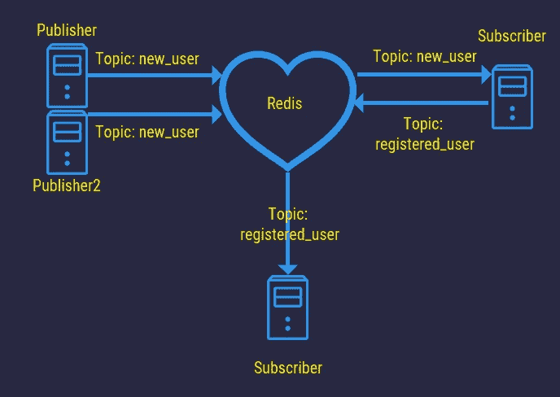
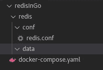
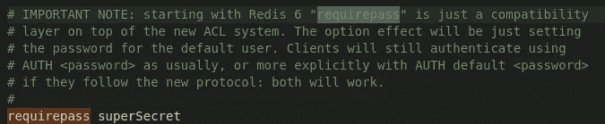
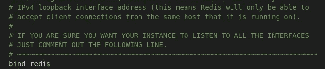
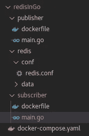
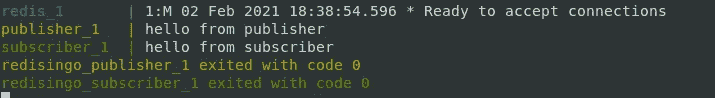

# Redis 作为 Go 中的发布/订阅引擎

> 原文：<https://itnext.io/redis-as-a-pub-sub-engine-in-go-10eb5e6699cc?source=collection_archive---------2----------------------->

## 在多个应用程序之间共享信息和工作



发布/订阅架构的示例

## 什么是 Redis

Redis 是一个**内存**数据库，这意味着它将数据直接存储在内存中，而不是保存在磁盘上。这是使用 Redis 时需要记住的一个重要因素。如果运行 Redis 的系统断电，存储在内存中的数据将会丢失。 **Redis 通过**通过快照保存数据，因此只有自上次快照以来的新数据会丢失。这就是为什么很多人经常说应该利用 Redis 作为存储数据的缓存。尽管 Redis 有一些持久化机制，所以并不是所有的数据都丢失了，在这里[阅读更多信息](https://redis.io/topics/persistence)。

> Redis 是一个开源的(BSD 许可的)、内存中的数据结构存储，用作数据库、缓存和消息代理。Redis 网站

Redis 是一个键值存储。这意味着我们可以通过指定一个键和包含什么值来存储数据。实际上，密钥可以是任何二进制 blob，所以即使是密钥也可以非常高级。

Redis 还支持发布/订阅架构。这意味着我们可以使用 Redis 发布数据和订阅数据。如果你以前没有使用过 Pub/Sub，它通常用于在应用程序之间共享数据。我在我的一个项目中使用它在某些应用程序之间分配工作。
值得一提的是，在某个频道/主题上发布的任何消息都会被发送给**每个订阅者。**还有，用 Pub/Sub 发送的消息，一发布就会被遗忘。如果你想使用 Redis 作为一个工作队列，不要把目标放在 Pub/Sub 上。


多个发布者发布新用户的发布/订阅架构

那么，我们为什么需要内存缓存呢？速度是一回事。因为在 SQL 等中保存数据没有任何大的延迟，而且内存往往非常快。

在上面的图片中，我们看到了一个例子，来自多个网站的用户帐户存储在一个中央数据库中。新用户应该收到电子邮件，这是用来减少重复代码和应用程序运行的数量。这是一个如何使用 Redis 作为发布/订阅引擎或工作分发器的例子。

更好的是，想象一个中央日志记录应用程序，它从 Redis 中获取错误，并将其记录在中央存储中。这样，许多应用程序可以直接在 Redis 中抛出错误，而不必担心每个应用程序中的可靠日志逻辑。

它还可以帮助扩展应用程序，我见过的一个很酷的场景是工作分发平台。它由许多微服务组成，每当一个微服务需要另一个服务完成工作时，它们会将自己的工作推到 Redis 中的一个工作队列中。很酷的一点是，当开发人员注意到一个服务滞后时，他们可以很容易地添加一个具有同类服务的服务器，从同一个队列中读取工作。这使得他们可以在不停止或改变任何其他服务的情况下添加员工。

我遇到的一些人会说这样的话，

> 如果我想要内存缓存，我使用 map[string]接口{}

这很好。但是 Redis 不仅给你一个非常可扩展的缓存，它还帮助你持久化它，排序它，分类它，以及许多许多内置的东西。它也是网络连接的，因此比使用常规地图更容易缩放。

## 安装依赖项

首先，我们将使用 **Docker 来运行 Redis** 。
安装 docker 如果没有得到[的说明，这里](https://docs.docker.com/engine/install/)。如果你对 Docker 不熟悉，可以在[我的另一篇文章](/docker-skyrocketed-my-teams-productivity-e19cd89a23ea?sk=4dbf55e89ab3899d147c67d96b3ec6f9)中了解一下。

如果你在离线环境中，你需要下载 Redis 镜像，我们将使用[这个](https://hub.docker.com/_/redis/)。如果你连上了互联网，就不需要拿任何东西。Docker 会自动为我们提取图像。

我们还在构建一个 Go 应用程序来与 Redis 对话。如果你没有 Go，不要担心安装它，我们也将使用 Docker。但是你真的应该安装 go……它太棒了！

## 设置 docker 编写

我们将首先创建一个 docker-compose 文件，该文件将包含一个 Redis 和两个 Go 应用程序的项目架构。
我还想说**对不起，设置步骤相当长，**比我想的要长。但是如果 docker 上有新人的话，我不想急着设置作曲。如果你想作弊，并且对 docker 感到舒适，[这里是资源库](https://github.com/percybolmer/redisInGo)。

Redis 将被用作发布/订阅引擎，一个 go 应用程序将发布数据，而另一个应用程序将订阅数据。

我们将首先添加 Redis，开始构建 docker-compose 的基础。我们还需要创建一些 Redis 希望我们挂载的文件夹。我们将挂载一个名为 redis/data 的文件夹来保存数据，redis 将在这里存储内存快照。我们还会有 redis/conf，我们将有一个 redis.conf 文件，其中包含所需的配置。



当前项目设置

创建文件夹，然后创建 docker-compose.yaml。

```
mkdir -p redisInGo/redis/conf
mkdir redisInGo/redis/data
touch docker-compose.yaml
```

Redis 配置可以从 Redis 网站[这里](https://download.redis.io/redis-stable/redis.conf)下载。

Docker-compose 只运行 Redis。

当前的 docker-compose 只会启动 Redis。但是我们将在此基础上继续努力，并在前进的过程中添加更多的内容。我们需要做的第一件事是打开 **redis.conf** 并设置 redis 的密码。

在配置中搜索 **requirepass** ，用你的密钥替换密码。



我的 Redis 配置使用密码。

此外，搜索绑定 IP 地址的绑定配置，这通常是 localhost (127.0.0.1)。在我们的例子中，我们将在一个容器环境中运行，所以将 bind 改为“redis”。这就是我们将给予 Redis 容器的名称。



将 bind 命令更改为 redis，即合成中容器的名称

保存文件并尝试运行 docker-compose 以确保一切正常。

```
sudo docker-compose up
```

您应该会看到一个类似于 **Redis *准备好接受连接的输出。**

一旦完成，就该开始处理发布者和订阅者应用程序了。
我们将从向 docker-compose 添加所需的内核开始，只是为了让一切正常运行。一旦布局完成，我们将开始使用 Redis。

创建一个名为 publisher 的文件夹和一个名为 subscriber 的文件夹。这两个文件夹都应该包含两个文件， **main.go 和 dockerfile。**

```
mkdir publisher && mkdir subscriber
```

我将显示驻留在发布者中的代码，我希望您将该代码复制到发布者和订阅者中，但是用**替换订阅者文件夹**中出现的每个发布者。

打招呼的小应用。

docker 文件也是如此，用 subscriber 替换 publisher，并在每个文件夹中都有一个副本。

构建我们的应用程序的 docker 文件



这是我当前项目设置的样子

我们希望将这两个新应用程序添加到 docker-compose 中，然后我们就可以开始使用 Redis 了。我已经更新了 docker-compose 来构建和运行这两个应用程序。

运行整个项目设置的完整 docker-compose。

关闭旧的 compose，打开新的 compose，您应该会看到所有三个应用程序的输出。

```
sudo docker-compose down && sudo docker-compose up --build 
# I use the --build flag to force build the images
```



验证设置工作正常的输出。

## 最后，Redis 时间

所以，祝贺你通过了漫长的准备阶段。但是现在我们有了一个坚实的开发环境。时间花得值。

让我们从使用 Redis 作为发布者开始。我们将希望连接到 Redis 并发布数据。我们将构建的应用程序将是一个用户注册应用程序或类似的应用程序。它将随机生成新用户，并将其发布到一个主题/频道上。另一个应用程序将订阅新用户，并将他们记录到 stdout。

不是最好的例子，它不会进入你的超级酷软件工具箱。但是它可以作为实际应用的起点。请记住，我们想要关注 Redis 如何像发布/订阅引擎一样工作。

让我们从查看 Redis 客户机的发布方法开始

```
func (c Client) Publish(ctx [context](https://godoc.org/context).[Context](https://godoc.org/context#Context), channel [string](https://godoc.org/builtin#string), message interface{}) *[IntCmd](https://godoc.org/github.com/go-redis/redis#IntCmd)
```

它需要上下文、通道和消息。频道是发布消息的主题名称。该消息是一个空接口，因此它可以是任何类型的数据。重要的是，我们使用的 go-redis 包希望这个消息成为**编码的一部分。BinaryMarshaler** 接口。这是因为它需要能够以[]字节的形式传输数据。

发布者将由一个可以编码成[]字节的**用户**结构组成。应用程序将启动并连接到 Redis，然后开始生成随机用户并发布他们。我已经尽可能多地对代码进行了注释。

publisher 应用程序的完整代码。

接下来，我们需要查看正在发送的内容。为此，我们将修改 subscriber/main.go.
这将是一个非常简单的应用程序，很像出版商。它将连接到 Redis，订阅该频道，并打印在其上找到的任何项目。
它将包含相同的用户结构，在一个真实的例子中，我将把它分解到在两个应用程序中导入的包中。但是对于这个简短的演示来说，复制粘贴是有效的。

打印任何新用户的订户的完整代码

如果您在填写发布者和订阅者之后运行 docker-compose，您应该会看到如下图所示的输出。


订阅者的输出。

太好了！我们现在有两个(3 个带 Redis 的)应用程序在一个发布/订阅中一起工作。如你所见，go-redis 很容易使用。只需要两种方法就可以让它启动并运行(发布和订阅)。

您可以尝试自己添加另一个 publisher，这只是复制 docker-compose 中的 publisher 服务并对其进行重命名。

使用 Redis，您可以做更多的事情，例如将工作推送到由许多工作人员聚集的通道。本文只是展示了如何在 Go 环境中启动和运行 Pub/Sub。你能做的深度是巨大的。

今天到此为止。
**现在，去那里和 Pub/Sub！**

[](https://percybolmer.medium.com/membership) [## 阅读珀西·博尔默(以及媒体上成千上万的其他作家)的每一个故事

### 作为一个媒体会员，你的会员费的一部分会给你阅读的作家，你可以完全接触到每一个故事…

percybolmer.medium.com](https://percybolmer.medium.com/membership)