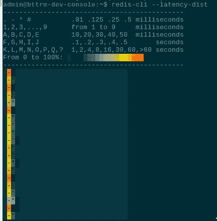
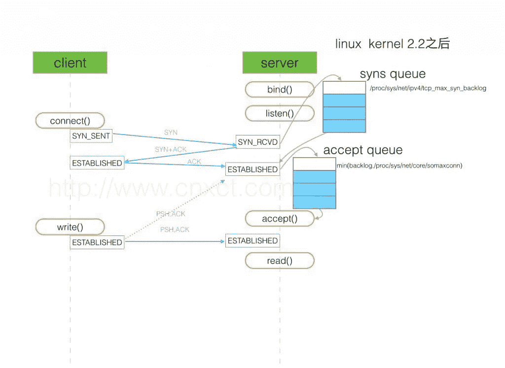

# Redis:主要配置参数和性能调优概述

> 原文：<https://itnext.io/redis-main-configuration-parameters-and-performance-tuning-overview-fc598f65137?source=collection_archive---------2----------------------->


目前正在配置 Redis 服务器作为我们的后端缓存服务，在此期间，我写了这篇文章，在 Redis 配置文件中有一些需要注意的地方。

足够短，但链接到其他职位或文件。

让我们从`[redis-benchmark](https://github.com/maxux/redis-benchmark)`实用程序开始。

将与 Redis 服务一起安装，因此可以在服务器安装后立即使用:

```
root@bttrm-dev-app-1:/home/admin# redis-benchmark -p 6389 -n 1000 -c 10 -k 
====== 1 ======
1000 requests completed in 0.03 seconds
10 parallel clients
3 bytes payload
keep alive: 1
98.30% <= 1 milliseconds
99.30% <= 2 milliseconds
100.00% <= 2 milliseconds
30303.03 requests per second
```

此外，您可以使用带有`--latency`或`--latency-dist`选项的 Redis CLI:



*   [Redis 服务器级配置](https://rtfm.co.ua/en/draft-eng-redis-main-configuration-parameters-and-performance-tuning-overview/#Redis_server-level_config)
*   [超时](https://rtfm.co.ua/en/draft-eng-redis-main-configuration-parameters-and-performance-tuning-overview/#timeout)
*   [tcp-keepalive](https://rtfm.co.ua/en/draft-eng-redis-main-configuration-parameters-and-performance-tuning-overview/#tcp-keepalive)
*   [RDB 的坚持](https://rtfm.co.ua/en/draft-eng-redis-main-configuration-parameters-and-performance-tuning-overview/#RDB_Persistence)
*   [AOF 的坚持](https://rtfm.co.ua/en/draft-eng-redis-main-configuration-parameters-and-performance-tuning-overview/#AOF_persistence)
*   [maxmemory](https://rtfm.co.ua/en/draft-eng-redis-main-configuration-parameters-and-performance-tuning-overview/#maxmemory)
*   [最大内存策略](https://rtfm.co.ua/en/draft-eng-redis-main-configuration-parameters-and-performance-tuning-overview/#maxmemory-policy)
*   [unixsocket](https://rtfm.co.ua/en/draft-eng-redis-main-configuration-parameters-and-performance-tuning-overview/#unixsocket)
*   [日志级别](https://rtfm.co.ua/en/draft-eng-redis-main-configuration-parameters-and-performance-tuning-overview/#loglevel)
*   [操作系统级配置](https://rtfm.co.ua/en/draft-eng-redis-main-configuration-parameters-and-performance-tuning-overview/#OS-level_config)
*   [透明巨页](https://rtfm.co.ua/en/draft-eng-redis-main-configuration-parameters-and-performance-tuning-overview/#Transparent_Huge_Page)
*   [maxclients 和 fs.file-max](https://rtfm.co.ua/en/draft-eng-redis-main-configuration-parameters-and-performance-tuning-overview/#maxclients_and_fsfile-max)
*   [tcp-backlog 和 net.core.somaxconn](https://rtfm.co.ua/en/draft-eng-redis-main-configuration-parameters-and-performance-tuning-overview/#tcp-backlog_and_netcoresomaxconn)
*   [什么是 TCP backlog 和 net.core.somaxconn](https://rtfm.co.ua/en/draft-eng-redis-main-configuration-parameters-and-performance-tuning-overview/#What_is_the_TCP_backlog_and_netcoresomaxconn)
*   [vm.overcommit_memory](https://rtfm.co.ua/en/draft-eng-redis-main-configuration-parameters-and-performance-tuning-overview/#vmovercommit_memory)
*   [vm.swappiness](https://rtfm.co.ua/en/draft-eng-redis-main-configuration-parameters-and-performance-tuning-overview/#vmswappiness)
*   [有用链接](https://rtfm.co.ua/en/draft-eng-redis-main-configuration-parameters-and-performance-tuning-overview/#Useful_links)

## Redis 服务器级配置

## `timeout`

如果客户端在 *N* 秒内不活动，则断开连接。

设置为零以禁用(空闲客户端将保持连接，直到服务器重新启动):

```
...
timeout 0
...
```

总的来说，我看不出有什么理由要改变默认的 300 秒。

## `tcp-keepalive`

更多信息请参见 [Redis 客户端处理](https://redis.io/topics/clients#tcp-keepalive)。

不适用于发布/订阅期间(实时操作)，请参见 [Redis 发布/订阅:介绍指南](https://www.redisgreen.net/blog/pubsub-intro/)和 [Redis 发布/订阅…它是如何工作的？](https://thoughtbot.com/blog/redis-pub-sub-how-does-it-work)

在此期间，Redis 服务器将在从该参数开始的秒后发送 ACK-requests ( *确认*)以保持会话活动:

```
...
tcp-keepalive 300
...
```

检查一下:

```
127.0.0.1:6389> CONFIG GET tcp-keepalive
1) “tcp-keepalive”
2) “300”
```

默认值为 300 秒(但在 Redis 版本上可以更改)。

如果客户端不响应来自服务器的确认请求，该连接将被关闭。

如果服务器端的`timeout`和`tcp-keepalive`都被设置为零(即禁用)，那么“死”连接将保持活动状态，直到服务器重启。

在[查看更多关于 TCP Keepalives](https://packetlife.net/blog/2010/jun/7/understanding-tcp-sequence-acknowledgment-numbers/) 的信息。

要了解 keep-alive 如何影响性能 id general —使用`tcp-keepalive`选项(`-k` == 1)运行基准测试:

```
root@bttrm-dev-app-1:/home/admin# redis-benchmark -p 6389 -n 1000 -c 10 -k 1 -q | tail -2
MSET (10 keys): 16129.03 requests per second
```

并且在禁用保持活动的情况下:

```
root@bttrm-dev-app-1:/home/admin# redis-benchmark -p 6389 -n 1000 -c 10 -k 0 -q | tail -2
MSET (10 keys): 7042.25 requests per second
```

同样——我找不到任何理由来更改默认值。

## RDB 持久性

将创建完整的数据库副本。参见此处的文档 [Redis 持久性](https://redis.io/topics/persistence)。

其行为通过`save`选项设置(参见 [Redis save，SAVE и BGSAVE](https://rtfm.co.ua/en/redis-fork-cannot-allocate-memory-linux-virtual-memory-and-vm-overcommit_memory/#Redis_save_SAVE_BGSAVE) )。

检查当前值:

```
127.0.0.1:6379> CONFIG GET save
1) “save”
2) “3600 1 300 100 60 10000”
```

移除它:

```
127.0.0.1:6379> CONFIG SET save “”
OK
127.0.0.1:6379> CONFIG GET save
1) “save”
2) “”
```

保存新设置:

```
127.0.0.1:6389> CONFIG rewrite
OK
```

在 Redis 仅用于缓存的情况下——可以禁用持久性，只需从配置文件中删除`save`即可。

但是，如果使用的话，相同的机制将用于主-从复制(详见 [Redis: replication，part 1-a overview)。复制与分片。哨兵 vs 集群。Redis 拓扑。](https://rtfm.co.ua/en/redis-replication-part-1-overview-replication-vs-sharding-sentinel-vs-cluster-redis-topology/)贴)。

## AOF 持久性

*仅追加文件* —将主控主机执行的每个操作保存到日志文件。

当我们仅将 Redis 用于缓存时，类似于 RDB—此选项中不需要。

禁用—将`appendonly`设置为*号*:

```
...
appendonly no
...
```

## `maxmemory`

`maxmemory`设置分配给 Redis 的最大主机内存限制。

参见[使用 Redis 作为 LRU 缓存](https://redis.io/topics/lru-cache)。

可以设置为%:

```
127.0.0.1:6389> CONFIG SET maxmemory 80
OK
```

或兆字节/千兆字节:

```
127.0.0.1:6389> CONFIG SET maxmemory 1gb
OK
127.0.0.1:6389> CONFIG GET maxmemory
1) “maxmemory”
2) “1073741824”
```

或者设置为零以完全禁用限制，这是 64 位系统的默认值。32 位系统默认为 3 GB。

当达到限制时，Redis 将根据 [maxmemory-policy](https://rtfm.co.ua/en/?p=21632#maxmemory-policy) 选项做出决定。

请记住，我们也有`memcached`和 PHP-FPM 工作人员在后端主机上运行——让我们将这个限制设置为 50% RAM。

## `maxmemory-policy`

设置当 Redis 达到`maxmemory`限制时使用的策略。

***注****:LRU——最近少用*

可以是下一个:

*   `volatile-lru`:移除设置了`expire`的较少使用的按键
*   `allkeys-lru`:不管`expire`设置如何，移除较少使用的按键
*   `volatile-random`:在`expire`设定下移除随机键
*   `allkeys-random`:不管`expire`设置如何，移除随机键
*   `volatile-ttl`:移除剩余 TTL 最低的按键
*   `noeviction`:根本不删除键——只是在写操作时返回一个错误

要检查`expire`字段，您可以使用`[TTL](https://redis.io/commands/ttl)` / `[PTTL](https://redis.io/commands/pttl)`:

```
127.0.0.1:6379> set test “test”
OK
127.0.0.1:6379> ttl test
(integer) -1
127.0.0.1:6379> pttl test
(integer) -1
127.0.0.1:6379> EXPIRE test 10
(integer) 1
127.0.0.1:6379> ttl test
(integer) 8
127.0.0.1:6379> ttl test
(integer) 7
127.0.0.1:6379> ttl test
(integer) 7
```

在我们的例子中，后端开发人员不确定我们是否将`expire`用于所有键，并且知道 Redis 将仅用于缓存的事实- `maxmemory-policy allkeys-lru`可以被设置。

## `unixsocket`

如果 Redis 和应用程序在同一台主机上一起工作，您可以尝试使用 UNIX 套接字而不是 TCP 连接。

将 Redis 服务器设置为使用套接字:

```
...
unixsocket /tmp/redis.sock
unixsocketperm 755
...
```

可以显著提高性能，更多信息请参见[调优 Redis，以获得额外的 Magento 性能](https://inchoo.net/magento/tuning-redis-for-extra-magento-performance/)。

让我们检查一下`redis-benchmark`。

创建测试会议:

```
unixsocket /tmp/redis.sock
unixsocketperm 775
port 0
```

使用插座运行:

```
root@bttrm-dev-console:/etc/redis-cluster# redis-server /etc/redis-cluster/test.conf
```

检查操作:

```
root@bttrm-dev-console:/home/admin# redis-benchmark -s /tmp/redis.sock -n 1000 -c 100 -k 1
…
90909.09 requests per second
```

并通过 TCP 端口:

```
root@bttrm-dev-console:/home/admin# redis-benchmark -p 7777 -n 1000 -c 100 -k 1
…
66666.67 requests per second
```

*90909*vs*66666*——相当明显。

## `loglevel`

日志的不稳定级别。使用*调试* —最详细，因此对主机资源(CPU 等)来说更昂贵。

可以设置为*调试*、*详细*、*通知*、*警告*。

默认情况下——*注意*，当应用程序仍处于配置状态时，可以保留该值。

## 操作系统级配置

## 透明巨页

在虚拟内存分配和管理期间利用对象进行操作的 Linux 内核特性。更多信息请参见[透明大页面:测量性能影响](https://alexandrnikitin.github.io/blog/transparent-hugepages-measuring-the-performance-impact/)、[禁用透明大页面](https://blog.nelhage.com/post/transparent-hugepages/)和[透明大页面引起的延迟](https://redis.io/topics/latency#latency-induced-by-transparent-huge-pages)。

在 Redis 中，从[文件> > >](https://redis.io/topics/latency#latency-induced-by-transparent-huge-pages) 判断，只有当 RTB 启用时才有意义，但完全可以禁用。

您可以通过调用以下命令来检查当前值:

```
root@bttrm-dev-app-1:/home/admin# cat /sys/kernel/mm/transparent_hugepage/enabled
always [madvise] never
```

[]中的值是当前使用的值—*mad device*。

*madvice* 设置内核只在被`[madvice()](http://man7.org/linux/man-pages/man2/madvise.2.html)`调用直接请求的情况下使用 THP。

可以使用下一个命令检查 THP 的使用情况:

```
root@bttrm-dev-app-1:/home/admin# grep HugePages /proc/meminfo
AnonHugePages: 0 kB
ShmemHugePages: 0 kB
HugePages_Total: 0
HugePages_Free: 0
HugePages_Rsvd: 0
HugePages_Surp: 0
```

## `maxclients`和`fs.file-max`

设置同时连接的最大客户端数量。

默认值为 10.000，可通过`maxclients`覆盖，参见[最大客户端数量](https://redis.io/topics/clients#maximum-number-of-clients)。

同时— Redis 将检查操作系统限制以及内核级限制— `sysctl fs.file-max`:

```
root@bttrm-dev-app-1:/home/admin# sysctl fs.file-max
fs.file-max = 202080
root@bttrm-dev-app-1:/home/admin# cat /proc/sys/fs/file-max
202080
```

和`ulimit`作为每个进程的每个用户限制:

```
root@bttrm-dev-app-1:/home/admin# ulimit -Sn
1024
```

对于基于 systemd 的系统，这个限制可以通过`[LimitNOFILE](https://www.freedesktop.org/software/systemd/man/systemd.exec.html#Process%20Properties)`选项在 Redis 单元文件中设置:

```
root@bttrm-dev-app-1:/home/admin# cat /etc/systemd/system/redis.service | grep LimitNOFILE
LimitNOFILE=65535
```

## `tcp-backlog`和`net.core.somaxconn`

Redis 可以将客户机的连接队列设置为在`tcp-backlog`中指定的值(默认为 511)。

尽管如此，操作系统有自己的限制— `net.core.somaxconn`如果它小于 Redis 的限制—那么将会产生警告:

> 由于/proc/sys/net/core/somaxconn 被设置为较低值 128，因此无法强制执行 TCP backlog 设置 511

什么是 TCP backlog 和`net.core.somaxconn`

为了更好地理解在哪里以及如何应用`tcp-backlog`以及`net.core.somaxconn`的角色——让我们回顾一下 TCP 会话是如何建立的:

1.  服务器:应用程序执行`[listen()](http://man7.org/linux/man-pages/man2/listen.2.html)` syscall，传递给它一个文件描述符到一个套接字，在第二个参数中——接受 backlog 大小(从`redis.conf`中得到的`tcp-backlog`值)
2.  客户端:客户端的应用程序执行`connect()`调用，并向服务器发送 **SYN** 数据包
3.  在客户端—连接将其状态更改为*同步发送*
4.  在服务器端；一个新的连接被设置为 *SYN_RCVD* 状态；并被保存在 *syn backlog* ( `net.ipv4.tcp_max_syn_backlog` ) - *未完成连接队列*
5.  服务器:发送 **SYN+ACK**
6.  客户端:发送 **ACK** ，将连接状态改为*已建立*状态
7.  服务器:接受 **ACK** 并将连接状态设置为*已建立*并将其移动到*接受积压* — *完成连接队列*
8.  服务器:执行`[accept()](http://man7.org/linux/man-pages/man2/accept.2.html)`调用，传递来自*接受积压*的连接
9.  客户端:执行`write()`调用并开始发送数据
10.  服务器:调用`read()`系统调用并开始接收数据



因此，如果 Redis 将传递给`listen()`的`tcp-backlog`值大于内核在`net.core.somaxconn`设置中的限制，您将得到“ *TCP backlog 设置不能被执行*”消息。

默认值为 128:

```
root@bttrm-dev-app-1:/home/admin# sysctl net.core.somaxconn
net.core.somaxconn = 128
```

并且可以通过`sysctl -w`进行更新:

```
root@bttrm-dev-console:/home/admin# sysctl -w net.core.somaxconn=65535
net.core.somaxconn = 65535
root@bttrm-dev-console:/home/admin# sysctl -p
```

参见 [TCP 连接积压——苦苦挣扎的服务器](https://bunn.cc/2017/syn-backlog/) и [TCP 三方握手](https://hackernoon.com/tcp-three-way-handshake-4161eb8aba32)。

## `vm.overcommit_memory`

对我来说最模糊的参数。

我强烈推荐阅读 [Redis: fork —不能分配内存、Linux、虚拟内存和 vm.overcommit_memory](https://rtfm.co.ua/en/redis-fork-cannot-allocate-memory-linux-virtual-memory-and-vm-overcommit_memory/) 。

另见`[overcommit_memory](https://www.kernel.org/doc/Documentation/vm/overcommit-accounting)`和[在 Linux 下后台保存失败，出现 fork()错误，即使我有很多空闲 RAM](https://redis.io/topics/faq#background-saving-fails-with-a-fork-error-under-linux-even-if-i-have-a-lot-of-free-ram) 。

当 Redis 从磁盘上的内存创建数据快照时，`overcommit_memory`介入，特别是在`[BGSAVE](https://rtfm.co.ua/goto/https://redis.io/commands/bgsave)`期间

在我们当前的例子中，当 Redis 仅用于缓存，并且没有启用 RDB 或 AOF 备份时，不需要更改`overcommit_memory`，最好保留默认值 0。

如果您真的想自己设定界限，最好使用`overcommit_memory` == 2，并通过设置`overcommit_ratio`或`overcommit_kbytes`参数来限制过度承诺。

## `vm.swappiness`

如果操作系统配置了交换，它可以将一些 Redis 的数据转储到磁盘，以后 Redis 试图访问这些数据时，可能需要很长时间才能将它们读回内存。

要避免这种情况，请完全禁用交换:

```
root@bttrm-dev-console:/home/admin# sysctl -w vm.swappiness=0
```

## 有用的链接

*   [redis.conf](http://download.redis.io/redis-stable/redis.conf)
*   [sentinel.conf](http://download.redis.io/redis-stable/sentinel.conf)
*   [在 AWS 上运行 Redis 的 5 个技巧](https://redislabs.com/blog/5-tips-for-running-redis-over-aws/)
*   雷迪斯:我喜欢你，但你疯了
*   [Redis 最佳实践和性能调优](https://medium.com/@abhishekbhardwaj510/redis-best-practices-and-performance-tuning-c48611388bbc)
*   [艰难地学习 Redis(在生产中)](https://tech.trivago.com/2017/01/25/learn-redis-the-hard-way-in-production/)
*   [优化 Redis 缓存使用](https://sorentwo.com/2015/07/27/optimizing-redis-usage-for-caching.html)
*   【Redis 多线程 I/O 性能指标评测
*   [Redis 生产配置](https://scaleyourcode.com/blog/article/15)
*   [关于 TCP Keepalives 你可能想知道的事情](https://blogs.technet.microsoft.com/nettracer/2010/06/03/things-that-you-may-want-to-know-about-tcp-keepalives/)
*   [Redis 配置控件](https://www.compose.com/articles/redis-configuration-controls-new-at-compose/)
*   [了解前 5 名 Redis 绩效指标](https://www.datadoghq.com/pdf/Understanding-the-Top-5-Redis-Performance-Metrics.pdf)
*   [с收集我们的笔记以调整 redis](https://easyengine.io/tutorials/redis/)
*   [влияние透明巨页напроизводительностьсистемы](https://habr.com/ru/company/tinkoff/blog/446342/)
*   [由于透明的大页面导致 Redis 延迟](https://ibm.github.io/event-streams/troubleshooting/redis-latency-transparent-huge-pages/)
*   [透明大页面:测量性能影响](https://alexandrnikitin.github.io/blog/transparent-hugepages-measuring-the-performance-impact/)
*   [禁用透明超大页面](https://blog.nelhage.com/post/transparent-hugepages/)
*   [生产中运行 Redis](http://shokunin.co/blog/2014/11/11/operational_redis.html)(*2014год*
*   [настрокаRedis](https://kamaok.org.ua/?p=2461)

*最初发布于* [*RTFM: Linux、DevOps 和系统管理*](https://rtfm.co.ua/en/draft-eng-redis-main-configuration-parameters-and-performance-tuning-overview/) *。*