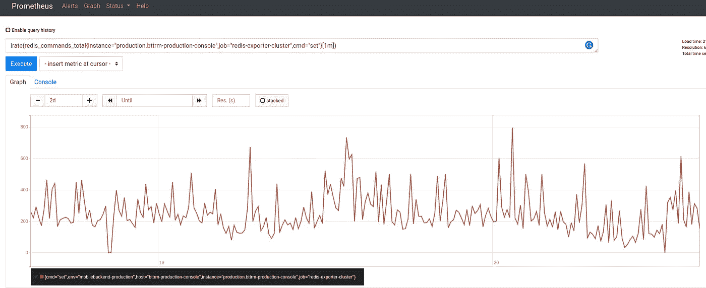

# Redis: "psync 计划尽快关闭以克服输出缓冲区限制"и client-output-buffer-limit

> 原文：<https://itnext.io/redis-psync-scheduled-to-be-closed-asap-for-overcoming-of-output-buffer-limits-%D0%B8-a9ecd40d5491?source=collection_archive---------3----------------------->


我们有一个带有主从复制和 Sentinel 的 Redis 集群，请参见 [Redis: replication，第 2 部分—主从复制和 Redis Sentinel](https://rtfm.co.ua/en/redis-replication-part-2-master-slave-replication-and-redis-sentinel/) 、 [Redis: fork —不能分配内存、Linux、虚拟内存和 vm.overcommit_memory](https://rtfm.co.ua/en/redis-fork-cannot-allocate-memory-linux-virtual-memory-and-vm-overcommit_memory/) 和 [Redis:主要配置参数和性能调优概述](https://rtfm.co.ua/en/draft-eng-redis-main-configuration-parameters-and-performance-tuning-overview/)帖子。

这个系统运行得很好，直到我们开始更积极地使用它。

## Redis 信息

一些有用的故障排除命令。

使用`INFO`命令检查所有数据库中的所有关键字:

```
admin@bttrm-production-console:~$ redis-cli -h 10.0.3.105 -p 6389 INFO keyspace
Keyspace
db0:keys=5,expires=0,avg_ttl=0
db4:keys=16988,expires=2698,avg_ttl=30025662
db5:keys=138713,expires=90388,avg_ttl=7435947
```

和按键大小——使用`bigkeys`命令:

```
admin@bttrm-production-console:~$ redis-cli -h 10.0.3.105 -p 6389 -n 5 — bigkeys
…
[00.00%] Biggest string found so far ‘projectname_aba3b5bf1af24246b465826658b3c375’ with 45 bytes
…
[38.56%] Biggest string found so far ‘projectname_44bb0e2dd7f4fabf41ee09001791bdc4’ with 4627517 bytes — — — — summary — — — -Sampled 150726 keys in the keyspace!Total key length in bytes is 6782670 (avg len 45.00)Biggest string found ‘projectname_44bb0e2dd7f4fabf41ee09001791bdc4’ has 4627517 bytes
```

美国完整选项`--stat`:

```
root@bttrm-production-console:/home/admin# redis-cli -h 10.0.3.105 -p 6389 — stat -i 2
 — — — — data — — — — — — — — — — — — — — load — — — — — — — — — — — child -
keys mem clients blocked requests connections
10290781 3.80G 12 0 37279511 (+0) 79301
…
10292946 3.81G 10 0 37283233 (+701) 79502
…
```

还有一个`monitor`:

```
root@bttrm-production-console:/home/admin# redis-cli -h 10.0.3.105 -p 6389 monitor
…
1582037638.965389 [5 10.0.3.92:58594] “SET” “projectname_e7e0a3ed5251cb36e2925957981e9faa” “a:2:{***}
1582037638.967345 [5 10.0.3.71:40906] “SET” “projectname_80d9171937e4463d0238bcc42a54aead” “a:2:{***}
1582037638.967411 [5 10.0.3.71:40684] “SET” “projectname_e8b81cd503d87be74070aa012b22be4a” “a:2:{***}
…
```

还有`[slowlog](https://redis.io/commands/slowlog)`:

```
10.0.3.105:6389> SLOWLOG get 2
1) 1) (integer) 9
2) (integer) 1582119750
3) (integer) 21507206
4) 1) “FLUSHDB”
2) 1) (integer) 8
2) (integer) 1582058687
3) (integer) 71653
4) 1) “PSYNC”
2) “?”
3) “-1”
```

另外，检查`[latency](https://redis.io/topics/latency-monitor)`。

现在，让我们去错误。

## “psync 计划尽快关闭，以克服输出缓冲区限制”错误

在一个风平浪静的夜晚，我们的监控系统发出了集群停机的警报。

该问题期间 Redis 主日志为:

```
2244:C 17 Feb 19:48:12.464 * DB saved on disk\
2244:C 17 Feb 19:48:12.527 * RDB: 370 MB of memory used by copy-on-write
1911:M 17 Feb 19:48:12.681 * Background saving terminated with success
1911:M 17 Feb 19:48:12.681 * Starting BGSAVE for SYNC with target: disk
1911:M 17 Feb 19:48:12.744 * Background saving started by pid 2397
1911:M 17 Feb 19:48:13.251 * Slave 10.0.3.71:6389 asks for synchronization
1911:M 17 Feb 19:48:13.251 * Full resync requested by slave 10.0.3.71:6389
1911:M 17 Feb 19:48:13.251 * Waiting for end of BGSAVE for SYNC
1911:M 17 Feb 19:48:15.743 # Client id=3144 addr=10.0.3.92:40313 fd=104 name= age=31 idle=31 flags=S db=0 sub=0 psub=0 multi=-1 qbuf=0 qbuf-free=0 obl=11284 oll=1203 omem=269714472 events=r cmd=psync scheduled to be closed ASAP for overcoming of output buffer limits.
1911:M 17 Feb 19:48:15.743 # Client id=4300 addr=10.0.3.71:40029 fd=110 name= age=2 idle=2 flags=S db=0 sub=0 psub=0 multi=-1 qbuf=0 qbuf-free=0 obl=11284 oll=1203 omem=269714472 events=r cmd=psync scheduled to be closed ASAP for overcoming of output buffer limits.
1911:M 17 Feb 19:48:15.754 # Connection with slave 10.0.3.92:6389 lost.
1911:M 17 Feb 19:48:15.756 # Connection with slave 10.0.3.71:6389 lost.
1911:M 17 Feb 19:48:16.251 * Slave 10.0.3.71:6389 asks for synchronization
1911:M 17 Feb 19:48:16.251 * Full resync requested by slave 10.0.3.71:6389
1911:M 17 Feb 19:48:16.251 * Can’t attach the slave to the current BGSAVE. Waiting for next BGSAVE for SYNC
```

在所有文本中，我们最感兴趣的是“ **psync 计划尽快关闭，以克服输出缓冲区限制**”消息。

## 一个“快速解决方案”— `client-output-buffer-limit`

解决办法是增加`[client-output-buffer-limit](https://redis.io/topics/clients#output-buffers-limits)`。

简而言之，Redis 主机使用这个缓冲区来存储与从机同步期间发生更改的数据。

检查当前值:

```
root@bttrm-production-console:/home/admin# redis-cli -h 10.0.3.105 -p 6389
10.0.3.105:6389> config get client-output-buffer-limit
1) “client-output-buffer-limit”
2) “normal 0 0 0 slave 268435456 67108864 60 pubsub 33554432 8388608 60”
```

这里的格式是:

```
client-output-buffer-limit <class> <hard limit> <soft limit> <soft seconds>
```

和默认值:

*   `client-output-buffer-limit`正常 0 0
*   `client-output-buffer-limit` **从机** 256mb 64mb 60
*   `client-output-buffer-limit`pubsub32mb 8mb 60

通过这样的设置，如果达到了`<hard limit>` - 256 MB，或者从`<soft seconds>` - 60 秒开始超过了`<soft limit>` - 64 MB，则与从机的连接将立即关闭。

对我们来说——我们需要增加*从模块 268435456 67108864 60* 中的值。

在主控主机上设置新值 512 MB:

```
10.0.3.105:6389> config set client-output-buffer-limit “slave 4194990176 4194990176 0”
OK
10.0.3.105:6389> config get client-output-buffer-limit
1) “client-output-buffer-limit”
2) “normal 0 0 0 slave 4194990176 4194990176 0 pubsub 33554432 8388608 60”
```

实际上，我不得不将缓冲区增加到 512 MB，然后是 1 GB，2…和 4，8-只有在 10 BG 的情况下，服务才能完成同步过程。，尽管内存中的数据只有大约 5 GB:

```
1911:M 17 Feb 20:30:21.308 * Slave 10.0.3.71:6389 asks for synchronization
1911:M 17 Feb 20:30:21.308 * Full resync requested by slave 10.0.3.71:6389
1911:M 17 Feb 20:30:21.308 * Starting BGSAVE for SYNC with target: disk
1911:M 17 Feb 20:30:21.389 * Background saving started by pid 8166
1911:M 17 Feb 20:30:21.851 * Slave 10.0.3.92:6389 asks for synchronization
1911:M 17 Feb 20:30:21.851 * Full resync requested by slave 10.0.3.92:6389
1911:M 17 Feb 20:30:21.851 * Waiting for end of BGSAVE for SYNC
8166:C 17 Feb 20:30:55.069 * DB saved on disk
8166:C 17 Feb 20:30:55.148 * RDB: 851 MB of memory used by copy-on-write
1911:M 17 Feb 20:30:55.365 * Background saving terminated with success
1911:M 17 Feb 20:31:05.160 * Synchronization with slave 10.0.3.92:6389 succeeded
1911:M 17 Feb 20:31:05.223 * Synchronization with slave 10.0.3.71:6389 succeeded
```

和一个奴隶的日志:

```
11347:S 17 Feb 20:29:06.523 * Connecting to MASTER 10.0.3.105:6389
11347:S 17 Feb 20:29:06.524 * MASTER <-> SLAVE sync started
11347:S 17 Feb 20:29:06.526 * Non blocking connect for SYNC fired the event.
11347:S 17 Feb 20:29:06.530 * Master replied to PING, replication can continue…
11347:S 17 Feb 20:29:06.532 * Partial resynchronization not possible (no cached master)
11347:S 17 Feb 20:29:06.612 * Full resync from master: e96dc8dcea06375e45f9e0796f796cb642b2a94a:243379789779
11347:S 17 Feb 20:29:36.120 * MASTER <-> SLAVE sync: receiving 1457381394 bytes from master
11347:S 17 Feb 20:29:43.069 # I/O error trying to sync with MASTER: connection lost
11347:S 17 Feb 20:29:43.191 * Connecting to MASTER 10.0.3.105:6389
11347:S 17 Feb 20:29:43.191 * MASTER <-> SLAVE sync started
11347:S 17 Feb 20:29:43.198 * Non blocking connect for SYNC fired the event.
11347:S 17 Feb 20:29:43.446 * Master replied to PING, replication can continue…
11347:S 17 Feb 20:29:43.450 * Partial resynchronization not possible (no cached master)
11347:S 17 Feb 20:29:43.532 * Full resync from master: e96dc8dcea06375e45f9e0796f796cb642b2a94a:247290941137
11347:S 17 Feb 20:30:17.763 * MASTER <-> SLAVE sync: receiving 1458314307 bytes from master
11347:S 17 Feb 20:30:20.516 # I/O error trying to sync with MASTER: connection lost
11347:S 17 Feb 20:30:21.303 * Connecting to MASTER 10.0.3.105:6389
11347:S 17 Feb 20:30:21.303 * MASTER <-> SLAVE sync started
11347:S 17 Feb 20:30:21.304 * Non blocking connect for SYNC fired the event.
11347:S 17 Feb 20:30:21.305 * Master replied to PING, replication can continue…
11347:S 17 Feb 20:30:21.307 * Partial resynchronization not possible (no cached master)
11347:S 17 Feb 20:30:21.389 * Full resync from master: e96dc8dcea06375e45f9e0796f796cb642b2a94a:251282993972
11347:S 17 Feb 20:30:55.365 * MASTER <-> SLAVE sync: receiving 1459112192 bytes from master
11347:S 17 Feb 20:31:05.299 * MASTER <-> SLAVE sync: Flushing old data
11347:S 17 Feb 20:31:20.802 * MASTER <-> SLAVE sync: Loading DB in memory
11347:S 17 Feb 20:31:41.073 * MASTER <-> SLAVE sync: Finished with success
```

现在，当生产恢复时，让我们更深入地探讨这个问题。

## 这是怎么回事？

## Redis 主从式——解释了同步过程

让我们看看同步过程是如何执行的:

1.  一个从站在开始或断开连接后找到一个主站，请求把主站的数据库发送给他
2.  主设备回复该请求，并:
3.  创建一个子进程，将其数据库转储创建到文件系统上，作为一个`dump.rdb`文件(参见`[fork()](https://rtfm.co.ua/en/redis-fork-cannot-allocate-memory-linux-virtual-memory-and-vm-overcommit_memory/#fork_vs_fork_vs_clone)`[vs](https://rtfm.co.ua/en/redis-fork-cannot-allocate-memory-linux-virtual-memory-and-vm-overcommit_memory/#fork_vs_fork_vs_clone)`[fork()](https://rtfm.co.ua/en/redis-fork-cannot-allocate-memory-linux-virtual-memory-and-vm-overcommit_memory/#fork_vs_fork_vs_clone)`[vs](https://rtfm.co.ua/en/redis-fork-cannot-allocate-memory-linux-virtual-memory-and-vm-overcommit_memory/#fork_vs_fork_vs_clone)`[clone()](https://rtfm.co.ua/en/redis-fork-cannot-allocate-memory-linux-virtual-memory-and-vm-overcommit_memory/#fork_vs_fork_vs_clone)`)
4.  在此期间，Master 将继续处理当前连接的客户端
5.  并且在转储创建期间其数据集中更改的所有数据都将保存到复制缓冲区中
6.  主设备向从设备发送转储准备就绪的通知，从设备开始通过网络复制转储，并将其保存在从设备主机的磁盘上
7.  从服务器完成转储副本，将其加载到 Redis 实例内存中，并向主服务器发送通知，告知从服务器已准备好为客户端提供服务
8.  主设备依次检查其复制缓冲区，如果有任何数据，主设备开始将已更改的数据从缓冲区发送到从设备，因此从设备可以用来自主设备的新数据替换其存储器中的数据
9.  从属服务器应用这些更改并开始工作

因此，复制过程由两部分组成:

1.  首先，创建一个完整的数据库副本，其中可能包含一些过时的数据(在转储创建和传输过程中发生了更改)
2.  之后，将来自缓冲区的一致更新应用于从服务器上的数据，使其与主服务器数据库中的数据相同

## 数据库和缓冲区大小

第一个问题是，与数据库大小相比，Redis 有时需要 x3 内存来创建转储，第二个问题(也是主要问题)是，虽然会创建转储，然后经过所有网络延迟传输到从服务器，并保存到从服务器的硬盘上，但主服务器上的数据可能会发生变化。

因此，在转储转换期间，主 Redis 实例上的所有此类更改都将存储在复制缓冲区中。但是一旦耗尽，它将被清除，同步过程将重新开始。结束了。再一次。

理论上，缓冲区的大小必须不小于数据库的大小，尽管数据库中的所有数据在同步过程中被更新的可能性很小。

在任何情况下，这都是非常粗略的估计，您必须测试和监控您的实际使用情况，以获得缓冲区大小的真实值。

但是这里有几个步骤可以帮助你进行这样的调查。

检查主服务器内存中数据库的当前大小:

```
root@bttrm-production-console:/home/admin# redis-cli -h 10.0.3.105 -p 6389 info memory
Memory
used_memory:871106648
used_memory_human:830.75M
…
```

创建其转储:

```
root@bttrm-production-console:/home/admin# redis-cli -h 10.0.3.105 -p 6389 bgsave
Background saving started
```

检查 RDB(转储的)文件大小:

```
root@bttrm-production-console:/home/admin# ls -lh /var/lib/redis-cluster/dump.rdb
-rw-rw — — 1 redis redis 345M Feb 20 15:04 /var/lib/redis-cluster/dump.rdb
```

因此，在内存中，我们有 830 MB 的数据库，但在配置中，我们的内存限制高达 hots 内存的 50%:

```
root@bttrm-production-console:/home/admin# cat /etc/redis-cluster/redis-cluster.conf | grep maxmem
maxmemory 50%
maxmemory-policy allkeys-lru
```

因此，数据库可以增长到大约 16 GB(服务器总共有 32 GB 内存)，在创建转储之后，它的大小大约为 7–8gb。

现在，我们需要获得网络传输过程的粗略估计时间，并知道要传输的最大文件大小——让我们计算完成它所需的时间。

要检查连接速度，可以使用`[iperf](https://rtfm.co.ua/linux-iperf-test-skorosti/)`工具，将其安装在从设备和主设备上:

```
root@bttrm-production-console:/home/admin# apt -y install iperf3
```

在主控主机上—在服务器模式下运行 iperf:

```
root@bttrm-production-console:/home/admin# iperf3 -s
 — — — — — — — — — — — — — — — — — — — — — — — — — — — — — -
Server listening on 5201
 — — — — — — — — — — — — — — — — — — — — — — — — — — — — — -
…
```

*后来我发现了* `*redis-cli --latency -h <Redis IP> -p <Redis port>*`

并作为客户机从从属服务器运行它:

```
root@bttrm-production-app-1:/home/admin# iperf3 -c 10.0.3.105
Connecting to host 10.0.3.105, port 5201
[ 4] local 10.0.3.71 port 47046 connected to 10.0.3.105 port 5201
[ ID] Interval Transfer Bandwidth Retr Cwnd
[ 4] 0.00–1.00 sec 585 MBytes 4.90 Gbits/sec 0 1.37 MBytes
…
[ 4] 9.00–10.00 sec 592 MBytes 4.97 Gbits/sec 0 2.06 MBytes
- — — — — — — — — — — — — — — — — — — — — — — — -
[ ID] Interval Transfer Bandwidth Retr
[ 4] 0.00–10.00 sec 5.78 GBytes 4.96 Gbits/sec 0 sender
[ 4] 0.00–10.00 sec 5.78 GBytes 4.96 Gbits/sec receiver
iperf Done.
```

*4.90 吉比特/秒* — 625 兆字节/秒。

知道转储的大小大约为 7 GB，我们可以使用计算器[这里的> > >](https://downloadtimecalculator.com/Upload-Time-Calculator.html) — 13 秒来转移它。

现在，使用`--stat`我们可以检查一秒钟内在主服务器上更新了多少密钥:

```
root@bttrm-production-app-1:/home/admin# redis-cli -h 10.0.3.105 -p 6389 — stat
 — — — — data — — — — — — — — — — — — — — load — — — — — — — — — — — child -
keys mem clients blocked requests connections
530178 765.42M 9 0 91699673 (+0) 2856563
530407 766.04M 16 0 91700194 (+521) 2856580
…
```

*530178–530407*= =每秒 229 键。

或者你可以使用 Prometheus 和`[redis-exporter](https://github.com/oliver006/redis_exporter)`这样的监控工具，然后选择所有的`SET`请求，因为这是主更新的请求:

```
irate(redis_commands_total{instance="production.bttrm-production-console",job="redis-exporter-cluster",cmd="set"}[1m])
```



并查找密钥大小:

```
root@bttrm-production-app-1:/home/admin# redis-cli -h 10.0.3.105 -p 6389 — bigkeys
…
[00.00%] Biggest string found so far ‘projectname_8caf094272eac1c6a51213c1c878767b’ with 45 bytes
…
[00.00%] Biggest string found so far ‘projectname_44bb0e2dd7f4fabf41ee09001791bdc4’ with 4626843 bytes
…
Biggest string found ‘projectname_44bb0e2dd7f4fabf41ee09001791bdc4’ has 4626843 bytes
```

229 大约 4.5 MB ==在这 13 秒的传输过程中，大约 1 GB 的更改数据将被添加到缓冲区中。

但是，同样，这是非常粗略的计算，因为我们是在正常工作负载期间计算操作，而有时工作负载可能会大几倍。

## 有用的链接

*   [Redis 客户端处理](https://redis.io/topics/clients#output-buffers-limits)
*   [客户端缓冲区-在生产中使用 Redis 之前，请检查这一点！](https://medium.com/@VipulDivyanshu/client-buffers-before-taking-redis-in-production-read-this-c175a508d8ba)
*   [devo PS 最头疼的 Redis 复制缓冲区](https://redislabs.com/blog/top-redis-headaches-for-devops-replication-buffer/)
*   [Redis 延迟问题故障排除](https://redis.io/topics/latency)
*   [Redis 无休止的复制循环:什么，为什么，如何解决](https://redislabs.com/blog/the-endless-redis-replication-loop-what-why-and-how-to-solve-it/) ( `slave-output-buffer-throttling`没有加到 Redis，但是帖子真的很有意思)
*   [您需要关注的 6 个关键 Redis 监控指标](https://scalegrid.io/blog/6-crucial-redis-monitoring-metrics/)
*   [如何收集 Redis 指标](https://www.datadoghq.com/blog/how-to-collect-redis-metrics/)
*   [如何测试 Redis 服务器的性能](https://www.digitalocean.com/community/tutorials/how-to-perform-redis-benchmark-tests#using-the-memtier-benchmark-tool)
*   [一些有趣的 redis-cli 命令和用法](https://pingredis.blogspot.com/2017/02/some-interesting-redis-cli-commands-and.html)

*最初发布于* [*RTFM: Linux、DevOps 和系统管理*](https://rtfm.co.ua/en/en-draft-redis-psync-scheduled-to-be-closed-asap-for-overcoming-of-output-buffer-limits-i-client-output-buffer-limit/) *。*