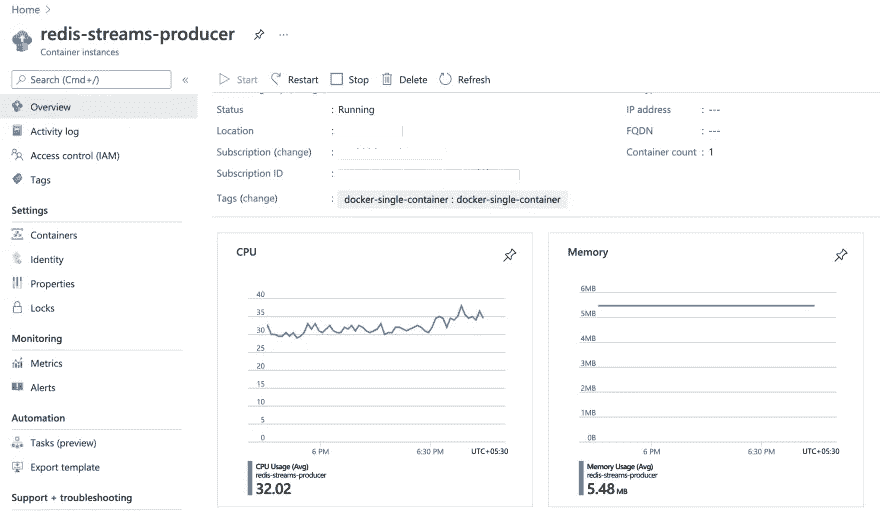

# Redis Streams 在行动——第二部分(Tweets 消费者应用)

> 原文：<https://itnext.io/redis-streams-in-action-part-2-tweets-consumer-app-674fd3b45f6f?source=collection_archive---------1----------------------->

## 构建一个 Rust 应用程序，从 Twitter 流 API 中使用

欢迎阅读这一系列的博客文章，这些文章通过一个实际的例子介绍了 [Redis Streams](https://redis.io/topics/streams-intro) 。我们将使用一个示例应用程序来实时搜索和查询 Twitter 数据。[redi research](https://redisearch.io/)和[redi Streams](https://redis.io/topics/streams-intro)是这个解决方案的主干，它由几个合作组件组成，每个组件都将在一篇专门的博客文章中介绍。

*   [第一部分](/redis-streams-in-action-part-1-intro-and-overview-135f66d3ab58)
*   第二部分——这个博客
*   [第三部分](/redis-streams-in-action-part-3-tweets-processor-app-254161838973)
*   [第四部分](/redis-streams-in-action-part-4-serverless-monitoring-service-faef52ee58db)

> *本 GitHub 回购中有代码—*[*https://github.com/abhirockzz/redis-streams-in-action*](https://github.com/abhirockzz/redis-streams-in-action)

在这一部分中，我们将关注与 Twitter 流 API 交互的服务，以消费 tweets 并将其移动到处理管道中的下一部分。


高层建筑

我们的最终目标是能够处理推文，并通过`RediSearch`使它们可用于搜索和查询。人们可以编写一个“尽一切努力”的服务来消费推文，并将它们直接存储在`RediSearch`中。但是，为了扩展以处理大量的 tweets，我们需要一个服务来充当缓冲，并分离我们的生产者(我们将在这篇博客中关注的应用程序)和消费者(在下一篇博客中讨论)。

这正是我们的第一个组件所促进的——它消费流 Twitter 数据并将其转发到 Redis 流。我们将把它部署到 [Azure Container 实例](https://docs.microsoft.com/azure/container-instances/container-instances-overview?WT.mc_id=data-17927-abhishgu)，验证它的功能，并演示它如何与代码一起工作。

> 正如您将在本系列的后续部分中看到的，这也为横向扩展架构提供了基础。

总而言之，这篇博文短小精悍！它为解决方案的其他部分奠定了基础，这些部分将在后续的文章中讨论。请不要担心这个服务是用 Rust 编写的(以防你还不知道)。这种逻辑可以很容易地移植到您喜欢的编程语言中。

# 先决条件

如果你还没有一个免费的 Azure 账户的话，先申请一个[账户](https://azure.microsoft.com/free/?WT.mc_id=data-17927-abhishgu)，然后[安装 Azure CLI](https://docs.microsoft.com/cli/azure/install-azure-cli?WT.mc_id=data-17927-abhishgu) 。

我们将使用常规的 Docker CLI 命令将 tweets 消费者应用程序部署到 [Azure 容器实例](https://docs.microsoft.com/azure/container-instances/container-instances-overview?WT.mc_id=data-17927-abhishgu)。Docker 和 Azure 之间的[集成实现了这一功能。只要确保你有 Docker 桌面版 2.3.0.5 或更高版本，用于](https://docs.docker.com/engine/context/aci-integration/) [Windows](https://desktop.docker.com/win/edge/Docker%20Desktop%20Installer.exe) 、 [macOS](https://desktop.docker.com/mac/edge/Docker.dmg) ，或者安装 [Docker ACI 集成 CLI 用于 Linux](https://docs.docker.com/engine/context/aci-integration/#install-the-docker-aci-integration-cli-on-linux) 。

要使用 Twitter 流 API，您还需要一个 Twitter 开发者帐户。如果您还没有，请[按照这些说明](https://developer.twitter.com/en/apply-for-access)进行设置。

# 将应用部署到 Azure 容器实例

首先，使用这个快速入门设置 Redis 的 Azure 缓存企业层。完成此步骤后，请确保保存以下信息:Redis 主机名和访问密钥


tweets 消费者应用程序作为一个 [Docker 容器](https://hub.docker.com/r/abhirockzz/tweets-redis-streams-producer-rust)可用——最简单的方法就是简单地重用它。如果您希望创建自己的图像，请使用 GitHub repo 中的`[Dockerfile](https://github.com/abhirockzz/redis-streams-in-action/blob/master/tweets-consumer/Dockerfile)` [。](https://github.com/abhirockzz/redis-streams-in-action/blob/master/tweets-consumer/Dockerfile)

现在，您将看到将它部署到 Azure 容器实例是多么方便，这允许您在托管的、无服务器的 Azure 环境中按需运行 Docker 容器。

首先，[创建一个 Azure 上下文](https://docs.microsoft.com/azure/container-instances/quickstart-docker-cli?WT.mc_id=data-17927-abhishgu#create-azure-context)将 Docker 与 Azure 订阅和资源组关联起来，这样您就可以创建和管理容器实例。

```
docker login azure
docker context create aci aci-context
docker context use aci-context
```

设置环境变量—确保根据您的帐户更新 Redis 主机和凭据:

```
export REDIS_HOSTNAME=<redis host port e.g. my-redis-host:10000>
export IS_TLS=true
export REDIS_PASSWORD=<redis access key (password)># don't forget your twitter api credentials
export TWITTER_API_KEY=<api key>
export TWITTER_API_KEY_SECRET=<api key secret>
export TWITTER_ACCESS_TOKEN=<access token>
export TWITTER_ACCESS_TOKEN_SECRET=<access token secret>
```

就执行好老`docker run`:

```
docker run -d --name redis-streams-producer \
-e REDIS_HOSTNAME=$REDIS_HOSTNAME \
-e IS_TLS=$IS_TLS \
-e REDIS_PASSWORD=$REDIS_PASSWORD \
-e TWITTER_API_KEY=$TWITTER_API_KEY \
-e TWITTER_API_KEY_SECRET=$TWITTER_API_KEY_SECRET \
-e TWITTER_ACCESS_TOKEN=$TWITTER_ACCESS_TOKEN \
-e TWITTER_ACCESS_TOKEN_SECRET=$TWITTER_ACCESS_TOKEN_SECRET \
abhirockzz/tweets-redis-streams-producer-rust
```

现在应该在 Azure 中创建了一个容器，您应该会看到类似如下的输出:

```
[+] Running 2/2
 ⠿ Group redis-streams-producer  Created                                                                             4.2s
 ⠿ redis-streams-producer        Created                                                                            15.8s
```

使用 Azure 门户对此进行验证:



在 Azure 容器实例中发布消费者应用

要检查容器日志:

```
docker logs redis-streams-producer
```

# 那么，这有用吗？

嗯，应该的！要进行确认，请使用`redis-cli`连接到 Redis 实例:

```
redis-cli -h <redis cache host> -p <redis port> -a <access key> --tls
```

…并运行 [XRANGE](https://redis.io/commands/xrange) 命令来检查 Redis 流:

```
XRANGE tweets_stream - + COUNT 5
```

这将返回前五条推文。您可以根据需要更换`COUNT`。

> *`*-*`*和* `*+*` *特殊 ID 分别表示流内可能的最小 ID 和最大 ID**

*这就是确认我们的应用程序能够消费 tweets 并将其添加到 Redis 流所需的全部内容。如前所述，我们解决方案中的其余组件将构建在此基础之上。*

*您可以暂时暂停应用程序，也可以将其删除:*

```
*#to pause
docker stop redis-streams-producer#to delete
docker rm redis-streams-producer*
```

*既然您已经看到了运行中的应用程序，让我们快速浏览一下“如何”工作。如果您对探索 Rust 代码感兴趣，您会发现它很有用。*

# *代码遍历*

> **你可以* [*参考这里的代码*](https://github.com/abhirockzz/redis-streams-in-action/tree/master/tweets-consumer/src)*

*该应用程序使用以下库:*

*   *用于访问 [Twitter 流 API](https://github.com/tesaguri/twitter-stream-rs) 的 Rust 库(使用 [tokio](https://github.com/tokio-rs/tokio)*
*   *[redis-rs](https://github.com/mitsuhiko/redis-rs) ，redis 的 Rust 库，有高级和低级 API*
*   *[serde](https://github.com/serde-rs/serde) 和 [serde json](https://github.com/serde-rs/json)*

*它首先连接到 Redis 和 Twitter:*

```
*fn connect_redis() -> redis::Connection {
    println!("Connecting to Redis");
    let redis_host_name =
        env::var("REDIS_HOSTNAME").expect("missing environment variable REDIS_HOSTNAME");
    let redis_password = env::var("REDIS_PASSWORD").unwrap_or_default(); //if Redis server needs secure connection
    let uri_scheme = match env::var("IS_TLS") {
        Ok(_) => "rediss",
        Err(_) => "redis",
    }; let redis_conn_url = format!("{}://:{}@{}", uri_scheme, redis_password, redis_host_name);
    println!("redis_conn_url {}", redis_conn_url); let client = redis::Client::open(redis_conn_url).expect("check Redis connection URL");
    client.get_connection().expect("failed to connect to Redis")
}*
```

*我们只需连接到 [Twitter 样本流](https://developer.twitter.com/en/docs/twitter-api/tweets/sampled-stream/api-reference/get-tweets-sample-stream)，就可以实时访问大约 1%的推文，而不是跟踪一组特定的关键词或用户:*

```
*let token = twitter_token(); TwitterStream::sample(&token)
        .try_flatten_stream()
        .try_for_each(|json| {
            let msg: model::StreamMessage =
                serde_json::from_str(&json).expect("failed to convert tweet JSON to struct");
            process(msg, c.clone());
            future::ok(())
        })
        .await
        .expect("error connecting to Twitter stream!");*
```

*大部分逻辑封装在`process`函数中。让我们一点一点来看。
`twitter-stream` crate 以原始 JSON 形式返回每条 tweet。它被转换成一个`model::StreamMessage`，这是一个根据我们打算从原始推文中提取的数据建模的结构。*

*我们使用`serde_json`来完成这项工作:*

```
*serde_json::from_str(&json).expect("json to struct conversion failed");*
```

*然后它和一个 [redis::Connection](https://docs.rs/redis/0.20.0/redis/struct.Connection.html) 一起被传递给`process`函数。*

```
*let conn = connect_redis();
let c = Arc::new(Mutex::new(conn));
...
fn process(msg: model::StreamMessage, conn: Arc<Mutex<redis::Connection>>) {
    //omitted
}*
```

*但是为什么要把它包在[互斥](https://doc.rust-lang.org/std/sync/struct.Mutex.html)的[弧](https://doc.rust-lang.org/std/sync/struct.Arc.html)中呢？*

*这是因为我们需要将`redis::Connection`传递给`FnMut`闭包。它[移动](https://doc.rust-lang.org/book/ch04-01-what-is-ownership.html)连接，因此我们需要使用一个共享引用，这是`Arc`提供的。但是`Arc`是不够的，因为我们不允许改变数据。因此，我们使用一个`Mutex`来锁定连接对象 Rust 编译器可以确信一次只有一个线程可以访问它(保持不变性)*

*加工部分比较简单。这都是关于使用 [xadd_map](https://docs.rs/redis/0.20.0/redis/trait.Commands.html#method.xadd_map) 函数将推文添加到 Redis 流。它接受一个 [BTreeMap](https://doc.rust-lang.org/std/collections/struct.BTreeMap.html) ，这是我们从`model::StreamMessage`中的信息创建的 tweet 文本、twitter 用户(屏幕)名称、ID、位置和标签(如果有的话)。最终，目标是能够在`RediSearch`中索引这些内容，并灵活地查询它们。*

```
*let mut stream_entry: BTreeMap<String, String> = BTreeMap::new();
                stream_entry.insert("id".to_string(), tweet.id.to_string());
                stream_entry.insert("user".to_string(), tweet.user.screen_name);
                stream_entry.insert("text".to_string(), tweet.text);
                stream_entry.insert("location".to_string(), tweet.user.location);*
```

*这部分到此为止。*

# *继续下一个…*

*我们才刚刚开始！这是我们服务中的第一个组件，为处理推文并通过`RediSearch`进行查询奠定了基础。在接下来的博客中，我们将深入探讨如何使用基于 Java 的应用程序消费和处理来自 Redis 流的 tweets。敬请期待！*