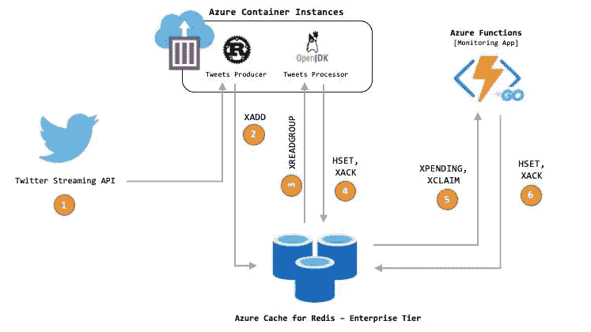
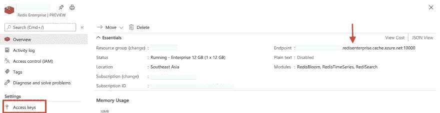
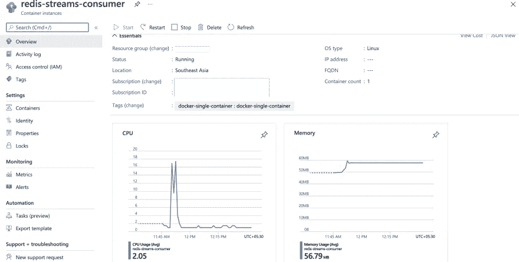

# Redis Streams 的应用——第 3 部分(Tweets 处理器应用)

> 原文：<https://itnext.io/redis-streams-in-action-part-3-tweets-processor-app-254161838973?source=collection_archive---------1----------------------->

## Java 应用程序处理来自 Redis 流的推文

欢迎阅读这一系列的博客文章，这些文章通过一个实际的例子介绍了 [Redis Streams](https://redis.io/topics/streams-intro) 。我们将使用一个示例应用程序来实时搜索和查询 Twitter 数据。 [RediSearch](https://redisearch.io/) 和 [Redis Streams](https://redis.io/topics/streams-intro) 是该解决方案的主干，由几个合作组件组成，我们将在一篇专门的博客文章中介绍每一个组件。

*   [第一部分](/redis-streams-in-action-part-1-intro-and-overview-135f66d3ab58)
*   [第二部分](/redis-streams-in-action-part-2-tweets-consumer-app-674fd3b45f6f)
*   第 3 部分—本博客
*   [第四部分](/redis-streams-in-action-part-4-serverless-monitoring-service-faef52ee58db)

> *本 GitHub 回购中有代码—*[*https://github.com/abhirockzz/redis-streams-in-action*](https://github.com/abhirockzz/redis-streams-in-action)

这篇博文将介绍一个基于 Java 的 tweets 处理器应用程序，它的作用是从 Redis 流中提取 Tweets 并存储它们(作为一个`HASH`)，这样就可以使用`RediSearch`对它们进行查询(在`RediSearch`中，准确的术语是“索引文档”)。您将把应用程序部署到 Azure，验证它，运行一些`RediSearch`查询来搜索 tweets。最后，有一个部分，我们将通过代码来理解“事情是如何工作的”。



高层建筑

# 先决条件

请务必阅读本系列的第 2 部分，并启动和运行 Tweets 消费者应用程序。这个应用程序将从 Twitter 流 API 中读取推文，并将它们推送到 Redis 流。我们的 tweets 处理器应用程序(在这篇博客中描述的那个)将会接管。

你需要一个 Azure 账户[，你可以免费获得这个账户](https://dev.to/abhirockzz/(https://azure.microsoft.com/free/?WT.mc_id=data-17927-abhishgu))和 [Azure CLI](https://docs.microsoft.com/cli/azure/install-azure-cli?WT.mc_id=data-17927-abhishgu) 。与之前的应用程序一样，这个应用程序也将使用常规 Docker CLI 命令部署到 [Azure 容器实例](https://docs.microsoft.com/azure/container-instances/container-instances-overview?WT.mc_id=data-17927-abhishgu)。Docker 和 Azure 之间的[集成实现了这一功能。只要确保你有 Docker 桌面版 2.3.0.5 或更高版本，用于](https://docs.docker.com/engine/context/aci-integration/) [Windows](https://desktop.docker.com/win/edge/Docker%20Desktop%20Installer.exe) 、 [macOS](https://desktop.docker.com/mac/edge/Docker.dmg) ，或者安装 [Docker ACI 集成 CLI 用于 Linux](https://docs.docker.com/engine/context/aci-integration/#install-the-docker-aci-integration-cli-on-linux) 。

# 将应用部署到 Azure 容器实例

如果你一直在关注上一篇博文，你应该已经使用这个快速入门为 Redis 设置了 Azure Cache 的企业层。完成此步骤后，请确保保存以下信息:Redis 主机名和访问密钥



企业级:用于 Redis 的 Azure 缓存

该应用程序可以作为一个 [Docker 容器](https://hub.docker.com/r/abhirockzz/tweets-redis-streams-consumer-java)获得——最简单的方法就是简单地重用它。如果你想建立自己的形象，请使用 GitHub repo 上的`[Dockerfile](https://github.com/abhirockzz/redis-streams-in-action/blob/master/tweets-processor/Dockerfile)` [。](https://github.com/abhirockzz/redis-streams-in-action/blob/master/tweets-processor/Dockerfile)

> *如果您选择构建自己的映像，请确保首先使用 Maven (* `*mvn clean install*` *)构建 JAR 文件*

将它部署到 Azure 容器实例真的很方便，这允许你在一个托管的、无服务器的 Azure 环境中按需运行 Docker 容器。

确保您[创建了一个 Azure 上下文](https://docs.microsoft.com/azure/container-instances/quickstart-docker-cli?WT.mc_id=data-17927-abhishgu#create-azure-context)来将 Docker 与 Azure 订阅和资源组相关联，这样您就可以创建和管理容器实例。

```
docker login azure
docker context create aci aci-context
docker context use aci-context
```

设置环境变量—确保根据您的帐户更新 Redis 主机和凭据:

```
export STREAM_NAME=tweets_stream # don't change
export STREAM_CONSUMER_GROUP_NAME=redisearch_app_group # don't changeexport REDIS_HOST=<redis host port e.g. my-redis-host>
export REDIS_PORT=<redis port>
export REDIS_PASSWORD=<redis access key (password)>
export SSL=true
```

..然后使用`docker run`将容器部署到 Azure:

```
docker run -d --name redis-streams-consumer \
-e STREAM_NAME=$STREAM_NAME \
-e STREAM_CONSUMER_GROUP_NAME=$STREAM_CONSUMER_GROUP_NAME \
-e REDIS_HOST=$REDIS_HOST \
-e REDIS_PORT=$REDIS_PORT \
-e REDIS_PASSWORD=$REDIS_PASSWORD \
-e SSL=$SSL \
abhirockzz/tweets-redis-streams-consumer-java
```

在创建容器时，您应该会看到类似如下的输出:

```
[+] Running 2/2
 ⠿ Group redis-streams-consumer  Created                                                                             5.2s
 ⠿ redis-streams-consumer        Created                                                                            10.5s
```

使用 Azure 门户对此进行验证:



在 Azure 容器实例中运行的 Tweets 处理器应用程序

要检查容器日志，您可以使用常见的`docker logs`命令:

```
docker logs redis-streams-consumer
```

您应该会看到类似如下的输出:

```
Reading from stream tweets_stream with XREADGROUP
saved tweet to hash tweet:1393089239324282880
Reading from stream tweets_stream with XREADGROUP
saved tweet to hash tweet:1393089243539517441
Reading from stream tweets_stream with XREADGROUP
not processed - tweet:1393089247721132033
Reading from stream tweets_stream with XREADGROUP
saved tweet to hash tweet:1393089256105693184
Reading from stream tweets_stream with XREADGROUP
saved tweet to hash tweet:1393089260304179200
....
```

> *注意到* `*not processed*` *的日志了吗？我们将在下一节*中讨论它们

一旦应用程序启动并运行，它将开始从`tweets_stream` Redis 流中消费，并将每条推文信息存储在一个单独的`HASH`中，然后由`RediSearch`进行索引。在继续之前，使用 [redis-cli](https://redis.io/topics/rediscli) 登录 Redis 实例:

```
redis-cli -h <hostname> -p 10000 -a <password> --tls
```

# 情况怎么样？

如果您仔细查看日志，您应该能够找到`HASH`(基于 tweet ID)的名称，例如`tweet:<tweet id>`。用`HGETALL`检查其内容即可:

```
redis-cli> TYPE tweet:1393089163856056320
redis-cli> hash
redis-cli> HGETALL tweet:1393089163856056320
```

结果将看起来像任何其他的`HASH`。例如

```
1) "location"
 2) "Nairobi, Kenya"
 3) "text"
 4) "RT @WanjaNjubi: #EidMubarak \xf0\x9f\x99\x8f\nMay peace be upon you now and always.\n#EidUlFitr https://t.co/MlL0DbM2aS"
 5) "id"
 6) "1393089163856056320"
 7) "user"
 8) "Hot_96Kenya"
 9) "hashtags"
10) "EidMubarak,EidUlFitr"
```

好了，是时候用`RediSearch`查询推文了！让我们使用几个命令来搜索`tweets-index`索引:

*   `FT.SEARCH tweets-index hello` -将返回哪些推文
*   `FT.SEARCH tweets-index hello|world` -同上，只是适用于“你好”或“世界”
*   如果您对来自特定`location`的推文感兴趣，请使用`FT.SEARCH tweets-index "@location:India"`
*   `FT.SEARCH tweets-index "@user:jo* @location:India"` -这结合了`location`和用户名应该以`jo`开头的标准
*   `FT.SEARCH tweets-index "@user:jo* | @location:India"`——这是上面的微妙变化。`|`表示一个`OR`标准
*   您也可以使用散列标签进行搜索— `FT.SEARCH tweets-index "@hashtags:{cov*}`
*   包括多个这样的散列标签— `FT.SEARCH tweets-index "@hashtags:{cov*|Med*}"`

这些只是几个例子。我强烈建议您参考[重新搜索文档](https://oss.redislabs.com/redisearch/Query_Syntax/)并尝试其他查询。

# 让我们横向扩展

使用 Redis 流的主要好处之一是利用其消费者群体特性。这意味着您可以简单地向应用程序添加更多实例(横向扩展)来提高处理能力——实例数量越多，tweets 处理得越快。每个应用程序将使用同一个 Redis 流的不同部分(`tweets_stream`)，因此工作负载(几乎)均匀地分布在所有实例中——这为您提供了线性扩展的能力。

让我们试试这个。要启动另一个实例，使用`docker run` -确保使用不同的名称:

```
docker run -d --name redis-streams-consumer_2 \
-e STREAM_NAME=$STREAM_NAME \
-e STREAM_CONSUMER_GROUP_NAME=$STREAM_CONSUMER_GROUP_NAME \
-e REDIS_HOST=$REDIS_HOST \
-e REDIS_PORT=$REDIS_PORT \
-e REDIS_PASSWORD=$REDIS_PASSWORD \
-e SSL=$SSL \
abhirockzz/tweets-redis-streams-consumer-java
```

> *注意，我用了一个不同的名字* `*--name redis-streams-consumer_2*`

事情会像以前一样继续——只是快了一点，因为我们有了另一只援助之手。您也可以检查新实例的日志— `docker logs redis-streams-consumer_2`。

您可以继续进一步试验，尝试扩展到更多实例。

# 是时候深入挖掘一下了

我们可以使用 [XPENDING](https://redis.io/commands/XPENDING) 命令自省 Redis 流:

```
XPENDING tweets_stream redisearch_app_group
```

您将得到类似如下的输出:

```
1) (integer) 25
2) "1618572598902-0"
3) "1618573768902-0"
4) 1) 1) "consumer-b6410cf9-8244-41ba-b0a5-d79b66d33d65"
      2) "20"
   2) 1) "consumer-e5a872d4-b488-416e-92ee-55d2902b338f"
      2) "5"
```

如果您是 Redis Streams 的新手，这个输出可能没有什么意义。对`XPENDING`的调用返回由我们的处理应用程序*接收到*但还没有*处理过*(并且[确认了](https://redis.io/commands/xack))的消息的数量。在这种情况下，我们有两个应用程序实例(它们随机生成 UUIDs ),并且分别有`20`和`5`未处理的消息(当然，在您的情况下，数字会有所不同)。

在生产场景中，应用程序故障可能由于多种原因而发生。然而，在我们的示例应用程序中，下面的代码片段用于模拟这种情况——它随机选择(大约 20%的概率)不处理从 Redis 流接收的 tweet:

```
if (!(random.nextInt(5) == 0)) {
    conn.hset(hashName, entry.getFields());
    conn.xack(streamName, consumerGroupName, entry.getID());
}
```

这就是为什么你会看到`XPENDING`数量缓慢但稳定地增加。在生产中，如果一个(或多个)实例崩溃，这些实例的`XPENDING`计数将停止增加，但保持*不变*。这意味着，这些消息现在未被处理——在这个具体的例子中，这意味着 tweet 信息在`RediSearch`中无法供您查询。

## Redis 前来救援

Redis Streams 提供可靠的消息传递。它存储每个消费者的状态——这正是你用`XPENDING`看到的！如果您使用相同的组和消费者名称启动另一个消费者实例，您将能够*重放*相同的消息并重新处理它们，以确保 tweets 存储在 Redis 中。这不需要你做任何不同的/额外的事情。

另一个选择是拥有一个专用的应用程序，它可以定期*检查*消费者群体状态(`XPENDING`)，[声明](https://redis.io/commands/xclaim)已经被放弃的消息，重新处理并且(最重要的是)确认(`XACK`)它们。在本系列的下一部分(最后一部分),我们将探索如何构建一个应用程序来实现这一点！

# 那么，它是如何工作的呢？

这是快速浏览代码的好时机。

> *可以参考* [*GitHub 回购*](https://github.com/abhirockzz/redis-streams-in-action/tree/master/tweets-processor) 中的代码

该应用程序使用 [JRediSearch](https://github.com/RediSearch/JRediSearch) ，它抽象了`RediSearch`模块的 API。我们要做的第一件事是建立与 Redis 的连接:

```
GenericObjectPoolConfig<Jedis> jedisPoolConfig = new GenericObjectPoolConfig<>();JedisPool pool = new JedisPool(jedisPoolConfig, redisHost, Integer.valueOf(redisPort), timeout, redisPassword, isSSL);Client redisearch = new Client(INDEX_NAME, pool);
```

然后我们创建一个[模式](https://www.javadoc.io/doc/com.redislabs/jredisearch/latest/io/redisearch/Schema.html)和[索引定义](https://www.javadoc.io/doc/com.redislabs/jredisearch/latest/io/redisearch/client/IndexDefinition.html)。

```
Schema sc = new Schema().addTextField(SCHEMA_FIELD_ID, 1.0).addTextField(SCHEMA_FIELD_USER, 1.0)
                .addTextField(SCHEMA_FIELD_TWEET, 1.0).addTextField(SCHEMA_FIELD_LOCATION, 1.0)
                .addTagField(SCHEMA_FIELD_HASHTAGS); IndexDefinition def = new IndexDefinition().setPrefixes(new String[] { INDEX_PREFIX }); try {
            boolean indexCreated = redisearch.createIndex(sc, Client.IndexOptions.defaultOptions().setDefinition(def)); if (indexCreated) {
                System.out.println("Created RediSearch index ");
            }
        } catch (Exception e) {
            System.out.println("Did not create RediSearch index - " + e.getMessage());
        }
```

> *探究 Redis 流 API(*`*xgroupCreate*`*，* `*xreadGroup*` *等)。)由 Jedis 库曝光，看看它的*[*javadocs*](https://www.javadoc.io/doc/redis.clients/jedis/latest/redis/clients/jedis/commands/JedisCommands.html)

在继续之前，我们创建一个 Redis 流消费者组(使用`xgroupCreate`)——这是强制性的。使用者组代表一组“协同工作”的应用程序，它们相互协作以分担处理负载:

```
try {
    conn = pool.getResource();
    String res = conn.xgroupCreate(streamName, consumerGroupName, StreamEntryID.LAST_ENTRY, true);
}
```

消费者群体中的每个 app 都需要唯一标识。虽然可以手动分配名称，但我们会生成一个随机的消费者名称。

```
String consumerName = "consumer-" + UUID.randomUUID().toString();
```

消费者应用程序的主要部分是使用`xreadGroup`从 Redis 流中读取数据的循环。请注意`StreamEntryID.UNRECEIVED_ENTRY` -这意味着我们将要求 Redis 返回组中任何其他消费者*没有*收到的流条目。此外，我们对`15 seconds`的调用被阻塞，我们选择每次调用`XREADGROUP`最多获得`50`条消息(当然，您可以根据需要更改这一点)。

```
while (true) { List<Entry<String, List<StreamEntry>>> results = conn.xreadGroup(consumerGroupName, consumerName, 50,
                        15000, false, Map.entry(streamName, StreamEntryID.UNRECEIVED_ENTRY)); if (results == null) {
        continue;
    }
    ....
}
```

每个流条目都需要保存到 Redis `HASH`(使用`hset`)。好的一面是读取一个流条目会返回一个`HashMap`，这也正是`HSET` API 所期望的。所以我们能够重复使用`HashMap`！

这还没完，请注意`xack`方法——这是调用`XACK`并告知我们已经成功处理消息的方法:

```
for (Entry<String, List<StreamEntry>> result : results) {
                    List<StreamEntry> entries = result.getValue();
                    for (StreamEntry entry : entries) {
                        String tweetid = entry.getFields().get("id");
                        String hashName = INDEX_PREFIX + tweetid; try {
                            // simulate random failure/anomaly. ~ 20% will NOT be ACKed
                            if (!(random.nextInt(5) == 0)) {
                                conn.hset(hashName, entry.getFields());
                                conn.xack(streamName, consumerGroupName, entry.getID());
                            }
                        } catch (Exception e) {
                            continue;
                        }
                    }
                }
```

> 这里有很大的优化空间。例如，您可以通过为每批(比如 50 条消息)生成一个线程来使这个过程成为多线程的

这个博客到此为止！

# 对最后部分感兴趣吗？

到目前为止，我们在第 1 部分介绍了高级概述，在第 2 部分介绍了 tweets consumer Rust 应用程序，以及一个处理来自 Redis 流的 tweets 的 Java 应用程序。正如所承诺的，该系列的最后一部分将涵盖一个应用程序，以监控流程并重新处理被放弃的消息，以保持我们的整体系统健壮——这将是一个部署到 [Azure Functions](https://docs.microsoft.com/azure/azure-functions/functions-overview?WT.mc_id=data-17927-abhishgu) 的[无服务器 Go 应用程序](https://docs.microsoft.com/azure/azure-functions/functions-custom-handlers?WT.mc_id=data-17927-abhishgu)。敬请期待！