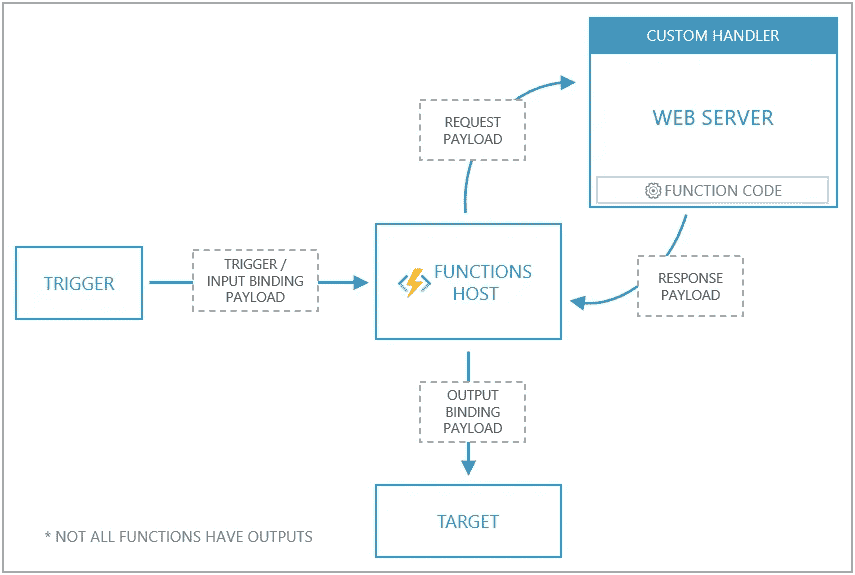
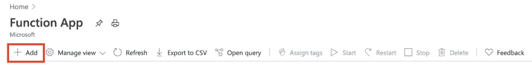
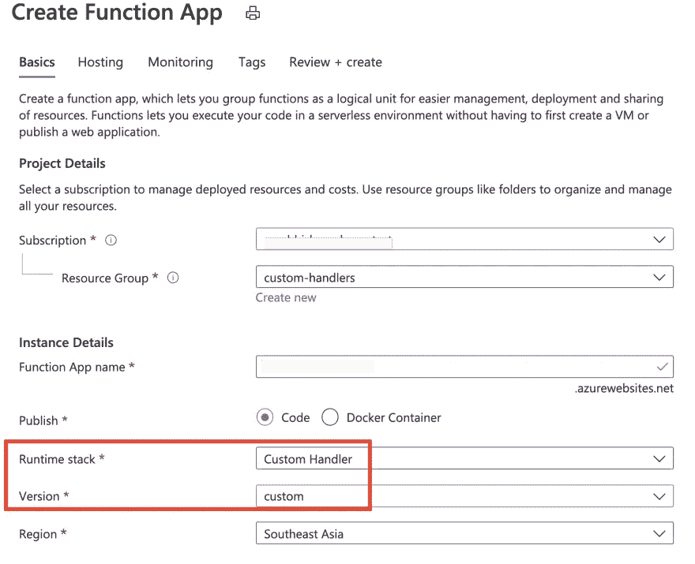
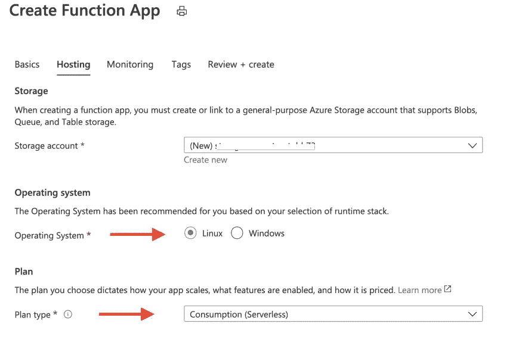
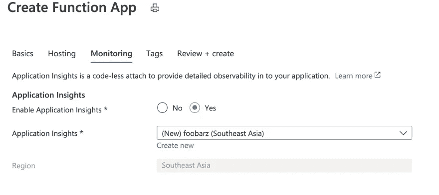
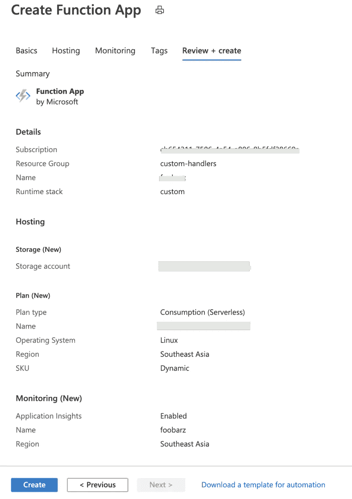
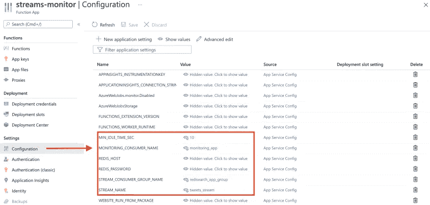
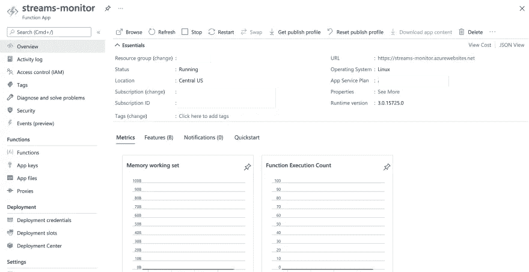

# Redis Streams 在运行—第 4 部分(无服务器监控服务)

> 原文：<https://itnext.io/redis-streams-in-action-part-4-serverless-monitoring-service-faef52ee58db?source=collection_archive---------4----------------------->

## 最后，构建一个无服务器的 Go 应用程序来监控 Tweets 处理器应用程序

欢迎阅读这一系列的博客文章，这些文章通过一个实际的例子介绍了 Redis 流。我们将使用一个示例应用程序来实时搜索和查询 Twitter 数据。 [RediSearch](https://redisearch.io/) 和 [Redis Streams](https://redis.io/topics/streams-intro) 是这个解决方案的主干，它由几个合作组件组成，我们将在一篇专门的博客文章中介绍每一个组件。

*   [第一部分](/redis-streams-in-action-part-1-intro-and-overview-135f66d3ab58)
*   [第二部分](/redis-streams-in-action-part-2-tweets-consumer-app-674fd3b45f6f)
*   [第三部分](/redis-streams-in-action-part-3-tweets-processor-app-254161838973)
*   第 4 部分—本博客

> *本 GitHub 回购中有代码—*[*https://github.com/abhirockzz/redis-streams-in-action*](https://github.com/abhirockzz/redis-streams-in-action)

我们将从上一篇博客文章停止的地方继续，看看如何构建一个监控应用程序，使整个系统在面对高负载或故障场景时更加健壮。这是因为我们的数据处理应用程序经常会因为数据量过大而变慢，甚至会因为我们无法控制的情况而崩溃/停止。如果我们的 Tweets 处理应用程序出现这种情况，分配给特定实例的消息将不会被处理。这篇博文中提到的监控组件检查未决推文(使用`XPENDING`)、声明(`XCLAIM`)、处理(使用`HSET`将它们存储为`HASH`)并最终确认它们(`XACK`)。


高层建筑

这是一个将部署到 Azure Functions 的 Go 应用程序——是的，我们将使用无服务器模型，其中监控系统将基于预定义的计时器触发器执行。像往常一样，我们将首先配置它并将其部署到 Azure，观察它的工作情况，最后遍历代码。

在我们继续之前，这里有一些关于 Azure 函数中 Go 支持的背景。

# 多亏了自定义处理程序，Azure 上的无服务器 Go 应用程序

那些使用过 Azure 函数的人可能还记得 Go 是默认支持的语言处理程序之一。这就是[定制处理程序](https://docs.microsoft.com/azure/azure-functions/functions-custom-handlers?WT.mc_id=data-17927-abhishgu)发挥作用的地方。

简而言之，自定义处理程序是一个轻量级 web 服务器，它从函数主机接收事件。在您最喜欢的运行时/语言中，您唯一需要实现的定制处理程序是— HTTP 支持！

事件触发器(通过 HTTP、存储、事件中心等。)调用函数主机。定制处理程序与传统函数的不同之处在于，函数主机充当中间人:它向定制处理程序(函数)的 web 服务器发出请求有效负载，以及包含触发器、输入绑定数据和函数的其他元数据的*有效负载*。函数将响应返回给函数宿主，宿主将响应中的数据传递给函数的输出绑定进行处理。

下面是自定义处理程序如何工作的概要(下图摘自文档)



好了，现在让我们转到实际的部分。

# 先决条件

请务必阅读本系列的第 2、3 部分，并启动和运行相应的应用程序。我们的监控应用程序将构建在您部署的 Tweets 生产者和处理器服务之上。

你需要一个 Azure 账户[，你可以免费获得](https://dev.to/abhirockzz/(https://azure.microsoft.com/free/?WT.mc_id=data-17927-abhishgu))和 [Azure CLI](https://docs.microsoft.com/cli/azure/install-azure-cli?WT.mc_id=data-17927-abhishgu) 。确保[下载并安装 Go](https://golang.org/dl/) (如果你还没有的话)并安装 [Azure functions 核心工具](https://docs.microsoft.com/azure/azure-functions/functions-run-local?tabs=macos%2Ccsharp%2Cbash&WT.mc_id=data-17927-abhishgu#v2)——这将允许你使用 CLI 部署该功能(并在本地运行测试和调试)

接下来的章节将指导你如何部署和配置 Azure 功能。

# 将监控服务部署到 Azure 功能

您将:

*   创建 Azure Functions 应用程序
*   配置它
*   将该功能部署到您创建的应用程序

首先创建一个[资源组](https://docs.microsoft.com/azure/azure-resource-manager/management/manage-resource-groups-portal?WT.mc_id=data-17927-abhishgu)来托管解决方案的所有组件。

在 Azure 门户中搜索**功能 App** ，点击**添加**



添加新的功能应用程序

输入所需的详细信息:您应该选择**自定义处理程序**作为**运行时堆栈**



输入功能应用信息

在**托管**部分，分别为**操作系统**和**计划类型**选择 **Linux** 和**消费(无服务器)**。



选择操作系统、计划等。

*   启用应用洞察(如果需要)



启用应用洞察

*   查看最终设置并点击**创建**继续



启动创建

该过程完成后，还将创建以下资源和功能应用程序:

*   [App 服务计划](https://docs.microsoft.com/azure/app-service/overview-hosting-plans?WT.mc_id=data-17927-abhishgu)(本例为消费/无服务器计划)
*   一个 [Azure 存储帐户](https://docs.microsoft.com/azure/storage/common/storage-account-overview?WT.mc_id=data-17927-abhishgu)
*   一个 [Azure 应用洞察](https://docs.microsoft.com/azure/azure-monitor/app/app-insights-overview?WT.mc_id=data-17927-abhishgu)功能)

## 更新功能应用程序配置

我们的函数需要一些环境变量才能正常工作——这些变量可以使用 Azure portal 作为函数配置添加。以下是清单:

Redis 连接详细信息:

*   `REDIS_HOST`-Redis 实例的主机和端口，例如 myredis:10000
*   `REDIS_PASSWORD`-Redis 实例的访问密钥(密码)

Redis 流信息:

*   `STREAM_NAME`-Redis 流的名称(使用`tweets_stream`作为值)
*   `STREAM_CONSUMER_GROUP_NAME`-Redis Streams 消费群的名称(使用`redisearch_app_group`作为值)

监控应用程序元数据:

*   `MONITORING_CONSUMER_NAME` -监控应用程序所代表的消费者实例的名称(它是上述消费者组的一部分)
*   `MIN_IDLE_TIME_SEC` -仅声明早于指定时间间隔的待处理消息



更新应用配置

## 我们现在已经准备好部署这个功能了

首先，克隆 GitHub repo 并构建函数:

```
git clone https://github.com/abhirockzz/redis-streams-in-action
cd redis-streams-in-action/monitoring-appGOOS=linux go build -o processor_monitor cmd/main.go
```

> `*GOOS=linux*` *用于构建* `*Linux*` *可执行既然我们选择了* `*Linux*` *OS 为我们的功能 App*

要进行部署，请使用 Azure Functions 核心工具 CLI:

```
func azure functionapp publish <enter name of the Azure Function app>
```

完成后，您应该会看到以下日志:

```
Getting site publishing info...
Uploading package...
Uploading 3.71 MB [###############################################################################]
Upload completed successfully.
Deployment completed successfully.
Syncing triggers...
Functions in streams-monitor:
    monitor - [timerTrigger]
```

您应该也能在 Azure 门户中看到该功能:



作为 Azure 功能部署的监控应用程序

该功能配置为每`20`秒触发一次(根据 [function.json](https://github.com/abhirockzz/redis-streams-in-action/blob/master/monitoring-app/monitor/function.json) ):

```
{
    "bindings": [
        {
            "type": "timerTrigger",
            "direction": "in",
            "name": "req",
            "schedule": "*/20 * * * * *"
        }
    ]
}
```

# 监控监控 app！

和以前一样，可以使用`redis-cli`检查我们系统的状态——执行[expending](https://redis.io/commands/XPENDING)命令:

```
XPENDING tweets_stream redisearch_app_group
```

您将得到与此类似的输出(根据您运行的 tweets 处理器实例的数量和运行时间的不同，这个数字会有所不同):

```
1) (integer) 209
2) "1620973121009-0"
3) "1621054539960-0"
4) 1) 1) "consumer-1f20d41d-e63e-40d2-bc0f-749f11f15026"
      2) "3"
   2) 1) "monitoring_app"
      2) "206"
```

如前所述，监控应用程序将*声明*其他消费者(活动或非活动)尚未处理的未决消息。在上面的输出中，请注意当前由`monitoring_app`(我们的消费者的名称)处理的消息号是`206`——它实际上从另一个消费者实例声明了这些消息。一旦这些消息被声明，它们的所有权就从最初的消费者转移到了`monitoring_app`消费者。

> *您可以再次使用* `*XPENDING tweets_stream redisearch_app_group*` *进行同样的检查，但是可能很难检测到，因为消息实际上处理得非常快。*

在被声明的`206`消息中，只有在最后`10`秒内没有被处理的消息(这是我们指定的`MIN_IDLE_TIME_SEC`)将被处理——其他消息将被忽略，并在下一次运行时被`XPENDING`调用获取(如果它们仍处于未处理状态)。这是因为我们想给我们的消费者应用程序一些时间来完成他们的工作——对于涉及使用`HSET`然后使用`XACK`保存到`HASH`的处理来说，10 秒是一个相当大的时间范围。。

> *请注意，上面使用的 10 秒时间间隔仅用作示例，您应根据您的数据管道/处理所需的端到端延迟来确定这些数字。*

就如何运行/操作这样一个“监控”组件而言，您拥有完全的灵活性。我选择了一个无服务器的函数，但是你可以把它作为一个独立的程序运行，作为一个预定的 Cron 任务或者甚至作为一个 Kubernetes 任务！

不要忘记执行`RediSearch`查询，以验证您可以基于多个标准搜索推文:

```
FT.SEARCH tweets-index hello
FT.SEARCH tweets-index hello|world
FT.SEARCH tweets-index "@location:India"FT.SEARCH tweets-index "@user:jo* @location:India"
FT.SEARCH tweets-index "@user:jo* | @location:India"FT.SEARCH tweets-index "@hashtags:{cov*}"
FT.SEARCH tweets-index "@hashtags:{cov*|Med*}"
```

既然我们已经看到了实际操作，让我们来研究一下代码。

# 代码遍历

> *请参考 GitHub* 上的 [*代码*](https://github.com/abhirockzz/redis-streams-in-action/tree/master/monitoring-app/cmd)

该应用程序使用了优秀的 [go-redis 客户端库](https://github.com/go-redis/redis)。像往常一样，这一切都从连接到 Redis 开始(注意`TLS`的用法):

```
client := redis.NewClient(&redis.Options{Addr: host, Password: password, TLSConfig: &tls.Config{MinVersion: tls.VersionTLS12}}) err = client.Ping(context.Background()).Err()
 if err != nil {
     log.Fatal(err)
 }
```

接下来是大部分处理发生的部分——把它想象成包含子部分的工作流:

我们调用`XPENDING`来检测未决消息的数量，例如`XPENDING tweets_stream group1`

```
numPendingMessages := client.**XPending**(context.Background(), streamName, consumerGroupName).Val().Count
```

为了获得待处理的消息，我们调用另一个不同的`XPENDING`变量，向其传递我们在之前的调用中获得的消息数量

```
xpendingResult := client.**XPendingExt**(context.Background(), &redis.XPendingExtArgs{Stream: streamName,Group: consumerGroupName, Start: "-", End: "+", Count: numPendingMessages})
```

我们现在可以声明挂起的消息——这些消息的所有权将从以前的消费者变更为我们指定了名称的新消费者(`monitoringConsumerName`)

```
xclaim := client.**XClaim**(context.Background(), &redis.XClaimArgs{Stream: streamName, Group: consumerGroupName, Consumer: monitoringConsumerName, MinIdle: time.Duration(minIdleTimeSec) * time.Second, Messages: toBeClaimed})
```

一旦所有权转移，我们就可以处理它们。这包括将 tweet 信息添加到`HASH`(使用`HSET`)并确认成功处理(`XACK`)。`goroutine`用于保持事情的效率，例如，如果我们批量获得`100`个声明的消息，则执行分散-收集过程，其中产生一个`goroutine`来处理这些消息中的每一个。一个[同步。WaitGroup](https://golang.org/pkg/sync/#WaitGroup) 用于在寻找下一组未决消息(如果有)之前“等待”当前批处理完成。

```
for _, claimed := range xclaim.Val() {
            if exitSignalled {
                return
            }
            waitGroup.Add(1) go func(tweetFromStream redis.XMessage) {
                hashName := fmt.Sprintf("%s%s", indexDefinitionHashPrefix, tweetFromStream.Values["id"]) processed := false
                defer func() {
                    waitGroup.Done()
                }() err = client.HSet(context.Background(), hashName, claimed.Values).Err() if err != nil {
                    return // don't proceed (ACK) if HSET fails
                } err = client.XAck(context.Background(), streamName, consumerGroupName, tweetFromStream.ID).Err()
                if err != nil {
                    return
                }
                processed = true
            }(claimed)
        }
        waitGroup.Wait()
```

在我们深入其他领域之前，通过探索代码(顺便说一下，这相对简单)来理解本质可能会有所帮助

## 关于应用程序结构的快速说明

下面是应用程序的设置方式(文件夹结构):

```
.
├── cmd
│   └── main.go
├── monitor
│   └── function.json
├── go.mod
├── go.sum
├── host.json
```

`host.json`通过指向能够处理 HTTP 事件的 web 服务器，告知函数主机向何处发送请求。注意`customHandler.description.defaultExecutablePath`，它定义了`processor_monitor`是用于运行 web 服务器的可执行文件的名称。

```
{
    "version": "2.0",
    "extensionBundle": {
        "id": "Microsoft.Azure.Functions.ExtensionBundle",
        "version": "[1.*, 2.0.0)"
    },
    "customHandler": {
        "description": {
            "defaultExecutablePath": "processor_monitor"
        },
        "enableForwardingHttpRequest": true
    },
    "logging": {
        "logLevel": {
            "default": "Trace"
        }
    }
}
```

# 这是一个总结！

这就把我们带到了这个博客系列的结尾。让我们回顾一下我们所学的内容:

*   在第一部分中，您了解了用例、架构及其组件的概述，以及 Redis 流和`RediSearch`的介绍。它为该系列的其余部分设置了场景。
*   第二部分讨论了基于 Rust 的 tweets 消费者应用程序的细节，该应用程序使用 Twitter 流 API，并将 tweets 在 Redis 流中排队以供进一步处理。
*   第三部分是关于 Java 应用程序，它通过利用 Redis Streams 消费者组特性和跨多个实例扩展处理来处理这些推文。
*   …最后一部分(这一部分)是关于 Go 应用程序，用于监控由于处理失败或消费者实例失败而被放弃(在待定条目列表中)的推文。

我希望您发现这很有用，并将其应用于使用 Redis 流构建可伸缩的解决方案。编码快乐！