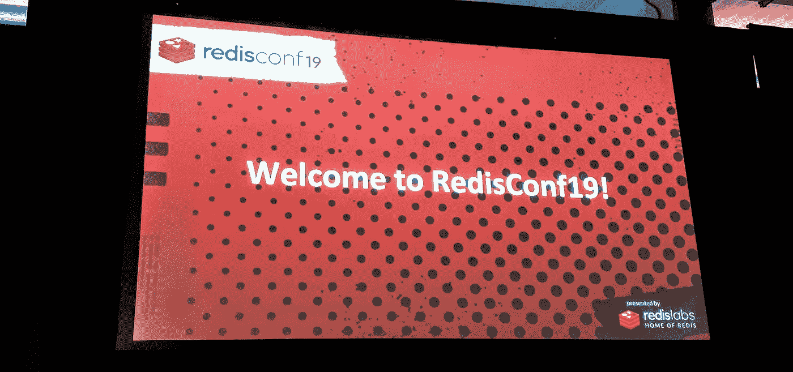

# RedisGears 多模型使用案例—改进内容交付和制作性能

> 原文：<https://itnext.io/redisgears-multi-model-use-case-improving-content-delivery-performance-ce13ca86b7c3?source=collection_archive---------5----------------------->

## 完整的项目可以在 GitHub 下面的[链接](https://github.com/filipecosta90/RedisGearsExampleCDN)中找到。



继今天在 redisconf19 上预发布 [RedisGears](https://c212.net/c/link/?t=0&l=en&o=2420891-1&h=2146343739&u=https%3A%2F%2Fredislabs.com%2Fredis-enterprise%2Ftechnology%2Fgears%2F&a=RedisGears) 之后，我决定测试它的数据库内可编程性，以自动处理、转换和建模不同类型的数据。例如，我们将使用 Redis 和 RedisGears 实现我们自己的无服务器内容交付优化器逻辑。如果您想了解 RedisGears 的实际应用，请跳到本文的第 2.0 节。

# 1.0 单一模型起点

内容交付性能本质上与延迟和速度有关。大多数 cdn(例如 [Akamai](https://www.akamai.com/us/en/solutions/why-akamai/image-management.jsp) )和第三方解决方案，如 [Cloudinary](https://cloudinary.com/) ，提供广泛的自动化映像优化解决方案，达到全球分布式数据节点的基础服务的程度(以便找到到用户的最短跳)。然而，一旦我们优化了最短路径，图像的延迟就更多地与正确处理的图像节省的字节有关。

通过优化每个内容的内存使用，我们不仅在后端和客户端设备中保存了数据，还提高了交付性能，因为更少的字节需要传输更少的网络数据包。

根据 [HTTP 存档](http://httparchive.org/):

> 为获取网页而传输的 60%的数据是由 JPEGs、png 和 gif 组成的图像。截至 2017 年 7 月，图片占 3.0MB 平均网站加载内容的 [1.7MB](http://httparchive.org/interesting.php#bytesperpage) 。

现在，您已经同意这是一个可靠的用例，让我们决定解决方案的设计，将我们的内容交付优化器重点放在图像上。

通常，图像用例最好作为唯一的 URL。因此，不管派生的内容优化如何，它们都应该与原始内容相关，并且应该只在我们的架构中的一个层上产生。这些是我们的业务需求，也是我们的 CDN 微服务需要做的事情，负责将 URL 关联到 Redis 关键字的业务逻辑，以及将内容提取到源。我们不会在本文中实现 CDN 微服务。我们将关注所需的数据转换和 RedisGears 的关键要点。

## 请记住，RedisGears 不会取代对处理业务逻辑的微服务的需求。

RedisGears 要做的是利用已经存在于数据库服务器上的数据，并将其转化为服务于更多最初数据无法响应的需求。

为了简单起见，我们将只优化图像压缩(四级压缩)和图像格式(为了演示，只优化两种图像格式)，但其余的优化将适用于相同的设计过程。

在可能的 CDN 交付 URL 之后，例如，如果我们希望在第一次跳过我们的 CDN**ourcdn.com**时，获得在源【example.com】T2 上托管的内容**image.jpg**，我们可以使用下一个已有空间的修改后的 URL 来实现我们在本例中想要实现的优化。

```
curl -X GET https://mycdn.com/image/optimizer/fetch_format_**<format>**,q_**<quality>**/http://example.com/image.jpg
```

从前面的例子中，我们可以看到我们将使用" **image"** 作为包含所有选项和原始图像的键。在我们的应用服务器中，我们要做的是检查关键的**映像**是否存在，以及是否已经计算了优化，如果是，则服务于优化的映像，如果不是，则服务于优化或优化集的最近似的回退。

为了检查，如果图像存在于或 CDN 级别，我们将使用 EXISTS 查询 Redis，如果存在，我们将使用 HGET 查询 Redis，并将提取的属性作为字段名。

```
127.0.0.1:6379> EXISTS cdn:image
(integer) 1
127.0.0.1:6379>HGET cdn:image fetch_format_**<format>**,q_**<quality>**
```

如果**原始的**映像在我们的 CDN 中不存在，那么 RedisGears 就开始发挥作用了。我们的应用程序服务器仍然需要转到基础映像的源位置，因为微服务架构的一个最重要的规则是每个微服务必须**拥有**其域数据和**逻辑，但是，从映像优化 Redis 的操作角度来看，**对我们的映像目录和基础架构的影响最小，因为原始数据已经存储在 Redis 中。

以下命令包含了我们的应用程序(Redis 之外)必须拥有的全部逻辑。

```
127.0.0.1:6379> EXISTS cdn:image
(integer) 0**( APPLICATION LOGIC OUTSIDE OF REDIS :: CDN MICROSERVICE )**127.0.0.1:6379>HSET cdn:image fetch_format_jpg
```

# 2.0 —当 RedisGears 开始发挥作用时

## 2.1 构建我们的 Gears 脚本

如前所述，我们的 CDN 微服务负责将 URL 关联到 Redis 关键字的业务逻辑，还负责将内容提取到源，只需根据来自源的响应将一种图像类型设置到 Redis 中。一旦使用以下脚本设置了新的映像(通过 HSET cdn: <imagename>字段值…)，所有的映像优化都将由 RedisGears 执行:</imagename>

不要担心复制代码的每个要点。完整的项目可以在 GitHub 的以下[链接](https://github.com/filipecosta90/RedisGearsExampleCDN)中找到。

python 代码将通过 redis-cli 传递给 Redis，RedisGears [RG 添加了新命令。按以下方式执行](https://oss.redislabs.com/redisgears/commands.html#rgpyexecute):

```
redis-cli -x rg.pyexecute < imageserver.py
OK
```

之后，在通过模式“cdn*”的每个散列的每个字段集上，将开始图像优化过程。正如你在 image_optimization.py 上看到的，我们通过 python 模块 [**Wand**](http://docs.wand-py.org/en/0.5.2/#) 使用了 [**imagemagick**](https://www.imagemagick.org/script/index.php) 。python 的可扩展性与 Redis 的低延迟和数据局部性相结合，支持非常高级的用例，Redis 社区肯定会探索这些用例。

## 2.2 测试我们的 Gears 脚本

为了进行测试，我们创建了两个额外的 python 文件，将图像加载到 Redis (load_image.py)并将图像从 Redis 保存到磁盘(save_image.py)。为了进一步简化数据加载和测试的流程，我们添加了一个脚本来加载数据并检查是否生成了优化的图像。请**修改 flushall** 并更改您的模块(是的，模块，惊喜，惊喜！！)位置相应。

这应该是脚本的预期输出。正如您所看到的，我们只为每个键**cdn:collage-redisconf 19**和**cdn:redisconf 19-location-header**设置了一个字段(**field name**:fetch _ format _ jpg，q_80，fetch_format_png，q_90 等)，但是还有几个附加字段是由或 RedisGears 脚本自动添加的。

```
filipeoliveira$ ./script.sh+ redis-cli flushallOK+ redis-cli module load /Users/filipeoliveira/redis-porto/RedisGears/redisgears.soOK+ redis-cli module load /Users/filipeoliveira/redis-porto/RedisTimeSeries/src/redistimeseries.soOK+ redis-cli -x rg.pyexecuteOK+ python load_image.py --key=cdn:collage-redisconf19 --field=fetch_format_jpg --image=./data/collage-redisconf19.jpg+ python load_image.py --key=cdn:redisconf19-location-header --field=fetch_format_jpg --image=./data/redisconf19-location-header.jpg+ read -p 'Give it a second and Press [ENTER]'Give it a second and Press [ENTER]+ redis-cli hexists cdn:collage-redisconf19 fetch_format_jpg(integer) 1+ redis-cli hexists cdn:collage-redisconf19 fetch_format_png(integer) 1+ redis-cli hexists cdn:collage-redisconf19 fetch_format_jpg,q_90(integer) 1+ redis-cli hexists cdn:collage-redisconf19 fetch_format_jpg,q_80(integer) 1+ redis-cli hexists cdn:collage-redisconf19 fetch_format_jpg,q_70(integer) 1+ redis-cli hexists cdn:collage-redisconf19 fetch_format_jpg,q_60(integer) 1+ redis-cli hexists cdn:collage-redisconf19 fetch_format_png,q_90(integer) 1+ redis-cli hexists cdn:collage-redisconf19 fetch_format_png,q_80(integer) 1+ redis-cli hexists cdn:collage-redisconf19 fetch_format_png,q_70(integer) 1+ redis-cli hexists cdn:collage-redisconf19 fetch_format_png,q_60(integer) 1+ redis-cli hexists cdn:redisconf19-location-header fetch_format_jpg(integer) 1+ redis-cli hexists cdn:redisconf19-location-header fetch_format_png(integer) 1+ redis-cli hexists cdn:redisconf19-location-header fetch_format_jpg,q_90(integer) 1+ redis-cli hexists cdn:redisconf19-location-header fetch_format_jpg,q_80(integer) 1+ redis-cli hexists cdn:redisconf19-location-header fetch_format_jpg,q_70(integer) 1+ redis-cli hexists cdn:redisconf19-location-header fetch_format_jpg,q_60(integer) 1+ redis-cli hexists cdn:redisconf19-location-header fetch_format_png,q_90(integer) 1+ redis-cli hexists cdn:redisconf19-location-header fetch_format_png,q_80(integer) 1+ redis-cli hexists cdn:redisconf19-location-header fetch_format_png,q_70(integer) 1+ redis-cli hexists cdn:redisconf19-location-header fetch_format_png,q_60(integer) 1+ python save_image.py --key=cdn:collage-redisconf19 --field=fetch_format_jpg,q_60 --image=./data/collage-redisconf19_q_60.jpg+ python save_image.py --key=cdn:collage-redisconf19 --field=fetch_format_jpg --image=./data/collage-redisconf19_q_100.jpg+ read -p 'IRate of insertions per second ( bucket of 5s ) [ENTER]'IRate of insertions per second ( bucket of 5s ) [ENTER]+ redis-cli TS.RANGE size:cdn - + aggregation avg 51) 1) (integer) 15542794252) "4.333333333333333"2) 1) (integer) 15542794302) "3"3) 1) (integer) 15542794352) "17"4) 1) (integer) 15542794402) "7.666666666666667"5) 1) (integer) 15542794452) "22"
```

如果您查看您的数据文件夹，您可以看到优化器正在完成工作。在左边，你可以看到优化的图像(大小为 161K)。右边可以看到原图(用 935K 从 redisconf19 网站下载)。


## 2.2 多模型涉及零件和关键问题的地方

如果您查看输出的最后几行，您会发现我们还在内容管理优化器中显示了每秒插入的速率。

与我们在缓存模型中触发转换的方式相同，我们添加了一个 Timeseries 模型，使我们能够跟踪系统上缓存插入的速率。由于一些关键点，这既非常强大又非常危险:

1) python 脚本对查询集群的 Redis 客户端不可见地执行。

2)很容易忘记 python 脚本，如果没有强制文档或警告，新开发人员将很难理解它们的存在。

3) python 脚本将在每次数据库字段更新时运行，并且它可能代表可能已经过载的系统上的开销。

正如今天 RedisGears 会议问答中所讨论的，所有这些问题都可以或已经通过 RedisLabs 得到缓解。通常，Redis 成功的主要原因之一是，作为开发人员，您既没有从性能极高的工具中抽象出来，也没有被禁止对您的集群造成极大的损害。因此，在 Redis，你应该知道你在做什么。

alpha 版本 0.2.0 几天前刚刚发布，项目中肯定会加入成熟度，但我们已经可以看到一个模块的有用性，它在所有其他事情中充当“丢失的链接”。