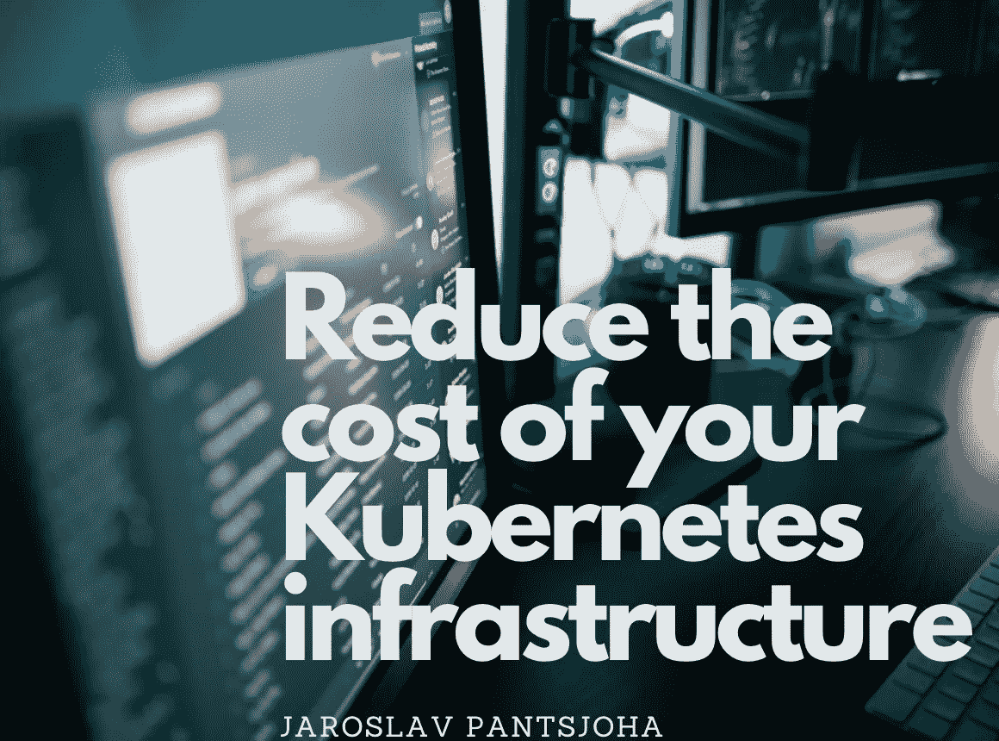

# 通过以下几个步骤降低 Kubernetes IaC 基础设施的成本

> 原文：<https://itnext.io/reduce-the-cost-of-your-kubernetes-iac-infrastructure-with-these-few-steps-b4719940c491?source=collection_archive---------1----------------------->

我清楚地记得在 Loveholidays 工作的激动人心的时刻，我自己的 Kubernetes 成本优化练习。我们热衷于一个精简的、吝啬的 Kubernetes 基础设施即代码( **DevOps** ) **GitOps** 操作机器。

不在其中。

(早在 2018/19 年)由于最近才从本地迁移到**谷歌云平台**以及云原生迁移，我们实际上接受了 Kubernetes。现在迁移已经完成，是时候审查不断增长的 Kubernetes 基础设施成本，并制定一个良好的流程来控制如此重要的细节了。

# 优化您的工作量

起初，降低成本的工作是有条不紊的。

这绝不是成本优化的详尽列表，但它是开始的地方，以确保您的基础架构支出走了很长的路。

这些是我推荐的 Kubernetes 活动的上下文列表:

*   **评估******应用**的工作负载和服务。这更像是对 docker 映像构建和应用程序堆栈的实际操作，但是基础架构团队和应用程序开发团队需要联合起来验证假设，并确定应用程序运行时需求。
    即哪些应用需要审查，哪些应用流程可以优化以修复任何 mem 漏洞。**
*   **确保应用程序可以在 docker 基础映像占用空间最小的情况下运行。另一个最佳实践，值得重复。因此，您的安全状况应该会有所改善。但是它将有助于降低这种应用程序容器的总成本。**
*   **这种工作负载评估和应用程序运行时的负载需求应该有助于**定义**Kubernetes 部署 **Pod** **内存**和 **CPU** `**quotas**`和`**limits**`。这是为了防止虚假的资源流失，在这种情况下，现有的未检查的 pod 将耗尽它们运行的节点上的内存*(如果没有内存限制)*或抑制节点 CPU *(如果没有 CPU 限制)*。
    这不仅仅影响了一个资源利用率未经检查的应用程序，还影响了在那个不幸的节点上运行的其他容器化服务。这会影响该节点上运行的其他服务，这可能会降低正常运行时间和相关的 SLA。**
*   **`Taint`节点和`tolerate`那些有工作负载`tolerations.`的`taints`确保正确的工作负载在正确的机器类型上运行。我最近在这里写了这个。出色的图形突出了原因和方法。**
*   **节点过度利用的影响可能会导致集群节点**自动缩放器**功能启动。此类活动将启动另一个完整的节点来调度您的工作负载，从而进一步增加您的集群成本。您可能希望再次依靠这些`taints`和`tolerations`来帮助减少上述几点的综合影响，不仅要在正确的 CPU 和内存匹配节点(`nodepool`)上调度工作负载，还要为`nodepool` **大小设置****最小值**、**最大值**。**

# **监控成本**

**面对共享、多租户集群操作环境的挑战，很难有效评估工作负载/命名空间的成本。公平地说，这种成本监控工作不是“我的例行任务”,也不是平台团队的责任。这是 [**FinOps**](https://www.finops.org/what-is-finops/) 的一个有趣领域，云基础设施成本的共同责任模型。**

## **入门指南**

**这不需要太令人生畏，但你需要准备好所有的 Kubernetes 要素，至少要有 Prometheus metrics aggregator 和 Grafana dashboard UI。**

**我清楚地记得 Grafana 集群成本仪表板的伟大基础[这里](https://grafana.com/grafana/dashboards/6873)和[这里](https://grafana.com/grafana/dashboards/8670)非常有用。**

**你可以下载两者，它们当然是免费的，你可以调整**网络**、 **CPU** 、**存储**和**内存**的费用以及延长使用的折扣。**

****

**每个云都有自己的成本指标，根据需要更新这些指标**

**这是一个反复出现的主题，我认为它是微服务 Kubernetes 环境中客户端业务需求的一部分。最近，我非常惊讶地发现 [**Kubecost**](https://kubecost.com/) 是我过去使用的此类仪表板的提供商，他们的商业产品具有更多功能和多云端 Kubernetes 监控功能。Kubecost 进一步扩展了这种 Kubernetes 工作量评估，以提供对成本分摊的更多了解。一个共享的名称空间`kube-system`就是这样一个例子，有许多部门利用该名称空间的服务。其成本可以归属于/分摊给消费团队。**

**另一个奇妙的特性是**预测**功能，它可以显示基于**月**、**日**和**小时**消耗率**、**当前 Kubernetes 运行时间的预测，为新兴服务提供可预测的支出。**

**到目前为止，这还不是所有特性的列表，但是其他值得注意的特性包括**

*   **关于预算支出通知的预警**
*   **基础设施洞察**
*   **成本分配**
*   **基础设施可靠性得分**

**当在 Kubernetes 地产上运行生产工作负载时，成本会快速上升。但这些都是我发现的方便的功能，可以让你重新控制支出，并具有很好的洞察力和可预测性。**

**那里。我发现你觉得它很有帮助。**

****祝您的集群成本优化之旅好运！**
喜欢，把知识分享转发给同事。**

**[在 LinkedIn 上连接](https://www.linkedin.com/in/johas/)
直到下次，**

**J**