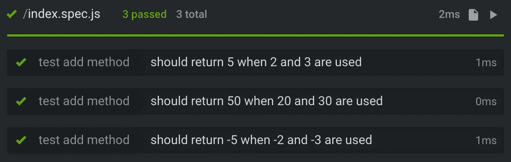

# 用 Jest 的减少单元测试样板。每种语法

> 原文：<https://itnext.io/reduce-unit-tests-boilerplate-with-jests-each-syntax-f5e48828437f?source=collection_archive---------2----------------------->


照片由[布拉登·科拉姆](https://unsplash.com/photos/9HI8UJMSdZA?utm_source=unsplash&utm_medium=referral&utm_content=creditCopyText)在 [Unsplash](https://unsplash.com/search/photos/run?utm_source=unsplash&utm_medium=referral&utm_content=creditCopyText) 上拍摄

为了最终得到可维护的、结构良好的代码库，单元测试在 web 开发中至关重要。如你所知，这篇文章不会试图说服你考试的重要性。这是理所当然的。

不幸的是，有一个问题，我们在编写单元测试时面临的问题是，我们必须重复很多次，以便用 describe / it 格式添加所有这些断言。是的，这是真的。编写测试需要时间。

那我们该怎么办？为了更快地编写测试，我们必须找到尽可能自动化整个过程的方法。对于那些想知道的人来说，编写更少的测试不是一个选项。

## 。每个人都是为了胜利

有一个很酷的功能叫做[。Jest 23 中包含的每个](https://jestjs.io/docs/en/api#describeeachtable-name-fn)。这个图书馆的灵感来自摩卡咖啡。它最初是一个名为 [jest-each](https://www.npmjs.com/package/jest-each) 的第三方包，在第 23 版中 jest 自己提供了这个包。如果你仍然使用旧版本的 Jest，你可以单独安装 jest-each 包。

## 它是如何工作的？

因为。每一个我们都可以用几行写几十个断言，这样我们就可以避免重复。我们唯一要做的就是以动态的方式声明我们的变量，然后使用这些变量做一次断言。这些甚至用在断言的描述中。

听起来很有趣？那么让我们深入研究代码。我们有下面的纯函数，我们想对它进行单元测试:

```
function add(x, y) {
  return x + y;
}
```

我们可以选择随机的数字对，并提供一些断言，以验证我们总是得到预期的结果:

```
describe('test add method', () => {
  it ('should return 5 when 2 and 3 are used', () => {
    expect(add(2, 3)).toEqual(5);  
  }); it ('should return 50 when 20 and 30 are used', () => {
    expect(add(20, 30)).toEqual(50);  
  }); it ('should return -5 when -2 and -3 are used', () => {
    expect(add(-2, -3)).toEqual(-5);  
  });
});
```

太棒了。我们写下了我们的断言，但是很明显，我们必须按照`it`语句重复一点，对吗？如果我们仔细观察，我们会注意到每个断言唯一的变化是新的参数和预期的结果。

我们如何解决这个问题？如果我们可以在一个地方只声明参数和预期的结果，然后以动态的方式调用每个组合的断言，那就太好了。

让我们使用`it.each`来重构我们的测试:

```
describe('test add method', () => {
  it.each`
    a     | b     | result
    ${2}  | ${3}  | ${5}
    ${20} | ${30} | ${50}
    ${-2} | ${-3} | ${-5}
  `('should return $result when $a and $b are used', ({a, b, result}) => {
    expect(add(a, b)).toEqual(result);
  });
});
```

不错！！更少的样板文件，可读性更好，对吗？我们可以在眨眼之间检查预期的结果。

这将在控制台中返回以下结果:



## 如何在 ReactJS 组件中使用它？

假设我们有以下`Button`组件:

```
import React from 'react';
import cn from 'classnames';
import PropTypes from 'prop-types';const Button = ({ isPrimary, isDanger, isSuccess }) => (
  <button
    className={cn('button', {
      'is-primary': isPrimary,
      'is-danger': isDanger,
      'is-success': isSuccess,
    })}
  />
);Button.propTypes = {
  isPrimary: PropTypes.bool,
  isDanger: PropTypes.bool,
  isSuccess: PropTypes.bool,
};Button.defaultProps = {
  isPrimary: false,
  isDanger: false,
  isSuccess: false,
};export default Button;
```

我们可以很容易地使用笑话，酶和。每个模式对所有这些类进行单元测试:

```
import React from 'react';
import { shallow } from 'enzyme';
import Button from './Button';let props;beforeEach(() => {
  props = {
    isPrimary: false,
    isDanger: false,
    isSuccess: false,
  };
});describe('test Button component', () => {
  it.each`
    propName       | propValue | className       | result
    ${'isPrimary'} | ${true}   | ${'is-primary'} | ${true}
    ${'isDanger'}  | ${true}   | ${'is-danger'}  | ${true}
    ${'isSuccess'} | ${true}   | ${'is-success'} | ${true}
  `('should have class $className when prop $propName is equal to $propValue', ({propName, propValue, className, result}) => {
    props = { ...props, [propName]: propValue };
    *const* enzymeWrapper = shallow(<Button {...props} />); expect(enzymeWrapper.hasClass(className)).toEqual(result);
  });
});
```

我很确定你已经知道这有多快和可伸缩了。让我们添加一些额外的断言来证明这一点:

```
it.each`
  propName       | propValue | className       | result
  ${'isPrimary'} | ${false}  | ${'is-primary'} | ${false}
  ${'isDanger'}  | ${false}  | ${'is-danger'}  | ${false}
  ${'isSuccess'} | ${false}  | ${'is-success'} | ${false}
`('should have not class $className when prop $propName is equal to $propValue', ({propName, propValue, className, result}) => {
  props = { ...props, [propName]: propValue };
  *const* enzymeWrapper = shallow(<Button {...props} />); expect(enzymeWrapper.hasClass(className)).toEqual(result);
});
```

老实说，这些测试在现实生活中并不那么有用，因为它们检查的是`classnames`包是否完成了它的工作，这有点过度工程化😃

## 结论

我很有信心，现在你知道如何利用。减少你在单元测试中必须一遍又一遍重复的无聊的样板代码。干杯！！