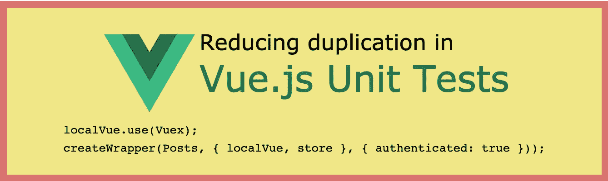

# 减少单元测试中的重复

> 原文：<https://itnext.io/reducing-duplication-in-unit-tests-e4e827511295?source=collection_archive---------6----------------------->

作为 Vue.js 课程的[截屏提供！](http://vuejs-course.com/screencasts/reducing-duplication-in-tests)

减少单元测试中的样板文件可以提高可读性。在本文中，我们使用 Vuex 和 VueRouter 重构了一个组件的单元测试，并提取了一个可以在整个代码库中使用的实用函数。

> *这篇文章是 Vue.js 课程* *上的* [*截屏。*](http://vuejs-course.com/screencasts/reducing-duplication-in-tests)

从一个组件的新副本开始每个单元测试通常是理想的。此外，随着你的应用程序变得越来越大和越来越复杂，你可能会有一些带有许多不同道具的组件，并可能安装了许多第三方库，如 Vuetify、VueRouter 和 Vuex。这可能导致您的测试有许多样板代码，也就是说，与测试不直接相关的代码。

本页所述测试的源代码可以在[这里](https://github.com/lmiller1990/vue-testing-handbook/tree/master/demo-app/tests/unit/Posts.spec.js)找到。

这是我们将要测试的组件。如果收到一个道具，它会显示一个`message`道具。如果用户通过验证，它会显示一个新的 Post 按钮和一些 Post。`authenticated`和`posts`对象都来自 Vuex 商店。最后，它呈现的是`router-link`组件，显示一个帖子的链接。

我们想测试:

*   收到道具时会渲染`message`吗？
*   `posts`是否正确渲染？
*   当`authenticated`为`true`时，新的 Post 按钮显示，当`false`时隐藏吗？

理想情况下，测试应该尽可能简洁。

让应用程序更易测试的一个好方法是为 Vuex 和 VueRouter 导出工厂函数。通常，您会看到类似这样的内容:

这对于常规应用程序来说很好，但对于测试来说并不理想。如果您这样做了，那么每次您在测试中使用存储或路由器时，它将在其他所有也导入它的测试中共享。理想情况下，每个组件都应该获得存储和路由器的新副本。

解决这个问题的一个简单方法是导出一个工厂函数，这个函数返回一个对象的新实例。例如:

现在你的主应用程序可以做`import { store } from './store.js`，你的测试每次都可以通过做`import { createStore } from './store.js'`，然后用`const store = createStore()`创建一个实例来获得一个新的商店副本。路由器也是如此。这就是我在`Posts.vue`示例中所做的——商店代码在这里[找到](https://github.com/lmiller1990/vue-testing-handbook/tree/master/demo-app/src/createStore.js)而路由器在这里[找到](https://github.com/lmiller1990/vue-testing-handbook/tree/master/demo-app/src/createRouter.js)。

现在我们知道了`Posts.vue`以及商店和路由器的样子，我们可以理解测试在做什么:

这并不能完全测试所有条件；这是一个最小的例子，足以让我们开始。注意重复和重复——让我们去掉它。

# 自定义 createTestVue 函数

每个测试的前五行是相同的:

让我们解决这个问题。为了不与 Vue Test Utils 的`createLocalVue`函数混淆，我喜欢称我的函数为`createTestVue`。它看起来像这样:

现在我们已经将所有的逻辑封装在一个函数中。我们返回`store`、`router`和`localVue`，因为我们需要将它们传递给`mount`函数。

如果我们使用`createTestVue`重构第一个测试，它看起来像这样:

更简洁一点。让我们重构第二个测试，它利用了 Vuex 商店的。

# 定义一个`createWrapper`方法

虽然上面的代码肯定是一个改进，但是比较这个测试和前面的测试，我们可以注意到大约一半的代码仍然是重复的。让我们创建一个新方法`createWrapper`来解决这个问题。

现在我们可以调用`createWrapper`并拥有一个组件的新副本，为测试做准备。我们的测试现在非常简洁。

我们可以做的最后一项改进是如何填充 Vuex 商店。在一个真实的应用程序中，你的存储很可能是复杂的，并且不得不`commit`和`dispatch`许多不同的变化和动作来让你的组件进入你想要测试的状态是不理想的。我们可以对我们的`createStore`函数做一个小小的改变，这使得设置初始状态更加容易:

现在我们可以将期望的初始状态传给`createStore`函数。我们可以做一个快速重构，合并`createTestVue`和`createWrapper`:

现在我们的测试可以写成如下形式:

这是很大的进步！我们从一个大约一半代码是样板文件，并且实际上与断言无关的测试，发展到两行代码；一个为测试准备组件，一个为断言准备。

这种重构的另一个好处是我们有一个灵活的`createWrapper`函数，我们可以在所有的测试中使用它。

还有其他一些潜在的改进:

*   更新`createStore`函数，允许设置 Vuex 命名空间模块的初始状态
*   提高`createRouter`设置具体路线
*   允许用户向`createWrapper`传递一个`shallow`或`mount`参数

本指南讨论了:

*   使用工厂函数获取对象的新实例
*   通过提取常见行为减少样板文件和重复

本页描述的测试源代码可以在[这里](https://github.com/lmiller1990/vue-testing-handbook/tree/master/demo-app/tests/unit/Posts.spec.js)找到。它也可以作为 Vue.js 课程的[截屏。](http://vuejs-course.com/screencasts/reducing-duplication-in-tests)