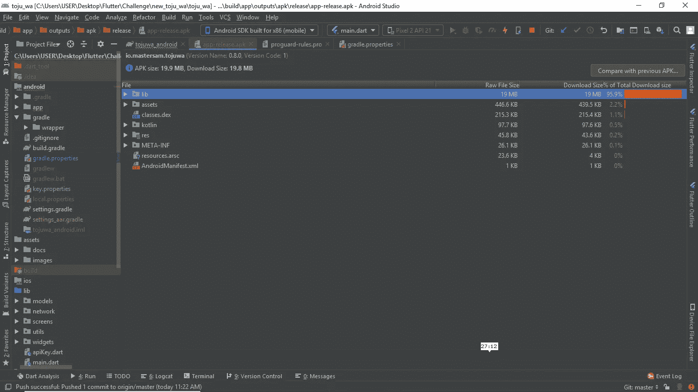
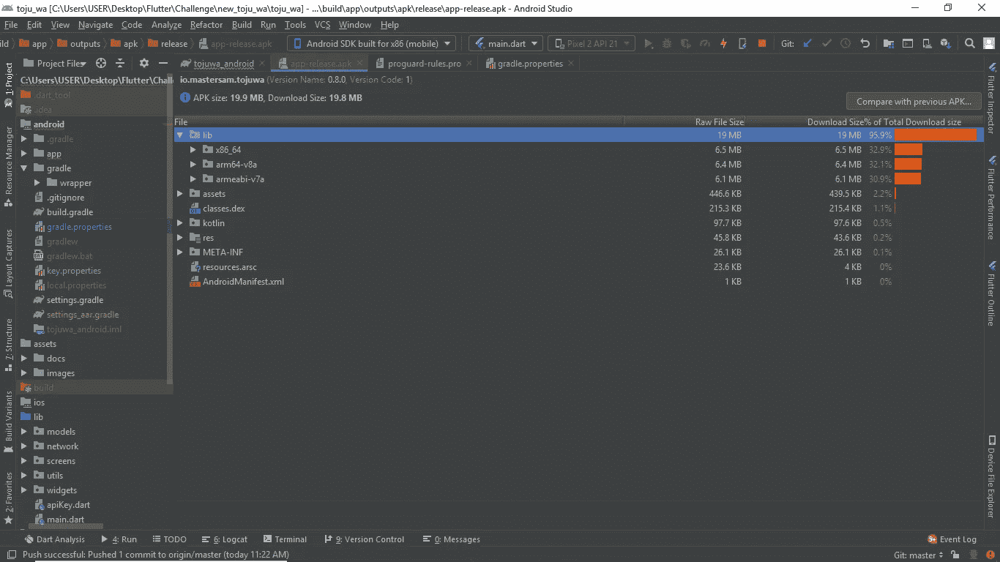
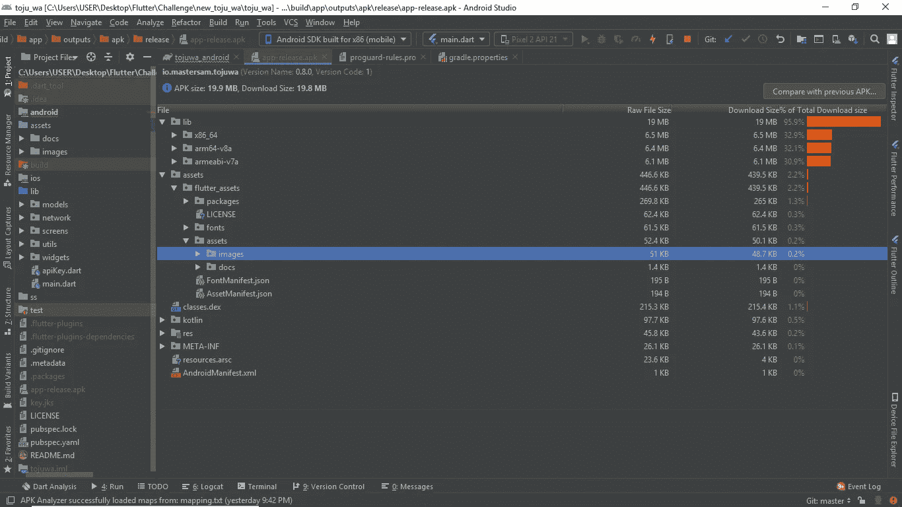

# 减少抖动应用程序的大小

> 原文：<https://itnext.io/reducing-flutter-app-size-570db9810ebb?source=collection_archive---------0----------------------->


减少抖动应用程序的大小

应用程序的大小非常重要。它有两个维度:下载大小 play store 上应用程序的大小/下载时/安装时的大小，以及安装大小——这是当你下载应用程序、解压缩、编译和优化它时会发生的事情。这大大扩展了应用程序，可以是安装大小的两倍、三倍甚至更多。你为什么要关心这些尺寸呢？

# 下载大小

当用户在 play store 上安装应用程序时，他会看到加载栏和实际的应用程序大小。应用程序越大，下载失败/取消的几率就越大。作为开发者，我们希望让应用程序变小，这样我们的应用程序就能获得尽可能多的分发。

# 安装尺寸

这也有类似的现象。用户用视频、音频、图像填充他们的手机，在某个时间点，他们会尝试安装一个新的应用程序，但糟糕的是没有空间了😪😪😪。他们会去寻找空间，去设置，检查哪个应用程序消耗更多的空间。即使在试图从 play store 下载时，它也建议他们删除一些应用程序以适应新的应用程序，甚至给他们一些建议。

# 我们来分析一些 APK

因此，我将分析一个发布应用程序的签名 apk。我将使用 ncovid 应用程序——一个新冠肺炎新闻应用程序，带有统计数据和跟踪仪表板，其 GitHub repo 可用于 [**这里**](https://github.com/Mastersam07/ncovid) 。你可以查看回购协议上的发行标签。我们将在这里 分析预发布版本 0.8 可用的 [**。**](https://github.com/Mastersam07/ncovid/releases/tag/v0.8)

让我们启动 android studio 并打开项目。在 android studio 上打开项目，点击 Build >> Analyze Apk 并选择 Apk。我将要分析的 apk 在 [**这里**](https://github.com/Mastersam07/ncovid/releases/tag/v0.8) 可用。您应该会看到一个与下图类似的屏幕。



分析 Apk

我们可以看到 95%的应用程序大小被 **lib 占用。**展开 **lib** ，我们看到三个不同的编译二进制文件。这告诉我们什么？🤔🤔🤔…….用于构建发布应用程序的命令应该是`flutter build apk --release`。分析还告诉我们，该应用程序是一个胖 apk，包括 android-arm、android-arm64 和 android-x64 的二进制文件。



分析 Apk

## 解决 fat apk 问题

为了解决这个问题，如果我们上传到 playstore，我们可以构建一个应用捆绑包，或者我们可以按照 abi 拆分 apk，将 apk 拆分为 x64 和 x86 位代码。

为了构建 app bundle，我们运行命令`flutter build appbundle`，该命令包含为 [armeabi-v7a](https://developer.android.com/ndk/guides/abis#v7a) (ARM 32 位)、 [arm64-v8a](https://developer.android.com/ndk/guides/abis#arm64-v8a) (ARM 64 位)和[x86–64](https://developer.android.com/ndk/guides/abis#86-64)(x86 64 位)编译的 flutter 运行时的 dart 代码，或者我们也可以使用命令`flutter build appbundle --target-platform android-arm,android-arm64,android-x64`拆分 app bundle。

为了分割 apk，我们运行命令`flutter build apk --split-per-abi`。这将显著减小应用程序的大小。此处 有 [**的拆分 apk。**](https://github.com/Mastersam07/ncovid/releases/tag/v0.9)

# 处理图像资产



分析资产

看上面的图像，它说资产占用了大约 439.5kb，其中图像占 48.7kb，文档占 1.4kb，字体占 61.5kb。这就引出了一个问题“如果使用了应用程序图像，它们在哪里？”。

答案很简单。除了将图像资产捆绑在应用程序中，用户可以将图像托管在 firebase 等外部服务上，并使用包 **cached_network_image 在应用程序中调用这些图像。**第一次启动应用程序时，软件包会从提供的 URL 获取图像并缓存，因此您在后续使用应用程序时会获得缓存的图像，因此这些图像不会占用下载空间，因为它们没有捆绑在应用程序中。你可以在这里 **查看 pub.dev [**上的包。**](https://pub.dev/packages/cached_network_image)**

# 压缩 png 和 jpg

每当你不得不在应用程序中使用图像，比如漫游屏幕，并且你不想从外部主机调用图像时，你应该压缩你的 png 和 jpg，因为高质量的 png 和 jpg 会增加应用程序的大小。你可以在谷歌上快速搜索压缩 png 和 jpg 的工具。

# 使用。svg 格式图标

我们应该对矢量绘图说欢迎，对 png 说再见，因为使用它们有很多好处。人们不需要担心不同的设备 DPI，这也有助于减少 apk 的大小。

当你从谷歌[材质设计图标库](https://design.google.com/icons/)下载系统 app 图标时，下载。svg 格式，而不是。png

# 使用特定的库

应该避免调用我们的 pubspec.yaml 文件中不需要或不使用的包。一旦构建好你的应用程序，你应该检查你的 pubspec.yaml 并删除那些没有被使用的库/包。

# 使用谷歌字体

字体是应用程序膨胀的一个来源。它们很重，卡在 app 里。当然，你的 UX 需要它们。你可能想使用 google_fonts 包，而不是在应用程序中捆绑字体。使用`google_fonts`包，`.ttf`或`.otf`文件不需要存储在 assets 文件夹中，也不需要映射到 pubspec.yaml 文件中。相反，它们可以在运行时通过 HTTP 获取一次，并缓存在应用程序的文件系统中。这类似于原生 android 开发中的可下载字体。可以在 这里查看 pub.dev [**上的包。**](https://pub.dev/packages/google_fonts)

# 使用 Proguard

Proguard 是一个 java 程序优化器。它以不改变功能的方式优化您的代码，但是改变表示使它更紧凑。它混淆了类型、字段、方法的名称，其中原始名称并不重要，因此为了提高效率，长名称被替换为短字符串，如 a 和 b。包和类可能有一个很长的名字，但是不应该妨碍效率。它还从依赖项中删除了未使用的 java 代码。要设置 proguard，请确保您的 <app dir="">/android/app/build.gradle 中的构建类型如下所示:</app>

```
buildTypes {
        release {
            minifyEnabled true // add this
            proguardFiles getDefaultProguardFile('proguard-android.txt'), 'proguard-rules.pro' // add this
            signingConfig signingConfigs.release // this is default for release
        }
    }
```

在同一个目录中，创建 proguard-rules.pro 文件，并添加以下代码:

```
## Flutter wrapper
 -keep class io.flutter.app.** { *; }
 -keep class io.flutter.plugin.** { *; }
 -keep class io.flutter.util.** { *; }
 -keep class io.flutter.view.** { *; }
 -keep class io.flutter.** { *; }
 -keep class io.flutter.plugins.** { *; }
# -keep class com.google.firebase.** { *; } // uncomment this if you are using firebase in the project
 -dontwarn io.flutter.embedding.**
 -ignorewarnings
```

您还应该转到 gradle.properties，并将下面的代码片段添加到其中:

```
extra-gen-snapshot-options=--obfuscate
```

# 资源萎缩

这将 proguard 的死代码消除的概念扩展到了资源。在 <app dir="">/android/app 目录下的 build.gradle 文件中，您的构建类型应该是这样的:</app>

```
buildTypes {
        release {
            minifyEnabled true // added previously
            shrinkResources true // add this
            proguardFiles getDefaultProguardFile('proguard-android.txt'), 'proguard-rules.pro' // added previously
            signingConfig signingConfigs.release // added previously
        }
    }
```

这就是我们想要的🙂🙂🙂。在所有这些调整和配置之后，您应该运行“**解决 fat apk 问题**”中提到的发布命令。如果您打算发送到 playstore 或在必要时拆分 apk，请生成一个应用捆绑包。

如果您有任何问题，请随时发表评论🙂。

# 有益链接

[构建并发布一款 android 应用](https://flutter.dev/docs/deployment/android)
[测量你的应用大小](https://flutter.dev/docs/perf/app-size)
[混淆飞镖代码](https://flutter.dev/docs/deployment/obfuscate)
[精简你的应用大小的最佳实践(Google I/O’17)](https://www.youtube.com/watch?v=AdfKNgyT438)