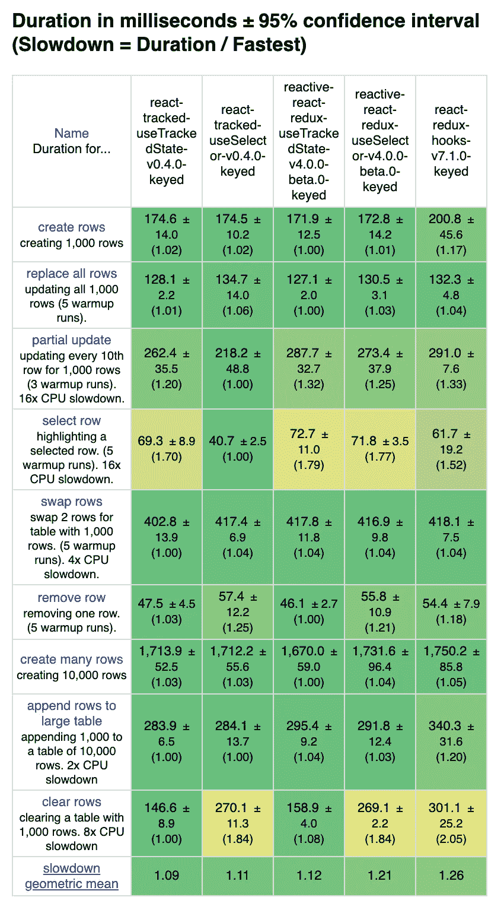
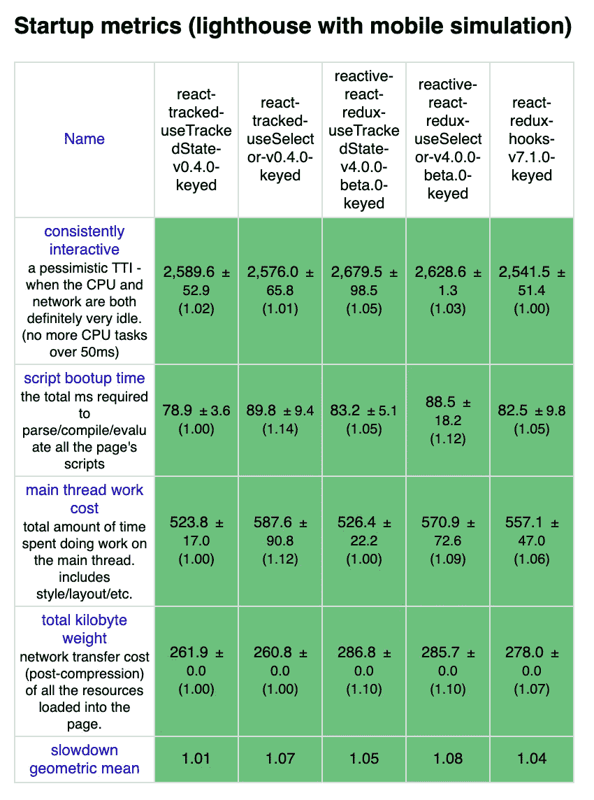
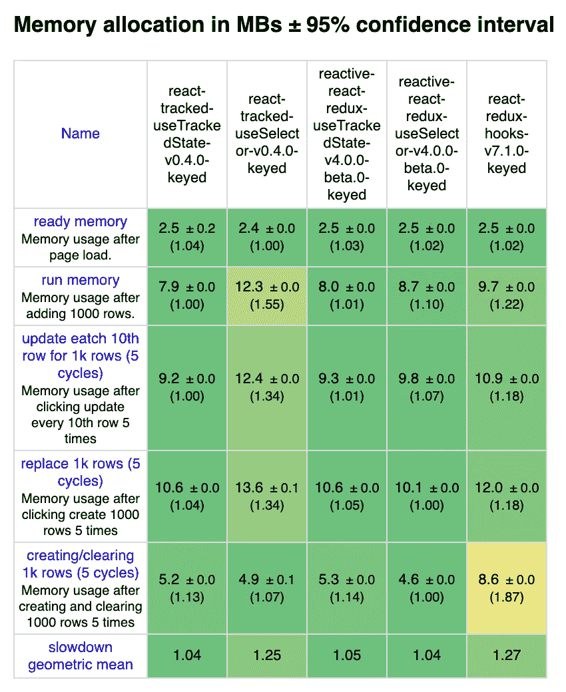

# Redux-less 基于上下文的 useSelector 挂钩具有与 React-Redux 相同的性能

> 原文：<https://itnext.io/redux-less-context-based-useselector-hook-that-has-same-performance-as-react-redux-450b1853f744?source=collection_archive---------4----------------------->

## 超级容易使用的 TrackedState 钩子也值得推荐

# 介绍

React-Redux 为 [hooks API](https://react-redux.js.org/api/hooks) 提供了良好的抽象。尤其是，`useSelector`可能比`mapStateToProps`更少被误用。

[react-tracked](https://github.com/dai-shi/react-tracked) 是一个没有 Redux 的全局状态库。这个库提供了几乎兼容的 hooks API 来 React-Redux。它的开发考虑到了性能，应该和 React-Redux 一样高性能，即使它只利用 React 上下文。有关更多信息，请参见 GitHub repo。

 [## 戴式/反应跟踪式

### 超快速反应全局/共享状态与上下文和钩子-戴-施/反应-跟踪

github.com](https://github.com/dai-shi/react-tracked) 

这篇文章展示了基准测试结果，以证明它在一个场景中确实是高性能的。

值得一提的是，react-tracked，顾名思义，有另一个`useTrackedState`钩子，能够跟踪状态使用情况。与`useSelector`不同，开发者不需要为这个钩子定义选择器。

另外值得一提的是，另一个库 [reactive-react-redux](https://github.com/dai-shi/reactive-react-redux) 为 redux 提供了`useTrackedState`钩子。有关更多信息，请参见 GitHub repo。

 [## 代时/反应-反应-还原

### 用 React 钩子和代理绑定 React Redux。通过创造一个新的环境，为 dai-shi/reactive-react-redux 的发展做出贡献

github.com](https://github.com/dai-shi/reactive-react-redux) 

我们比较上面描述的所有钩子。

# 基准工具

为了对不同的框架进行基准测试，使用了 [js-framework-benchmark](https://github.com/krausest/js-framework-benchmark) 。

如果你想在你的终端重现基准结果，请查看分叉回购。

# 基准测试结果

*   react-tracked-useTrackedState:`useTrackedState`在 react-tracked v0.4.0 中
*   react-tracked-useSelector: `useSelector`在 react-tracked v0.4.0 中
*   reactive-react-redux-useTrackedState:`useTrackedState`在 reactive-react-redux 4 . 0 . 0-beta 0 中
*   reactive-react-redux-use selector:`useSelector`在 reactive-react-redux 4 . 0 . 0-beta 0 中
*   react-redux-hooks: `useSelector`在 react-redux v7.1.0 中

# 结束语

`useSelector`的基准代码在三个库中几乎是相同的。两个库之间的`useTrackedState`代码也是相同的。然而，`useSelector`的代码和`useTrackedState`的代码有点不同，它们是分开优化的。因此，在比较不同的挂钩时要注意。

我希望这些结果能鼓励开发人员尝试我的两个库。

*原载于 2019 年 6 月 16 日*[*https://blog.axlight.com*](https://blog.axlight.com/posts/benchmark-react-tracked/)*。*