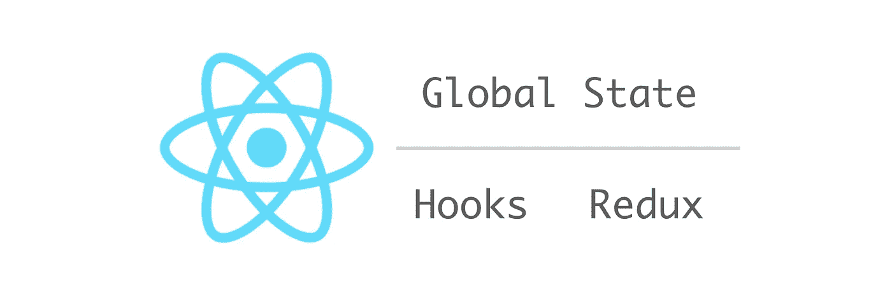

# Redux 中间件兼容 React Hooks 库，便于全局状态管理

> 原文：<https://itnext.io/redux-middleware-compatible-react-hooks-library-for-easy-global-state-management-4fe73623e69e?source=collection_archive---------4----------------------->

React 钩子很牛逼。



## 图书馆

我一直在开发一个库来利用 React Hooks API。这个库是用于全局状态管理的，目的是用它来代替 Redux，特别是对于较小的应用程序。有关更多信息和源代码，请参见资源库。

[](https://github.com/dai-shi/react-hooks-global-state) [## 戴式/反应钩式-全局-状态

### 钩子 API 反应的简单全局状态。通过创造一个新的世界，为 Dai-Shi/react-hooks-global-state 的发展作出贡献

github.com](https://github.com/dai-shi/react-hooks-global-state) 

也请看看我以前的帖子[ [1](/typescript-aware-react-hooks-for-global-state-b6e2dfc0e9a7) ] [ [2](/an-alternative-to-react-redux-by-react-hooks-api-for-both-javascript-and-typescript-c5e9a351ba0b) 。

## 支持 Redux 中间件

最初，该库扩展了全局状态的 useState。后来，减速器得到了支持。现在，增加了中间件支持。下面是工作示例中的代码片段，用来说明如何使用它。

首先，我们从我们的库中导入`createStore`,从 Redux 中导入两个助手。

```
import { createStore } from 'react-hooks-global-state';
import { applyMiddleware, combineReducers } from 'redux';
```

然后我们定义初始状态。注意，初始状态在我们的库中是强制的，而在 Redux 中是可选的。

```
const initialState = {
  counter: 0,
  person: {
    age: 0,
    firstName: '',
    lastName: '',
  },
};
```

我们为每个状态项定义了两个归约器(`counter`和`person`)。

```
const counterReducer = (state = initialState.counter, action) => {
  switch (action.type) {
    case 'increment': return state + 1;
    case 'decrement': return state - 1;
    default: return state;
  }
};const personReducer = (state = initialState.person, action) => {
  switch (action.type) {
    case 'setFirstName': return {
      ...state,
      firstName: action.firstName,
    };
    case 'setLastName': return {
      ...state,
      lastName: action.lastName,
    };
    case 'setAge': return {
      ...state,
      age: action.age,
    };
    default: return state;
  }
};
```

然后，用`combineReducers`把它们组合起来。

```
const reducer = combineReducers({
  counter: counterReducer,
  person: personReducer,
});
```

我们定义了来自 Redux 文档的日志中间件。

```
const logger = ({ getState }) => next => (action) => {
  console.log('will dispatch', action);
  const returnValue = next(action);
  console.log('state after dispatch', getState());
  return returnValue;
};
```

我们根据上面定义的内容创建一个商店，并导出结果函数。

```
export const { GlobalStateProvider, dispatch, useGlobalState } = createStore(
  reducer,
  initialState,
  applyMiddleware(logger),
);
```

例如，计数器组件的实现如下。

```
const Counter = () => {
  const [value] = useGlobalState('counter');
  return (
    <div>
      <span>Count: {value}</span>
      <button
        type="button"
        onClick={() => dispatch({ type: 'increment' })}
      >
        Increment
      </button>
    </div>
  );
};
```

## TypeScript 中的完整示例代码

您可以在[库](https://github.com/dai-shi/react-hooks-global-state/tree/master/examples/07_middleware)中看到完整的示例代码。它是用 TypeScript 编写的，但是 JavaScript 开发人员可以通过忽略类型定义(`type Foo = ...;`)和类型注释(`: Foo`就在变量后面)来阅读它。

## 这是可行的，但是还需要更多的实验

据我所知，日志中间件工作正常。我还没有尝试过其他的中间件。特别是，应该尝试异步库。如果有人对尝试其他中间件感兴趣，我很乐意帮忙。

## 最后一点

引入钩子 API 的 React 16.7 还没有发布。在正式发布之前，任何依赖钩子的东西都应该是实验性的。但是，无论如何你都要试一试。

## 变更日志

*   *【2018–11–07】:首次发布。*
*   *【2018–11–08】:跟随库 API 变化，让例子更直观。*
*   *【2018–11–12】:基于上下文 API 再次改变库 API。*