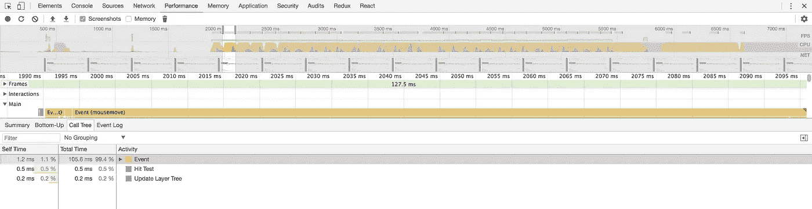

# Redux 毁了你的 React app 性能？你在做错事

> 原文：<https://itnext.io/redux-ruins-you-react-app-performance-you-are-doing-something-wrong-82e28ec96cf5?source=collection_archive---------0----------------------->


我经常听到人们说 Redux 很慢，并且可能是不必要的重新渲染的根本原因。在本文中，我将尝试解释在使用 react-redux 绑定时如何避免常见错误。

*假设你已经了解了避免和解的基本技巧，否则，你可以在一本* [*官方反应指南*](https://reactjs.org/docs/optimizing-performance.html#avoid-reconciliation) *中读到。*

有很多[通用技术](https://github.com/reactjs/redux/blob/master/docs/faq/Performance.md)，比如使用 PureComponent、[重新选择](https://github.com/reactjs/reselect)和内存化，但是当涉及到复杂的应用程序时，即使遵循所有的规则仍然会导致性能问题。

# 定义根本原因



使用 react perf 工具，很容易看到应用程序的哪一部分被重新渲染。但主要问题是为什么它会被重新渲染。要快速识别，您可以使用以下代码片段:

```
import { PureComponent } from 'react';PureComponent.componentDidUpdate = prevProps => {
    const name =
        this.constructor.displayName || this.constructor.name || 'Component';
    console.group(name);
    Object.keys(prevProps).forEach(key => {
        if (prevProps[key] !== this.props[key]) {
            console.log(
                `property ${key} changed from ${prevProps[key]} to ${
                    this.props[key]
                }`
            );
        }
    });
    console.groupEnd(name);
};
```

它将漂亮的打印属性，导致您的组件重新呈现。尝试将这个代码片段放到应用程序的根模块中，然后调度 redux 操作，这在您的系统中是不存在的。我打赌你会发现很多有趣的东西。

# 常见陷阱

我将试着列出破坏等式检查的最常见错误，并强制您的组件总是重新呈现。

## 无记忆选择器。

最明显的一个。选择器喜欢

```
const getList = (state, filter) => state.list.filter(filter);const getConfig = (state) => {
    return {foo: state.foo}
};
```

将总是导致重新渲染。尝试使用[重新选择](https://github.com/reactjs/reselect)或其他记忆技术来修复它。

## 边缘案例处理

如果默认值不存在，返回默认值的选择器也会导致性能下降:

```
const getList = (state) => state.list || [];
```

在每次 redux store 更改时，它将返回一个新的数组实例，但是您可以通过定义默认常量来轻松修复它:

```
const defaultList = [];const getList = (state) => state.list || defaultList;
```

## 连接组件中的逻辑

```
import {connect} from 'react-redux';...export default connect((state) => ({
    filter: {foo: state.filter}
}))(MyComponent);
```

这样的逻辑应该被移到选择器中并被适当地记忆。

## 反应道具中的元素

```
import {connect} from 'react-redux';...export default connect((state) => ({
    element: <List />
}));
```

`element`将总是一个新的实例，所以它也打破了相等检查。但是，通过将它移动到一个常量(在模块中定义),很容易解决这个问题:

```
import {connect} from 'react-redux';...const element = <List />;export default connect((state) => ({
    element
}));
```

另一种方法是传递组件而不是实例，并将渲染委托给父级:

```
import {connect} from 'react-redux';...export default connect((state) => ({
    Element: List
}));...{
    render() {
        const {Element} = this.props; return (<div>{<Element />}</div>);
    }
}
```

## 动态处理程序

```
class MyComponent extends PureComponent {
    render() {
        const {title, onClick} = this.props;

        return (
            <InnerComponent title={title} onClick={() => onClick()} />
        )
    }
}
```

InnerComponent 将总是被重新呈现，因为它总是获得 onClick 处理程序的新实例。您可以通过将 handler 移动到组件类属性来简单地修复它:

```
class MyComponent extends PureComponent {
    onClick = () => {
        this.props.onClick();
    }

    render() {
        const {title, onClick} = this.props;

        return (
            <InnerComponent onClick={this.onClick}>
                <span>{title}</span>
            </InnerComponent>
        )
    }
}
```

# 提示和技巧

现在让我们来详细说明你如何能在将来更容易地避免这样的错误。

## 使元件更小

将一个容器组件订阅到一堆状态，然后通过 props 将它传递下去，这是一个非常糟糕的想法，例如:

```
class MyBeastComponent extends PureComponent {
    render() {
        const {a, b, c} = this.props;

        return (
            <div>
                <ComponentA a={a} />
                <ComponentB b={b} />
                <ComponentC c={c} />
            </div>
        );
    }
}
```

每次 a、b 或 c 中有什么变化，都会导致所有的块重新呈现。相反，您可以将其拆分为更小的连接组件:

```
class MyBeastComponent extends PureComponent {
    render() {
        return (
            <div>
                <ComponentA />
                <ComponentB />
                <ComponentC />
            </div>
        );
    }
}... ComponentA, ComponentB or ComponentCimport {connect} from 'react-redux';export default connect(state => ({
    a: getA(state)
}))(ComponentA);
```

## 缩小数据范围

只传递组件需要的数据。例如，要呈现集合，通常不需要传递整个列表，只需传递项目的 id。然后将孩子连接到商店，并使用 ID 检索数据:

```
class MyList extends PureComponent {
    render() {
        const {itemIds} = this.props;

        return (
            <div>
                {itemIds.map(id => (
                    <Item key={id} id={id} />
                ))}
            </div>
        );
    }
}... Item componentimport {connect} from 'react-redux';export default connect((state, {id}) => ({
    title: getItemTitle(state, id),
    foo: getItemFoo(state, id),
    bar: getItemBar(state, id)
}))(Item);
```

在这种情况下，即使集合中的 id 集发生变化，它也不会重新呈现包括子项在内的所有列表。

## 仔细检查你自己

一定要确保你的记忆是有效的，并且不会产生任何倒退。您可以使用下面的代码片段在单元测试中包装您的选择器，并仔细检查它是否为相同的参数集返回相同的结果:

```
const wrapMemoizedSelector = (selector) => {
    returns (...args) => {
        const result = selector(...args); if (selector(...args) !== result) {
            throw new Error('Memoization check failed.');
        } return result;
    }
}...const examine = wrapMemoizedSelector(selector);test('check return value', () => {
    expect(examine({...})).toEqual({...});
});
```

# 就是这样！

我希望这将有助于你快速反应应用程序。

如果有帮助就鼓掌，并在评论中分享你的建议。