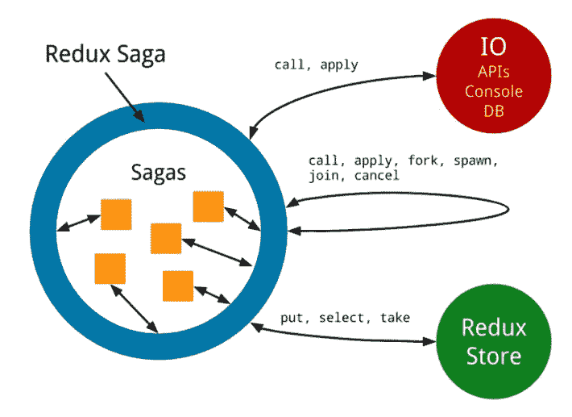

# redux Saga——如何用发电机做出真正的好东西

> 原文：<https://itnext.io/redux-saga-how-to-make-real-good-things-with-generators-7d91a8916f0e?source=collection_archive---------0----------------------->

# 请系好安全带……CQRS

术语 saga 通常用于 CQRS(命令查询责任分离)模式。更多信息你可以在这里找到。一般来说，术语 *saga* 指的是在有界上下文和集合之间协调和路由消息的代码。但是就 Redux Saga 而言，我们可以简单地将其命名为*进程管理器*。它完全涵盖了我们需要知道的关于传说的所有内容。关于术语定义的更多信息可以从原始论文“ [Sagas](http://www.cs.cornell.edu/andru/cs711/2002fa/reading/sagas.pdf) ”中找到。

当您实现 CQRS 模式时，您通常会想到在系统内交换信息的两种类型的消息:*命令*和*事件*。*命令*是请求系统执行一些任务或动作。命令通常由一个接收者执行并且只执行一次。*事件*是通知。他们通知相关方发生了一些事情。他们可以有多个订户。

让我们描述一下在网上商店订购一些产品。

在一个复杂的系统中，可能有一些涉及多个集合的业务流程。在这样的系统中，不同类型的多个消息由参与的集合交换。例如，在商店订购一些商品，你可以按照图(1-8)中的步骤进行，以获得成功的结果。他们必须通力合作，才能让顾客完成购买。您可以考虑使用如此复杂的解决方案的开销。对于一些小的业务流程来说确实如此。但是，当您拥有数十个聚合和大量消息时，好处就变得更加明显了。

**何时使用流程管理器？**当您有大量事件和命令，很难作为聚合之间点对点交互的集合进行管理时。当您希望更容易地修改系统中的消息路由时。Process manager 提供了定义所有路由规则的单一事实来源。

**什么时候不用流程经理？**当你拥有数量有限的少量聚合消息时。

不应该将业务逻辑放在流程管理器中。所有的业务逻辑都属于具体的聚合类型。

# **Thunk 和 Saga**

在 Redux 应用程序中有两种常见的处理副作用的方法。Thunk 是一个函数，它已经拥有了执行所需的一切。在 Redux 中，动作是用简单的对象定义的。而 *thunk* 的主要好处是它允许发送一个函数来代替。因此，您已经能够编写一些逻辑来立即执行并分派其他操作。

这只是导出一个返回商店的函数，我们将把它添加到 Provider 中。

在这个动作创建器文件中，我们有三个简单的动作和一个将通过 *thunk* 中间件管理的动作。根据获取结果`fetchOrganization`动作函数将自己分派`FAIL`或`SUCCESS`动作。

这个解决方案对于一些小逻辑来说非常棒。但是对于更大的解决方案，你已经需要使用一些更强大的中间件。

# 什么是佐贺

**简短说几句关于佐贺的方法**。佐贺只是一系列相连的故事。Saga 是长期存在事务，可以写成一系列可以交错的事务。序列中的所有事务都成功完成，或者运行补偿事务来修改部分执行。补偿交易能够撤销或添加一些关于交易或其失败的信息。

Sagas 使用 yield 关键字及其在函数中暂停执行的能力。因此，通过编写生成器，您只需编写完成操作所需的步骤。

让我们从初始步骤开始，用`npm install redux-saga`将其添加到项目中。

让我们用一些评论和解释来定义我们的`fetchDataSaga`:

因此，我们在中间件的系统中注册了我们的 saga。这个传奇听着`REQUEST_FETCH`的动作，并准备好按照自己的流程制造我们需要的一切，然后将数据取出并放入存储。在任何情况下，所有 saga 都被实现为生成器函数，生成 redux-saga 中间件的对象。产生的对象是一种指令，将由中间件以适当的方式解释。在第一个`yield`之后，发生器暂停并等待来自环境的数据解析和命令，以继续 saga，直到下一个`yield`。

Redux Saga 内部的流程编排通过使用所谓的*效果*实现。每次我们在调用`put`、`take`、`delay`等命令时，都会让出一些对象给外部环境，Saga 知道如何处理这些指令。例如，`put({ type: 'FETCH_DATA' })`的结果指示中间件分派`FETCH_DATA`动作。

我们之后有什么？通过只调度一个动作，我们执行复杂的异步流，并把有效负载发送到存储。是不是很神奇？这个流程也可以用测试来覆盖，以确保我们执行的一切都是正确的。

# 用测试覆盖流程

正如我们从生成器中已经知道的，每次我们用 yield 表达式调用对象时，我们都会得到格式为`{value: ..., done: [true|false]}`的对象。最后一次调用将为我们返回`{value: undefined, done: true}`。因此，记住这一点，我们将简单地迭代返回的生成器并检查生成的值。

# 助手

redux-saga 的所有通信都是通过 helper effects 实现的，它包装了内部函数，以便在调度一些特定动作时产生任务。

`put`返回指示 redux-saga 调度 put 参数中提到的类型为的操作的普通对象

`call`调用函数并返回结果，结果将由 redux-saga 传回。

`take`、`takeEvery`、`takeLatest`返回指示 redux-saga 开始监听系统中某个特定动作的普通对象。`take`将只听一次，`takeEvery`将听每一个动作，`takeLatest`将只听最后一个并取消之前的指令。

`fork`用于产生多个内置助手的观察者，在后台观察多个英雄的动作。

要创建效果，可以使用`redux-saga/effects`包中库提供的函数。

# 错误处理

我们可以使用熟悉的`try/catch`语法很容易地捕捉到 saga 中的错误。

如果我们需要在我们的传奇中抛出错误，您可以使用`.throw`方法来伪造错误。这将导致生成器中断当前流并执行 catch 块。

# 这个介绍的最终世界

任何来自传奇的副作用总是由一些声明性的效果来完成。这给我们带来了一些很好的优势，比如容易测试。Saga 将所有效果组合在一起，以实现自我描述和易于阅读的控制流。本文中只描述了最简单的一种流程。您还可以使用`if`、`while`和`for`操作符来实现更复杂的流程。

通过这个简单的使用示例，我们获得了与`redux-thunk`软件包相同的结果。但是已经大大提高了它的可测试性。