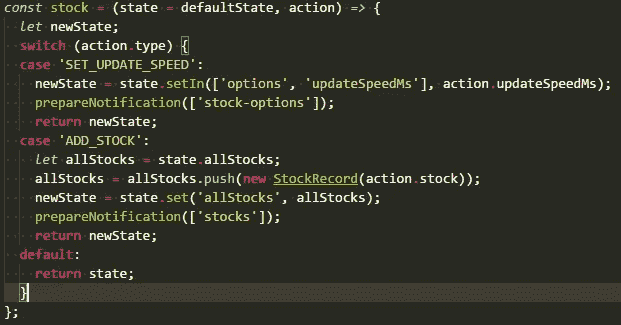
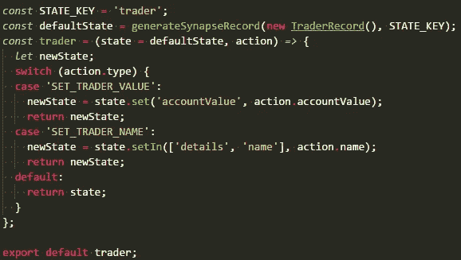

# redux Synapse——诞生于对快速执行、大型应用程序和繁重 UI 的需求

> 原文：<https://itnext.io/redux-synapse-born-out-of-the-need-for-fast-performing-large-applications-and-heavy-uis-8ddafe305fcd?source=collection_archive---------8----------------------->

冗余突触

[*点击这里在 LinkedIn 上分享这篇文章*](https://www.linkedin.com/cws/share?url=https%3A%2F%2Fitnext.io%2Fredux-synapse-born-out-of-the-need-for-fast-performing-large-applications-and-heavy-uis-8ddafe305fcd)

React 和 Redux 库，有助于构建集中和直接的状态更新，以确保最佳性能

**编辑** : *我最近修改了这篇文章，使其更容易理解，并包含了更多关于性能和文章预期用途的信息。因此，我将描述* `*react*` *、* `*react-redux*` *和* `*redux-synapse*` *如何工作的部分分开。你可以在这里找到:*

 [## react、react-redux 和 redux-synapse 之间的区别

### redux-synapse 是一个 javascript 库，它提供了一种不同的方法来连接组件并为它们提供…

medium.com](https://medium.com/@jonevans100/the-differences-between-react-react-redux-and-redux-synapse-2a5ffe654f3c) 

# 冗余突触

**Redux 让前端开发变得令人敬畏。它改变了 javascript 开发的前景，并在世界范围内的应用程序中扎根，从大量的待办事项应用程序到大规模的单页面应用程序。此外，已经创建了 100 个(如果不是 1000 个的话)库来扩充、扩展和改进它。`redux-synapse` *是*其中的一个库，旨在利用`redux`的能力，并通过 redux 订阅系统上的不同角度，将它转向允许更多定向的订阅更新，以提供临时性能优势和更多上下文更新。这可能不是第一个(*考虑到我因为懒惰搁置了 2 年~* )但是我想与你分享它，希望你能从中得到一些想法，或者甚至使用它。**

## 表现潜力？

我会推荐任何有兴趣了解更多的人去 bench ( *除非我先抽出时间*)，看看它是否比普通的`react-redux`更有效。有人理所当然地问我关于基准测试的问题，但是在我的本地实验中，它确实表现得更好。

也就是说，我确信通过仔细考虑连接和高级设置或自定义插件,`react-reduX`可以执行得更快，但我相信作为一种选择，通过少量的设置，它可以更好地开箱即用。

## 突触的支柱

创造之柱(美国宇航局)

> synapse 记录、通知和底层观察器

这些是`redux-synapse`的支柱，并最终决定了它如何工作。这是一个相对简单的系统，只有几个部分需要设置才能开始享受好处，所以让我们讨论一下它们扮演的各种角色:

`synapse(function, function, Array<string>)(component)` —这是您将组件连接到商店的方法。您提供了经典的`mapStateToProps`、`mapDispatchToProps`函数和一个`pathArray:Array<String>`，后者是您感兴趣的一系列路径。这些路径将是 redux 状态树的路径。

`observer` —观察者在后台处理状态，并在设置提供者时被启动。它采用默认的形状，拆除它，并基于已经存在并对特定关键路径表示出兴趣的`synapse`，构建一个内部的关键路径和订阅者字典。

`prepareNotification`—**向突触提供更新的两种**方式之一。当你得到某些更新时，你可以在你的 reducer 中使用它，或者如果绝对必要的话，在它之外的其他地方使用它。

将 prepareNotification 与 reducer 一起使用

`SynapseRecord` —这是**推荐的**方式，可以在`Immutable.Records`的基础上更新您的应用和作品，但也可以在原始状态下工作。您只需调用`generateSynapseRecord(new T(), STATE_KEY)`，其中`T`是您的记录类型，而`STATE_KEY`匹配状态上的键的名称。下面的截图给出了一个例子。

这样你就可以高枕无忧了，因为你所有的更新现在都可以通过`Immutable`API 来处理，比如`.set`、`.setIn`和`.withMutations`。`SynapseRecord`将状态更新传递给观察器，观察器通过订阅通知正确的组件。

> `SynapseRecord`是使用该库的方式，提供了开箱即用的最佳优势；通过抽象掉对`prepareNotification`的需求，利用`immutable`的优势。

哒哒！

当然，就代码而言，它还有更多的内容，但从消费者的角度来看，你可以简单地插入并非常快速地播放*，只需使用`redux-synapse` `Provider`(从包中导入)，然后用`generateSynapseRecord`包装你的唱片。很自然地，它假设您有不可变的记录——如上所述，您总是可以使用`prepareNotification` API，但代价是继续维护它，并可能错过对它的调用。*

*要了解更多信息，你可以阅读 [**文档**](https://github.com/glitch100/redux-synapse/tree/master/docs) 来解释这一点，但我希望它很容易掌握。*

## *比分*

*`redux-synapse`这是我和其他人在处理搬到`redux`时遇到的一个非常具体的问题的想法。也就是说，当涉及到其他库时，我并不是最敏锐的工具，因为 JS 肯定不是我的强项，而且还有其他库基于 Observer 模式使用类似的概念。*

*这个库对我来说更像是一个概念证明，证明了我可以创造一些潜在有用的东西。*

*值得注意的是，我做了一些关于性能改进的灰色假设，这可以为用户提供频繁更新的应用程序，如多个视频发射更新或游戏引擎。*

*因为该库始于 2016 年，随着时间的推移，维护和承诺水平参差不齐，它仍然存在一些潜在的未知问题。该库目前依赖于不可变的 3.8.6。去年对`immutable`进行了一次重大更新，实际上取消了`redux-synapse`中使用的一些 API。由于许多原因，这种升级是必要，但是这样做的话，各种区域将需要重写。*

## *后续步骤*

***给你**:如果你喜欢这篇文章，觉得它有趣或者有一些问题**在**下面开始对话。事实上，如果你非常感兴趣的话，可以去知识库，以任何适合你的方式贡献自己的一份力量！*

* [## glitch100/redux-synapse

### redux-synapse 影响的替代 react-redux，为您的反应提供一个基于观察者的特设系统…

github.com](https://github.com/glitch100/redux-synapse) 

想试试吗？你很幸运，它在 NPM:

 [## 冗余突触

### Redux 之上的层，以帮助显式地将 React 组件绑定到存储。非常适合性能和频繁更新…

www.npmjs.com](https://www.npmjs.com/package/redux-synapse) 

对我来说:现在这篇文章终于发表了，我打算回顾一下我在图书馆工作时提出的一些问题。

*   *添加单元测试覆盖*
*   *升级不可变，Redux 和 React*
*   *添加更多不可变的支持(通过各种 API)*
*   *获取一些性能日志*
*   *添加演示页面*

这里有很多东西，我欢迎对它们的任何帮助，因为这将是一条漫长的道路，但它值得一个 1.0.0 版本。

感谢阅读——我真的很感激。如果你觉得有趣，一定要评论、鼓掌并留下精彩片段。

 [## 乔恩·埃文斯(@Glitch100) |推特

### 乔恩·埃文斯的最新推文(@Glitch100)。。NET/React/Redux/ES6 Dev。redux-synapse、Halo-API 和…

twitter.com](https://twitter.com/Glitch100)*