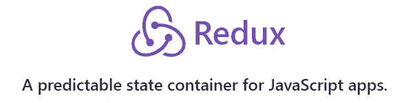
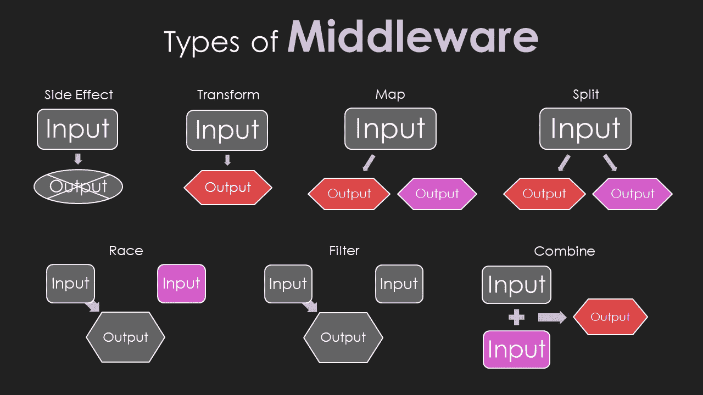

# 无状态还原

> 原文：<https://itnext.io/redux-without-state-15e2f839055c?source=collection_archive---------5----------------------->


本·怀特在 [Unsplash](https://unsplash.com?utm_source=medium&utm_medium=referral) 上拍摄的照片

## 为什么？

如果你能获得 Redux 的大部分好处，而且不用写一个 reducer，会怎么样？

如果您必须支持一个遗留的 AngularJS、jQuery、Backbone 或 Knockout 应用程序，那该怎么办？如果您现在想使用 Redux，您将不得不担心有两组状态。

你可以的！而你需要的只是没有状态的 Redux。

但是 Redux 是一个状态管理器:



那么为什么会有人使用没有状态的 Redux 呢？这就像有人给了你一个已经吃过的苹果作为午餐。那有什么好处？

Redux 的真正力量并不来自于状态管理。这只是关键成分的副作用:一个**消息传递**系统。

# Redux 中的消息传递

在 Redux 中，消息被称为动作，它们通常用于更新状态。

中间件功能是 Redux 的另一个关键元素，但是它们不更新状态。这些函数只分派动作或产生副作用(比如 AJAX 调用和控制台日志记录)。

这意味着它们只监听动作，然后分派其他动作:


Redux 中间件相当神奇。下面是一些例子，说明添加中间件后，可以用 Redux 操作做些什么:



同样的[你不需要 Redux 来使用 Redux-Observable](/redux-observable-without-redux-ff4a2b5a4b39) ，你也不需要状态或者 Redux 中的动作系统。要理解 Redux 消息传递，您必须首先理解动作。

## 什么是行动？

Redux 消息系统的核心是**动作**。它是一个具有`type`属性的对象。

```
{ type: 'SOME_ACTION' }
```

就是这样。

`type`可以是任何东西:`string`、`object`、`symbol`，甚至`number`。最佳实践是在所有大写字母中使用字符串，以便于调试。

动作是拥有无状态 Redux 的关键。

# 无状态冗余

实现自己的无状态 Redux 非常简单。我们将介绍几种不同的方法来创建您自己的。

您可以创建自己的`dispatch`函数，如下所示:

出于兼容性的原因，ES5 中的例子。

如果`stateModifiers`中存在`action.type`，则调用该函数并传入`action`。

听起来熟悉吗？

Redux reducers 也听动作。唯一的区别是缩减器不会改变状态，它会返回一个新的状态。

但是您可能正在使用一个遗留系统，状态突变是正常的。这就是为什么这些状态修改函数允许你改变状态。

下面是我们的`dispatch`函数在 AngularJS 控制器中的样子:

每次我们改变状态，它都发生在`stateModifiers`对象中。把这个想象成一个减速器函数。因为你的应用程序已经有了一个维护状态的方法，你所做的只是包装代码。

不要为了使用 Redux 而重写 AngularJS。让 Redux 与您现有的应用程序一起工作。您可以逐步添加`dispatch`功能到您的控制器，并根据需要进行更新。这样，**你不必仅仅为了从 Redux 中获益而改变渲染库**。

状态修改不再散落在你的代码库中。现在他们都在一个地方；容易找到，容易调试。

大部分情况下，你需要的只是`dispatch`。开始控制台日志记录操作，您已经从 Redux 消息传递中受益。

## 添加订户

调度很棒，但是大多数 Redux 应用需要中间件。您需要某种方式来说明“当 X 被更改时，调度其他操作”。

虽然像 Knockout 和 Angular 这样的大多数库允许您监听状态变化，但这只是等式的一部分。

你可能想把一个动作转换成另一个动作或者产生副作用。一个这样的例子是连接到第三方库——想想支持聊天客户端和服务，如 [LogRocket](https://logrocket.com/) 。很多时候，一个动作会触发多段代码执行。

这就是为什么您需要一种方式来订阅您的`dispatch`函数并在状态更新后执行中间件:

这里有一个简单的例子来说明你为什么需要中间件:

与我们前面的例子相比，当点击发生时，我们不再进行数据调用。相反，我们只调度`GET_IDS`动作。

在我们的例子中，两个中间件函数正在监听`GET_IDS`。一个触发装载指示器。另一个打数据电话。

这就是 Redux 的关注点分离的亮点。您的点击处理程序不再需要管理您的业务逻辑；这是在状态修改器和中间件函数中处理的。

## 欺骗的

如果您想使用您的`stateModifiers`对象创建中间件，这在技术上是可能的。问题是，我不建议这么做。

如果您将状态修饰符与中间件功能结合起来，您就失去了将状态更新作为独立实体的一部分的机会。

# 使其可重复使用

假设您想在今天的应用程序中使用它。你会想用不同的方式来写。大概是这样的:

现在我们有了错误日志，一切都包含在一个`createStore`函数中，就像 Redux 一样。唯一的区别是除了“商店”内部订户列表之外，没有其他状态。

在这个版本中,`subscribe`可以接受一组中间件，我们的调度函数有一些安全检查和错误记录。

如果你将`window.__isDebugging`设置为`true`，它也会记录下每一个动作，这样你就可以跟踪正在发生的事情。当然，这不是 Redux 的 devtools，但仍然很有帮助。

如果你看到一个红色错误信息的大博客，你现在可以通过查看你的控制台来跟踪哪个操作导致了它。

下面是你如何使用它:

虽然 Redux 是一个“一个全局存储来管理它们”的库，但是这个无状态版本可以，并且可能应该，在每个控制器中使用。

这样，您可以更好地控制正在发生的事情，而无需让整个应用程序全局感知自身。在许多遗留应用程序中，这是您想要的。

## 将无状态 Redux 与合法 Redux 一起使用

你也可以对官方库进行无状态还原。你所要做的就是使用一个减速器，并且总是返回到先前的状态:

没有定制的解决方案好，但是可以连接到现有的中间件库，比如 Redux-Observable，没问题。

但是，如果您有能力引入 npm 依赖项，您可能也不需要无状态 Redux。

# 真正的面向对象编程

我一直在谈论 Redux 的消息系统，好像它是一个非凡的东西，它确实是。

艾伦·凯，那个称之为面向对象编程的家伙，实际上是在谈论面向消息编程。

从 2003 年[发给艾伦·凯](http://userpage.fu-berlin.de/~ram/pub/pub_jf47ht81Ht/doc_kay_oop_en)的一封邮件中，他是这样说的:

> 我认为对象就像生物细胞和/或网络上的单个计算机，只能与消息进行通信(所以消息传递在一开始就出现了——花了一段时间才明白如何用编程语言足够有效地进行消息传递才是有用的)。
> 
> 我想摆脱数据。[……]我意识到，细胞/整个计算机的比喻将摆脱数据，而“

简而言之，这就是无状态 Redux。

# 结论

在 Redux 之前，没有太多好的方法来跟踪应用程序的状态。

回头看，jQuery 的很多代码也是事件驱动的，就像 Redux 的消息系统一样。您将听到诸如单击事件处理程序、鼠标移动、跟踪更新、文档加载和图像加载之类的内容。但是为什么 Redux 这么干净，jQuery 却变成了意大利面代码？

在过去，您订阅了特定的操作(事件)。你不能像 Redux 中间件那样订阅任何和所有的动作。此外，在使用事件发射器时，状态更新和中间件功能之间没有分离。

从成本上考虑 Redux。

它有一点短期成本，但从长远来看，它具有广泛的可维护性，并将业务逻辑从您的视图中分离出来。即使有了无状态 Redux，虽然您没有得到不可变的状态和易于测试的纯函数，但是您可以获得巨大的好处，知道到底发生了什么。

# 更多阅读

如果你喜欢你所读的，请查看我关于类似的令人大开眼界的主题的其他文章:

*   [试听:权威指南](/the-definitive-guide-to-callbacks-in-javascript-44a39c065292)
*   [承诺:权威指南](/promises-the-definitive-guide-6a49e0dbf3b7)
*   [特性标志:真正敏捷](/feature-flags-be-truly-agile-820ff50294c)
*   [带有表情符号的函数式编程基础知识](/an-emoji-lovers-guide-to-functional-programming-part-1-241d8d4c9223)