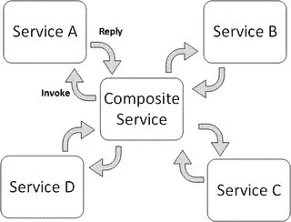
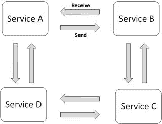
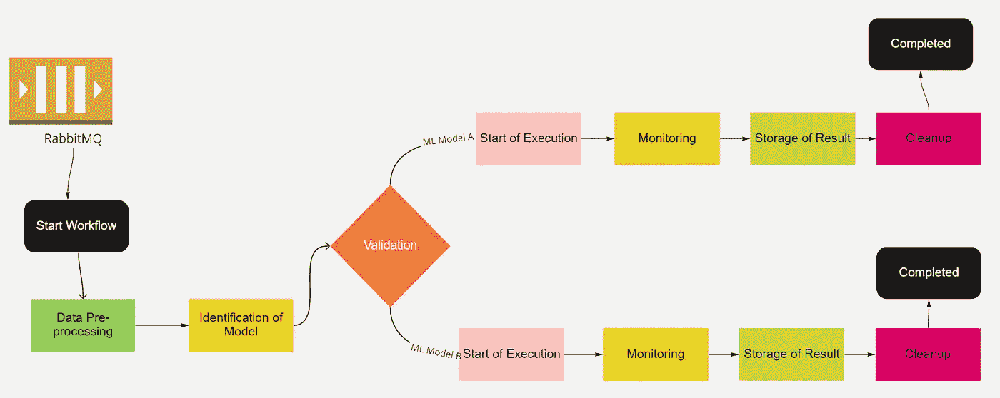
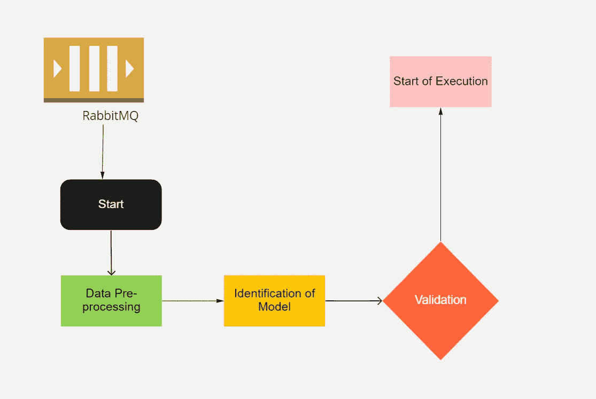
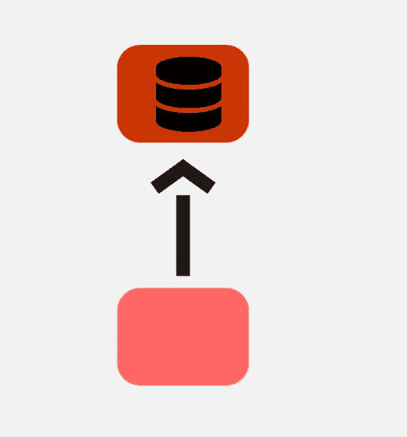
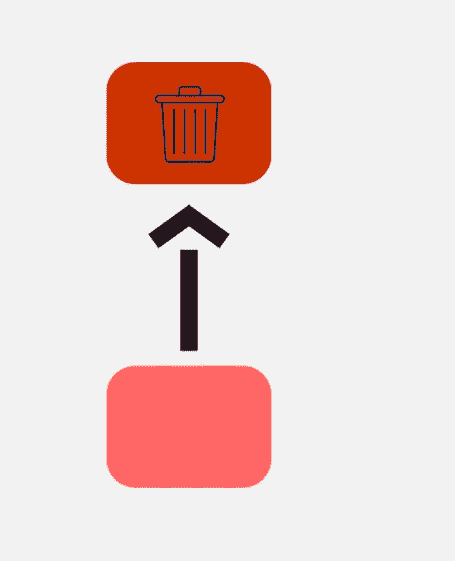

# 从整体工作流到微观工作流的重构

> 原文：<https://itnext.io/refactor-from-monolith-workflow-to-micro-workflows-92afcc49c8ec?source=collection_archive---------5----------------------->

# 介绍

工作流被视为在当前计算中定义和实现复杂应用的不可或缺的工具。业务流程的自动化有助于组织和客户自动处理和计算多个步骤和工作，而无需任何干预。工作流技术和过程在现代复杂计算环境中起着核心作用。如今，许多公司都在追逐大多数项目的微服务架构。在这里，工作流引擎在编排各种服务中起着至关重要的作用。这对于处理状态、监控、报告等也非常有帮助。

在许多情况下，我注意到工作流是作为一个单一的中心组件实现的，然而该项目有多个组件来展示微服务架构的行为。工作流引擎不一定要实现为一个单一的中央组件。它可以选择作为多个分散的工作流引擎，以避免整体行为和 SPOF(单点故障)。

# 为什么要使用工作流来进行编排或编排？

在项目中引入和开发工作流之前，理解编排和编排的概念是非常重要的。基于这种理解，工作流的角色将被定义，否则微服务架构的某个地方将会受到损害。

## 管弦乐编曲

服务编排指定了一个集中的可执行业务流程，该流程协调不同服务之间的交互。编排者负责构思和整合服务。编排采用集中的方法进行服务组合。

图 1:编排

## 舞蹈编排

服务编排是参与服务的全局定义，由两个或多个端点之间的消息交换、交互规则和理解来指定。编排采用了一种分散的服务组合方法。

图 2:编排

编排和编排都是有价值的交流方式，不同的策略需要其中之一。工作流引擎对于编排来说非常有价值，因为它允许显式地对流程建模，并在流程运行时对其进行实时监控。它有利于管理长期运行的流程的状态。然而，编排可以屠杀微服务并创建分布式整体。它创建了一个紧密耦合的环境。在这里，服务相互之间紧密依赖，任何一点的失败都可能导致流程停止。

# Monolith 工作流示例

让我们假设一家企业想要在一个实时场景中执行几个机器学习或深度学习模型，其中有几个重要步骤。步骤可以是数据预处理、模型的注册和验证、数据的识别和基于特定数据的特定模型的执行、监控模型的执行状态、通过给予其他服务收集和存储由模型产生的结果、通知不同的服务、清理作业等。

这些不同的步骤将调用不同的服务，有时一个服务的结果依赖于另一个服务。

图 3:整体工作流程

这里的危险是，它失去了大规模流动的图片。理解流程、修改流程或处理流程变得极其困难。在这里，工作流引擎演变为架构的中心组件，需要正确操作，微服务之间的通信仅通过工作流完成。此外，该组件在可用性要求方面更为关键。

大约十年来，工作流引擎(BPM 工具)一直占据着中心地位。这是运行一个复杂系统的唯一方法。在现代系统和架构中，对于非常灵活的现代工具来说，这不再是真的。

所有现代运动，如 DDD 或微服务，都要求组件去中心化，以实现更大的灵活性和独立性，这意味着尽快将变化投入生产，这将是未来成功企业的关键能力。

# 分散工作流引擎，使其成为微型工作流

基于不同的相似功能，工作流可以是分散的。

上述工作流程可分为四种不同的工作流程:

*   数据预处理、模型识别、验证和 ML 模型的执行
*   监视
*   结果存储
*   清除

## 工作流程 I:数据预处理、模型识别、验证和 ML 模型的执行

图 4:数据预处理、模型识别、验证和 ML 模型的执行

## 工作流 II:监控 ML 模型的执行

图 5:监控 ML 模型的执行

## 工作流程三:结果存储

图 6:结果的存储

## 工作流四:清理

图 7:清理

# 结论

分散的工作流方法是正确的选择，因为它只是与微服务值同步。服务的每个部分都可以单独扩展。ML 模型的执行和监控需要更多的资源，因此两者都可以单独扩展。引擎上的负载也可以使决策变得清晰——因为众多的引擎也意味着分配负载。