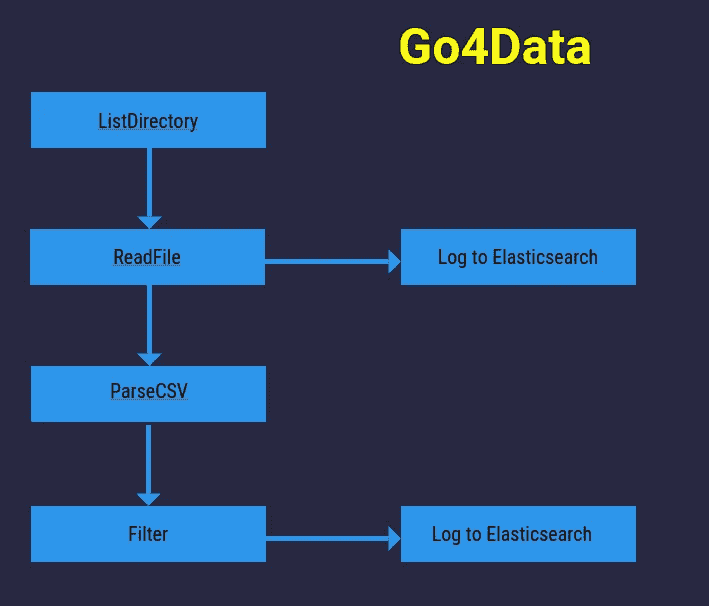
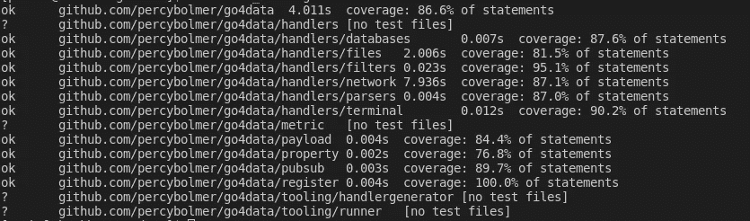
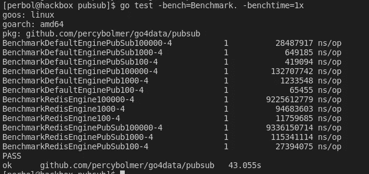

# 使用接口和基准重构 Go4Data

> 原文：<https://itnext.io/refactoring-go4data-using-interfaces-and-benchmarks-19affdf94079?source=collection_archive---------7----------------------->

## 一步一步的指导你如何在 Go 中使用接口来重构并使你的代码非常模块化



Go4Data 可以用来做什么的例子。

在本文中，我将介绍我如何使用 Golang 接口的能力来替换 [Go4Data](https://github.com/percybolmer/go4data) 中的一个主要部分。我们还将使用基准测试来比较旧解决方案和新解决方案。

我希望这篇文章聚焦于**如何正确使用接口，以及基准**而不是我正在改变的代码。因为我们将会改变很多代码，我不期望你自己编码，而是试着接受使用接口的过程和心态。

先来解释一下 Go4Data 是什么，或者说我希望它变成什么样子。Go4Data 是一款数据处理工具。它专注于处理数据，目前正在进行中。这个想法是，您可以设置输入，比如 Redis 队列或目录中的文件。然后，您可以通过发布/订阅引擎将数据传递到下一个数据处理器。这个想法来自于我的第 100 个项目，在对数据进行过滤和转换后，必须读取 CSV 文件并将其放入数据库。

这都是由 Go4Data 加载的 YAML 配置文件完成的，不需要编码。

我们今天要重构的部分是 Go4Data 使用的发布/订阅系统。在开发过程中，我创建了一个定制的内存发布/订阅系统。这工作得很好，但是它的可伸缩性不是很好，因为它依赖于当前应用程序使用的内存。**允许用户通过创建一个发布/订阅接口来配置 Go4Data 使用的发布/订阅引擎**将会非常酷，让我们开始吧。我还将实现该接口的 Redis 实现。

当 Redis 实现完成时，我们将对两者进行基准测试，看哪一个性能最好。如果你不熟悉 Redis 如何与 Pub/Sub 一起工作，请阅读我的另一篇[文章](/redis-as-a-pub-sub-engine-in-go-10eb5e6699cc)。

最后，我们将允许用户通过简单地调用方法 NewEngine 在 Go4Datas 自定义发布/订阅和 Redis 之间切换。下面的要点显示了如何进行改变。

在 Redis 和 Default 之间切换将是一个简单的配置。

## 从回顾当前存在的东西开始

因此，我想做的第一件事是看看当前的实现，我们将努力使界面适合这一点，以便我们可以允许用户在不修改任何其他代码的情况下交换整个发布/订阅引擎。

当前的发布/订阅引擎公开了一些全局方法，整个 Go4Data 使用这些方法来发布和订阅数据。这些方法是**发布、发布主题和订阅**。因此，如果我们在将要创建的接口中使用这 3 个方法，我们应该能够替换整个逻辑，而不会破坏其余的包。

## 创建界面

我将把这 3 个方法提取到一个名为 Engine 的接口中。该引擎将通过三个相同的方法由公共 API 公开使用。这允许用户非常容易地重新配置所使用的引擎，而不破坏所有其他包。

我希望在运行 Go4Data 时将旧的实现作为默认实现，因为我们不想强迫用户安装 Redis。所以我们还必须创建一个默认的结构来实现引擎接口。

这是我们在 Go4Data 中需要的接口。

## 全局公开所需的方法

由于 Go4Data 中的其余包依赖于可用的方法，我将创建一些与 API 匹配的包装函数，但它们将只调用底层选定引擎的真正方法来运行。

因为我们公开的方法将依赖于我们即将创建的接口实现，所以我们需要创建一个 init 函数，在导入包后立即运行。这里我们将创建一个 DefaultEngine 对象，这样如果没有设置引擎，Go4Data 就不会崩溃。

完整的 PubSub 代码，公开方法并包装引擎。

这就是发布/订阅的样子，它将 API 暴露给其余的包，所以当我们改变底层的发布/订阅引擎时，它不会崩溃。

注意我是如何创建一个具有类型引擎接口的**引擎变量的？这是当用户选择引擎时我们将重新配置的变量，也是每当调用 API 方法时我们调用方法的变量。这允许我们对 go4 数据包的其余部分保持全局方法，但是可以很容易地切换调用的逻辑。**

## 实现 DefaultEngine

DefaultEngine 是我在开发过程中使用的旧实现。完整的代码很长，你可以滚动过去，如果你想。我们要做的是获取其中存在的所有方法，并将它们作为一个名为 DefaultEngine 的结构上的方法接收器。

这里重要的是，我们希望确保 DefaultEngine 实现了引擎接口。如果是的话，我们应该可以马上在整个应用程序中使用它。这就是接口的美妙之处，只要我们匹配它们中定义的 API，我们就可以非常容易地用新的逻辑将它们切换进来和切换出去。

这是我用过的旧的发布/订阅引擎，它是硬编码的，很难在不破坏东西的情况下改变。

因此，替换旧引擎中的所有代码，而不是确保实现接口是简单的**，我们只是添加一个简单的结构，并使所有方法成为结构**的一部分。

向 DefaultEngine 结构添加方法接收器，使其成为引擎接口的一部分

一旦我改变了这个。我现在可以运行所有 go4 数据包的测试了，希望不会出什么问题。

请记住，这是可能的，因为其他包依赖于发布/订阅包来公开引擎接口中的 3 个方法。这些方法做什么并不重要，只要它们符合设计模式。



当重新运行测试时，没有测试失败，因为它们都使用看起来相同的 pubsub 包公开的方法。

很好，现在我们知道了使用公开的方法来包装我们的引擎是可行的。我们可以开始实现 Redis 引擎。

## 实现 RedisEngine

现在下一步是创建一个实现引擎接口的新结构。这个将有一个名为**的 helper 函数，带有 RedisEngine** ，它将引擎变量更改为 Redis 连接，而不是 DefaultEngine。

如果你不熟悉 Redis，你可以在这里阅读我写的关于把它用作[酒馆/订阅的文章。](/redis-as-a-pub-sub-engine-in-go-10eb5e6699cc)

Redis 的简单实现，而不是定制的发布/订阅

这只是 128 行代码来代替整个项目的整个发布/订阅引擎，非常好！

此外，由于我们正在使用一个接口来做这件事，如果我们想尝试其他引擎，可能是 Kafka 或 RabbitMQ，我们可以很容易地继续添加 Pub/Sub 引擎。

你会问，我们为什么要添加其他人？**因为它非常有趣！**

现在我们有了两个实现，我们也可以对它们进行基准测试。

## 基准

标杆管理可能很难。限制它们，让你只测试你想测试的东西可能会很难。我真的不擅长，但我会尽力而为。我们想要删除将要推送的对象的初始化，因为这不是我们想要测试的，所以我将把它放在 init 函数中，在测试之前运行。我们希望测试发布所需的时间，以及发布到订阅者拥有所有项目所需的时间。

引擎将在启动时用 Go4Data 创建，所以我们也将引擎的连接和初始化放在 init 中。它们的性能并不重要，因为它们是在启动时运行的，所以让我们把重点放在运行时性能上。

在运行我的基准测试之前，我需要设置一个 Redis 实例来使用。

```
sudo docker run --name redis -p 6379:6379 -d redis
```

因此，这里的想法是，我们想首先尝试基准测试我们可以多快地发布数据，因此一个基准测试将只使用两个引擎，并发布 N 个项目。我将使用 100、1000 和 100000 作为我的基准来查看低额和高额。这些基准将被命名为 BenchmarkEnginePubXAmount。

我也将有一个基准，将测试发布和等待订阅者收到所有发布的项目。这些基准将被命名为
benchmarkinginesubxamount。

在 Go 中，您可以设置基准运行的次数，并获取这些次数的平均值。在我的例子中，我将坚持每个基准运行一次，这是因为 Redis 似乎不喜欢被高速上下的连接运行。这是通过添加标志-benchtime=1x 来实现的。

这是基准测试的样子。

发布和发布/订阅的基准功能的结果。

正如你所看到的，Go 中的基准测试相当容易，编写好的基准测试很难，我仍在努力学习。我们可以使用 **go test -bench** 命令简单地运行这个基准测试。



基准测试结果来自 DefaultEngine 和 RedisEngine。

基准测试的输出首先显示名称、运行的基准测试数量以及每次操作的纳秒数(ns/op)。

正如所料，DefaultEngine 比 Redis 运行得更快。这是意料之中的，因为 DefaultEngine 运行在应用程序使用的内存中，所以它可以直接访问。Redis 的优势在于它提供了持久性和跨多个节点运行 Go4Data 的能力。

现在用户可以很容易地替换项目的大部分，因为我们利用了界面的力量。

这次到此为止。感谢您的阅读！