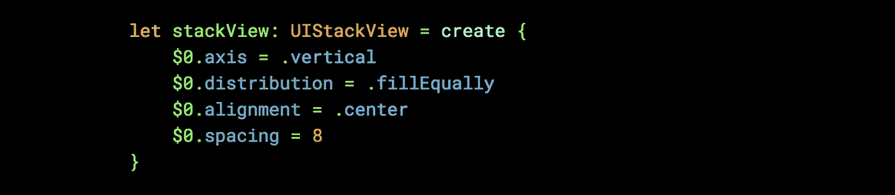
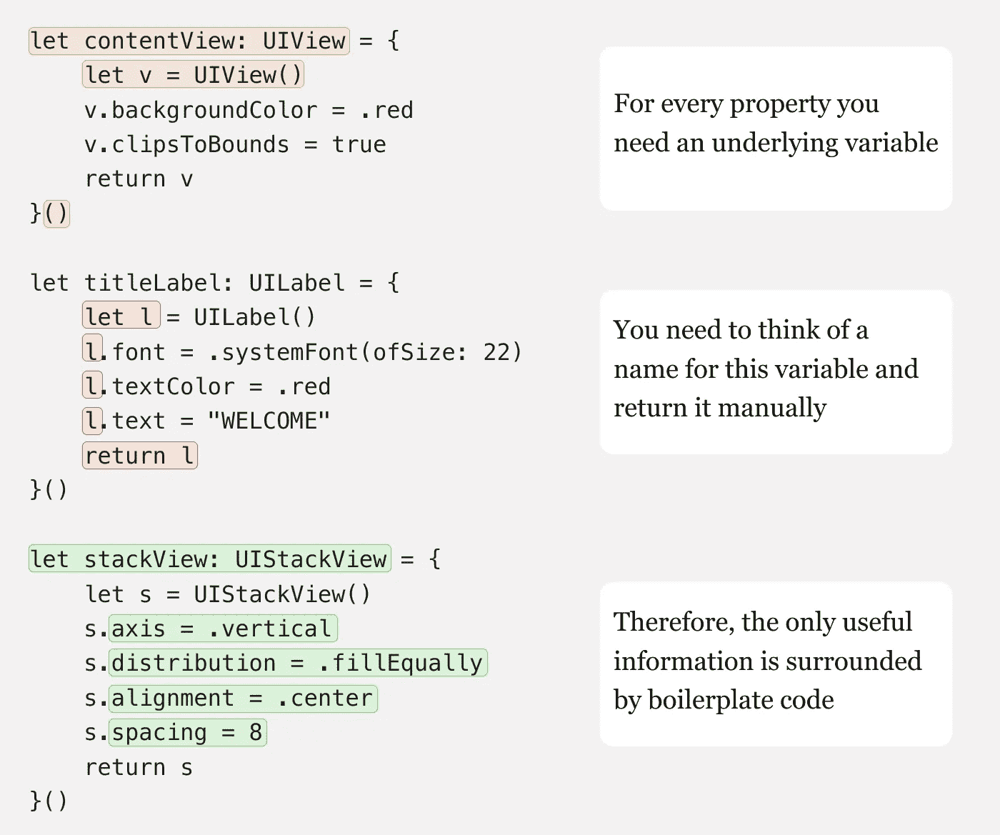

# Swift 中的重构:设置闭包

> 原文：<https://itnext.io/refactoring-in-swift-setup-closures-d06b896c412c?source=collection_archive---------0----------------------->

## 快速了解一个简单的函数如何让你的设置闭包更加整洁



简洁！

视图控制器顶部的一个经典场景是正在实例化的视图列表，以及在每个视图上设置的一些属性:

```
let contentView: UIView = {
    let v = UIView()
    v.backgroundColor = .red
    v.clipsToBounds = true
    return v
}()let titleLabel: UILabel = {
    let l = UILabel()
    l.font = .systemFont(ofSize: 22)
    l.textColor = .red
    l.text = "WELCOME"
    return l
}()let stackView: UIStackView = {
    let s = UIStackView()
    s.axis = .vertical
    s.distribution = .fillEqually
    s.alignment = .center
    s.spacing = 8
    return s
}()
```

当我查看这些代码时，我不禁觉得其中有一些冗余和重复的信息，具体来说:



因此，我创建了一个函数，可以用来使设置闭包变得更加整洁:

```
func create<T>(_ setup: ((T) -> Void)) -> T where T: NSObject {
    let obj = T()
    setup(obj)
    return obj
}
```

这个函数位于一切之上，可以实例化任何不需要传递给它的`init`的参数的`NSObject`子类。现在，如果我们要重写我们的设置闭包列表，它将只有编译器要求的最低限度的搭建:

```
let contentView: UIView = create {
    $0.backgroundColor = .red
    $0.clipsToBounds = true
}let titleLabel: UILabel = create {
    $0.font = .systemFont(ofSize: 22)
    $0.textColor = .red
    $0.text = "WELCOME"
}let stackView: UIStackView = create {
    $0.axis = .vertical
    $0.distribution = .fillEqually
    $0.alignment = .center
    $0.spacing = 8
}
```

这通过利用以下 Swift 语言功能来实现:

*   函数的返回值一般可以通过它被赋值的类型来推断，例如`func x<ReturnType>() -> ReturnType`
*   函数的最后一个闭包参数可以写成函数外部的闭包，例如`array.forEach { … }`
*   闭包参数不需要命名；也可以用`$0`来代替，例如`array.compactMap { $0 }`

所以现在属性的类型只需要出现一次，我们不需要在一个闭包的范围内创建一个我们立即调用的变量！