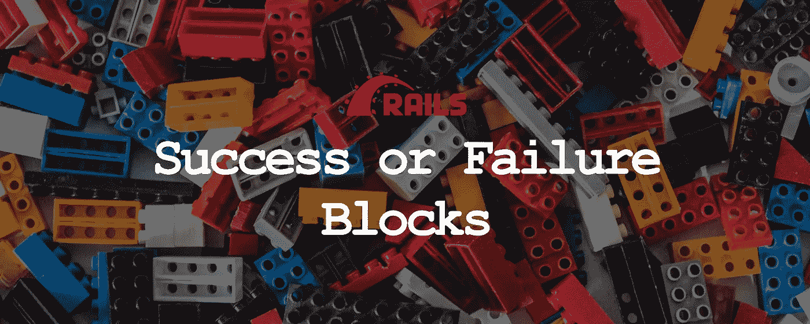

# 如何使用块重构 Ruby on Rails 控制器

> 原文：<https://itnext.io/refactoring-ruby-on-rails-controllers-using-blocks-bf78b1b292ca?source=collection_archive---------3----------------------->

## 重构

## 使用服务对象和成功或失败模块来帮助您编写可维护的 ruby on rails 控制器



Francisco Jacquier 在 [Unsplash](https://unsplash.com/search/photos/lego?utm_source=unsplash&utm_medium=referral&utm_content=creditCopyText) 上拍摄的背景照片

# 什么是服务对象？

简单地说，它是一个普通的 ruby 对象，只有一个用途。就像一把椅子。它只能让人坐在上面。句号。这有很多原因。它使任何人都更容易理解它做什么，同时也使编写测试更容易。

> I nsight:我在编写可维护代码的这些年中学到的一件事是，通过将软件开发世界中的对象与现实世界中的对象联系起来，可以更好地理解和编写这些对象。就像你不希望你的电炉顶也作为你的办公桌(火灾隐患！)，创建只为单一目的服务的对象才有意义。

下面是一个简单的 ruby 服务对象类的例子，它只创建帖子。我们将进一步阐述这一点，以展示我们如何利用这个简单的类，使用成功或失败块来重构您的 rails 控制器。

```
class CreatePost
  attr_reader :subject, :body
  def initialize(subject:,body:)
    @subject = subject
    @body    = body
  end

  def call
    Post.create!({ subject: subject, body: body })
  end
end
```

> 提示:尽量总是用动词来命名服务对象(例如，创建、构建、更新等)。)它迫使你专注于对象的动作和目的。也使得任何人都很难添加不属于那里的业务逻辑。

# 为什么是服务对象？

封装业务逻辑，同时保持它与 Rails 框架的其余部分隔离，使它成为一个组件，您可以在应用程序中的其他地方重用它。假设您需要在您的控制器和 API 端点中应用相同的业务逻辑，您可以重用相同的服务对象，并自由决定您希望如何响应请求(即，在您的控制器中，您可以重定向用户，而在您的 API 端点中，您可以发送回 JSON 响应)

此外，它使得测试您的业务逻辑更加容易，因为您不必为控制器或 API 设置任何额外的开销来测试业务逻辑。

事不宜迟，让我们直接进入成功或失败模块。

# 臃肿的控制器动作

下面是一个包含业务逻辑的控制器操作的简单示例，我们稍后可以将其重构为服务对象:

```
class PostsController < ApplicationController
  def create
    @post = Post.new(post_params)
    if @post.save
      send_email
      track_activity
      redirect_to posts_path, notice: 'Successfully created post.'
    else
      render :new
    end
  end
end
```

# 成败阻碍救援

我第一次遇到这种技术是在窥视“[inherited _ resources](https://github.com/activeadmin/inherited_resources)”gem 的时候。我感兴趣的是关于如何使用成功或失败块来覆盖默认的继承资源操作的部分。以下是来自[自述文件](https://github.com/activeadmin/inherited_resources#overwriting-actions)的片段:

```
class ProjectsController < InheritedResources::Base
  def update
    update! do |success, failure|
      failure.html { redirect_to project_url(@project) }
    end
  end
end
```

下面是代码所做工作的高级概述。当对项目资源进行更新时，如果更新失败，它将通过重定向到项目资源的显示页面来调用失败响应。但是，如果更新成功，它将默认为重定向到项目索引页面的正常流程(这就是默认情况下继承的资源所做的)。在封装业务逻辑的同时，允许我们控制对每一个成功和失败的场景做什么有助于简化我们的控制器逻辑。

让我们使用我们之前的服务对象示例，通过一些调整，使用更简化的实现逻辑(与在[继承资源](https://github.com/activeadmin/inherited_resources/blob/master/lib/inherited_resources/base_helpers.rb#L257)中使用的逻辑相比)来实现相同的结果

这是我们的控制器动作的重构版本，以及服务对象和实现这一点所必需的其他类。

```
# app/controllers/posts_controller.rb
class PostsController < ApplicationController
  def create
    @post = Post.new(post_params)
    CreatePost.call(@post) do |success, failure|
      success.call { redirect_to posts_path, notice: 'Successfully created post.' }
      failure.call { render :new }
    end
  end
end

# app/services/create_post.rb
class CreatePost
  attr_reader :post

  def self.call(post, &block)
    new(post).call(&block)
  end

  def initialize(post)
    @post = post
  end
  private_class_method :new

  def call(&block)
    if post.save
      send_email
      track_activity
      yield(Trigger, NoTrigger)
    else
      yield(NoTrigger, Trigger)
    end
  end

  def send_email
    # Send email to all followers
  end

  def track_activity
    # Track in activity feed
  end
end

# app/services/trigger.rb
class Trigger
  def self.call
    yield
  end
end

# app/services/no_trigger.rb
class NoTrigger
  def self.call
    # Do nothing
  end
endThe CreatePost#call instance method (line 25) essentially accepts a block of code with success and failure as arguments (Line 5)
```

我们可以传递一个`Trigger`或`NoTrigger`类对象作为`success`参数。如果给`success`参数一个 `Trigger`类，那么将产生给`success.call`的块，它将用户请求重定向到 posts 索引页面以及一个成功通知。然而，如果`success`参数被赋予一个`NoTrigger`类，赋予它的块将不会被调用，因为`NoTrigger.call`类方法什么也不做。这整个逻辑也适用于`failure`参数。

你不喜欢积木吗？

# 额外资源

Blocks、procs 和 lambdas 可能有些令人困惑，但是当你最终掌握这个概念时，它们可以成为一个非常强大和灵活的工具，帮助你编写更简单和更好的代码。如果您想了解更多信息，这里有一些有用的资源:

*   [https://blog . app signal . com/2018/09/04/ruby-magic-closures-in-ruby-blocks-procs-and-lambdas . html](https://blog.appsignal.com/2018/09/04/ruby-magic-closures-in-ruby-blocks-procs-and-lambdas.html)
*   [https://www.rubyguides.com/2016/02/ruby-procs-and-lambdas/](https://www.rubyguides.com/2016/02/ruby-procs-and-lambdas/)
*   https://pragprog.com/book/btrubyclo/mastering-ruby-closures

希望你喜欢读我的文章。我热爱重构代码，希望以后能分享更多的重构技巧。像往常一样，如果你有任何可以帮助我改进帖子的反馈或建议，请随时发表评论。

下次见。干杯。