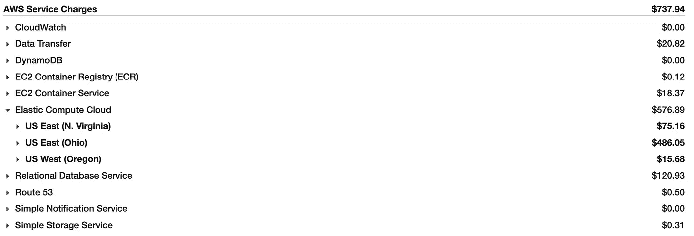
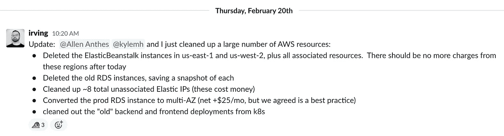
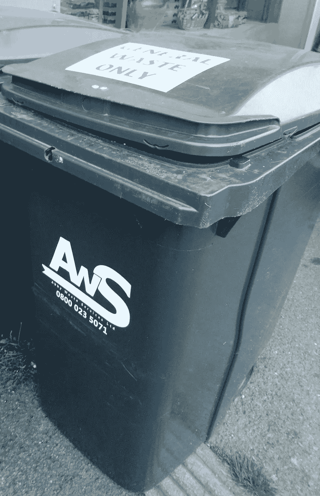
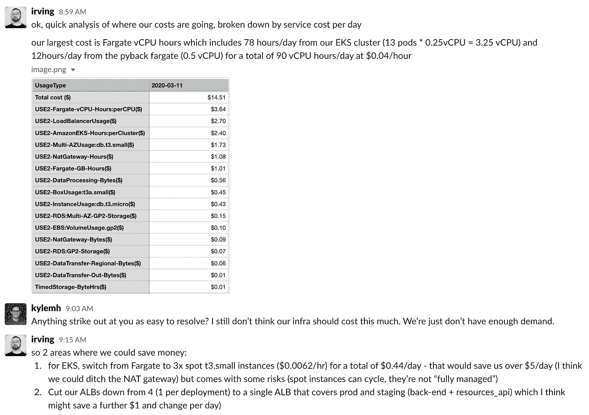
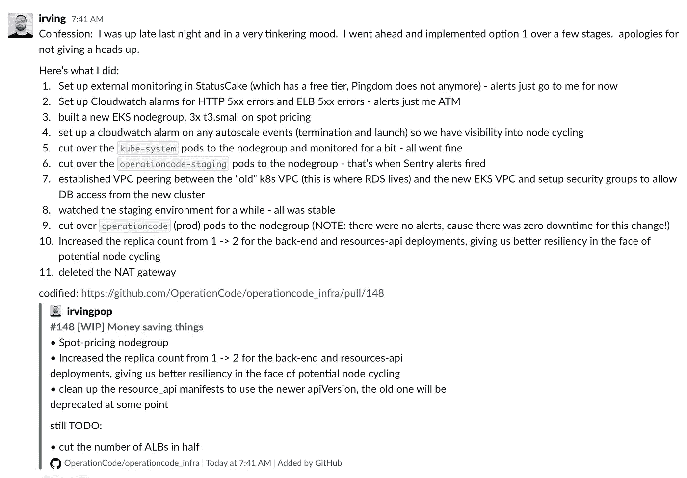
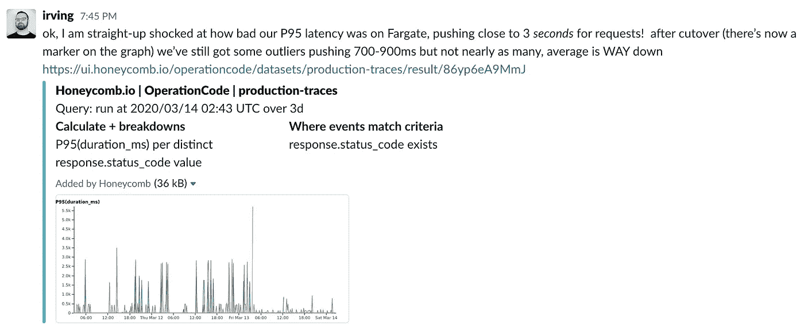
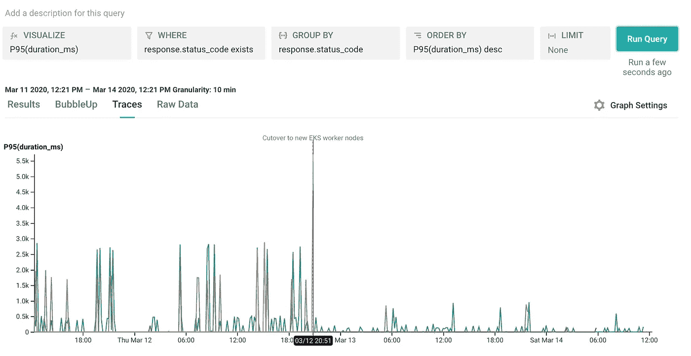

# 在运营代码中重构 Kubernetes 基础设施

> 原文：<https://itnext.io/refactoring-the-kubernetes-infrastructure-at-operationcode-229e391e3ad9?source=collection_archive---------5----------------------->

一个让我们的 Kubernetes infra 进入更好状态并在此过程中削减 2/3 AWS 账单的故事

# 这一切都始于…


[Nell Shamrell](https://medium.com/u/68b109307620?source=post_page-----229e391e3ad9--------------------------------) 在`#infrastructure-team`频道中指出，我们每月的 AWS 账单真的很高，老实说，对于像 OperationCode 这样的组织来说实在是太高了。

我已经在 OperationCode 帮忙做了大约一年的运营工作，我们的 Kubernetes(又名 k8s)集群肯定需要做一些工作:

1.  它还在 Kubernetes 1.11 上(21 个月大！k8s 年一百)原地升级的步骤[充满了危险](https://github.com/kubernetes/kops/blob/master/docs/releases/1.12-NOTES.md)。
2.  它有一个繁琐的用户登录过程，包括谷歌认证和一个`secrets.json`文件，每个人(包括管理员！)一直输
3.  它花费了我们太多，包括 6x t3 .中型实例(3 个主节点，3 个工作节点)，3 个 NAT 网关(这些贵得惊人！)和过大的 EBS 卷(每台主机 200 GB)

正如您所看到的，对于像我们这样的小组织来说，所有这些加起来真的很快。



我们 2020 年 2 月的 AWS 成本

# 第 0 部分:实现监控和可观察性

在进行任何更改之前，我仔细检查了我们的监控情况。我们有 [Sentry.io](http://sentry.io) 来通知我们应用程序错误，还有 Prometheus 和 [AlertManager](https://prometheus.io/docs/prometheus/latest/configuration/alerting_rules/) 来捕获指标并从我们的 Kubernetes 集群内部发送警报。

此外，我添加了两个外部(和免费)的可见点:

*   来自 [Honeycomb.io](http://honeycomb.io) (我的兼职雇主)的可观测性仪器，利用[免费社区计划](https://www.honeycomb.io/pricing/)给我们 500MB 的存储空间和 15/GB mo 的遥测数据摄取。在我们的后端应用程序中实现[Python 直线是相对容易的，事实上大部分工作都涉及到修复构建和更新依赖关系和文档。](https://github.com/OperationCode/back-end/pull/277)
*   具有[状态的外部站点监控进行](https://www.statuscake.com/)，也利用他们的[免费计划](https://www.statuscake.com/pricing)给我们 10 个正常运行时间测试 URL 和 1 个页面速度测试。

这样，我就有信心继续进行整个基础设施改造，因为我知道我们有足够的测试覆盖我们的生产环境。

正如[慈善专业](https://medium.com/u/5587d135a397?source=post_page-----229e391e3ad9--------------------------------)总说的，你真的是在生产中做测试。


来源:charity.wtf 博客

# 第 1 部分:清理未使用的资源



我们的初步检查发现，有近 200 美元/月的资源完全没有使用，这是之前在 ElasticBeanstalk 上运行的应用程序版本和一些实验遗留下来的。与另外两个 OCers 进行了一个小时的配对，我们很快就把它们清理干净了。

# 第 2 部分:思考为什么 Kubernetes 对操作码很重要


我喜欢 OperationCode 的一点是我们如何使用自己的网络应用和基础设施作为教学资源，所有的应用和基础设施都是开源的。这使得我们帮助的兽医(以及所有志愿者)能够在当今流行的开发实践中获得经验。我相信我们选择使用和提供“真实的、生产中的”Kubernetes 集群也是出于同样的精神。如果对我们的需求来说有点大材小用，这完全没问题，因为它为任何想要它的人提供了宝贵的实践经验。

关于我们基于 kops 的 k8s 集群的反馈是，它有点太难了，这让人们感到害怕。毕竟，我们在这里讨论的是我们的生产基础设施，它需要保持运行并易于理解。在过去对亚马逊的“托管”EKS 产品有过积极的体验后，这感觉像是向前发展的自然选择。它平衡了可访问性和可靠性，同时合理地减少了日常维护的复杂性和工作量。

此外,“无服务器”Kubernetes 的理念与[基于 Fargate 的新运营模式](https://aws.amazon.com/blogs/aws/amazon-eks-on-aws-fargate-now-generally-available/)似乎是进一步减少运营问题的一种有吸引力的方式。它并没有完全解决，但后来更多的。

# 第 3 部分:构建新的集群



AWS 容器，这不是我编的

多亏了 [eksctl](http://eksctl.io) ，建立一个新的 EKS 集群变得异常容易。我意识到我可以通过利用配置文件[来实践一些基础设施作为代码实践。eksctl 还提供了一个非常方便的`eksctl utils write-kubeconfig`,让新用户的加入变得非常简单。](https://github.com/OperationCode/operationcode_infra/blob/7396262afe38c2de4451c7f023d95e7c8649747c/kubernetes/eksctl/operationcode-backend.yaml)

在构建集群之后(这实际上根本不需要时间！)，AWS 文档[建议安装以下组件:](https://docs.aws.amazon.com/eks/latest/userguide/fargate-getting-started.html)

*   [ALB 入口控制器](https://docs.aws.amazon.com/eks/latest/userguide/alb-ingress.html)
*   [外部 DNS 控制器](https://kubernetes-sigs.github.io/aws-alb-ingress-controller/guide/external-dns/setup/)
*   [垂直 Pod 自动缩放器](https://docs.aws.amazon.com/eks/latest/userguide/vertical-pod-autoscaler.html)

除了外部 dns 之外，按照说明进行设置相对容易。提供的[示例配置指向了一个过时的映像](https://github.com/kubernetes-sigs/aws-alb-ingress-controller/blob/v1.1.5/docs/examples/external-dns.yaml#L55)，不幸的是[外部 dns 文档](https://github.com/kubernetes-sigs/external-dns/blob/master/docs/tutorials/aws.md)没有提供任何关于如何在 Fargate 中使用它的指导。经过一些实验，并得到了 Kubernetes slack 的友好人士的帮助，我发现我需要使用 T1 命令为外部 DNS 创建一个角色，然后使用 T2 注释将 Kubernetes 服务帐户映射到 IAM 角色(这里是 T21 代码 T22)。

最后，我们使用 [Argo CD](https://argoproj.github.io/argo-cd/) 来持续交付我们在 k8s 上运行的后端服务，因此这对于部署非常重要。EKS+法盖特的一个已知限制是，它不支持持久的卷声明，它只能支持短暂的 pod。我最终向集群添加了一个单独的`t3a.medium`节点，这样 Argo 就不会在每次 pod 循环时丢失所有数据:)

我没有使用 Argo 的 HA 安装模板(这对我们来说是多余的)，而是将 quickstart 模板的 Redis 服务器部分修改为一个带有持久卷声明的 stateful set([代码，此处为](https://github.com/OperationCode/operationcode_infra/blob/master/kubernetes/argocd/install.yaml#L2294-L2304))，为 Argo 提供了足够的可用性级别。

# 第 4 部分:更新我们的服务 k8s 清单

在测试中，我们发现有必要对我们的应用程序清单进行一些更改，以便在新的集群上运行。

最重要的是根据 ALB 入口控制器和外部 DNS 控制器的要求，修改从`type: ClusterIP`到`type: NodePort`的所有服务。之后，它只是以正确的方式实现入口注释和规则。控制器观察这些注释，然后自动创建 AWS ALB 和 Route53 DNS 记录，非常酷！

```
apiVersion: extensions/v1beta1
kind: Ingress
metadata:
  name: back-end
  annotations:
    kubernetes.io/ingress.class: alb
    alb.ingress.kubernetes.io/certificate-arn: arn:aws:acm:us-east-2:633607774026:certificate/d59d030e-0239-4bfa-8553-e4bafb6481b4
    alb.ingress.kubernetes.io/listen-ports: '[{"HTTPS": 443}]'
    alb.ingress.kubernetes.io/scheme: internet-facing
    alb.ingress.kubernetes.io/ssl-policy: ELBSecurityPolicy-TLS-1-2-2017-01
    external-dns.alpha.kubernetes.io/hostname: backend.k8s.operationcode.org
  labels:
    app: back-end
spec:
  rules:
  - host: backend.k8s.operationcode.org
    http:
      paths:
      - path: /*
        backend:
          serviceName: back-end-service
          servicePort: 80
```

以下是包含所有更改的完整拉取请求:

[](https://github.com/OperationCode/operationcode_infra/pull/143/) [## 返工 Kubernetes 的部署，以使用 EKS+法尔盖特的一切由欧文波普拉请求#143 …

### 问题:我们当前的 Kubernetes 集群运行起来成本太高，而且还存在可管理性挑战。这个公关的目标…

github.com](https://github.com/OperationCode/operationcode_infra/pull/143/) 

最后，切换就像更改 DNS 记录一样简单，它(大部分)是在一个周日晚上成功完成的。这有助于我们的 PostgreSQL 数据库位于 RDS 上，并且不需要在安全组更改时进行改动。

# 第 5 部分:意识到我们的成本仍然太高(唉！)


DevOps 动作集

在运行新设置一周后，我清理了 kops 集群，然后我们开始密切监控 AWS 的日常开销。我实现了 [MiserBot](https://www.concurrencylabs.com/blog/introducing-miserbot-aws-cost-management/) 来为我们提供每日 AWS 支出更新。不幸的是，一旦稳定下来，我们的日成本仍然是 14.51 美元(435 美元/月)，这仍然太高了。

我的分析和建议:



回到 OC slack 中的#基础设施-团队聊天

# 第 6 部分:转移到 Spot 实例工作节点

好吧，那么 Fargate 是一个很酷的主意，但它肯定比我想象的要贵。Fargate hours、NAT gateway 和 t3a.small 的总花费为 6.16 美元/天，我知道我们可以合并成三个 AWS `t3.small`实例，如果现货定价，总花费为 0.45 美元/天。这是一个值得的改变。

我想小心 spot 实例循环(被终止和重新创建)影响我们的操作，所以我用 Cloudwatch 警报和[cloud watch 警报对 Slack sender](https://github.com/widdix/cloudwatch-alarm-to-slack/) 实施了额外的监控。

我对将`kube-system`pod 从 Fargate 转移到 worker 节点也有一点紧张，但这最终非常顺利地完成了，并且跳过了其余的名称空间。在过渡阶段环境后，我发现我们的 RDS 安全组被设置为允许来自 NAT 网关的流量(这也会增加数据传输成本！)，所以我不得不快速实现 VPC 对等，从安全性和成本的角度来看，这是一个更好的解决方案。



如果没人注意到，你可以忍者编辑基础设施，对吗？

我意识到的另一件事是我们在 Fargate 上的后端请求延迟有多糟糕，许多请求接近 3 秒！切换后的图形看起来好多了。



蜂巢的松弛展开是如此之好，对不对？



响应时间的差异令人震惊！

# 结论

运行 Kubernetes 需要工作、测试和严密监控。该项目进展如此之快，以至于你无法将目光从它身上移开一年，然后期待一次平稳的升级。让它拥有 4-5 个次要版本，你会发现像我们一样，把所有东西都搬到一个新的集群上要容易得多。

就 Kubernetes 集群的成本和可管理性而言，我们现在处于一个更好的位置。现在，群集本身的运营成本不到 5 美元/天(包括入口 ALBs ),我们的 AWS 总支出为 7.80 美元/天，对于像我们这样的组织来说，这是一个更可持续的价格。

Fargate 对这个项目有点失望:我希望 AWS 在 EKS·法盖特的成本上更明确一些。是的，如果你真的仔细挖掘，你会发现它，但它并不明显。但是性价比是最大的败笔。

最后，像 OperationCode 这样的组织做得很好，他们依赖于我们服务提供商的慷慨以及你们的捐赠。[请捐款！](https://operationcode.org/)