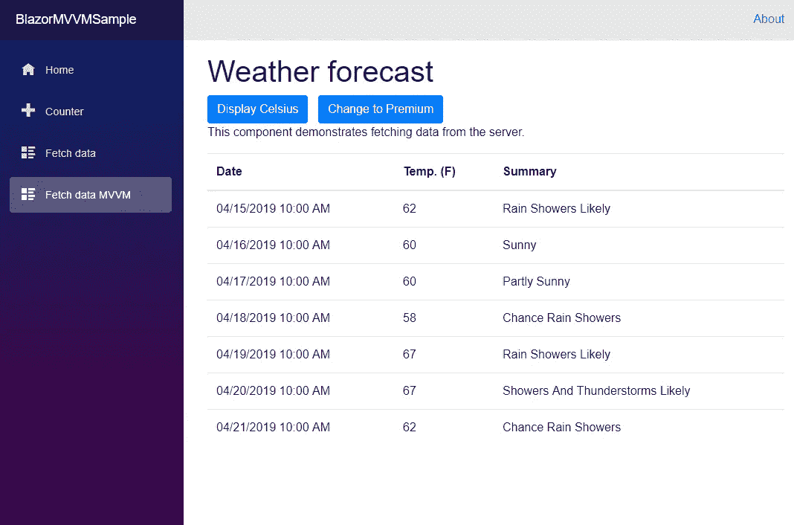

# 重构简单的 Blazor MVVM 客户端:依赖注入的冒险

> 原文：<https://itnext.io/refactoring-the-simple-blazor-mvvm-client-adventures-in-dependency-injection-e9866d194ee9?source=collection_archive---------2----------------------->


本文是关于在 ASP.Net 客户端 Blazor 中实现模型视图 ViewModel 的系列文章的第四篇。如果您想从头开始阅读本系列，第一篇文章位于此处:

[](/a-simple-mvvm-implementation-in-client-side-blazor-8c875c365435) [## 客户端 Blazor 中一个简单的 MVVM 实现。

### 如前所述，我正致力于将我的生产 Silverlight 应用程序迁移到一个新的平台上。我的…

itnext.io](/a-simple-mvvm-implementation-in-client-side-blazor-8c875c365435) 

这个项目的源代码可以从 GitHub 获得。本文起点的代码在 ArticleThree 分支和 4.3 版本中。本文末尾的代码是 ArticleFour 分支和 4.4 版本。

[](https://github.com/lchendricks/BlazorMVVM) [## lchendrick s/blazormvm

### 一个客户端 Blazor MVVM 实现。通过在…上创建帐户，为 lchendricks/BlazorMVVM 的开发做出贡献

github.com](https://github.com/lchendricks/BlazorMVVM) 

在这篇文章中，我们将探讨使用内置的几种方法。我们的 Blazor 客户端中的 Net Core DI 容器。在前面的文章中，我们已经看到了如何将一个类注册为一个接口，然后通过类的构造函数或者使用@inject 将它作为视图中的一个属性注入。今天我们来看两个我们还没有讨论过的场景。第一个场景是将同一个类注册为两个不同的接口。第二个场景是将两个不同的类注册为同一个接口。我们将保持实现非常简单，以防止这篇文章变得太大。之后，我们将讨论一种在 Startup.cs 中自动注册服务的方法。

# 新的业务需求

我们假想的雇主进行了成本效益分析，并决定今后只使用国家气象局 API。我们需要改变系统，只使用这项服务来提供基本的，增强的和每小时的预测。我们将借此机会重构和改进我们的模型，同时将这种变化落实到位。

如果我们回头看看 FetchDataModel.cs，我们有 3 个公开的方法。这些方法中的每一个都包含一个对外部 API 的硬编码引用，其中两个返回一个类而不是一个接口。这段代码将很难编写合适的测试，并且在以后的支持过程中可能会变得很痛苦。我们还可以通过不在每次用户在每日和每小时预测之间导航时调用 API 来提高我们的性能。

我们今天的方法是为模型创建两个孩子，一个用于每日预测，一个用于每小时预测，并让依赖注入帮助我们使用它们来满足我们的需求。我们还将添加私有变量来存储检索到的预测，以避免对 API 的多余调用。

# 第一个子模型

在我们添加模型之前，我们将通过声明一个接口来准备我们的代码，在这个接口中，我们当前在整个代码中使用一个类。在共享项目中，进入 WeatherDotGovForecast 并提取一个接口:

```
public interface IWeatherDotGovForecast
{
   Geometry geometry { get; set; }
   Properties properties { get; set; }
   string type { get; set; }
}
```

我们将从我们的每日预测开始，因此进入 Models 文件夹并创建一个新的类 DailyForecastModel.cs。我们要做的第一件事是设置新的子模型以通过构造函数注入接收 HttpClient 并保存对它的引用。接下来，我们将向该类添加一个方法来下拉我们的每日预测:

随着数据采集的进行，我们将需要返回增强预测和基本预测的方法。增强预测是一种简单的传递方法:

```
public async Task<IWeatherDotGovForecast> RetrieveFullForecast()
{
   var forecast = await RetrieveForecast();
   return forecast;
}
```

基本预测需要更多的工作。我们只需要检索信息的子集，我们也只需要每天一次预测。我们将使用一点 Linq，仅从预测中提取奇数编号的周期，然后仅从结果集中提取我们要寻找的数据点。我们将创建的方法如下所示:

```
public async Task<IWeatherForecast[]> RetrieveBasicForecast()
{
   var forecast = await RetrieveForecast();
   var basicForecast = (from Period p in forecast.properties.periods
   where p.number % 2 == 0 select new WeatherForecast
   {
      Date = p.startTime,
      TemperatureC = (int)((p.temperature - 32) * 5 / 9),
      Summary = p.shortForecast
   }).ToArray();
   return basicForecast;
}
```

我们可以将这个类注册为一个接口，并让父模型进行两个不同的方法调用来获取它需要的数据(在现实世界的应用程序中我们会这样做)。在今天的练习中，我们将这个类注册为两个不同的接口，并让模型不知道它正在查看同一个类来进行不同的方法调用。在现实世界中，当一个类需要在应用程序的不同部分以不同的方式显示时，而不是在一个类中，更有可能使用这种方法。

我们的第一个界面将展示我们的完整预测:

```
public interface IFullForecastModel
{
   Task<IWeatherDotGovForecast> RetrieveFullForecast();
}
```

第二个界面将显示基本预测:

```
public interface IBasicForecastModel
{
   Task<IWeatherForecast[]> RetrieveBasicForecast();
}
```

现在，我们可以用这些接口更新我们的类，之后它将看起来像这样:

新类完成后，我们可以进入`Startup.cs`中的`ConfigureServices()`，在两个接口下注册新类。

```
services.AddTransient<IFullForecastModel, DailyForecastModel>();services.AddTransient<IBasicForecastModel, DailyForecastModel>();
```

# 使用第一个子模型

现在一切就绪，我们可以开始在父模型中使用我们的新孩子了。进入 FetchDataModel.cs 并进行以下更改。添加两个新的私有变量来保存对子模型实例的引用

```
private IFullForecastModel _dailyForecast;private IBasicForecastModel _basicForecast;
```

并更新父类的构造函数，通过注入接收这两个实例，并保存对它们的引用。

```
public FetchDataModel(HttpClient http, IFullForecastModel dailyForecast, IBasicForecastModel basicForecast)
{
   _http = http;
   _dailyForecast = dailyForecast;
   _basicForecast = basicForecast;
}
```

现在让我们更新 ViewModel 调用的方法，以使用这些新的引用。当我们这样做时，如果我们还没有这样做，我们将通过只进行 API 调用来提高性能。首先，我们将更新获得基本预测的方法

```
public async Task RetrieveForecastsAsync()
{
   if (_weatherForecasts == null)
   {
      _weatherForecasts = await 
         _basicForecast.RetrieveBasicForecast();
   }
}
```

然后，我们将为我们的增强预测做同样的事情。

```
public async Task RetrieveRealForecastAsync()
{
   if (_realWeatherForecast == null)
   {
      _realWeatherForecast = await
         _dailyForecast.RetrieveFullForecast();
   }
}
```

在这些更新完成后，我们将有一些类型不匹配的地方，我们需要将类声明改为接口声明。更新后的模型现在看起来像这样:

完成后，我们可以启动应用程序，并看到它仍然像预期的那样工作。我们现在已经通过两个不同的接口将同一个类注入到我们的应用程序中。



# 第二胎模型

对于每小时预测的模型，我们将返回到我们的模型文件夹，并创建另一个新类`HourlyForecastModel.cs`。这个类将会和我们的第一个子模型有很多相同的内容，除了它将只实现“完整的”接口，并且只有一次方法。这个类一开始会是这样的:

该类还需要在 Startup.cs 中注册。

```
services.AddTransient<IFullForecastModel, HourlyForecastModel>();
```

到目前为止，一切都很标准。然而，我们现在已经注册了两个不同的`IFullForecastModel`实现，那么当我们运行我们的应用程序时会发生什么呢？简单的回答是。Net Core 的 DI 容器将返回接口的最后一个注册实例。这意味着我们现在的代码将总是注入`HourlyForecastModel`。这不是我们想要的，那么我们该如何应对呢？我们将让注册服务告诉我们它们可以做什么，这样我们就可以选择我们想要接收的服务。

首先，我们将制作一个`enum`，它允许我们区分不同的注册服务，并将其作为公共属性公开。将它添加到`BlazorMVVMSample.Client.Models`名称空间中的某个地方。

```
public enum supports { daily, hourly}
```

现在向两个子模型添加相同的属性

```
public supports Supports { get; private set; }
```

并拉高到`IFullForecastModel`接口。

```
supports Supports { get; }
```

剩下的工作就是在子模型的构造函数中分配所需的支持类型

```
Supports = supports.daily;           orSupports = supports.hourly;
```

# 注入正确的模型

既然我们已经做出了这一更改，我们可以更新父模型来利用这一点并选择正确的模型。首先，我们需要更新我们的构造函数定义，用一个`IEnumerable<IFullForceastModel>`来获取每个注册的实例，而不仅仅是最后一个。

```
public FetchDataModel(HttpClient http, IEnumerable<IFullForecastModel> fullForecasts, IBasicForecastModel basicForecast)
```

一旦我们可以访问它们，我们就可以使用 Linq 在我们的构造函数中指定一个我们想要的类型，如下所示:

```
_dailyForecast = fullForecasts
     .Where( f => f.Supports == supports.daily )
     .First();
```

这里的前提是，我们正在通过我们的注册服务寻找一个符合我们需求的服务。我们只注册了两个班级，标准非常简单。这可以很容易地应用于一长串服务，并且在搜索合适的服务时有多个匹配的标准。现在，我们已经制定了注射，我们可以利用我们的第二个孩子模型。我们需要在 FetchDataModel 中声明一个私有变量

```
private IFullForecastModel _hourlyForecast;
```

在构造函数中填充它

```
_hourlyForecast = fullForecasts.Where(f => f.Supports == supports.hourly).First();
```

并更新检索每小时预报的方法。

```
public async Task RetrieveHourlyForecastAsync()
{
   if (_hourlyWeatherForecast == null)
   {
      _hourlyWeatherForecast = await     
      _hourlyForecast.RetrieveFullForecast();
   }
}
```

在这之后，我们将有更多的类型不匹配，我们将需要用接口替换类声明，我们将一切就绪。FetchDataModel 现在看起来像这样:

我们现在可以再次启动该应用程序，它的功能完全正常。我们不再调用旧的 API，我们使用两个不同的接口注入了一个类，并且使用同一个接口注入了两个不同的类。

# 依赖关系的自动注册

如果我们看看我们的`ConfigureServices()`方法的内容，它现在看起来像这样:

```
services.AddTransient<IFetchDataViewModel, FetchDataViewModel>();services.AddTransient<IFetchDataModel, FetchDataModel>();services.AddTransient<IBasicForecastViewModel, BasicForecastViewModel>();services.AddTransient<IFullForecastModel, DailyForecastModel>();services.AddTransient<IBasicForecastModel, DailyForecastModel>();services.AddTransient<IFullForecastModel, HourlyForecastModel>();
```

当我们构建一个需要注册几十或几百个类的大型应用程序时会发生什么？每当我们需要注册另一个接口时，我们就在这个方法中添加另一行代码，或者我们可以设置我们的应用程序来自动注册。像 AutoFac 和 StructureMap 这样的 DI 框架的用户已经在这么做了。Net Core DI 容器用户也在这么做。

为了用代码注册我们的服务，我们需要使用反射。首先，我们需要确定要搜索哪个或哪些程序集。之后，我们可以确定我们想要的类并注册它们。为了做好这一点，我们需要为我们的类和程序集设计一个命名方案，确保我们只注册我们的类，并且只注册一次。在我们的应用程序中，如果我们使用“FullName.Contains("Model ")”这样的标准，我们将注册我们的模型和视图模型，这可能不是我们想要的。

我们将采取的第一步是获取对我们的客户端程序集的引用:

```
var assembly = AppDomain.CurrentDomain.GetAssemblies()
   .Where(a => a
   .FullName.StartsWith("BlazorMVVM.Client"))
   .First();
```

该语句查看所有程序集，并提取具有匹配名称的所有程序集。我们已经提前知道我们将只有一个匹配，所以我们可以避免收到一个带有`.First()`的数组。下一步是获取我想要注册的所有类。我不想意外地获取我不想要的类，所以我将使用 Visual Studio 重命名我所有的模型，以`_model`结尾。这将使我更容易抓住他们注册。幸运的是，我在 Startup.cs 的屏幕上有它们，所以只需点击几下就可以重命名父模型和两个子模型。完成后，我可以像这样抓住它们:

```
var classes = assembly.ExportedTypes.Where(a => a.FullName.Contains("_Model"));
```

现在我只需要遍历这些类，然后遍历它们的接口，并注册每个类，如下所示:

```
foreach (Type t in classes)
{
   foreach (Type i in t.GetInterfaces())
   {
      services.AddTransient(i, t);
   }
}
```

我们现在在`ConfigureServices()`中只剩下两个手动注册的视图模型和一个已经自动注册了我们所有模型的代码块。更新后的`ConfigureServices()`会是这样的:

再次，当我们启动我们的应用程序时，它就像我们手动注册每个服务时一样工作。

在一个更大的应用程序中，你可能会把那个代码从`ConfigureServices`中取出来，使它成为一个单独的方法，甚至是另一个完全不同的类。您可能对不同的程序集使用不同的标准，并且您可能有其他要求，比如只注册公共类或接口。只要你提前计划并坚持你自己的指导方针，你就可以很容易地注册你所有的依赖项。

# 包扎

即使我们没有改变任何对用户可见的东西，我们也能够消除一个不需要的 API，并对我们的实现进行一些改进。我们看到了如何对实现两个不同接口的类以及由两个不同类实现的接口使用依赖注入。我们还看到了在 Startup.cs 中用几行代码自动注册我们的服务是多么容易。

本系列还将继续其他文章。如果有你想看到的话题，请留下反馈或发推文给我。更新:第五篇文章已经发表:

[](https://medium.com/@haywireiv/working-with-the-view-in-blazor-mvvm-functions-vs-code-behind-vs-viewmodel-ed3508dba86a) [## 在 Blazor MVVM 中使用视图:函数{} vs 代码隐藏 vs 视图模型

### 这是关于在客户端 Blazor 中使用模型-视图-视图模型模式的一种方法的系列文章的第五篇。如果…

medium.com](https://medium.com/@haywireiv/working-with-the-view-in-blazor-mvvm-functions-vs-code-behind-vs-viewmodel-ed3508dba86a)