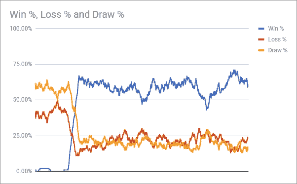
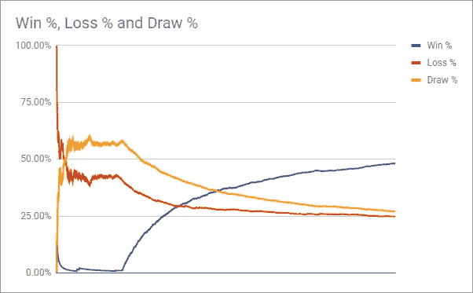

# 优化您的稀疏 PySC2 代理

> 原文：<https://itnext.io/refine-your-sparse-pysc2-agent-a3feb189bc68?source=collection_archive---------4----------------------->



> [点击这里在 LinkedIn 上分享这篇文章](https://www.linkedin.com/cws/share?url=https%3A%2F%2Fitnext.io%2Frefine-your-sparse-pysc2-agent-a3feb189bc68%3Futm_source%3Dmedium_sharelink%26utm_medium%3Dsocial%26utm_campaign%3Dbuffer)

在我的[上一篇教程](https://medium.com/@skjb/build-a-sparse-reward-pysc2-agent-a44e94ba5255)中，我展示了如何构建一个从稀疏回报中学习的 PySC2 代理。该代理能够赢得大约 25%的时间，但会失去几乎 50%的时间。

在本教程中，我们将建立在以前的代理，但一些小的变化，我们将能够提高胜率超过 70%。

# 1.状态不变时忽略学习

在处理之前的代理时，我将 Q 表数据输出到一个 CSV:

当代理学习时，我刷新了 CSV，并提出了一些关于如何改进的理论。我注意到的第一件事是，因为我的状态非常简单，所以代理采取一个动作并返回到相同的状态是很常见的。每当代理人从一个状态前进到下一个状态时，它会获得该状态的最大折扣奖励。在这种状态下，该行为的价值会向奖励方向移动一点。

虽然当一个动作将代理从一个状态移动到下一个状态时，这通常不是一个大问题，但是当它频繁地停留在同一个状态时，它倾向于将价值较低的动作向上推到价值最高的动作，而价值最高的动作被向下推。随着时间的推移，如果他们更频繁地停留在同一个状态，而不是另一个明显不同的状态，所有的回报将接近零。

为了解决这个问题，我们可以简单地阻止代理在动作没有改变状态的任何时候学习。代码非常简单，只需在`QLearningTable`的`learn()`方法的开头添加两行:

当状态相同时，这将立即中止学习步骤。

# 2.防止无效操作

在观察代理时，我注意到有几次它会被发现重复尝试无效的动作。通常可用动作的数量是可能动作的一半，所以代理花费时间试图从不会产生结果的动作中学习。

通过过滤这些无效的动作，我们可以让代理专注于尝试应该导致状态改变的动作，减少探索并改进学习时间。

首先我们修改`QLearningTable`的构造函数:

在最后一行，我们创建了一个不允许操作的列表。

然后，在`choose_action()`方法中，我们接受给定状态的无效动作列表:

然后，我们从可能的选项中筛选出这些操作，这样代理就不会采取无效的操作:

然后我们做了一个非常重要的改变。因为无效的行为永远不会被选择，它们的回报永远不会改变。如果它们从 0 开始，那么它们可能成为该状态的最高值动作，如果所有其他动作具有负值的话。为了解决这个问题，我们在`learn()`方法中从未来状态的奖励中过滤出无效的行为:

接下来，我们要建立一个无效动作的列表。在代理的`step()`方法中，收集一些我们将用于决策的数据:

现在我们开始排除动作。首先，如果我们已经达到了 2 个补给站的限制，或者我们没有工人来建造补给站，让我们取消代理建造补给站的能力:

如果我们没有补给站，或者我们已经达到了 2 个兵营的上限，或者我们没有建造兵营的工人，我们就不要让代理建造兵营了:

如果我们没有任何兵营或者我们已经达到了我们的供应极限，我们不想训练海军陆战队:

最后，如果我们没有海军陆战队，我们不想攻击任何东西:

现在我们有了无效操作的列表，我们可以在选择操作时输入它:

# 3.将我们的单位位置添加到州

这一个不是数据驱动的，而是一个理论。如果我们的代理不知道它的单位在哪里，它怎么知道哪个位置可能是最好的攻击？

将我们的单元位置添加到州非常简单，首先我们将州的大小增加到 12:

接下来，我们使用相同的逻辑来识别敌人的位置，除了我们为我们的单位过滤小地图:

和敌人的位置一样，这将把小地图分成 4 份，任何包含友军单位的象限的值都设置为 1。

# 4.试试看！

来吧，试一试:

```
python -m pysc2.bin.agent \
--map Simple64 \
--agent refined_agent.SparseAgent \
--agent_race T \
--max_agent_steps 0 \
--norender
```

信不信由你，我的经纪人在仅仅 512 场比赛后就取得了 67%的胜率(平均过去 100 场比赛的胜率)。1965 年游戏达到了 71%,但你可以从本文开头的图表中看到，它在大部分时间里都做得很好。前一个代理人的峰值为 59%。

这里有一个图表与之前的代理进行比较，显示了一段时间而不是过去 100 场比赛的胜率:



如你所见，胜率仍呈上升趋势。

本教程的所有代码都可以在[这里](https://github.com/skjb/pysc2-tutorial/tree/master/Refining%20the%20Sparse%20Reward%20Agent)找到。

如果你喜欢这个教程，请在 [Patreon](https://www.patreon.com/skjb) 上支持我。也请和我一起上[不和谐](https://discord.gg/qTZ65sh)，或者关注我上 [Twitch](https://www.twitch.tv/skjb) 、 [Medium](https://medium.com/@skjb) 、 [GitHub](https://github.com/skjb) 、 [Twitter](https://twitter.com/theskjb) 和 [YouTube](https://www.youtube.com/channel/UCZcEvhpV4_6llcrWrWQ2wsg) 。