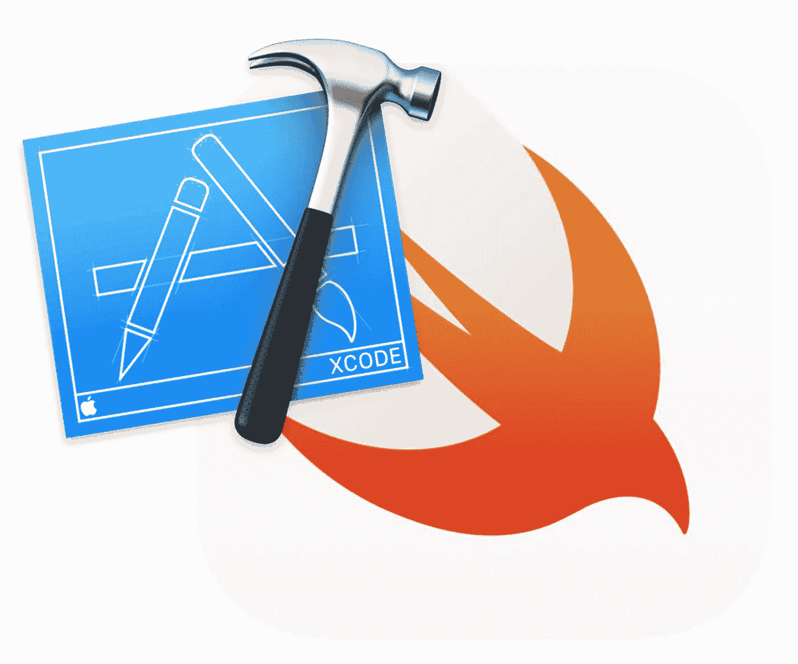
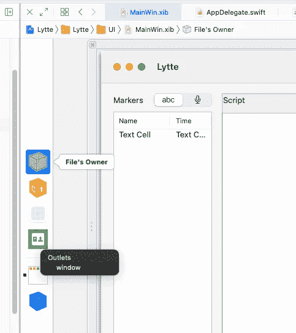
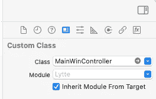
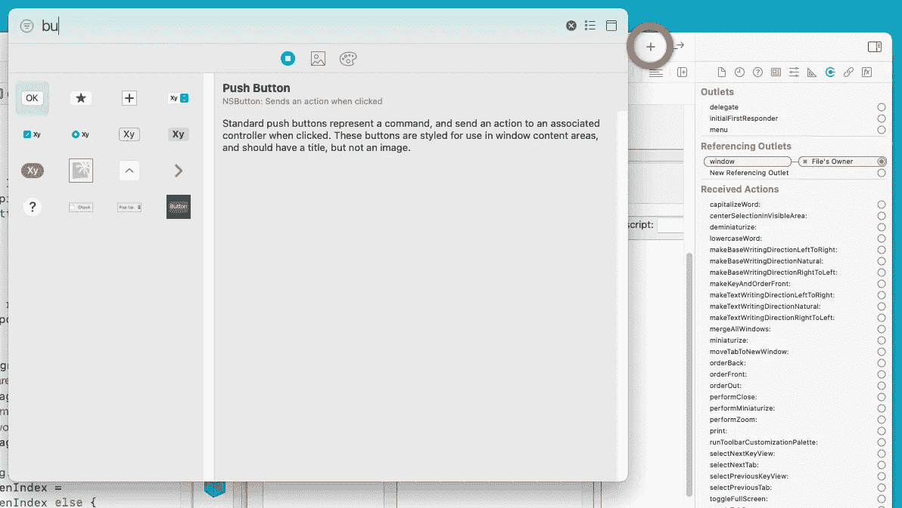
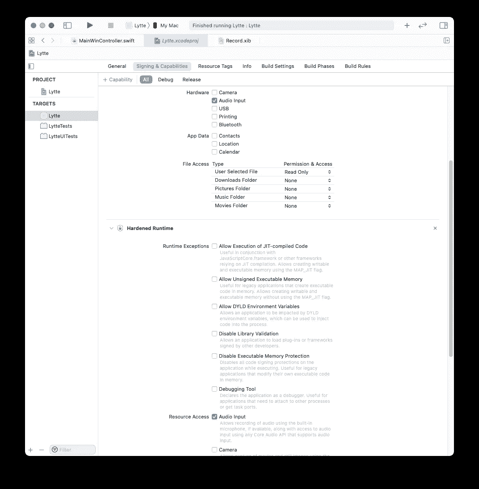
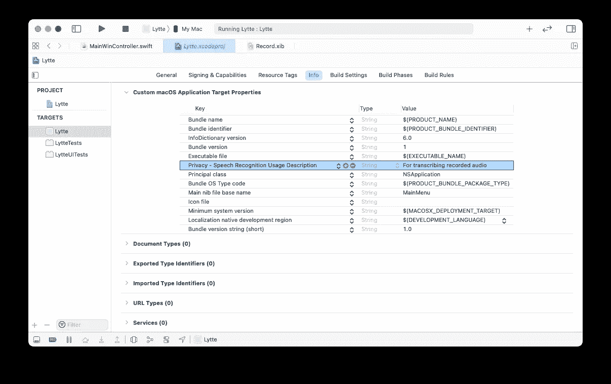
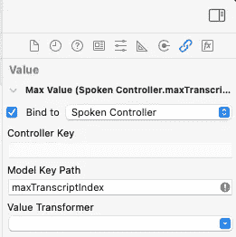
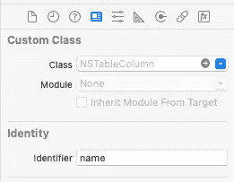

# 刷新您的 Swift 和 Cocoa 编程技能

> 原文：<https://itnext.io/refreshing-your-swift-and-cocoa-programming-skills-f80b041fd24a?source=collection_archive---------1----------------------->

## 远离了 Cocoa 和 Swift 编程，感觉自己忘记了很多细节？这是 Swift 5 和 Xcode 12 的复习资料。



他的故事不会试图教你斯威夫特或可可。取而代之的假设是，你在某个时候知道这两者，但只是忘记了一大堆东西。

这是试图涵盖最容易忘记的东西。以下是我将涉及的主题:

*   **XIB 的出路和陷阱**——使用`.xib`文件设计用户界面时，很容易忘记东西。尤其是忘记连接正确的插座。
*   **添加 GUI 控件**——这看起来很可笑，但实际上我在 Xcode 12 中努力找出 GUI 控件的位置。
*   **功能和签名** —你可能会不明白为什么你的相机、视频或麦克风不工作。想知道你的代码有什么问题。但也许您只是忘记了在您的项目中启用使用这些设备的权限。
*   **Swift 中的错误处理** —虽然您知道基础知识，但可能很难记住最佳实践。我在这里告诉你怎么做。
*   **绑定**——一项真正强大的技术，但容易出错。我涵盖了一些常见的错误，并解释了这个概念。
*   willSet 和 didSet —你为什么需要这些？
*   字符串标识符的类型安全版本 —有像`NSUserInterfaceItemIdentifier`和`Notification.Name`这样的类型，它们实际上是字符串，但是可以用类型安全的方式处理。
*   **通知和通知中心** —在您的应用程序中发送和接收通知的目的和最佳实践。
*   **Swift 字符串混淆** —在 Swift 中使用字符串可能会造成混淆，尤其是索引访问。我澄清了这个谜。

# XIB 网点和陷阱

在 Xcode 中使用`.xib`文件时，您很容易忘记很多事情。文件的所有者是人们一直纠结的概念之一。

这里有一种方式来考虑它:想象你在内存中有一堆对象，它们被组合起来创建一个 GUI。然后这些对象被存储到磁盘上。那是你的`.xib`文件。当你加载`.xib`时，你把所有这些对象都带回内存。

您希望按钮被点击时发生一些事情，这意味着您希望您的一些代码运行。为了做到这一点，当我们使用界面设计器时，我们将 GUI 组件的动作连接到控制器对象中的方法。

当 Cocoa 框架从磁盘加载一个`.xib`文件时，它将与您的控制器对象建立这些连接。

## 连接文件所有者的窗口出口

记住将你的`NSWindowController`子类的`window`出口连接到你的实际窗口。



## 为什么我的出口和行动不起作用？

也许你忘记了将你的`.xib`文件的所有者设置为你的`NSWindowController`子类的名字。如果你不这样做，那么拖动出口和行动将无法正常工作。



在这个例子中，我的`.xib`文件由一个名为`MainWindowController`的控制器加载。当我忘记这样做的时候，我很紧张，试图找出为什么我的工具栏项目不起作用。为什么他们连接到[第一响应者](https://developer.apple.com/documentation/appkit/nswindow/1419440-firstresponder)而不是[文件的所有者](https://developer.apple.com/library/archive/documentation/Cocoa/Conceptual/LoadingResources/CocoaNibs/CocoaNibs.html)？当您没有正确连接到`IBAction`时，工具栏项目也不会被启用。

# 如何添加 GUI 控件？

令人惊讶的是，我在 Xcode 12 中很难搞清楚这一点，因为自从我上次使用 Xcode 以来，这已经发生了很大的变化。现在，GUI 控件来自一个弹出窗口，您可以通过单击 GUI 设计窗口右上角的加号按钮调出该窗口。



按下用橙色圈起来的加号按钮

# 功能—为什么我的麦克风不工作？

在我的应用程序中，我录制音频进行转录。为此，我使用了`AVAudioRecorder`类，代码如下所示:

```
let rec = try AVAudioRecorder(url: audioFile,
                         settings: settings)
var ok = rec.prepareToRecord()
if !ok {
    throw AudioError.unableToPrepareRecording
}

ok = rec.record()
if !ok {
    throw AudioError.failedToStartRecording
}
```

我不明白为什么这一直失败。`rec.record()`和`rec.prepareToRecord()`调用会失败，没有任何合理的消息(`AudioError`是我自己定制的错误类型)。

原因是我忘记了在我的应用程序的*签名&功能*设置中指定我的应用程序将会录制音频。什么！？



要启用录音，您需要选中两个蓝色框。

原因是苹果有安全意识，不会让你的 API 使用任何可能侵犯用户隐私的功能，除非事先明确宣布。这意味着您必须配置您的应用程序才能使用这些功能。不仅如此，你还必须提供一个用户可读的字符串来解释*为什么*你需要使用它。



例如，我在这里提供了文本，说明我正在使用录制的音频来提供转录服务。然而，举例来说，如果你下载了一个电子邮件应用程序，它开始使用你的摄像机，那么这将是非常可疑的。你会想知道为什么。因此，苹果公司将给出一个许可框，解释或为什么要求你许可使用这项功能。

我向你保证，这东西很容易忘记。我用不同的应用程序连续两次忘记这一点。每次我都浪费时间排除代码故障，而不是检查我的权限。不要和我犯同样的错误。

# 我忘记了错误是如何发生的！

Swift 中的错误可以是类，也可以是枚举。你可以谷歌一下这个。我将会给你一个快速和最实用的处理错误的方法。

您可以创建自己的自定义错误，如下所示:

```
enum AudioError: Error {
    case invalidFilePath(URL)
    case unableToPrepareRecording
}
```

您可以看到其中一个错误带有一个参数，即没有找到的文件路径的`URL`。

```
init(audioFile : URL) throws {
        guard audioFile.isFileURL else {
            throw AudioError.invalidFilePath(audioFile)
        }
        let player = try AVAudioPlayer(contentsOf: audioFile)
        var ok = player.prepareToPlay()
        if !ok {
            throw AudioError.unableToPreparePlaying
        }
```

您可以看到这个类的`init`函数标有`throws`。如果你在里面使用了`throw`关键字或者你的一个调用需要在前面有一个`try`，你就需要这个。`AVAudioPlayer(contentsOf: audioFile)`前面需要一个`try`，因为它是一个可能抛出错误的调用。

## 如何捕捉错误

早先的`init`是给`AudioPlayer`级的。为了能够捕捉错误，使用`do`和`catch`。Catch 自动给你一个名为`error`的错误对象，我们在这里使用它。

```
do {
    let audioDev = try AudioPlayer(audioFile: url)
    audioDev.player.delegate = self
} catch {
    NSAlert(error: error).runModal()
}
```

但是，您可以像这样明确地做:

```
catch let err {
    NSAlert(error: err).alert.runModal()
}
```

## 自定义错误消息

但是`NSAlert`面板如何知道要写出什么样的错误信息呢？它检查你的错误对象是否有一个可以询问的`errorDescription`属性。或者更具体地说，它检查您的`Error`对象是否实现了具有`errorDescription`属性的`LocalizedError`协议。在这种情况下我们当然不会。

但是在 Swift 中，我们可以为任何类添加协议遵守，甚至是使用类扩展的另一个库中的类:

```
extension AudioError : LocalizedError {
    var errorDescription: String? {
        switch self {
        case .invalidFilePath(let url):
            return "\(url.path) is not a valid path to an audio file"
        case .unableToPreparePlaying:
            return "Could not prepare the audio player for playing"
```

然而，在这种情况下，您并不一定需要使用类扩展，因为我们有`AudioError` enum 实现的源代码。

请注意，我没有使用`NSLocalString`，这将允许错误消息的本地化，是一个坏的 Cocoa 公民。

# 我的绑定不同步也不更新！

通过绑定，您可以将多个 GUI 控件连接到同一个变量，并让 Cocoa 自动同步它们。下图显示了我如何将一个`NSStepper`绑定到我的`SpokenController`对象中的一个值。



`NSStepper`控制器的`maxValue`绑定到`maxTranscriptIndex`

下面是容易出错的地方。为了使更新机制能够工作，您的变量需要用`@objc`和`dynamic`来修饰。这很容易出错，因为 Swift 在这方面已经做了很多改变。这是截至 2021 年的 Swift 5 的做法。

```
@objc dynamic var maxTranscriptIndex : Int = -1
```

需要`@objc`部分来使 setter 和 getter 函数对 Objective-C 可见，这是因为整个绑定系统都是用 Objective-C 代码编写的。或者说，它必须能够与 Objective-C 一起工作。

阅读更多: [objc vs 动态](https://swiftunboxed.com/interop/objc-dynamic/)

`dynamic`支持动态分派，这是动态语言和 Objective-C 中常见的。这是基于消息传递，而不是 C++风格的方法调用，后者要么直接跳转到地址，要么通过进入`vtable`的偏移量来找到函数指针。动态分派更加复杂，因为您实际上发送的是文本字符串的等价物，并且您使用该字符串在哈希表中查找正确的函数指针。

这显然要慢得多，但也灵活得多。这是绑定成为可能的首要原因。

# willSet 和 didSet 的目的是什么？

为什么不能只使用 setters 和 getters？实际上，在 Swift 代码中几乎不需要 setters 和 getters。也许有些 getters，但是 setters 很少。它们也更难使用，因为你需要指定一个私有变量，你可以从你的 setter 和 getter 中访问它。

然而，当变量发生变化时，需要进行某种更新是很常见的。这就是为什么`didSet`被如此频繁地使用。例如，这里每当我改变一个表中显示的值时，我就重新加载那个表。

```
var alignedDoc : AlignedDoc? {
    didSet {
        self.alignedWordsTable.reloadData()
    }
}
```

与 setters 相比有其他优势。它不会在初始化器中被调用，这是你通常不希望发生的事情。

请注意，`willSet`和`didSet`与绑定无关。您可能也不这么认为，但是由于某种原因，当我重新开始使用 Swift 和 Cocoa 编程时，我错误地记住了这一点。

# 如何处理 NSUserInterfaceItemIdentifier

当您处理`NSTableView`的数据源时，您必须实现这样的方法:

```
func tableView(_ tableView: NSTableView,
               objectValueFor column: NSTableColumn?,
               row: Int) -> Any? {
    guard let col = column else {
        return nil
    }

    switch col.identifier {
    case .name:
        return "hello Joe"
```

注意我在`switch`语句中使用的列标识符。这在用户界面中被指定为字符串。



然而，如果您查找`NSTableColumn`的`identifier`属性，您会看到它是这样定义的:

```
var identifier: NSUserInterfaceItemIdentifier
```

但这不是一个字符串。这是怎么回事，你是怎么处理的？嗯，您可以通过在代码中执行以下操作来解开字符串值:

```
switch col.identifier.rawValue {
case "name":
    return "hello Joe"
```

但这显然不是 Cocoa 和 Swift 的设计师想要你做的，否则他们不会用`NSUserInterfaceItemIdentifier`把字符串包起来。

这就是 Swift 和 Objective-C 扩展已经存在的类(甚至来自库)的能力发挥作用的地方。我们在`NSUserInterfaceItemIdentifier`上使用了一个类扩展:

```
extension NSUserInterfaceItemIdentifier {
    static let name = NSUserInterfaceItemIdentifier(rawValue: "name")
    static let time = NSUserInterfaceItemIdentifier(rawValue: "time")
}
```

这允许您在关于`NSUserInterfaceItemIdentifier`值的`switch`语句中写入`.name`和`.time`。可可中的许多地方都使用了这种模式。接下来我们将看到它的`NotificationCenter`和通知。

# 使用通知中心和方法选择器

有时 Cocoa 方法会将其他方法的名称作为参数。我们称之为选择器。选择器基本上是您发送给一个对象的消息，然后该对象选择正确的方法来执行。

假设我有一个这样的方法，我想调用它。

```
@objc func updateRecordingTable(notif: Notification) {

}
```

注意`@objc`插件——如果不将方法标记为`@objc`，就不能通过选择器调用方法。如何为这个方法编写选择器？

```
#selector(updateSpokenTextView(notif:))
```

您会看到命名参数只是被列出，而没有给出完整名称的实际参数。

## 注册和注销通知

是一种让你分离程序各部分的方法。例如，我的程序中有各种 GUI 元素，它们都修改和显示相同的数据对象。然而，我不想在这些类之间建立太多的指针，这样它们就互相知道了，因为这将会产生一堆依赖关系。这就是`NotificationCenter`帮助你的地方。如果你在一个地方做了修改，你可以通过通知把这个事实传播给程序的其他部分。程序的其他部分可以监听特定的通知，并根据它们进行更新。

下面是一个例子，说明如何在你的课堂上设置观察:

```
override init() {
    super.init()
    let center = NotificationCenter.default
    center.addObserver(self,
                       selector: #selector(updateSpokenTextView(notif:)),
                       name: .SpokenTextViewChanged,
                       object: nil)

    center.addObserver(self,
                       selector: #selector(updateRecordingTable(notif:)),
                       name: .RecordingTableChanged,
                       object: nil)
}

deinit {
    let center = NotificationCenter.default
    center.removeObserver(self)
}
```

请注意一旦对象死亡，取消注册的重要性。否则，通知中心将尝试向不再存在的对象发送消息。

您可以随意调用您的方法，只要它将单个`Notification`对象作为唯一的参数。因此`notif:`不是必需的名称。只是我给它的。

进一步注意`.SpokenTextViewChanged`和`.RecordingTableChanged`的使用，它们用于命名我们连接到方法调用的通知。其设置与`NSUserInterfaceItemIdentifier`的设置完全相同。这里 Cocoa 期望类型为`NSNotification.Name`的参数。我们可以扩展这个类:

```
extension Notification.Name {
    static let SpokenTextViewChanged = Notification.Name(rawValue: "SpokenTextViewChanged")
}
```

但是你可以把它分散在不同的文件中。因此，您可以将另一个通知名称放在另一个文件中:

```
extension Notification.Name {
    static let RecordingTableChanged = Notification.Name(rawValue: "RecordingTableChanged")
}
```

## 发送通知

那么我们如何发送通知呢？每当我更新特定表中的值时，我都调用这个方法:

```
func updateViews() {
    let center = NotificationCenter.default
    center.post(name: .RecordingTableChanged, 
                object: self)
}
```

# 向自定义对象添加基于索引的访问

在我的例子中，假设您有一个类`WrittenDoc`，并且您想要支持基于索引的访问，那么您可以编写类似`doc[4]`的东西来访问文档中的元素。下面是一个如何做到这一点的示例:

```
class WrittenDoc {
    var words : [WrittenWord]
    subscript(index: Int) -> WrittenWord {
        get {
            return self.words[index]
        }
        set {
            self.words[index] = newValue
        }
    }
}
```

注意`get`和`set`的使用，就像其他属性一样。`newValue`是一个神奇地存在于`set`中的值，它代表你试图赋值的值。

# 理解字符串

Swift 中字符串的工作方式是我最不喜欢的事情之一。但是比处理它们更糟糕的是，许多人不明白为什么 string 接口如此奇怪。理解这一点很重要，这样你就不会走愚蠢的捷径。有很多人给`String`类添加了类扩展，这使得他们可以基于整数访问字符。

```
let s = "hello world"
s[6] // This is what people want to get to the 'w' char
```

抵制诱惑。In 可能会使您的代码看起来更整洁、更简洁，但它也制造了一个定时炸弹。你看，Swift 字符串的行为几乎有点像链表。到达第 5 个字符需要遍历 5 个元素，除非已经有一个指向该字符的字符串迭代器。因此，如果你使用基于整数的索引访问，你将在你的代码中结束大量的`O(n)`操作，而不是人们习惯的字符串访问的`O(1)`。

因此，只要有字符串迭代器，就保留它们是很重要的，因为它们为它们所指向的元素提供了`O(1)`(常量)访问时间。相反，基于整数索引的访问总是以`O(n)`结束。

这就是你如何得到，比如说，`s`字符串中的第 6 个字符。

```
let s = "hello world"
let i = s.index(s.startIndex, offsetBy: 6)
s[i] // Access 'w' at 6th character
```

虽然这看起来很麻烦，但它允许您更有效地使用字符串。下面是一个`O(1)`操作:

```
let j = s.index(after: i)
s[j]
```

如果你专门处理整数，那么`s[i+1]`就是一个`O(n)`操作。

## 但是为什么在其他语言中却不是这样呢？

我另外两个喜欢的语言，Julia 和 Go，不是这样的。您可以直接使用整数索引。但这意味着你可能会不小心做一些违法的事情。下面是朱莉娅·REPL 尝试获取 unicode 字符串中的第 5 个(“v”)字符的示例:

```
julia> s = "Þrúðvangar"
"Þrúðvangar"

julia> s[5]
ERROR: StringIndexError: invalid index [5], valid nearby indices [4]=>'ú', [6]=>'ð
```

在 Swift 中，你不能导致这样的非法访问。

```
let s = "Þrúðvangar"
let i = s.index(s.startIndex, offsetBy: 4)
s[i]
```

现在，许多其他语言(如 Python)没有这样的问题，但他们通过将每个字符存储为 32 位元素来解决这个问题，这意味着平均而言，文本占用的空间是 Swift、Julia 或 Go 的 4 倍。这可能会降低性能敏感的面向字符串的应用程序的性能。对于主要卖点是便利性而非性能的 Python 来说，这可能无关紧要。

然而，Swift、Go 和 Julia 都以高性能为目标，因此需要紧凑的字符串表示。

## 从字符串转换。整数索引

在 Cocoa 中，并不是所有的 API 都适用于`String.Index`类型。如果你使用`NSAttributedString`，你必须使用字符的整数索引。因此，我们需要一种在整数和`String.Index`索引之间来回转换的方法。

```
let i : String.Index = s.index(s.startIndex, offsetBy: 6)
let j : Int = s.distance(from: s.startIndex, to: i)
```

在这种情况下，`j`将是一个整数索引，您可以将它与`NSRange`一起使用，这也是您与`NSAttributedString`一起使用的内容。