# /Reg(ular)？？xp(res{2}ion)？s/

> 原文：<https://itnext.io/regular-expressions-1580bbb26319?source=collection_archive---------5----------------------->


读取文件的最后一行？没错。
统计给定单词在文本中的使用情况？检查。
[验证用户输入](/what-is-valuer-2a73a685864)？一直都是！

这些是我们作为软件工程师经常遇到的任务。很有可能，你已经在某个时候遇到过他们中的一个。但是有一点*使它们彼此非常相似——在大多数情况下，用正则表达式处理它们会更好。*

我知道，我知道，正则表达式有不必要地过于复杂的名声。这篇文章的目的就是要告诉你，这只是一种偏见，与事实相去甚远。我相信正则表达式的真正力量，一旦拥有，将会给你以前无法想象的对工作质量和数量的控制。


**专业提示**:如果你对 regexps 的可伸缩性不满意(我想每个人都是)，试试[reScaled](https://www.npmjs.com/package/re-scaled)——从可重用原子无缝构建正则表达式的工具。

## 基本语法

让我们重温一下您可能已经熟悉的基础知识。Regexps(“正则表达式”的简称)最初是作为(并且仍然被用作)字符串的泛化工具而创建的，有点像字符串的模式。程序的逻辑直接取决于给定的字符串*是否与模式*匹配。

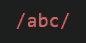

这是一个正则表达式

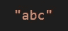

这是一个原始字符串

正则表达式在许多方面与字符串相似。就像字符串包含在两个`"`引号中一样，正则表达式包含在两个`/`斜杠中。就像字符串一样，一些字符需要用一个`\`反斜杠进行转义，以便恰当地用作正则表达式的一部分。

> 我更喜欢使用“regexp”而不是“regex ”,因为 JavaScript 通过`*RegExp*`构造函数的名称建议使用第一个。

除了少数特殊字符(稍后将详细介绍)，regexp 主体包含的大部分内容都是字面匹配的。这意味着这个正则表达式`/abc/`只匹配字符串`"abc"`，而不匹配“ab”、“bc”、“Abc”、“abbc”、“xyz”或其他任何字符串。

```
/abc/.test("abc"); // true
/abc/.test("xyz"); // false
```

但是如果文本是预先知道的，你就不需要正则表达式，只需要使用字符串本身。为了做有用的工作，你需要更多的东西，比如…

## 量词

这些家伙处理重复。比如说，如果你不确定这个模式在一个给定的字符串中会出现多少次，它们会帮助你。或者相反——你知道这个数字在这里重复了 16 次，不多也不少。诸如此类的事情。

在 regexp 语法中，有三种基本量词:

*   可选发生(0 或 1 次)；
*   明确出现(1 次或多次)；
*   不明确的发生(0 次或更多次)；

> 尽管这些术语并不真实。

使用`?`表示选择性，`+`表示确定性，`*`(星号)表示模糊性。

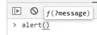

“消息”参数前的问号表示它是可选的

我发现这些汉字很容易记住。`?`是一个**是/否问题**。此外，许多编程语言使用问号来表示可选参数。


2009 年 6 月前的 PEGI 18 图标

`+`常用在类似“18+”的文字中，意思是你必须年满 **18 岁以上**才能看电影/玩游戏/访问网站。

> 这里需要注意的是`*+*`与数学无关。regexp `*/18+/*`既不匹配“19”也不匹配“20”，但它匹配`*"188"*`和`*"1888"*`。

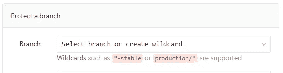

[GitLab.com](https://gitlab.com/parzh/re-scaled)的接口允许使用通配符保护多个分支

最后，`*`可以被认为是一个占位符。如果你想一想，零次或多次真的是**任何** 次的量。事实上,[经常被](https://en.wikipedia.org/wiki/Wildcard_character)用来说“什么都行”

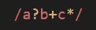

带量词的正则解释

如果我们将 regexp 从`/abc/`改为`/a?b+c*/`，它会更加强大。现在它还匹配类似`"abc"`、`"bc"`、`"ab"`、`"bbbb"`、`"bcccccc"`等字符串。但是它不会与“aabc”匹配，因为`?`最多取字符“a”*的一个* *出现*。此外，正则表达式与字符串“ac”不匹配，因为`+`期望“b”在*至少出现一次*。

> [试试看](https://regex101.com/r/xWJHlS/1)。

量词的用途可能更广。使用*自定义量词*，可以使用类似“精确地 *x* 次”、“至少 *x* 次”或“在 *x* 和 *y* 次之间”的公式来量化材料。在下面的例子中，我们精确地匹配五个“a ”,然后是至少六个“b ”,最后是七到十二个“c”。

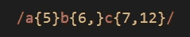

带有各种自定义量词的正则表达式示例

> 请注意，逗号周围没有空格。加空格会让它不再是量词。
> 
> [试试看](https://regex101.com/r/xWJHlS/2)。

正确量化字符串的各个部分是正则表达式中要做的最重要的事情之一。此外，您已经可以看到 regexps 是一种文本模板，限制或多样化了可接受的变体。

## 组

你可能已经注意到了，我们说的是人物。但是文字呢，我们能量化吗？例如，有没有可能使用 regexps 说出这样的话:*“在这一点上，可能有也可能没有这个单词*？嗯，单词只是有序的字符组(“有序”在这里很重要)，所以我们只需要将它们组合在一起。为此，我们非常直观地使用括号`()`。

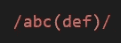

带组的正则表达式

通过创建一个组，我们就创建了一个标记，所以从现在开始，它几乎可以被当作是一个单独的字符。例如，通过量化`/hello( world)?/` regexp 中的组，我们说我们接受`"hello"`和`"hello world"`字符串— *，不管有没有第二个单词*。

> 注意，如果没有单词，它前面就没有空格。这就是为什么空间也必须包含在组中的原因。如果没有这个，字符串`*"hello "*`将被接受，这是不好的，因为文本不应该以空格结尾。
> 
> [试试看](https://regex101.com/r/TtvQKl/1)。

分组还允许我们用`|`(竖线)字符做出复杂的“非此即彼”逻辑。假设我们邀请了托尼和霍华德·史塔克，著名的钢铁侠和他的父亲来我们的后院聚会。他们所要做的就是在一个特殊的数字板上输入他们的全名，这个数字板必须被配置成只有“托尼·斯塔克”和“霍华德·史塔克”的名字才被认为是有效的。

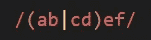

带交替的正则表达式

因为我们只有两个名字，而且它们之间有细微的差别，所以我们可以使用一个简单的 regexp，而不是一个允许的名字列表。它们都以“Stark”结尾，这使得很容易将其余部分提取到有效名字的子模式中:`/(Tony|Howard) Stark/`

现在，如果艾德·史塔克偷偷输入他的名字，他将很快被踢出我们的派对。

> [试试看](https://regex101.com/r/TtvQKl/2)。

## 字符集

好了，让我们回到单个角色。

使用`|`垂直线来改变单词中不同字母的用法似乎是合理的，例如，接受“-ize/-ise”单词的两种拼写。在这里，你可能会决定像这样使用垂直线:`/utili(z|s)e/`，但是…虽然这有点好，它确实工作，但你仍然可以做得更好。

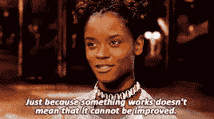

我最喜欢的一句话

另一组允许您对字符进行分组的方括号是一组两个方括号`[]`。

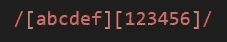

带有两个结果字符集的 Regexp

方括号组成一个无序的集合，执行“其中之一”的逻辑。这意味着我们可以创建一个两个字符的小集合`[zs]`，让正则表达式机器为我们做繁重的工作，而不是明确地说“尝试`z`，如果失败，那么尝试`s`”。后者也更加优化，它产生的 regexp 看起来更干净，读起来更容易:`/utili[zs]e/`。

出于我认为显而易见的原因，如果你不想让字符匹配，你不需要把它们放到集合中。同样，将一个角色放在这样的集合中两次是没有用的。

> [试试看。](https://regex101.com/r/vXebzh/1)

## 范围

但是有时你需要更多的灵活性。如果你期望的不是两个而是一大堆相关角色中的一个，那么在创建一个集合的时候把它们都一一列出来岂不是很繁琐？当然会。这就是为什么正则表达式还有另一个经常使用的特性——范围。

在 [Unicode 表](https://unicode-table.com/en/)中，每个字符都与一个特定的数字相关联，你越“向右”或“向下”，该数字的值就越高——简单地说，从一个字符到另一个字符，它增加 1。这允许通过范围定位一组随后放置的字符。

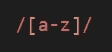

带字符范围的正则表达式

使用`-`连字符定义范围，这也非常直观。这也很简单:您只需在两个字符之间放置连字符，这两个字符都将包含在范围中。就像正则表达式`[3-8]`里一样。因为 Unicode 表中的数字从“0”到“9”放置，所以这个 regexp 匹配“3”和“8”之间的任何数字。

> 对比一下`*[345678]*`和`*(3|4|5|6|7|8)*`。如此简洁，难道不是 it‽吗

范围也很有用，因为它们可以无缝合并。您可以使用多个相邻的范围来扩大该角色的选项。

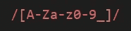

所有字母数字字符集

例如，一个字母数字字符可以表示为`[A-Za-z0-9_]`，它的正则表达式为:“大写或小写字母、数字或下划线字符。”仅供参考，这就是字母数字字符。

不过，这里有一些不太直观的小问题:

*   必须从头到尾指定范围边界，例如从“a”到“z”，而不是相反；
*   您必须格外小心地将连字符本身包含在集合中；
*   连字符仅当放在`[]`方括号内时定义范围；在它们之外，它被匹配成一个连字符(咄！).

> [试试看。](https://regex101.com/r/6H5VAX/1)

## 元字符

如果是哪个字符不重要，只要是字母就行呢？如何匹配*任意一个*字母*恰好一次*？或者任何数字？当然，你可以使用一个范围，但是只说“字母”或“数字”而不用范围之类的不是很好吗？

是的，没错。因为有元字符。

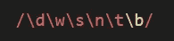

元字符

元字符有很多，在我看来最有用的是`\d`(代表“数字”)、`\w`(代表“单词”)、`\s`(代表“空格”)和`\n`(代表“新行”)。注意，它们前面都有一个反斜杠——这是它们成为*元*字符的原因。

一些元字符可以替换为范围，以准确演示它们的作用:

*   `\d`意为“数字”，所以和`[0-9]`简单相同。
*   `\w`尽管显而易见，但并不匹配单词，而是像单词一样的字母数字字符(是的，就是本文前面的那些家伙)，它可以安全地替换为`[A-Za-z0-9_]`(但是为什么要这样做呢？).注意`\d`是`\w`的子集。
*   `\s`是空白字符的一种非常方便的表示方式——比如实际的空格、制表符、换行符和许多其他字符。事实上，它封装了不可显示的字符，所以相应的范围看起来有点乱:`[ \f\n\r\t\v​\u00A0\u1680​\u180e\u2000​\u2001\u2002​\u2003\u2004​\u2005\u2006​\u2007\u2008​\u2009\u200a​\u2028\u2029​\u202f\u205f​\u3000]`给你，现在记住它😜

其他元字符通常是做某事的唯一方式:

*   `\n`不是一个范围，而是一个单独的字符([换行符](https://unicode-table.com/en/000A/))，虽然经常使用——以至于它有一个单独的元字符。另外，值得注意的是`\s`包含了`\n`，因此写类似`/[\s\n]/`的东西是没有用的。
*   `\b`(对于“边界”)是一个元字符，用于匹配单词开始和结束的位置(对于“单词”，我指的是字母数字字符组)。看，表中连这样一个人物都没有！

概括地说，元字符是有用的，因为它们是流行用例的简短缩写； *b)* 包含大量信息，否则(如果“否则”存在)用非常冗长的方式表达； *c)* 是可读性的超级明星。

> [试试看](https://regex101.com/r/jFwFme/1)。

## 特殊字符

在整篇文章中，您可能已经注意到正则表达式以特殊的方式处理一些字符——比如使用`|`、`?`、`+`、`*`、`\`、方括号和圆括号。不出意外，这些人物被称为*特型*。它们用各种有用的特性丰富了 regexps 但还是没有那么多。除了我们已经很熟悉的，还有`^`(扬抑符)`$`(美元符号)`.`(点)。

前两个经常一起使用，因为它们是互补的:`^`匹配字符串的开头，`$`匹配它的结尾。当您必须将*开始*或*结束*的文本与给定模式匹配时，这非常有用；或者确保整个*字符串遵守该模式，而不仅仅是其中的一部分。*

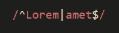

这个正则表达式匹配以“Lorem…”开头或以“…amet”结尾的字符串

最后，`.`点是一个“包罗万象”的家伙，所以它匹配任何其他字符，包括点本身。如果您将它与`*`量词结合使用，您将表达“任何数量的任何东西”逻辑——当您不知道或不真正关心输入的这一特定部分时。

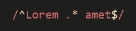

这个正则表达式匹配一个以“Lorem”开头、以“amet”结尾的字符串，可能还有介于两者之间的内容

> 重要的一点是，默认情况下，`*.*`与`*\n*`新行字符不匹配，所以您必须有点创意才能将其包含在“任何东西”组中。

根据定义，特殊字符与它们本身并不完全匹配。你已经可以看到这可能是一个问题——也就是说，当他们必须逐字匹配时，当然。在这种情况下，你应该能够以某种方式“关闭”他们的特殊性。

你猜怎么着，你不需要任何超级特别的角色来做到这一点(还有另一个超级特别的角色来匹配这一个，等等)，不。这实际上很糟糕！相反，你只需使用`\`反斜杠。把它想象成一个“恢复”其病人特殊性的字符:`d`字面上是“d”字符，但`\d`是一个数字；`s`字面上只匹配自身，但是`\s`代表类似空格的字符。而与此同时，`?`在它之前做了一个量化东西的特殊功能，但是`\?`只是一个问号。你明白了。

正如你所看到的，`\`反斜杠表现出特殊的行为，因此它也是一个特殊的字符。现在，您认为如何匹配输入字符串中的反斜杠本身？想一想。正如我之前说过的，你不需要任何花哨的字符…没错，你只需要再次使用反斜杠！

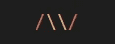

单个反斜杠的正则表达式

下面“尝试一下”一节中的正则表达式旨在匹配以问号结尾的句子(即问题)。

> [试试看。](https://regex101.com/r/FGbX9s/1)

# 例子

这些是 20%的正则表达式，为了从中挤出 80%的汁液，你必须知道它们。其余的将在本文后面介绍，但是现在，让我们从真实世界的用例中获得一些乐趣。

在我们开始之前，我想强调重要的一点:

> 编写正则表达式从定义理想值的模型开始——模型越精确，产生的正则表达式就越好。
> 
> 和任何模型一样，没有完美的模型。

现在，看例子！

## 验证用户的全名

在很多应用程序中，我们相信用户会填写他们的全名。但并不是每个用户都值得信任，所以我们必须考虑恶意输入，并防止这些输入被提交。

换句话说，我们必须验证用户的全名。

大多数情况下，全名由两部分组成:名和姓。

> 当然，用户的全名并不总是由两部分组成。比如我自己的全名也包括父名。但是让我们保持简单。

包含人名的理想文本应该遵守以下规则:

*   它包含两个单词，中间用空格隔开；
*   两部分至少有一个字符长；
*   每个部分以大写字母开始，以小写字母结尾。

我想，我们现在已经准备好构建模式了:

```
/[A-Z][a-z]* [A-Z][a-z]*/
```

> 因为全名的两部分有相似的规则，所以模式变得非常重复。我为这个问题创造了一个解决方案。

这里我们使用了`[A-Z]`和`[a-z]`范围，而不是`\w`，因为后者也允许数字和下划线字符，我们知道这些不能是名称的一部分。而且，我们的选择更加精确，这总是好的。

> [试试看。](https://regex101.com/r/05LiGG/1)

## 定位 Vue 组件使用

[Visual Studio 代码](https://code.visualstudio.com/)是目前最流行的 ide 之一。而 [Vue.js](https://vuejs.org/) 是最流行的前端框架之一。因此，让我们试着在用这些工具编写的应用程序中找到任意`<base-input>`组件的所有实例。

Vue 允许 PascalCase 和 kebab-case 引用组件，所以我们必须考虑这一点。让我们也考虑骆驼案，只是为了 lulzies。

现在，打开左边的搜索面板(或者按 Ctrl+Shift+F)，找到最上面的文本输入，打开 regexp 模式(或者尝试 Alt+R)。现在，我们可以通过一种模式找到组件引用:

```
<[Bb]ase(-i|I)nput\b
```

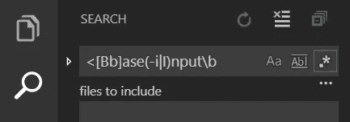

它应该是这样的

这个神奇的模式将为我们找到`<BaseInput>`和`<base-input>`的用法，以及`<baseInput>`的变体——它们都有或没有属性。此外，请注意，该模式与“< base-Input >”变量(大写的“I”)不匹配，因为这两种情况都不理想。

## 在 JSON 中查找尾随逗号

这个例子的灵感来自于[我在 StackOverflow 给出的这个答案](https://stackoverflow.com/a/34347475/4554883)。OP 努力处理错误的 JSON 输出，并希望去掉响应中的尾随逗号。

一个可能的解决方案是找到所有逗号后面的任何一种右括号。这是迄今为止最简单的方法，然而它有一些小的复杂性:

*   右括号`]`和`}`都类似于 regexp 的特殊字符，所以都要转义；
*   右括号可以放在未知数量的空格、制表符和新行之后；
*   右括号本身以及前面的空格不应该包含在 regexp 的输出中(即匹配)，这样我们就不会意外删除它。

第一个很猥琐，但是第二个呢？听起来耳熟吗？是的，这就是`*`量词最适合的地方:“零个或多个空白字符”与`\s*`相同。

第三个是新的东西——我们还不知道如何在不匹配的情况下检查某些东西。所以，让我简单介绍一下`(?=…)`一类的群体。它被称为“积极的前瞻”，它正是我们所需要的:它表达了“随后”的逻辑，但从最终匹配中丢弃了自身的内容。

此外，我们必须使用`g`(代表“全局”)标志来表明我们期望一个模式在整个输入中出现几次。

> 到目前为止，`*g*`旗帜是所有旗帜中最受欢迎的，所以我将在本文的下一部分提到它们。就跟我裸聊一会儿。

所有这些都包含在下面的 regexp 中:

```
/,(?=\s*[\}\]])/g
```

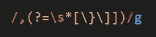

丰富多彩！

作为字符串的`[.replace(…)](https://developer.mozilla.org/en-US/docs/Web/JavaScript/Reference/Global_Objects/String/replace)`方法的第一个参数，这个 regexp 将允许把所有找到的内容更改为其他内容；那么用空字符串代替它们怎么样？

> [试试看。](https://regex101.com/r/HW7DFe/2)

# 其余的

如果您按照本文的内容完整地到达了这里，那么我认为可以肯定地说，您了解正则表达式，并且能够充分利用它们。希望你能把它们介绍给自己，并在整个开发过程中使用它们(比如，在项目中寻找代码片段时)。

正如我之前提到的，这里并没有提到和描述每一个特性。如果你想增长你的知识，增强你的技能，考虑阅读以下主题:

*   [急切而懒惰的量词](https://javascript.info/regexp-greedy-and-lazy)变体；
*   [旗帜](https://developer.mozilla.org/en-US/docs/Web/JavaScript/Reference/Global_Objects/RegExp#Parameters)；我们之前用过“g”；另一个常用的标志是“我”；
*   [非捕获组](https://stackoverflow.com/questions/3512471/what-is-a-non-capturing-group-what-does-do) `/(?:…)/`(有时)比正常组好；
*   [被否定的集合](https://stackoverflow.com/questions/1763071/negate-characters-in-regular-expression) `/[^…]/`匹配除之外的任何东西*；*
*   " [lookarounds](https://javascript.info/regexp-lookahead-lookbehind) " —全部四个，包括正向前瞻；
*   [元字符的对立面](https://stackoverflow.com/a/19011185/4554883)——我喜欢称它们为*反元字符*😈，—如大写的`\W`、`\D`等；

此外，知道什么时候*而不是*使用正则表达式，或者在使用时小心谨慎，总是很有用的:

*   避免陷入[灾难性的回溯](https://www.google.com/search?q=catastrophic+backtracking)；
*   非 ASCII 字符的范围可能不包括您认为的内容；
*   [你不应该用正则表达式](https://stackoverflow.com/a/1732454/4554883)解析 HTML

# 页（page 的缩写）南

非常感谢你能看到文章的结尾！你把整本书都看完了，真是太酷了！🎉🎊🎈🙏

我试图让它节奏适中，易于理解。如果你觉得有帮助，考虑给一些掌声(也许几下？也许 50？有人吗？).如果你想读更多我的东西，请通过电子邮件或在下面的相应部分留下评论来联系我。

此外，不要忘记看看[重新调整的](https://www.npmjs.com/package/re-scaled) npm 包。它有许多有用的实用函数，通过定义和重用更小的原子正则表达式，这些函数将使编写复杂的正则表达式变得更加容易。