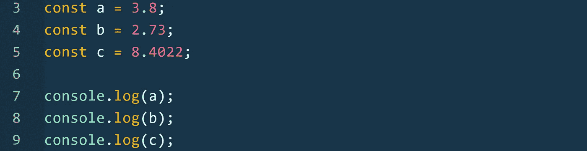
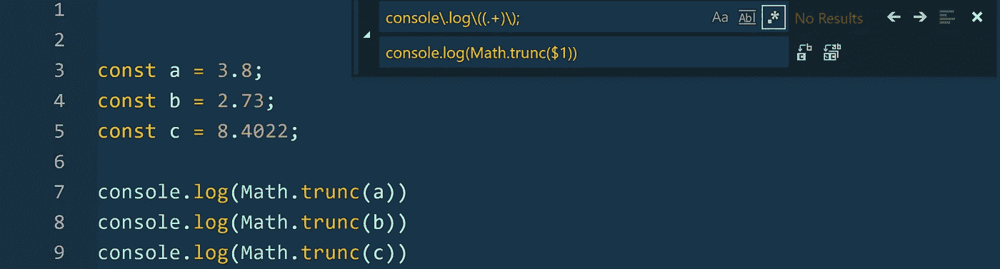
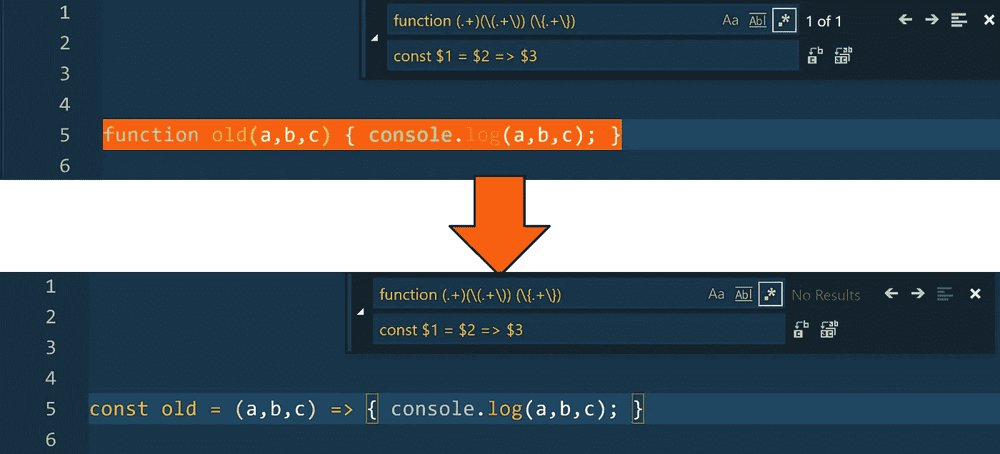

# 正则表达式:你应该知道的技巧

> 原文：<https://itnext.io/regular-expressions-tricks-you-should-know-2976c7bd1be3?source=collection_archive---------2----------------------->

照片由 [Alekzan Powell](https://unsplash.com/@alekzanpowell?utm_source=medium&utm_medium=referral) 在 [Unsplash](https://unsplash.com?utm_source=medium&utm_medium=referral) 上拍摄

这周我一直在使用正则表达式，我想和你们分享一些我一年来学到的非常有用的技巧。

我绝对相信正则表达式应该在任何计算机科学课程的一开始就教授，而不是过多地关注数学自动机。

这将节省 StackOverflow 上的大量空间，并极大地节省您的大量时间。

我们将一起探索这几个主题(用 Javascript):

*   **输入验证**
*   **在代码编辑器中智能查找&替换**
*   **真实用例**

到本文结束时，你将能够像使用条件语句一样流畅地使用正则表达式。这会节省你的时间。

> 请注意，正则表达式几乎与语言无关，因此无论您使用哪种编程语言，都可以使用它们。

时间就是金钱，孩子们

# 重要的事情先来！

如果您已经熟悉正则表达式，请跳过这一部分。

*   正则表达式的结构是这样的:`/expression/flag`
*   最常见的旗帜:
    `- i : case insensitive`
    `- g : global (doesn't stop after first match)
    - m : multi-line`
*   最常见的主播:
    `- ^ : Start of string
    - $ : End of string
    - \A : Start of string (not affected by multi-line content)
    - \Z : End of string (not affected by multi-line content)`
*   最常见的量词:`- {n} : Exactly n times
    - {n,} : At least n times
    - {m,n} : Between m and n times
    - ? : Zero or one time
    - + : One or more times
    - * : Zero, one or more times`
*   最常见的元序列:
    `- . : Any character but \n and \r
    - \w | \W : Any word character | Any non-word character
    - \d | \D : Any digit character | Any non-digit character
    - \s | \S : Any whitespace character | Any non-whitespace character`
*   字符集:`— [abc] : Will match either a, b or c
    - [1-9] : Will match any digit from 1 to 9
    - [a-zA-Z] : Will match any letter`
*   匹配除
    和`- [^abc] : Matches anything but a, b or c`以外的任何字符
*   转义符:
    `- \character (example : escaping + => \+)`
*   引用一个组(也用于捕捉组，进一步查看):
    `— (group of characters) (example : /(he)+/ will match 'hehehe'`
*   一组还是另一组:
    `- | : /^h((ello)|(ola))$/ will match both 'hello' and 'hola'`

# 输入验证

在 Javascript 中，您可以使用`test`检查字符串是否匹配正则表达式:

**例如，让我们检查一个字符串是否是一个电话号码**

> *我们将与法国合作，但你可以自由选择最符合你需求的。*

法国电话号码有两种常见格式:

*   +33 6 68 56 23 05
*   06 68 56 23 05

我们将构建一个正则表达式来匹配这两者！☎️

我们有两个可能的开端:

*   +33 6:与`(\+33 \d)`匹配
*   06:与`(0\d)`匹配
*   通过`OR`运算符组合:`|`

后面是 4 对数字，用空格隔开:
`( \d{2}){4}`

用正则表达式实现输入验证有无数种方法。在我们的场景中，我们可以选择使用连字符而不是空格作为数字分隔符。

正则表达式最好的部分之一是，你可以很容易地随着时间的推移修改规则，而用定制的现成算法做同样的事情会困难得多。

# 代码编辑器中的智能查找和替换

我们将使用捕获组！

`- /(group)/`:这将捕获一个组，并将其存储在一个基数为 1 的索引数组
`- \n`:这允许匹配第 n 个组中已捕获的内容

这个特性非常重要。

**举例！**

比方说，你正在开发一个聊天应用程序，每个人都必须输入自己的 ID。您的应用程序对 id 非常严格，它们必须以相同的数字开头和结尾。

每个 ID 遵循这个方案:`X-PSEUDO-X`其中`X`是一个数字。

这就是你解决问题的方法:

**发生了什么？**

我们用`(\d)`捕获了第一个数字，这个数字已经被放入捕获组的数组中。

然后我们使用`-.+-`来匹配任何以连字符为界的假名。

最后，我们使用`\1`重用第一个捕获的数字(等于 6)。

这只是冰山的一角

有趣的部分来了！

在接受正则表达式作为参数的函数中使用`$n`允许我们使用捕获的组。(`n`是第 n 个被捕获的组)

**举例！**

多酷？！？！？！😍😎

你可以和两个小组一起工作，例如使用`$1`和`$2`。

最好的是，你可以在代码编辑器的**工具中找到&替换**。

例如使用 **VSCODE** :

我想截断每个变量的小数部分。

几秒钟内完成！

一些提示:

*   不要忘记转义括号和大括号
*   总是试图捕获最大的组，这样你就不必重写太多的字符串。
*   在代码编辑器中处理多行代码时使用`\s+`和`\n+`，因为`\m`标志很少被支持。

# 真实用例

我当时正在做一个 JS 项目，它还没有更新到 ES6 语法，我做的事情之一就是将所有的函数转换成它们的 ES6 等价物。

这就是我想要的:

这就是我在 VSCODE 中的做法:

我手工构建了正则表达式:

*   首先，我们需要删除关键字`function`
*   然后，我们捕获函数的名称`(.+)`
*   然后，我们捕获括号`(\(.+\))`中的参数
*   然后，我们捕获由大括号`(\{.+\})`包围的函数体
*   最后，我们可以使用 3 个捕获的组替换所有内容😍

正则表达式已经可以在很多函数中使用了，例如`split`，而且使用起来非常方便。

如果我有一个建议的话:**习惯使用正则表达式，因为这是一项可以节省你很多时间的技能。**

关于该主题的非常有用的资源:

*   **JS 官方文档:**[https://developer . Mozilla . org/en-US/docs/Web/JavaScript/Guide/Regular _ Expressions](https://developer.mozilla.org/en-US/docs/Web/JavaScript/Guide/Regular_Expressions)
*   **终极正则表达式测试器(AFAIK):【https://regex101.com/】**
*   **一个更小但对 ruby 爱好者有用的正则表达式测试器:**[http://rubular.com/](http://rubular.com/)
*   **一个不错的读者投稿的正则表达式测试器:**[https://extendsclass.com/regex-tester.html](https://extendsclass.com/regex-tester.html)

# 感谢阅读

别忘了看看我的上一篇文章:[https://hacker noon . com/hacked-love-or-how-I-take-over-a-dating-app-and-could-possible-match-with-any one-6 f 8 c 0 ACC 3 f 47](https://hackernoon.com/hacked-love-or-how-ive-taken-over-a-dating-app-and-could-possibly-match-with-anybody-6f8c0acc3f47)

像往常一样，我希望你喜欢这个😃

欢迎致电**David . mell ul @ outlook . fr☕️**

[吴怡](https://unsplash.com/@takeshi2?utm_source=medium&utm_medium=referral)在 [Unsplash](https://unsplash.com?utm_source=medium&utm_medium=referral) 上的《白色马克杯里的卡布奇诺，白色泡沫艺术在木桌上》