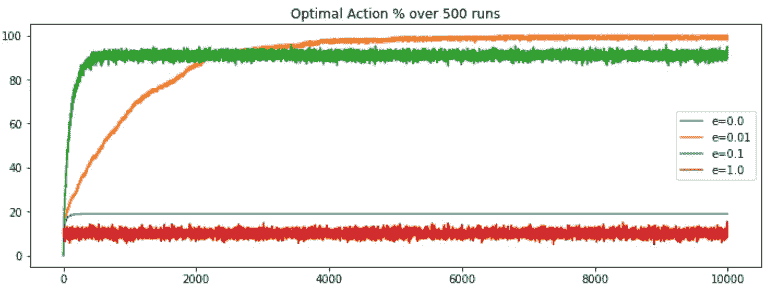
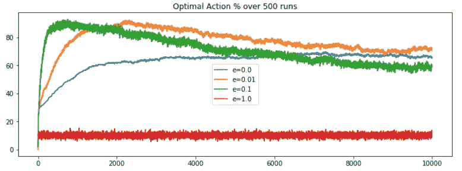
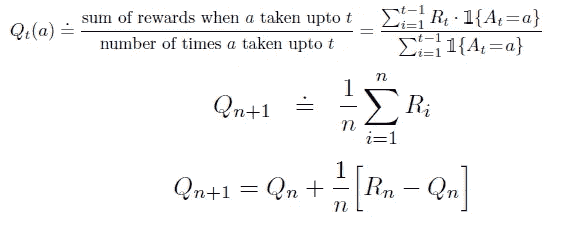
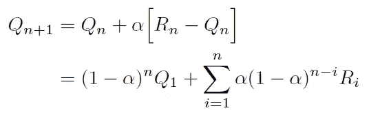
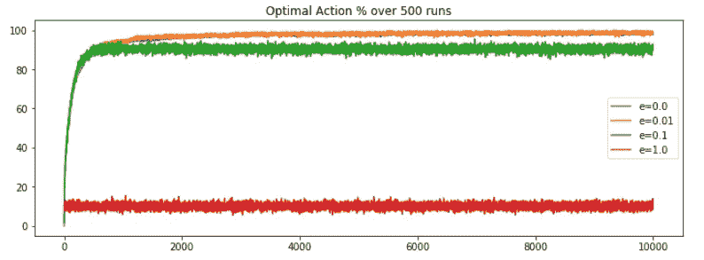

# 多臂 Bandit 强化学习(下)

> 原文：<https://itnext.io/reinforcement-learning-with-multi-arm-bandit-part-2-831a43f22a47?source=collection_archive---------2----------------------->

## 让我们把问题变得更复杂一点。复杂！


## 概述

这是最初的[帖子](/reinforcement-learning-with-multi-arm-bandit-decf442e02d2)的延续，我强烈建议先浏览一遍，在那里我们理解了多臂强盗的直觉，并试图应用贪婪算法来解决一个典型的问题。但是这个世界没那么简单。有一些因素，引入这些因素，问题完全改变，解决方案必须重新定义。我们将选择我们离开的地方，引入新的问题，展示我们心爱的算法是如何失败的，并尝试建立可能有助于这种情况的直觉。

## 非平稳问题

如果我们回想一下第一篇文章中的问题，我们已经定义了一些具有固定奖励分布的门户，并试图使我们的估计行动值更接近预期行动值或奖励分布。现在，大部分的定义保持不变，但我们将只是调整固定奖励分配的一部分。在最初的问题中，我们定义了一个奖励分布函数，它的值在整个过程中不变，但如果它们变了呢？如果预期动作值不恒定怎么办？就家庭门户游戏而言，如果一个家庭门户正慢慢变成一个海洋门户，或者反之亦然，或者只是波动到足以引起重大混乱。在这种情况下，我们简单的 e-greedy 算法会起作用吗？好吧，让我们试着找出答案。

首先，在运行原始代码以生成最佳动作选择百分比时，我们的图与预期一样，即使将步长增加到 10k，ε值 0.01 也优于 e = 0 或 1 的对比度设置。并且性能是稳定的，未来没有下降的迹象。



静态问题:e-greedy 算法性能；将步数增加到 10 公里

现在，我们需要稍微修改一下，把定态问题转化为非定态问题。根据定义，奖励分配可能会发生变化。让我们用均值为 0，偏差为 0.01 的正态分布来定义变化的术语，比如说在每一步之后。所以在每一步之后，我们将根据定义的正态分布计算随机数，并将其添加到之前的预期动作值中。现在这将是新的奖励分配。这很容易做到，只需在原始代码中添加几行代码，然后我们就可以计算出最新的最优动作选择百分比。

```
# define a function to update the expected_action_value
>>> def update_expected_action_value(expected_action_value):
>>>    expected_action_value += np.random.normal(0, 0.01, arms) 
>>>    return(expected_action_value)# inside the multi_arm_bandit_problem function add, 
>>> estimate_action_value = update_estimate_action_value(estimate_action_value)
```



非平稳问题:初始峰值后 e-greedy 算法性能下降

相比之下，我们可以说 e-greedy 算法的性能在一段时间后开始下降。请注意，尽管 e=0.01 仍显示出良好的结果，但即使是轻微的随机增量(0.01 偏差)，性能的急剧下降也是显而易见的，如果变化系数更大呢？事实证明，下降的幅度会更大。要问的问题是，这里的问题是什么？

## 报酬分布的估计

让我们试着回忆一下真实报酬分布的估计函数，大概是这样的，



为平稳问题选择的估计公式

在哪里，

1.  第一个等式给出了在`t`的估计奖励值的公式，这是到时间步`t-1`为止我们收到的所有奖励的简单平均值
2.  第二个方程只是写同样东西的一种很好的方式。表示对`n+1`步骤的估计将是直到步骤`n`的所有奖励的平均值
3.  第三个，是当你扩展第二个方程并加入`Qn`的公式时得到的，它类似于`Qn+1`的公式，只是少了一步(用`n-1`代替`n`)。这里，`Qn+1`是对`n+1`步骤的新估计，`Qn`是旧估计，即直到步骤`n`的估计，`Rn`是对`nth`步骤的奖励，`1/n`是我们想要更新新估计的步长。

为了清楚起见，按照这个公式，如果一个特定的动作被选择了比如说 5 次，那么这 5 个奖励(`n`动作导致`n`奖励)中的每一个将被除以 1/5，然后相加得到估计值，直到步骤 5。如果你仔细观察，你会发现我们对所有的奖励都给予了同等的权重，不管它们发生的时间，这意味着我们想说，每一个奖励对我们来说都是同等重要的，因此是同等的权重。这适用于静态问题，但新问题呢？随着奖励分布的变化，最新的奖励不是对真实奖励分布的更好估计吗？那么，难道我们不应该对新的奖励给予更多的重视，对旧的奖励给予更少的重视吗？这个想法绝对值得追求。这将意味着改变奖励权重，这可以通过将平均奖励估计替换为指数最近加权平均来实现。我们可以通过提供一个选项来进一步使这个过程通用化，这个选项可以是新的或旧的奖励应该给予更大的权重，或者是一个随着时间减少权重的中间解决方法。事实证明，这可以很容易地通过用常数代替旧公式中的阶跃函数`1/n`来实现，比如𝛂.这更新了估计函数，



为非平稳问题选择的估计公式

在哪里，

1.  如果𝛂= 1；`Rn`也就是说，最近一次奖励的最大权重为 1，其余奖励的权重为 0。因此，如果您的预期动作值的偏差太大，我们可以使用这个设置。
2.  如果𝛂= 0；`Q1`即，最早的奖励估计将具有最大权重 1，其余的将具有 0。当我们只想考虑初始估计值时，我们可以使用它。
3.  如果 0 1-𝛂呈指数下降。在这种情况下，最早的奖励权重较小，最新的奖励权重较高。这就是我们想要尝试的。

## 非稳态解

让我们通过简单地更新代码，用一个常数值(比如 0.1)代替步长，并保持其余参数不变，来正式化这个解决方案。这将实现指数递减权重。稍后，我们将计算最佳行动选择百分比，并对其进行反思。

```
# update the estimation calculation
>>> estimate_action_value[action] = estimate_action_value[action] + 0.1 * (reward - estimate_action_value[action])
```



非平稳问题:恒定步长导致的 e-greedy 算法性能

好吧，我们又开始做生意了。我们可以得出结论，

1.  e=0.01 的设置优于其竞争对手，并且在一些步骤之后性能收敛到最大值。在这里，我们没有看到性能的任何下降，因为我们修改了评估函数，它考虑了奖励分配的变化性质。
2.  估计函数提供了对环境状态的洞察，基于此我们必须设计函数。对于稳定的问题，我们可以用基本平均来解决，但是对于复杂的变化奖励分配的环境，我们必须应用指数递减的奖励平均。
3.  这提供了一种直觉，在数学上，仅仅通过修改步长的一个参数，我们就能够考虑新环境的复杂行为，这实际上与现实世界的问题非常相似。

## 结论

从这篇文章中学到的是理解稳定和不稳定的环境。通过质疑和考虑环境的所有属性来设计评估函数的艺术。以及有时最小但直观的变化如何导致精度和性能的最大提高。我们仍然有一些问题和改进，可以带来更好的准确性和优化，但以后。

干杯。

## 参考

[1]强化学习——介绍；理查德·萨顿和安德鲁·巴尔托