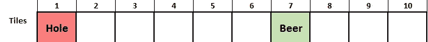
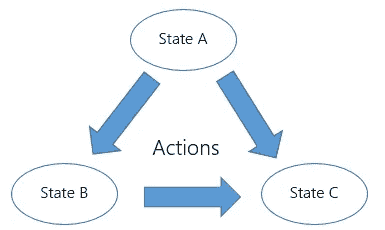
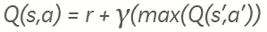
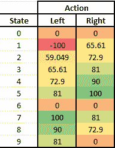

# 用 Q 表进行强化学习

> 原文：<https://itnext.io/reinforcement-learning-with-q-tables-5f11168862c8?source=collection_archive---------0----------------------->


强化学习——主体的行动和环境的回应

# 什么是强化学习

强化学习是机器学习中处理延迟奖励的一个领域。
**这是什么意思？**嗯，简单，我举个例子解释一下。对于这一点，我假设你已经听说过(如果你知道就更好了)神经网络，甚至回归或分类的基本知识都可以。让我们举一个分类问题的例子，你已经得到了一大块狗的图像，你必须设计一个系统，它能够通过判断图像是否是狗的来区分图像。任何有一点机器学习知识的人都会建议你使用卷积神经网络，并用提供的图像进行训练，是的，它会起作用。但是怎么做呢？好吧，不用深入细节(也许稍后会有一篇关于这个的文章？！)你先在样本图像上训练神经网络。在训练时，神经网络学习狗的图像特有的小特征和模式。在训练期间，你知道预期的输出，这是一个狗的图像，所以每当网络预测错误，我们纠正它。在某种程度上，我们知道对提供的图像的奖励，如果预测是正确的，我们给予积极的奖励，如果预测是错误的，奖励是消极的，并采取纠正措施来学习和适应。所以我们知道直接的回报。

**但是如果我们不知道眼前的回报呢？**在这里，强化学习进入了画面。

为了解释这一点，让我们创建一个游戏。游戏很简单，一排有 10 块瓷砖。所有的瓷砖都不一样，有些有我们不想去的洞，而有些有啤酒，我们肯定想去。当游戏开始时，你可以在任何牌上产卵，并且可以向左或向右走。游戏将继续下去，除非我们赢了或者游戏结束，让我们称这样的每一次迭代为一集。



去喝啤酒！！

所以，如果你在第 0 块瓷砖上产卵，或者以某种方式移动到第 0 块瓷砖，游戏就结束了，但是如果我们移动到第 6 块瓷砖，我们就赢了。

让我们以一个简单的插曲为例。好吧，让我们假设我们在瓷砖 2 上产卵。现在假设我没有给你看游戏地图，你只有向左或向右的选择，你会走哪条路？啊你不能说除非你尝试它。假设你一直向左走，直到你到了第 0 张牌，那张有洞的牌，你输了。这不是我们想要发生的，所以让我们给我们从 2 到 1 到 0 的左转动作分配一个负奖励。在下一集，你可能会再次出现在瓷砖 2，这次你继续向右，直到你到达瓷砖 6。啤酒来了，让我们给行动分配积极的奖励。

**我们学到了什么？对于我们所走的每一步，直到我们打了洞或喝了啤酒，我们都不知道会有什么回报。延迟奖励伙计们。没有人告诉你正确的方向，每一步之后都没有回报，暗示它是正确还是错误的方向。现在我们甚至很难掌握正确动作的感觉，如果我们想让计算机学习呢？强化学习拯救世界。**

# 马尔可夫决策过程

这个马尔可夫过程是什么，为什么我们需要学习它？我也是这么想的，而且要明确的是，我们不需要深究，只要一个基本的直觉就可以了。

因此，马尔可夫决策过程被用于在结果部分是随机的，部分在决策者控制下的情况下对决策进行建模。简而言之，所有的瓷砖，左和右的行动，我们讨论的消极和积极的奖励可以用马尔可夫过程建模。

马尔可夫决策过程包括，

1.  **状态**:是一组状态。我们例子中的瓷砖。所以我们的游戏中有 10 个州。
2.  **动作(A)** :状态`s`下可用的一组动作。从我们的游戏中向左&向右。
3.  **转移概率** `P(s'|s, a)`:如果我们在`t`时刻在`s`状态采取动作`a`，那么在`t+1`时刻转移到`s'`状态的概率。我们在这前面被排序，从瓦片 3 到瓦片 2 的一个左边，没有问题被问。
4.  **奖励** `R(s'|s, a)`:这是我们通过采取行动`a`从状态`s`过渡到状态`s'`时得到的奖励。
5.  **贴现(Y)** :是贴现因子，代表未来和现在奖励的差异。



由于某种动作而引起的状态变化。就这么简单！

因此，马尔可夫过程可以理解为状态`S`的集合，其中一些动作`A`可能来自具有某种概率`P`的每个状态。每一个这样的行动都会导致一些奖励。如果概率和回报未知，问题就在于强化学习。在这里，我们将使用 Q 学习或者更好地使用它的最基本实现 Q 表来解决一个简单的问题。

# q 学习

现在考虑到以上所有学到的理论，我们想要建立一个代理来像人类一样遍历我们的啤酒和洞游戏(寻找更好的名字)。为此，我们应该有一个政策，告诉我们什么时候做什么。就当是游戏的揭秘图吧。政策越好，我们赢得比赛的机会就越大，因此得名 Q(质量)学习。我们政策的质量将随着培训而提高，并将继续提高。为了学习，我们将使用贝尔曼方程，它是这样的:



未来报酬折现的贝尔曼方程

在哪里，

*   `Q(s,a)`当前的行动方针`a`是从`s`状态
*   `r`是对行动的奖励
*   `max(Q(s',a'))`定义了未来的最大奖励。假设我们在状态`s`采取动作`a`到达状态`s'`。从这里我们可能有多个动作，每个动作对应一些奖励。计算奖励的最大值。
*   `Y`是贴现因子。现在，价值从 0 到 1 变化，如果价值接近 0，立即奖励优先，如果价值接近 1，未来奖励的重要性增加，直到 1，它被认为等于立即奖励。

在这里，我们试图把延迟的奖励变成直接的奖励。对于我们从一个州采取的每一个行动，我们更新我们的政策表，让我们称之为 Q 表，以包括积极或消极的奖励。假设我们在牌 4 中，我们将右转，使牌 5 成为下一个状态，牌 4 的直接奖励将包括牌 5 中所有可能行动的最大奖励的某个因子(由折扣确定)。如果你查看游戏地图，从方块 5 向右会导致方块 6，这是我们游戏的最终目标，所以方块 4 的正确动作也会被分配一些积极的奖励。

# 密码

好了，现在有太多的理论，让代码。

让我将状态、行动和奖励定义为矩阵。一种方法是用行表示所有状态，用列表示动作，因此我们有 10 个状态和 2 个动作，我们将定义一个 10x2 的矩阵。为了简单起见，我没有使用任何库，只是用 python 中的列表对它们进行编码。

```
environment_matrix = [[None, 0],
                  [-100, 0],
                  [0, 0],
                  [0, 0],
                  [0, 0],
                  [0, 100],
                  [0, 0],
                  [100, 0],
                  [0, 0],
                  [0, None]]
```

如你所见，从方块 5 向右走和从方块 7 向左走有 100 的高回报，因为它通向方块 6。同样，从牌 1 向左导致洞，所以它有一个负奖励。由于没有-1 或第 10 个牌，所以牌 0 和 9 具有左右奖励`None`。

现在是我们的魔法 Q 表的时间了，它将随着代理在每一集的学习而更新。

```
q_matrix = [[0, 0],
      [0, 0],
      [0, 0],
      [0, 0],
      [0, 0],
      [0, 0],
      [0, 0],
      [0, 0],
      [0, 0],
      [0, 0]]
```

首先，让我们把所有的赋值为零。

定义一些有助于游戏遍历的函数。

```
win_loss_states = [0,6]def getAllPossibleNextAction(cur_pos):
    step_matrix = [x != None for x in environment_matrix[cur_pos]]
    action = []
    if(step_matrix[0]):
        action.append(0)    
    if(step_matrix[1]):
        action.append(1)
    return(action)def isGoalStateReached(cur_pos):
    return (cur_pos in [6])def getNextState(cur_pos, action):
    if (action == 0):
        return cur_pos - 1
    else:
        return cur_pos + 1def isGameOver(cur_pos):
    return cur_pos in win_loss_states
```

让我们一个一个来看，

*   传递你的当前状态，它会返回所有可能的动作。注意，对于图块 0，只有右动作，对于只有左动作的图块 9 也是如此
*   `isGoalStateReached`如果当前图块是 6，它将返回`True`
*   `getNextState`传递当前状态和动作，返回下一个状态
*   `isGameOver`如果状态为 0 或 6，游戏结束，返回`True`

现在是训练部分，

```
discount = 0.9
learning_rate = 0.1for _ in range(1000):
    # get starting place
    cur_pos = random.choice([0,1,2,3,4,5,6,7,8,9])
    # while goal state is not reached
    while(not isGameOver(cur_pos)):
        # get all possible next states from cur_step
        possible_actions = getAllPossibleNextAction(cur_pos)
        # select any one action randomly
        action = random.choice(possible_actions)
        # find the next state corresponding to the action selected
        next_state = getNextState(cur_pos, action)
        # update the q_matrix
        q_matrix[cur_pos][action] = q_matrix[cur_pos][action] + learning_rate * (environment_matrix[cur_pos][action] + 
            discount * max(q_matrix[next_state]) - q_matrix[cur_pos][action])
        # go to next state
        cur_pos = next_state
    # print status
    print("Episode ", _ , " done")print(q_matrix)
print("Training done...")
```

让我澄清一下，

*   首先，我们定义了折现因子和学习率
*   我们要训练 1000 集
*   产卵是完全随机的，它可能是任何瓷砖
*   虽然这一集还没有结束，我们继续采取随机行动，并更新 Q 表

1000 集之后，Q 表有些什么样子，

```
[[0, 0], [-99.99999999730835, 65.60999997057485], [59.04899994359059, 72.8999999993016], [65.60999999858613, 80.99999999978154], 
[72.89999999929572, 89.99999999991468], [80.99999999863587, 99.99999999997391], [0, 0], [99.9999999999985, 80.99999999994624], 
[89.99999999999515, 72.89999999997386], [80.99999999999046, 0]]
```

让我们稍微美化一下，开始吧，



现在我们的政策是什么，如果你发现自己处于任何状态，选择具有较高值的动作(这里是较暗的绿色阴影),你将获得啤酒。不错吧！

# 下一步

如果我们用有多个洞的 2D 板来增加游戏的复杂性，那会是一件有趣的事情。

**注**:此注来自我个人[网站](http://mohitmayank.com)。