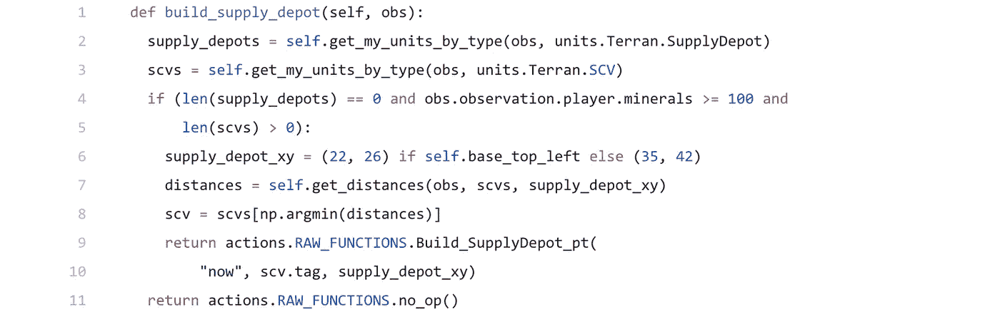

# PySC2 中基于原始动作和观察的强化学习

> 原文：<https://itnext.io/reinforcement-learning-with-raw-actions-and-observations-in-pysc2-af0b6fd8391f?source=collection_archive---------1----------------------->

在我之前的教程中，我介绍了 PySC2 的一个新特性，叫做原始观察和原始动作。现在我们可以利用这些知识，尝试用强化学习来教我们的机器人如何玩游戏。

将强化学习应用于完整的游戏极其复杂，需要大量的时间和计算能力，正如 DeepMind 通过 [AlphaStar](https://medium.com/@skjb/the-evolution-of-alphastar-cefff389b9d5) 向我们展示的那样。我们可以通过显著降低游戏的复杂性来让事情变得更简单。

降低复杂性的第一步是限制机器人可以做的事情，所以我们将创建一个人族机器人，它可以建立一个单一的补给站，一个单一的兵营，都在固定的位置，可以训练海军陆战队，并可以攻击预定的位置。

降低复杂性的第二步是，我们将让机器人与具有相同限制的对手竞争。我们这样做是因为使用游戏中的 AI 对手会导致更多的单位需要追踪，而且有些东西，比如隐形单位，是我们无法处理的。

第三，对手将简单地随机执行动作，这将给我们一个很好的比较，以确保我们的机器人正在学习，而不仅仅是运气好。

最后，我们将消除战争的迷雾，这样就没有隐藏的信息，机器人的世界更可预测，更容易做出反应。

让我们开始吧。

# 1.创建基本代理

由于我们的两个机器人基本上以相同的方式运行，我们将创建一个通用的代理类，其中包含学习代理和随机代理都将使用的代码。

首先，我们需要导入几个库:

接下来，我们创建代理类:

让我们定义代理可以执行的操作:

请注意，我们不允许代理重建他们的指挥中心。你当然可以这么做，但是为了简单起见，我选择不做，因为一般来说，一旦代理失去了指挥中心，他们很快就会被击败。

我们将需要一些实用方法，首先是一些从观察中收集单位的方法:

我们还将添加一个方法来计算单位列表和指定点之间的距离:

这些方法将被我们的行动方法所使用。

# 2.创建操作方法

我们需要为之前创建的列表中定义的每个动作添加一个方法。这些方法中的每一个都将接收来自每一步的观察，以便它可以独立地行动。稍后您将会看到，这大大简化了我们代理的结构。

让我们从简单的“无操作”动作开始，它什么也不做:

接下来，我们将创建一个方法，将闲置的 SCV 发送回一个矿块:

正如你所看到的，有很多矿物补丁单位类型！我们在这里做的是找到最接近所选 SCV 的矿块。首先，我们使用我们的`get_distances`方法计算从每个矿块到 SCV 的距离，然后我们使用`np.argmin`找到最近的距离。

`Harvest_Gather_unit`原始动作非常简洁，它接受一个工人的单元标签和一个资源(矿物或天然气)的单元标签。因此，不存在常规操作中可能出现的误点击风险。

现在，我们创建一个建立补给站的方法:

类似于我们之前对 SCV 和矿点所做的，我们找到离建造地点最近的 SCV，然后指示它在那里建造。当一个 SCV 行进到建造地点时，代理可能会多次调用这个方法，所以我们不想随机选择 scv，否则会从矿线中取出多个 scv。

与常规动作不同，如果动作无法执行，raw 动作不会崩溃，但我喜欢执行自己的检查，以便错误通知不会出现在游戏中。我只是需要保持东西整洁。

这里的补给站位置是我们将要使用的 Simple64 地图的位置，并且是我选择的看起来和每个基地位置平衡的位置。`self.base_top_left`值将在后面解释。

接下来，我们创建建造兵营的方法:

这与上面的补给站方法非常相似。

一旦我们有了兵营，我们就可以训练海军陆战队:

原始观察的一个很酷的特性是，我们可以通过使用`barracks.order_length`来查看有多少海军陆战队队员在军营中排队，我们知道对于一个标准的军营来说，这个数字被限制为 5。

最后，攻击方法:

这种方法有一些技巧。首先我们找到离攻击地点最远的陆战队员，这和我们之前用 scv 做的类似，除了我们用`np.argmax`找到最远的距离。

当我们选择了一个陆战队员，我们实际上是在预定的攻击坐标周围随机选择了一个位置。我们这样做是为了确保我们的单位完全探索敌人的基地位置并摧毁所有建筑。

# 3.创建随机代理

我们几乎准备好测试我们的代理了，但是首先我们应该创建一个随机执行动作的代理。首先，向基本代理添加一个方法，该方法将在每个游戏开始时确定基本位置:

虽然我们的基本代理相当复杂，但我们的随机代理实际上非常简单:

我们在这里从预定义的列表中随机选择一个动作，然后使用 Python 的`getattr`将动作名转换为方法调用，并将观察结果作为参数传入。

现在让我们添加运行代理的代码:

你可以看到我们已经使用`disable_fog`禁用了战争迷雾，我们还选择了一个相当大的 48 步乘数，这使得游戏运行得更快，并且不会真正影响这些简单代理的结果。

我们还为 1000 个游戏运行代理，这对于聪明的代理学习如何以大约 95%的成功率获胜来说是绰绰有余的。

运行你的代码，你应该看到两个机器人互相争斗。

这很好，但我们真的希望其中一个机器人学会如何获胜，对吗？

# 4.创建 Q 表

强化学习的一个最简单的形式是 Q 表，它本质上是一个游戏所有状态的电子表格，以及每个状态中每个动作的好坏。机器人根据它是赢还是输来更新每个动作的值，随着时间的推移，它为各种场景建立了一个相当好的策略。

我修改了一个版本的 [Morvan Zhou 的代码](https://github.com/MorvanZhou/Reinforcement-learning-with-tensorflow/blob/master/contents/2_Q_Learning_maze/RL_brain.py)。

首先创建`QLearningTable`类:

现在，我们将添加方法来选择机器人应该执行的操作:

这里的`e_greedy`参数决定了机器人选择随机动作而不是最佳动作的频率。值为 0.9 意味着它在 90%的情况下会选择最佳操作，在 10%的情况下会选择随机操作。

为了选择最佳动作，它首先检索当前状态下每个动作的值，然后选择值最高的动作。如果多个动作具有相同的最高值，它将随机选择其中一个状态。

现在我们需要添加允许机器人学习的方法:

这就是 Q 表的神奇之处。参数`s`是指*之前的*状态，`a`是在该状态下执行的动作，`r`是采取该动作后收到的奖励，`s_`是机器人采取该动作后所处的状态。

首先在`q_predict`中，我们得到当我们第一次进入状态时，为采取行动所给的值。假设这个值是 0.1。

接下来，我们确定当前状态下所有行为的最大可能值，用衰减率(0.9)将其贴现，然后加上我们收到的奖励。例如，如果当前状态的最大动作值是 0.5，而我们收到的奖励是 0，那么`q_target`将是 0.45，因为我们用 0.9 的衰减率乘以 0.5，然后加上奖励 0。

最后，我们取新值和先前值之间的差(例如，0.45 - 0.1 = 0.35)，并将其乘以学习率(例如，0.35 *0.1 = 0.035)。然后，我们将它添加到先前的动作值(例如，0.1 + 0.035 = 0.135)，并将其存储回 Q 表中。

所有这一切的结果是，根据我们最终所处的状态，行动会增加或减少一点，这将使我们在未来再次进入之前的状态时，或多或少地被选择。

您可能已经注意到这两种方法都使用了我们还没有添加的另一种方法，所以让我们这样做:

这个方法所做的就是检查状态是否已经在 Q 表中，如果没有，它将为所有可能的动作添加一个值 0。

你的头受伤了吗？抱歉。好吧，让我们回到我们的代理人。

# 5.创建智能代理

首先创建类:

然后，我们希望在创建代理时创建 Q 表的一个实例。

在游戏的每一步，我们需要选择一个动作来执行。为了选择行动，我们需要知道当前的状态。让我们创建一个方法来跟踪游戏状态的简化版本:

这看起来像很多代码，但实际上我们只是跟踪我们的单位和敌人的单位。因为我们禁用了战争迷雾，并且原始单位允许我们看到地图上的所有单位，我们可以 100%准确地看到所有的敌人单位。

我们不再追踪我们的矿物数量，而是将不同的单位简化为一个简单的布尔值。这大大降低了代理的粒度，而没有真正损失任何价值。

现在在我们的步骤中，我们可以使用状态来选择一个动作:

此时，我们的代理将随机选择一个动作，但它从不学习，所以让我们添加最后一部分:

如果我们已经看到了一个状态并执行了一个动作，我们现在已经进入了一个新的状态并收到了一个奖励，所以我们可以将这个输入到我们的 Q 表中。

如果我们不重置`previous_state`和`previous_action`，它可能会在每个游戏开始时错误地教导我们的代理，所以让我们在开始新游戏时重置这些值:

最后，将我们的第一个代理更改为智能代理:

就是这样！如果你运行代码，你会看到最终智能代理开始赢得几乎每一场比赛。

这篇教程的完整代码可以在[这里](https://github.com/skjb/pysc2-tutorial/blob/master/Reinforcement%20Learning%20Terran%20Bot/learning_agent.py)找到。

如果你喜欢这个教程，请在 [Patreon](https://www.patreon.com/skjb) 上支持我。也请和我一起上[不和谐](https://discord.gg/zXHU4wM)，或者关注我上 [Twitch](https://www.twitch.tv/skjb) 、 [Medium](https://medium.com/@skjb) 、 [GitHub](https://github.com/skjb) 、 [Twitter](https://twitter.com/theskjb) 和 [YouTube](https://www.youtube.com/channel/UCZcEvhpV4_6llcrWrWQ2wsg) 。