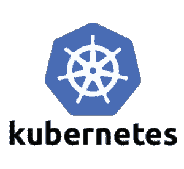
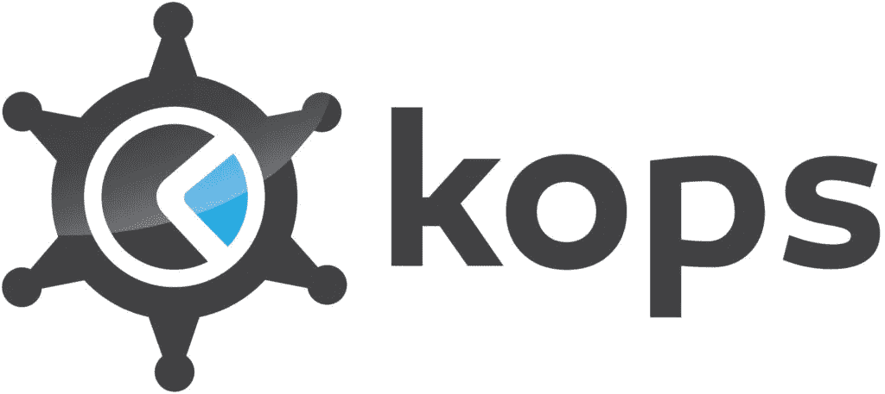
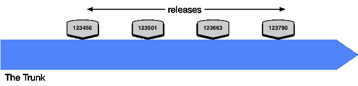
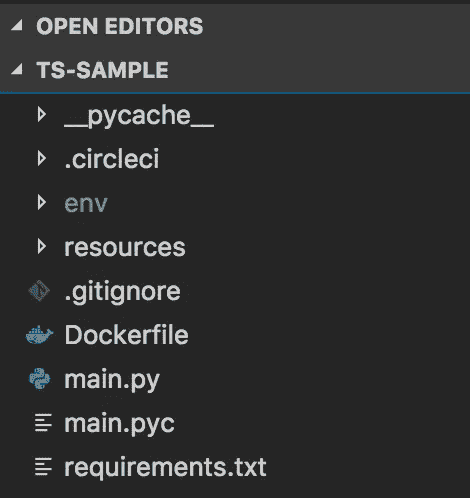
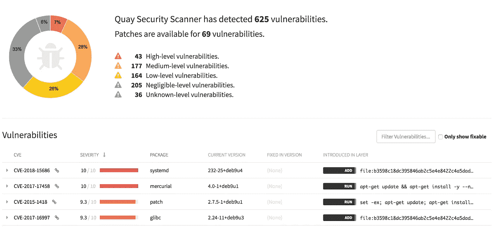
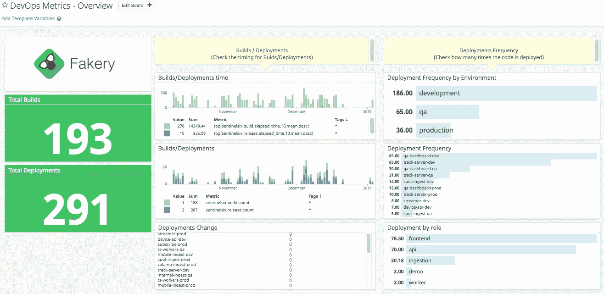
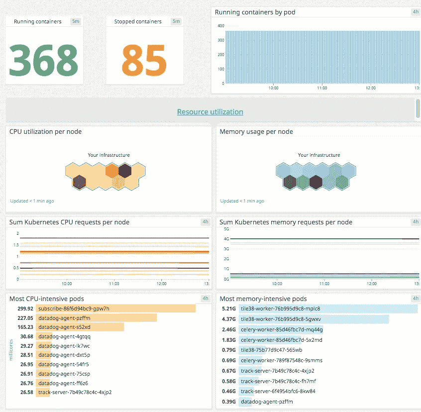
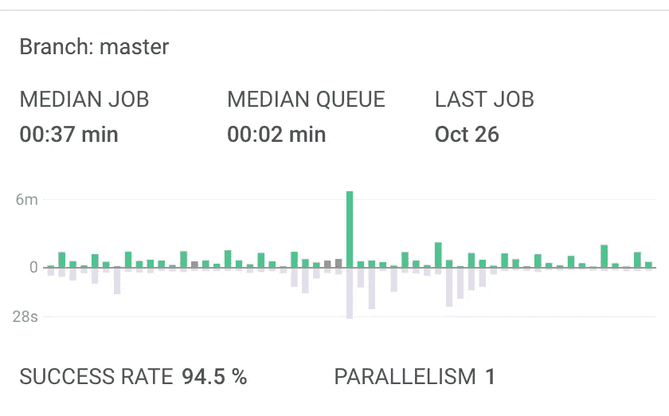

# 使用 CircleCI/Quay/Datadog 向 Kubernetes 发布和测量代码

> 原文：<https://itnext.io/release-measure-code-to-kubernetes-using-circleci-quay-datadog-f7e3b0802ff9?source=collection_archive---------6----------------------->

1.Kubernetes 平台工程

下面的故事将展示如何使用 CircleCI 创建一个 100%自动化的软件交付，并一步一步地部署到 Kubernetes 中，从开发到登台，以及使用精心制作的工具从登台到生产。

# 基础设施

我有一个在 AWS 中通过 Kops 启动的 Kubernetes Cluster 1.8。如果你需要了解如何创建一个集群，那么就去它的官方 Github 页面[https://github.com/kubernetes/kops](https://github.com/kubernetes/kops)吧，这是有据可查的。

2.Kubernetes 运营工具

# 定义正确的分支战略

定义正确的分支策略是在 ***长期*** 中成功的关键，因为在开发过程中会涉及太多的特性和工程师。通过在使用平台时采用 DevOps 思维模式，工程师需要在开发新功能、修复应用程序和尽可能快地交付软件以实现无摩擦、无时间限制的生产之间找到准确的平衡。

我们的场景将基于从主干 释放 [***来工作，因此我们不断地合并到*和 ***主*** 是 ***通过 ***部署管道交付*** ，直到生产*** 。开发将在 ***短命特性分支*** 中进行，最多持续几天*，然后将合并到主分支中，通过 ***自动化*** 交付给环境，不得允许手动任务。使用从主干发布的团队有一个 ***高发布节奏*** 。*****](https://trunkbaseddevelopment.com/release-from-trunk/)

*让我们来定义什么是发布节奏:*

> *交付团队需要做的事情之一，通常是与产品管理部门合作，是选择他们产品的**发布节奏**。…您的**发布节奏**定义了您的**多久发布一次**您的解决方案，包括内部和外部的产品(或市场)。*

**

*3.从行李箱中释放*

*更多的 ***低发布节奏*** 团队将需要使用更多的 [***基于主干的开发***](https://trunkbaseddevelopment.com/) 方法，以便适当地支持每个发布，因为它们将在生产中持续更长的时间，并且对于工程师来说将需要稳定/无摩擦和永恒的消耗。*

**

*4.基于主干的开发*

*还有谁支持这个想法？*

***微软**是通过他们所谓的 [**发布流程**](https://blogs.msdn.microsoft.com/devops/2018/04/19/release-flow-how-we-do-branching-on-the-vsts-team/) **在 VSTS 内部开发的。***

***Google**※**[**基于主干开发**](https://dzone.com/articles/googles-scaled-trunk-based) **。*****

***我会说这是逃离合并地狱的唯一方法，在那里我们花了几个小时试图在环境之间移动代码，这并不奇怪，它可能会在下一个环境中失败，可能是因为合并太大，可能有太多的冲突要解决，等等。***

***使用主干作为真实的单一来源，并保持其稳定，交付它，标记它。我见过太多的团队用 master branch 做任何事情，合并我们无法探测其工作的东西根本没有任何意义。***

# ***Git-Flow 还是基于主干的开发？***

***这两种策略在业内都被广泛接受，这是当今的标准。***

***作为工程师，我们可能会陷入两种选择中的一种。这是真的，这应该是一个深思熟虑的决定。***

## *****Gitflow*****

***Gitflow 使用以下分支:***

*   *****开发*****
*   *****主人*****
*   *****功能*****
*   *****热修复*****
*   *****发布*****

***每一次迭代，开发团队都将从 develop 创建分支，并通过 pull 请求集成到其中。一旦开发人员准备好发布，发布分支就被创建了。当发布分支准备好生产时，它被合并到主分支。为了向前发展，需要进行几次合并。***

***何时使用:***

*   ***当你在做一个开源项目时。***
*   ***当团队有几个初级成员时。***

***不使用时:***

*   ***当运行一个启动项目时，它会降低开发团队的速度。***
*   ***当您希望依赖开发运维并依赖自动化时。***
*   ***当队员都是学长的时候。***

## ***基于主干的开发***

***参与这一战略的分支机构有:***

*   *****主人*****
*   *****短命特色分支*****

***工程师将在一小段时间内致力于一个从主版本中提取的短命特性分支，然后发布它。发布的节奏往往很快，因为团队很快就要进入生产阶段，他们相信自动化的工作流程会更快。***

***何时使用:***

*   ***当适应 DevOps 心态时。***
*   ***当团队适应自动化时。***
*   ***当团队中有资深成员时。***
*   ***当它是一个启动项目时。***

***不使用时:***

*   ***团队不资深的时候。***
*   ***当它是一个大型开源项目时。***

***因此，在采用正确的策略之前，要三思而行。毕竟，这一切都是通过做来学习，通过测量我们的流程来学习，从团队中获得反馈，我们可以根据需要改变它来改进工作流程。做事并不总是有独特的方式。每个团队和项目都是不同的。***

# ***为工作选择合适的工具***

***既然选择了分支策略模型，是时候考虑什么是需要的和容易执行我们的工作了。我将在下面描述我选择以下工具的原因:***

*   *****Helm 包经理**:是 Kubernetes 包经理。这意味着我们可以在一个包中转换一堆用于部署到 Kubernetes 的 YML 文件。更好的是，我们可以将每个包作为一个单独的单元来部署，所以它是抽象的，这意味着我们可以用同样的方式部署所有的东西。我发现 HELM 非常强大，是部署到 K8S 的最佳工具之一。想象一下，无论技术如何，数十个微服务都以相同的方式部署，这使得自动化变得非常容易。***

******

***4.舵***

*   *****CircleCI** :一个基于容器的平台，允许使用短暂的 Docker 容器来部署我们的环境，并在完成任务后死去。我们使用我们自己的 Docker 映像，这些映像完全连接到环境中，其中包含正确的工具，因此每个容器都有我完成部署所需的一切。CircleCI 是一项非常快速的技术，从 Circle 2.0 开始，它允许自定义工作流，因此工程师可以选择正确的路径来上线。***

******

***5.切尔莱西***

*   *****Quay** : Quay 是一个在注册表中构建和保存 docker 图片的平台。到目前为止，它在建立形象方面做得不好，但在安全方面做得很好。每一个构建的图像都经过全面分析，寻找漏洞，并且总是很好地显示出来。***

******

***6.码头***

*   ***这是一个像 Graphite/Grafana 这样的度量后端，令人印象深刻并且非常容易使用。我使用 Datadog 来衡量基础设施指标，如 CPU/内存利用率、定制业务指标和 ***管道指标。*** 因此，部署工具将其部署指标发送给 Datadog，以便通过 HTTP 协议(也可以通过 UDP 协议)计算部署/失败/时间。***

# ***将 API 准备到 CI/CD***

***第一步是配置我们的服务，通过 CircleCI 进行部署。为此，我们需要添加一个文件夹。使用 circleci 工作流的 circleci/config.yml。***

******

***6.API 项目***

***7.CircleCI 工作流程***

***我们可以看到工作流程的步骤是:***

*   ***构建和运行测试***
*   ***请求 circle ci docker 守护进程的一个实例构建一个映像，并将其上传到 Quay.io hashed(它会将此映像存储在注册表中并执行安全分析)。***
*   ***在开发环境中执行部署，无需通过 Helm 包管理器批准。***
*   ***发送 QA 和生产环境的批准，必须由发布经理或任何负责人手动批准。***
*   ***一旦获得批准，将自动触发 QA/Prod 部署。***

***我们可以在 CircleCI 的 YML 定义中看到全局命令的用法。正如我之前提到的，我们使用预构建的 docker 映像，并在全球范围内安装工具。在这种情况下，它们是一堆 bash 脚本版本，以保存所做更改的历史记录，并支持回溯兼容性，以防工具的新版本出现问题。***

***我为每个环境准备了一个 docker 映像，其中包含以下内容:***

*   ***自定义 bash 脚本，用于构建和上传图像到 Quay。***
*   ***用于部署到 Kubernetes 的定制 bash 脚本。***
*   ***当 CircleCI secrets 运行部署容器时，在 AWS 中连接集群所需的所有凭证集都由 circle ci secrets 注入。***

***下面让我们看看 docker 图像是如何构建的:***

***8.Dockerfile CircleCI 自定义***

# ***构建工具***

***以下 bash 脚本将完成以下工作:***

*   ***接收一堆具有所需配置的环境变量。***
*   ***通过 HTTP 协议将指标发送到 datadog 后端。***
*   ***登录码头。***
*   ***请求 Docker 守护进程 CircleCI。(我强烈建议不要有码头建筑的图像，它经常无缘无故地失败。)***
*   ***将 Docker 映像推送到 Quay 并运行漏洞检查。***

***9.构建工具***

***下面我们可以欣赏一下推送的图片中的漏洞检查。***

******

***10.漏洞报告***

# ***释放工具***

***以下 Bash 脚本将在 docker 映像被推送并且准备好执行部署之后执行。该脚本将执行以下操作:***

*   ***通过环境变量接收大量配置。***
*   ***通过 HTTP 向 Datadog 发送指标。***
*   ***初始化头盔。***
*   ***在 AWS 中设置私有 Helm repo。***
*   ***从 S3 下载 Helm values.yaml 文件(我更喜欢将部署配置与开发人员代码分开)。***
*   ***确定 it 是否需要安装/升级应用程序。***
*   ***通过 Helm 安装/升级。***

***11.释放工具***

# ***平台指标***

***DevOps 思维模式非常信任自动化。了解我们的自动化工作流程中发生了什么的最好方法是测量指标。这是变革的推动者，是我们的眼睛。我们不能改进任何未经测量的东西。它只是盲目地工作。我在管道执行期间发送指标，以便了解正在部署什么，部署发生的频率，花费的时间。一段时间后，通过查看指标，您会惊讶地发现自动化节省了多少时间。***

***外部存在太多可用作数据狗的时序后端指标，在下图中以图形方式显示它们。***

******

***12.韵律学***

******

***13.库伯内特原木***

***CircleCI 提供了一个名为 Insights 的 2.0 特性，它也提供了一些漂亮的信息。***

******

***14.CircleCI 洞察***

# ***结尾词***

***这是一个真正完整的 CI/CD 工作流，有一个有趣的工具集(至少对我来说)。我们有太多新奇的选择可以使用。用于部署 Kubernetes 的下一代 CD 工具是 Spinakker，它提供了一系列功能来提高自动化，并通过可定制的策略(如我稍后将发布的蓝绿色/淡黄色/黑色部署)来显著改变零停机部署的概念。***

***15.CircleCI 结束工作流***

*****精心制作的 CI/CD 工具回购& API 回购如下:*****

*** [## hmarcelodn/helm 工具

### Bash 工具。在 GitHub 上创建一个帐户，为 hmarcelodn/helm-tool 开发做出贡献。

github.com](https://github.com/hmarcelodn/helm-tool)  [## hmarcelodn/ts 样本

### CircleCI / Helm 在 GitHub 上创建一个帐户，为 hmarcelodn/ts-sample 开发做出贡献。

github.com](https://github.com/hmarcelodn/ts-sample) 

我花了很多时间准备这个完整的周期，所以如果你喜欢，拍我。感谢阅读。***