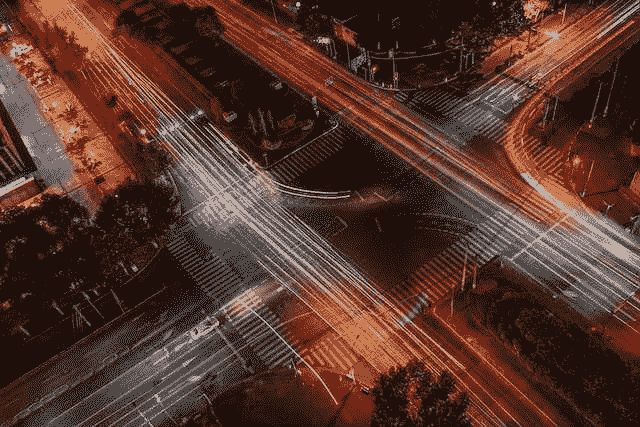
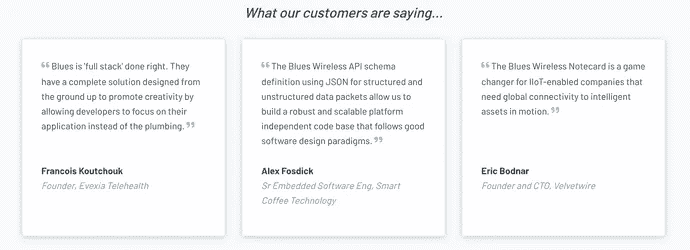
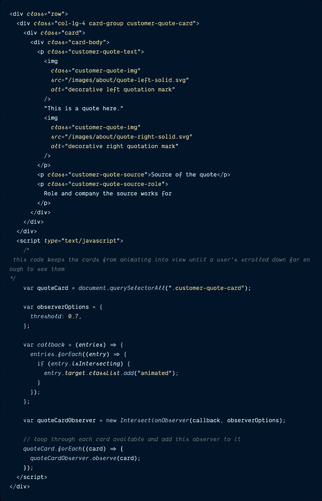
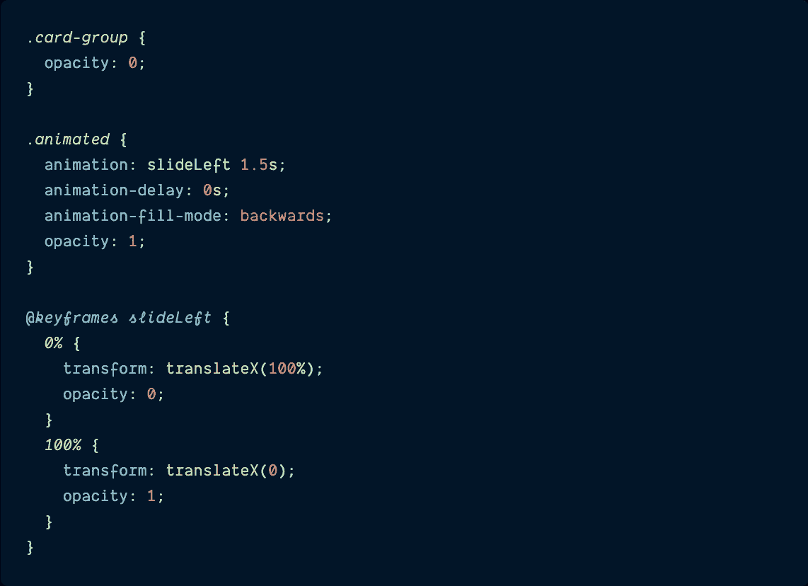
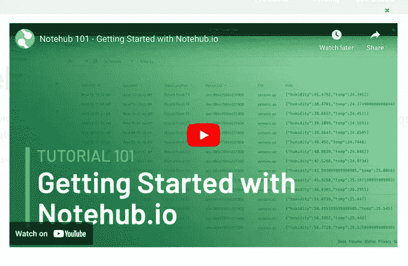
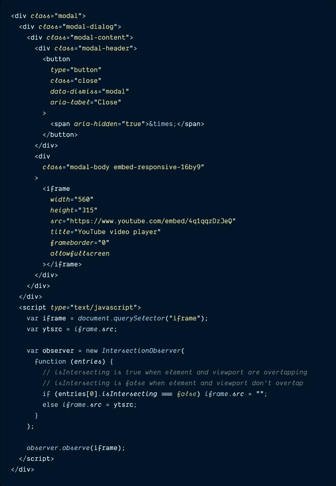

# 依靠 JavaScript 的交集观察器在视图中(或不在视图中)执行代码

> 原文：<https://itnext.io/rely-on-javascripts-intersection-observer-to-execute-code-when-in-view-or-not-87a48d77d5a1?source=collection_archive---------1----------------------->

## 停止视频播放或动画显示屏幕上的元素——交叉点观察器 API 非常通用。

# 重要的是小事

当我每天处理网站建设业务时，我不禁开始注意到，好网站和伟大网站的区别在于，伟大的网站密切关注小细节。

小页面动画，在表单提交后禁用的按钮，或者当用户滚动到页面的该部分时页面上的元素才显示它们自己。你可能不会立即意识到这种细微之处是为了改善用户体验，但当它消失时，它会变得更加明显:一个即使在你滚动离开后也不会停止播放的视频，一个直到你从失败的提交按钮向上滚动页面时才能看到的错误消息，还有无数这样的小烦恼。

最近，我为公司的营销网站建立了一个新的关于我们的页面，在设计师给我的模型中，有一些很酷的动画显示了页面底部的一系列卡片，只有当用户向下滚动足够远才能看到它们时，这些卡片才会滑入视图。它看起来真的很棒，事实证明，现在只需要一点 CSS 和 JavaScript，以及许多其他方便的交互就可以做到这一点。

**今天，我将向您展示 JavaScript Intersection Observer API 如何根据元素在视口中的可见性轻松控制元素的反应。**

下面是一个视频，展示了在观众到达之前，页面底部的卡片是如何不动起来并滑入视野的:这是一个路口观察者工作的例子。

# 交叉观察者

如果您不熟悉的话， [**交集观察器 API**](https://developer.mozilla.org/en-US/docs/Web/API/Intersection_Observer_API) 提供了一种异步观察目标元素与祖先元素或顶级文档视窗交集变化的方法。

简而言之:它可以判断一个元素是否在视图中，并使事物做出相应的动作。

在交叉点观察器出现之前，这种类型的交叉点检测很笨拙，主线程中有许多事件处理程序和循环，可能会导致性能问题和混乱的代码。

另一方面，创建一个`intersectionObserver`，并为其分配一个回调函数，每当 DOM 中的某个特定元素在一个方向或另一个方向上超过阈值时，该函数就会运行。

也可以给它一系列可选的`options`,告诉它何时调用回调函数:

*   `root` -用作检查目标可见性的视口的元素。
*   `rootMargin`——在计算交集之前，围绕根元素的边界框增长或收缩的一组值。
*   `threshold`——一个数字，表示观察者的回调函数应该在目标可见性的多少百分比上执行。(例如，缺省值 0 表示只要有一个像素可见，回调就会运行，而 1.0 表示直到元素的每个像素都可见，才认为超过了阈值)。

> *关于如何微调和利用交叉点观察器来达到酷的效果，还有很多细微差别，但是我上面提到的应该足以帮助你理解我将要演示的例子。如果你想了解更多，我推荐阅读 Mozilla* *的* [*文档，其中包括一些很棒的代码示例。*](https://developer.mozilla.org/en-US/docs/Web/API/Intersection_Observer_API)

所有这些文字可能还没有完全理解，所以让我们来看一些代码示例，在这些示例中，您可以看到交叉点观察器在工作。

# 交叉点观察器代码示例

有几个不同的场景，其中交叉点观察器以独特的方式在营销网站上使用，我将向您展示这两个场景，以帮助演示它可以有多灵活。

## 仅当用户将看到结果时才运行动画

一旦用户可以在交叉点观察器的帮助下在屏幕上看到这些卡，这些卡就会滑入视图。

我将向您展示的第一个示例是我在本博客的介绍中描述的:它在屏幕上显示一系列卡片的动画，但只有当用户向下滚动页面足够远以查看卡片时。

> ***注:***
> 
> *我引用的站点代码是用*[*Hugo*](https://gohugo.io/)*编写的，一个流行的、开源的、用 go 编写的静态站点生成器。像许多 SSG 一样，它依赖于* [*模板*](https://gohugo.io/templates/introduction/) *来呈现站点的大部分 HTML，为了本文的清晰起见，我用生成的 HTML 替换了注入模板的 Go 变量。*

让我们首先看看页面中呈现的三张卡片的 HTML 和 JavaScript。这个代码片段只显示了其中一张卡片，但是对于所有的卡片都是一样的。

`quote-cards.html`

代码片段中的 HTML 概述了`card`元素和卡片中包含的细节:报价、姓名、被报价人的公司和角色。

代码片段底部的 JavaScript 是交叉点观察器发挥作用的地方。首先，创建一个名为`quoteCard`的变量，指向包围每张卡片的`div`上的`customer-quote-card` CSS 类。

然后，用`0.7`的`threshold`声明`observerOptions`变量——这将很快传递给`IntersectionObserver`对象，并要求至少 70%的卡片可见，然后才能动画显示。

定义了一个`callback()`函数，它循环遍历一个项目列表，对于每个项目，如果项目`[isIntersecting](https://developer.mozilla.org/en-US/docs/Web/API/IntersectionObserverEntry/isIntersecting)`(一个布尔值，如果目标元素与交集观察者的根相交，则为真)，则`animated`类被添加到该项目的 CSS 类中。本质上，这个函数会将 CSS 类添加到每个卡片上，以触发动画，并在达到`isIntersecting`阈值时将它们显示在页面上。

接下来，一个`new IntersectionObserver`实例被实例化为`quoteCardObserver`，并且`callback()`和`observerOptions`被传入。

最后，对于每个`quoteCard`对象，`quoteCardObserver`函数被附加到卡片上。

随着 HTML 和 JavaScript 的建立，是时候添加 CSS 了(还记得前面提到的`animated` CSS 类吗？)当交叉点观察器的`callback()`功能触发时，在屏幕上动画显示卡片。

`about.scss`

在 SCSS 代码中，`card-group`类开始时不透明度为 0，以隐藏卡片。

创建了`animated`类，其`[animation](https://developer.mozilla.org/en-US/docs/Web/CSS/animation)` [属性](https://developer.mozilla.org/en-US/docs/Web/CSS/animation)指定了持续时间为 1.5 秒的`slideLeft`关键帧。

除了`animation`属性之外，`animation-delay`、`animation-fill-mode`和`opacity`也被定义在这个类上。

*   `animation-delay: 0;`确保动画立即播放，
*   `animation-fill-mode: backwards;`表示元素一旦应用到目标，就会应用在`0%`关键帧中定义的值(即，一旦在 DOM 中渲染，卡片将保持隐藏，不透明度为 0)。
*   `opacity: 1;`一旦`slideLeft`关键帧动画结束，卡片将在屏幕上 100%可见。

最后但同样重要的是，定义了`[@keyframes](https://developer.mozilla.org/en-US/docs/Web/CSS/@keyframes)`动画序列。仅定义了两个关键帧(`0%`和`100%`)来指示卡片开始时没有不透明度(`opacity: 0;`)并且 100%离开屏幕向右(`transform: translateX(100%);`，当它结束时，它们将完全可见(`opacity: 1;`)并且在屏幕上(`transform: translateX(0);`)。

最终，它产生了这样的效果:

> ***注:***
> 
> CSS 动画超出了本教程的范围，但是如果想更深入地研究它们，我推荐从这里开始**——它们非常酷！**

*太好了！这是如何使用交叉点观察器来控制动画计时的一个例子，这样用户就可以看到它。现在让我们考虑另一个选择。*

## *仅当用户可以看到时播放视频*

**

*只有当用户看到该视频并单击播放按钮时，该视频才会播放。如果用户通过点击页面上的其他地方来关闭该模式，该模式将隐藏，视频停止播放。*

*我要分享的第二个例子是一个视频模态，当模态不可见时，它会停止播放。当单击一个按钮时，模式会接管整个页面，视频播放器位于视窗的中心。如果用户在视频播放的时候点击了视频旁边的某个地方，这个模态就会消失并隐藏起来，视频也会停止播放。这是可能的，因为有了交叉点观测器。*

*让我们来看看实现这一点的代码。*

*`video_modal.html`*

**

*在上面的代码中，在 HTML 中创建了一个视频模型和一个来自 YouTube 的 iframe 视频嵌入。*

*在其正下方的 JavaScript 中，定义了一个聚焦于`<iframe>` HTML 元素的`iframe`变量，并定义了一个`ytsrc`变量来跟踪 iframe 的视频源——这将在交叉点观察器的回调中使用。*

*接下来，初始化一个新的交集观察器(`observer`)，这个观察器的回调函数遍历它接收到的列表`entries`，如果列表中的第一个`entry`不是*交集(即视频 iframe 和 viewport 不重叠，或者更确切地说，模态对查看器不可见)，iframe 的`src`被设置为空字符串，因此没有视频 URL 可播放。如果`entry` *与*相交(即视频模态在视口中可见)，则 iframe 的`src`被设置为`ytsrc`变量:实际的 YouTube 视频 URL。**

*最后，新的`observer`对象被告知观察`iframe`变量，因此每当`iframe`在视口中时(例如，当用户点击按钮打开模态时)，它的视频源就是 YouTube 视频。每当这种情况发生变化时(模态是隐藏的)，视频 URL 被设置为空字符串。*

*这导致当视频模式被取消时，没有视频继续播放。*

*要了解它是如何工作的，请在打开声音的情况下观看此视频，听听当模态被消除并隐藏时，音频是如何停止的。*

*很有用，是吧？*

# *结论*

*小细节可以创造伟大的用户体验，无论是当用户滚动过它时停止播放的视频，还是只有当用户看到元素时才会发生的动画。*

*虽然这些小的交互曾经需要大量额外的代码，并且知道主线程可能被阻塞多长时间，但是交叉点观察器 API 的引入极大地简化了事情。现在，单个对象允许开发人员指定一个要观察的元素、一个要做某件事的回调函数，甚至可以微调该函数，只在满足某些条件时触发。实际上，它在很多情况下都非常有用。*

*过几周再来看看——我会写更多关于 JavaScript、React、IoT 或其他与 web 开发相关的东西。*

*如果你想确保你不会错过我写的一篇文章，在这里注册我的时事通讯:[https://paigeniedringhaus.substack.com](https://paigeniedringhaus.substack.com/)*

*感谢阅读。我希望这个关于如何使用交叉点观察器 API 的演示能够帮助您在未来的工作中摆脱困境。我知道我真的很欣赏伟大的网站体验，拥有另一个工具来实现它们总是好的。*

# *参考资料和更多资源*

*   *[MDN 文档，交叉点观察器](https://developer.mozilla.org/en-US/docs/Web/API/Intersection_Observer_API)*
*   *[MDN 文档，CSS 动画](https://developer.mozilla.org/en-US/docs/Web/CSS/animation)*

**原载于*[*https://www.paigeniedringhaus.com*](https://www.paigeniedringhaus.com/blog/rely-on-java-scripts-intersection-observer-to-execute-code-when-in-view-or-not)*。**