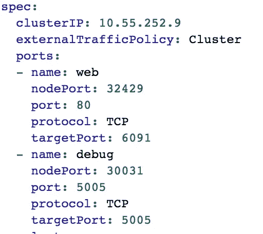
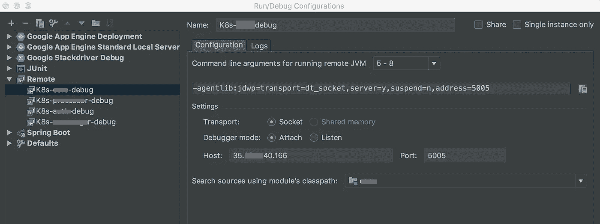

# 在 Kubernetes 上远程调试 Spring Boot

> 原文：<https://itnext.io/remote-debugging-spring-boot-on-kubernetes-a5f96a40e5c0?source=collection_archive---------3----------------------->

您在本地开发您的 Spring Boot 应用程序，然后将其容器化。甚至你把它部署在 Docker 主机或者 Kubernetes 上。但是，如何在本地 IntelliJ 环境中远程调试生产部署呢？🤔以下是解决方案…🤓

在我之前的文章中，我解释了如何在 Google Kubernetes 上部署 Spring Boot 应用程序。我假设您已经有了一个工作负载和一个公开的应用程序 IP 地址。

Kubernetes 将应用程序部署为工作负载。每个工作负载都通过负载平衡器在真实的 IP 地址和端口配置上暴露给互联网。这是必须的，除非你的应用服务于你的其他内部应用。

```
FROM openjdk:8-jdk-alpine
VOLUME /tmp
ARG JAR_FILE
ADD $JAR_FILE target/app.jar
ENTRYPOINT ["java","-**agentlib:jdwp=transport=dt_socket,address=5005,server=y,suspend=n","-Djava.security.egd=file:/dev/./urandom","-Xms2g","-Xmx8g","-jar","target/app.jar"]**
```

上面的**粗体**行是我的 Dockerfile 文件中的一个配置示例，它位于我的项目的根目录下。正如我在之前的文章中解释的[，这个 Docker 文件是 Spotify 的 Docker-Maven 插件使用的。这个插件将 jar 文件打包并构建一个 docker 映像。在该配置中，请注意该容器将在本地端口 5005 上运行 JAVA 调试器。这意味着无论您在哪里运行基于这个映像的容器，Spring 都会在端口 5005 上提供一个可附加的调试器。](https://medium.com/@ealparslan/ship-your-spring-boot-application-on-kubernetes-in-10-minutes-6873fddc388b)


但是，对于运行在 GKE 上的工作负载，我们如何到达端口 5005 呢？

这里我们需要在 GKE 负载平衡器上再公开一个端口，用于远程调试应用程序。

在 GKE 控制台的 Services 选项卡上，找到公开端口 80 的服务(或者您的实际应用程序的任何端口),并为 5005 添加另一个映射，以便您可以从本地机器访问远程调试器。


在 GKE 服务选项卡上显示端口 5005

这也可以通过编辑服务的 YAML 文件来实现



请注意，调试端口被添加到服务的 YAML 文件中

就是这样。远程调试器可以访问您的端口 5005 调试器。在 IntelliJ Idea 上添加一个新的运行/调试配置，并简单地定义 GKE 服务 IP 和端口 5005。

