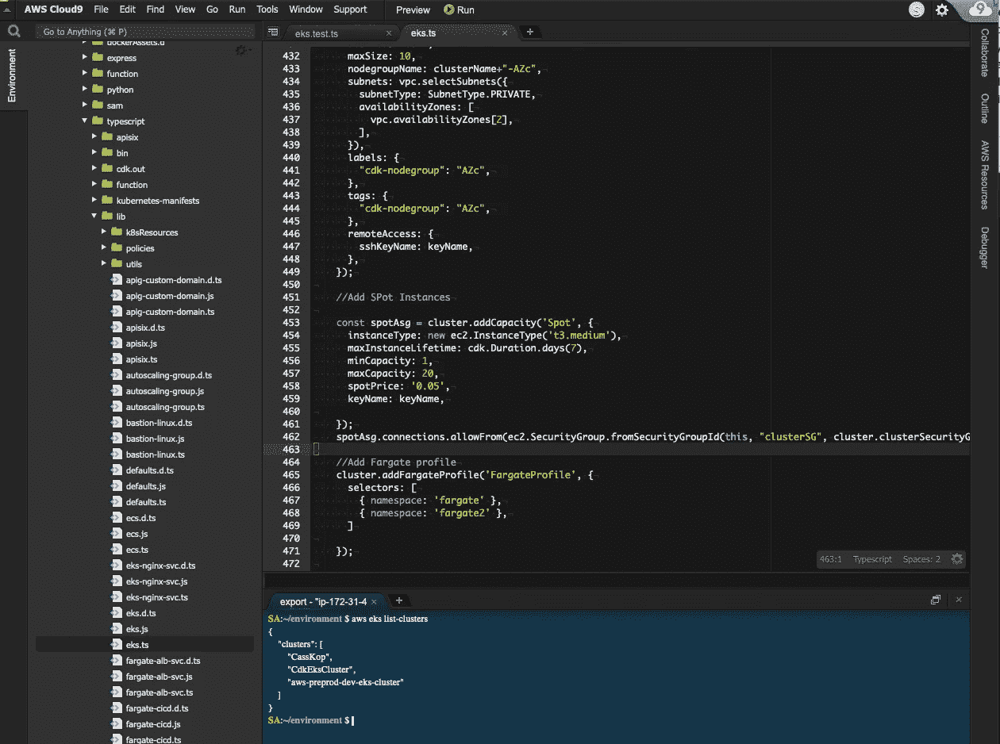
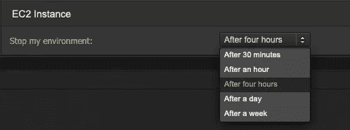
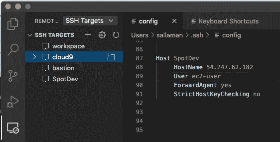
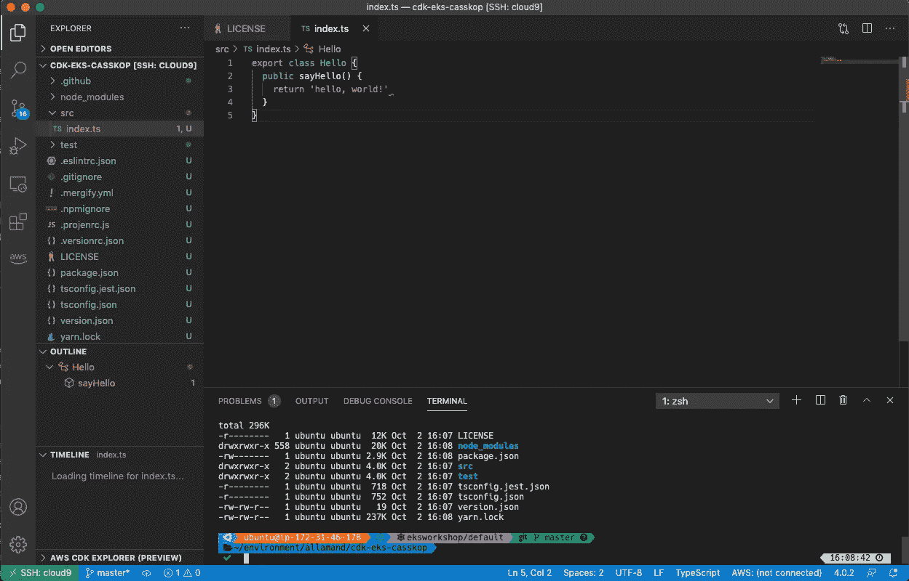
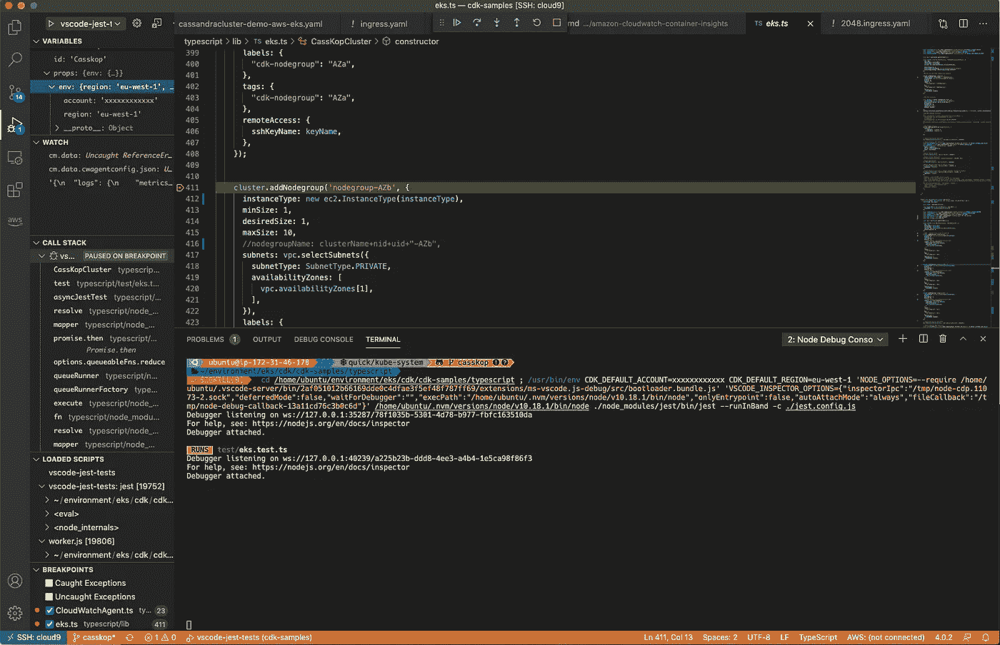

# 在 AWS Cloud9 EC2 实例上使用 VsCode 进行远程开发

> 原文：<https://itnext.io/remote-developing-with-vscode-on-aws-cloud9-ec2-instance-e18134af353f?source=collection_archive---------0----------------------->

# 动机

我通常使用 IntelliJ IDE 在我的本地 Macbook 13”上开发，但是当开始使用大量 docker 容器图像时，我很快就填满了我的小型本地硬盘，并且我的 CPU 在并行处理几个 IDE 项目时遇到了困难。我通常需要在一周内多次重启我的机器，这非常耗费时间。由于我无法增加我的笔记本电脑的功能，我决定看看如何在对我的工作方式影响最小的情况下利用云资源。

我从事的最后一个项目是使用 [AWS 云开发工具包(CDK)](https://aws.amazon.com/cdk/) 的基础设施代码。CDK 是一个开源软件开发框架，用代码定义云基础设施，并通过 AWS CloudFormation 提供它。它提供了一个高级的面向对象的抽象来使用现代编程语言的能力强制性地定义 AWS 资源。使用 CDK 的基础设施构造库，您可以轻松地将 AWS 最佳实践封装在您的基础设施定义中并共享它，而不用担心样板逻辑。

我想找到一个能够在远程云实例上工作的解决方案，同时保持我在本地笔记本电脑上习惯的开发人员体验。

# 利益

*   大幅降低我在本地笔记本电脑上处理项目时的功耗
*   简化开发流程，消除将本地代码同步到云实例的需要。
*   不需要保留代码的两个副本，一个在本地磁盘上，另一个在云实例上。
*   云实例比笔记本电脑具有更强的计算能力，有些事情在笔记本电脑上无法完成
*   你只能在需要的时候激活云实例，所以闲置时不会付费。

# 云 9

[AWS Cloud9](https://console.aws.amazon.com/cloud9/home/product) 是一个基于云的集成开发环境(IDE)，让你只需一个浏览器就能编写、运行和调试你的代码。它包括代码编辑器、调试器和终端。Cloud9 预装了流行编程语言的基本工具，包括 Javascript、Python、PHP 等，因此您不需要安装文件或配置您的开发机器来启动新项目。
由于 Cloud9 IDE 是基于云的，你可以在任何地方使用联网的机器来完成你的项目。借助 Cloud9，您还可以快速地与团队共享您的开发环境，使您能够配对程序并实时跟踪彼此的输入。



> *我们可以看到 Cloud9 是什么样子，编辑器在我的 CDK 项目上，终端有访问我的 AWS 环境的凭证。*

AWS Cloud9 附带了一个终端，它包括托管 Amazon EC2 实例的 sudo 特权，该实例托管您的开发环境和一个预认证的 AWS 命令行界面。这使得您可以轻松地快速运行命令并直接访问 AWS 服务。

AWS Cloud9 为通过 Cloud9 创建的 Amazon EC2 实例提供了 30 分钟的默认**自动休眠**设置。使用此设置，EC2 实例会在您停止使用 IDE 30 分钟后自动停止，并且只有在您重新打开 IDE 时才会重新启动。

因此，通常只有在您积极工作时才会产生 EC2 实例费用。当您的实例需要重启时，您会丢失 IDE 中任何活动的终端会话(但是您可以使用像 [tmux](https://fr.wikipedia.org/wiki/Tmux) 这样的工具来保存它们),并且在打开 IDE 时会经历一些等待时间。根据您的使用情况，您可以配置自动休眠设置，甚至选择“always on”来保持 EC2 实例活动。



Cloud9 是一个实实在在的进步，但是有时候，你需要一个更强大的 ide，Visual Studio 代码可以是其中之一。

> *但是嘿！如果您能从您的 Cloud9 环境中受益来运行您的 Visual Studio 代码集成开发环境，那会怎么样？*

# 远程 Visual Studio 代码

Visual Studio Code 是一个轻量级但功能强大的源代码编辑器，可以在你的桌面上运行。它内置了对 JavaScript、Typescript 和 Node.js 的支持，并为其他语言和运行时提供了丰富的扩展生态系统。

但是这里让我们感兴趣的是 VsCode 提出了一个[远程开发模式](https://code.visualstudio.com/docs/remote/ssh)，允许我们使用远程机器作为全功能开发环境:不需要在本地机器上有源代码。来自 marketplace 的[远程开发扩展包](https://marketplace.visualstudio.com/items?itemName=ms-vscode-remote.vscode-remote-extensionpack)中的每个扩展都可以直接在远程机器中运行命令和其他扩展，这样一切就像在本地运行一样。


这里的事情是，我们可以简单地重用与我们的 Cloud9 IDE 一起部署的相同的托管 EC2 实例，这样我们就可以选择使用 Cloud9 或 VsCode 或两者来管理相同的源代码，并将受益于 Cloud9 的自动休眠功能，从而让我们节省资金。

安装远程开发模式后:



> *VsCode 可以访问您的本地 ssh 配置，然后可以连接到您想要的任何 EC2 实例。*
> 
> **编辑 2022** :我已经更新了我的设置，强制连接使用 [AWS 系统管理器](https://aws.amazon.com/fr/systems-manager/)，如这个[博客](https://aws.amazon.com/blogs/architecture/field-notes-use-aws-cloud9-to-power-your-visual-studio-code-ide/)中所描述的，使用 SSM 而不是 SSH 从我的笔记本电脑连接到 Cloud9 实例。这样，我的实例就不能再通过 SSH 访问了，这提高了我的安全性。为此，我用 proxy 命令和代理脚本 [ssm-proxy.sh](https://github.com/aws-samples/cloud9-to-power-vscode-blog/blob/main/scripts/ssm-proxy.sh) 更新了我的 ssh 配置文件:

```
Host sebCloud9
 User ubuntu
 HostName i-xxxxxxxxxxxx
 ForwardAgent yes
 ProxyCommand sh -c "~/.ssh/ssm-proxy.sh %h %p"
```

左侧有一个新菜单，指向您的`~/.ssh/config`文件，您可以在其中配置对 Cloud9 EC2 实例的访问。

然后，您可以选择一个目标，让 VsCode 连接并安装必要的代码，以便远程使用 VSCode。

> ***注 1:*** *显然，您首先需要允许对 EC2 实例的外部访问，通过启用您的安全组来允许从您的开发机器进行 SSH 访问。* ***注 2:*** *将弹性 IP 地址映射到您的 Cloud9 实例更容易，因此当它重新启动时，您将始终拥有相同的公共 IP。*

现在，您可以远程工作，就像您的所有文件都在本地笔记本电脑上一样，这非常强大:



> 你可以在左下角看到一条消息，告诉我我正在远程使用我的 cloud9 实例。

以下是开始使用 VsCode 的一些提示:

*   [键盘快捷键](https://code.visualstudio.com/shortcuts/keyboard-shortcuts-macos.pdf)

如果你想保持你的终端状态，你可以使用 [**Tmux**](https://github.com/tmux/tmux/wiki) 和 **resurect** 插件，见我的`.tmux.conf`的摘录

```
set -g @plugin 'tmux-plugins/tpm'
set -g @plugin 'tmux-plugins/tmux-resurrect'
set -g @plugin 'tmux-plugins/tmux-continuum'
```

当您想在实例自动休眠后启动它时，有几种选择:

*   连接到 Cloud9，这将启动您的实例。
*   从 web 控制台启动您的实例。
*   从 cli 启动您的实例

为了从 cli 启动我的 cloud9 实例，我使用了这个别名:

```
cloud9Up='aws --region us-east-2 ec2 start-instances --instance-id=$(aws --region us-east-2 ec2 describe-instances | jq -r '\''.Reservations[].Instances[] | select((.Tags[]|select(.Key=="Name")|.Value) | match("cloud9") ) | .InstanceId'\'')'
```

# 使用 VsCode 调试基于 Jest 的单元测试

我想用这个新设置实现的是能够快速构建和调试 CDK 应用程序。我将了解如何在 VsCode 中为这个应用程序设置调试。

Jest 已经成为构建单元测试的事实标准。只需设置启动配置文件，就可以将 Visual Studio 代码调试功能集成到基于 Jest 的测试套件中。

在调试中选择配置并选择`Add Configuration...`并选择`Jest: Default jest configuration`。

在我的例子中，我还添加了一些我的 cdk 测试所需的 env var，最终文件看起来像这样:

```
{
    // Use IntelliSense to learn about possible attributes.
    // Hover to view descriptions of existing attributes.
    // For more information, visit: https://go.microsoft.com/fwlink/?linkid=830387
    "version": "0.2.0",
    "configurations": [ {
            "type": "node",
            "name": "vscode-jest-tests",
            "request": "launch",
            "program": "${workspaceFolder}/typescript/node_modules/jest/bin/jest",
            "args": [
                "--runInBand",
                "-c",
                "./jest.config.js"
            ],
            "env": {
                "CDK_DEFAULT_ACCOUNT": "xxxxxxxxxxxx",
                "CDK_DEFAULT_REGION": "eu-west-1"
            },
            "cwd": "${workspaceFolder}/typescript",
            "console": "integratedTerminal",
            "internalConsoleOptions": "neverOpen",
            "disableOptimisticBPs": true,

        },
    ]
}
```

我们现在可以使用断点调试代码，就像在本地一样:



通过这种设置，所有用于运行/调试的 CPU、所有 docker 映像都在云中运行，不再耗尽我的笔记本电脑资源。我真的很喜欢这个新设置:)