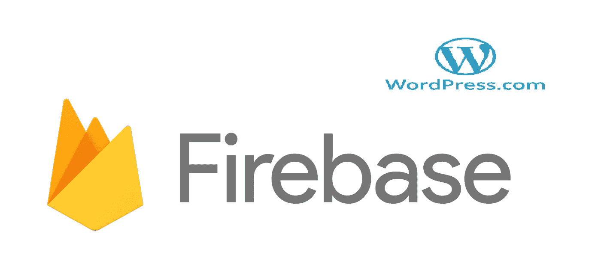
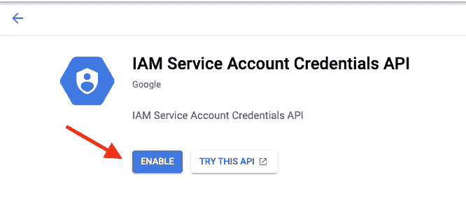
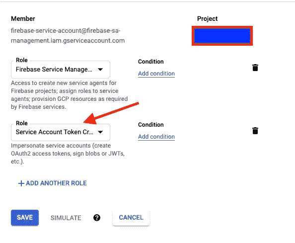

# 远程 URL 登录到 Firebase & WordPress

> 原文：<https://itnext.io/remote-url-login-to-firebase-wordpress-2027fad7c159?source=collection_archive---------3----------------------->



> 如果你对 Integrate Firebase PRO 版本感兴趣，请阅读完整的更新文档:[*【https://firebase-wordpress-docs.readthedocs.io/】*](https://firebase-wordpress-docs.readthedocs.io/)

**演示:**[**https://wordpress.dalenguyen.me/**](https://wordpress.dalenguyen.me/)

*   文章 1: [如何将 Firebase 整合到 WordPress](/how-to-integrate-firebase-and-wordpress-b017ee274687)
*   第 2 篇:[如何从 Firestore 检索数据并显示在 WordPress 上](/how-to-retrieve-data-from-firestore-and-display-on-wordpress-8638854a762e)
*   第 3 篇:[如何在 WordPress 中使用 Firebase 自定义声明](https://medium.com/@dalenguyen/how-to-work-with-firebase-custom-claims-in-wordpress-aaf83965bd20?sk=85786e3739d42b18c3e2c7344bc5f436)
*   第 4 条:[将数据从 WordPress 保存到 Firebase(实时+ Firestore)](/how-to-save-data-from-wordpress-to-firebase-realtime-firestore-2eda917d01fb)
*   第五条: [Firebase WordPress 用户集成](/firebase-wordpress-user-integration-c18a28e41cbd)
*   第六篇:[如何在 WordPress 仪表盘中管理 Firebase 用户](/firebase-users-management-in-wordpress-dashboard-61b4a1ca066)
*   第 7 篇:[如何将数据从 WordPress 同步到 Firebase](/sync-data-from-wordpress-to-firebase-d6e5860d3a06)
*   第 8 条:[一键登录 WordPress & Firebase 或通过电子邮件链接](https://medium.com/@dalenguyen/one-click-login-to-wordpress-firebase-or-via-email-link-d7610d71cd23)
*   第 9 条:[从 WordPress 上传文件到云存储](https://medium.com/@dalenguyen/upload-files-to-cloud-storage-from-wordpress-e8acc8ce70cd)
*   第十条: [**远程 URL 登录到 Firebase&WordPress**](/remote-url-login-to-firebase-wordpress-2027fad7c159)
*   第 11 条:[添加 Firebase 认证到 WordPress 的 2 种方法& WooCommerce](https://dalenguyen.medium.com/2-ways-to-add-firebase-authentication-to-wordpress-woocommerce-df500c3b104e)
*   第 12 条:[如何将 WooCommerce 购买数据发送到 Firebase](https://dalenguyen.medium.com/how-to-send-woocommerce-purchase-data-to-firebase-8c8b4c8cff39)
*   第 13 条:[从 WordPress](https://dalenguyen.medium.com/create-manage-firebase-database-from-wordpress-13347d8ffb2e) 创建&管理 Firebase 数据库

这个附加组件仍处于测试阶段。有一个 POC(概念验证),但我不知道它是否是一个好产品，是否有需要。我们会想出办法的。

# 远程认证(通过 URL)

假设你有一个 Firebase 应用程序，用户可以登录。然而，在他们可以使用你的应用程序之前，用户需要购买一个允许他们使用的包。这个产品将帮助用户从你的 Firebase 应用程序自动登录到你的 WooCommerce / WordPress 网站。这个插件并不关心用户是否存在于 WP 中，它只是用 Firebase 凭证让用户登录。就是这样。

如果你想试一试，请访问:【https://dn-wp-autologin.web.app/ 

如有任何问题或讨论，请在[https://github . com/dalen guyen/firebase-WordPress-plugin/discussions](https://github.com/dalenguyen/firebase-wordpress-plugin/discussions)创建一张票

# 先决条件

*   集成 Firebase PRO 用户
*   Firestore 服务已启用
*   用于部署云功能的节点 12

# 入门指南

确保您已经准备好 Firestore 数据库。然后将这些安全规则应用到您的收藏中。

```
match /jwtTokens/{token} {
    allow read, write: **if** false;
}
```

如果你是 PRO 用户，可以访问[我的账号](https://firebase.dalenguyen.me/shop/my-account)页面下载试用版。

然后像往常一样安装附加组件。该插件应该出现在 Firebase 选项卡下。

# 部署云功能

云函数在插件内部，所以您需要提取 zip 文件来部署它。

确保您正在运行节点 v12。如果您的机器上没有节点，请访问[节点版本管理器](https://github.com/nvm-sh/nvm)。

```
cd functions// install the package - you can run yarn or npm (pick one only)
yarn OR npm install// deploy functions
npm run deploy --project your-project-id
```

# 创建自动登录页面

用下面的短代码创建一个 WordPress 页面。

```
// you can specify the redirect page after the auto-login process
// default is home page[firebase_autologin redirect="redirect-link"]
```

# 创建重定向页面(Firebase 应用程序)

这个例子使用了 JavaScript。但是，你可以在 iOS 或 Android 或 Webapp 上使用相同的原理来实现它。关键是为登录用户调用可调用的函数。

```
<button id="auto-login" onclick="wpAutoLogin()">
...<script>// This is the WP page that you created with the shortcode
// ?jwt= is mandatory
const wpLink = 'https://example.com?jwt='const generateToken = () => {
    // Get the token from firebase
    const token = firebase.functions().httpsCallable('api-token')
    token().then((result) => {
        **if** (result.data.status) {
            const url = wpLink + result.data.data.token // Open auto-login link **for** WP
            // You can also send the URL to user **if** you want to
            // The time limit **for** the link is 1 HOUR
            window.open(url, '_blank')
        } **else** {
            console.error(result.data.message)
        }
    })
}// Start auto login process
const wpAutoLogin = **function** () {
    firebase.auth().onAuthStateChanged((user) => {
        **if** (user) {
            generateToken()
        } **else** {
            console.log(`User is not logged **in**...`)
        }
    })
}
</script>
```

# 解决纷争

## IAM 服务帐户凭据 API

IAM 服务帐户凭据 API 尚未在项目中使用…或者已被禁用。通过访问启用它…

如果您遇到此错误，只需单击链接并启用 IAM 服务。



*启用 IAM 服务*

## 呼叫者没有权限

调用方没有权限；请参考[https://firebase . Google . com/docs/auth/admin/create-custom-tokens](https://firebase.google.com/docs/auth/admin/create-custom-tokens)了解更多关于如何使用和排除该功能故障的详细信息。

对于此错误，您需要使用 Google Cloud 控制台，并向 firebase 服务帐户添加服务帐户令牌创建者角色。



*启用 IAM 服务*