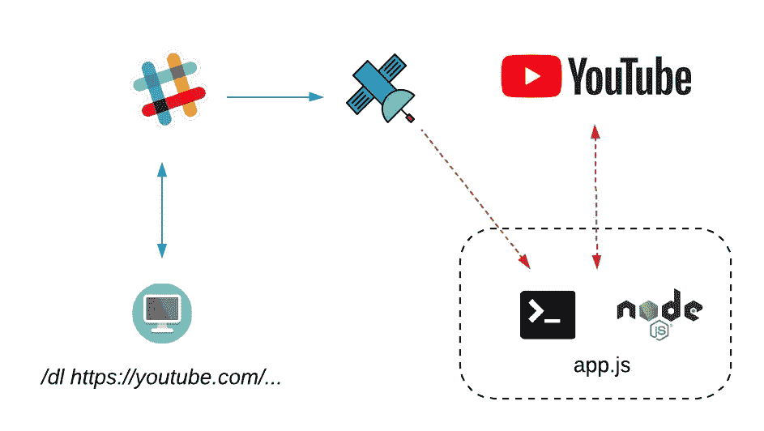
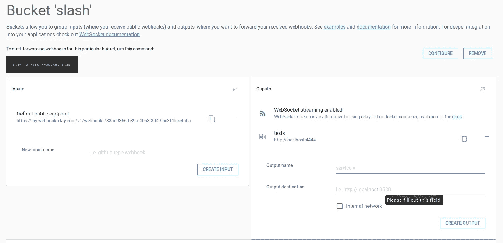
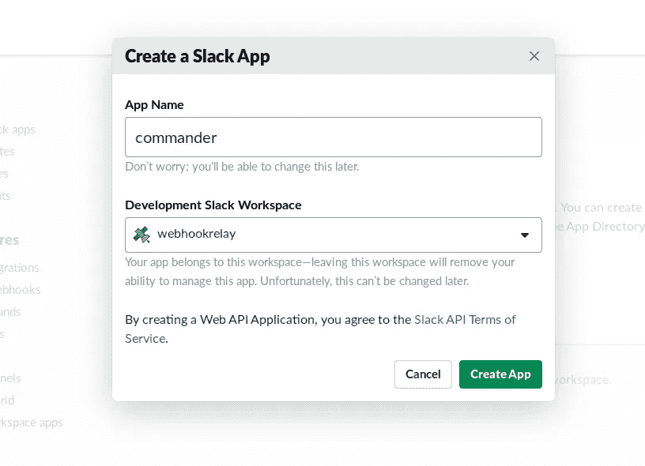
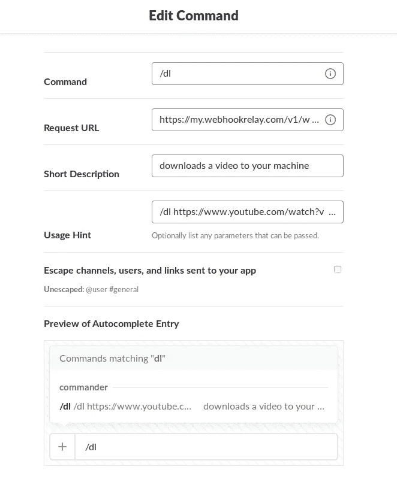
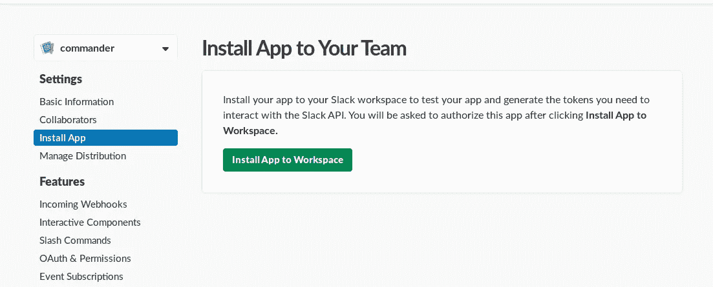

# 远程 YouTube 下载者 Slack bot

> 原文：<https://itnext.io/remote-youtube-downloader-slack-bot-dff265f57a70?source=collection_archive---------5----------------------->



我们的流程

在这个简短的教程中，我们将看到使用 Webhook 中继[套接字服务器](https://webhookrelay.com/v1/guide/socket-server)在你的应用程序中直接接收 web hook 是多么容易。我们的应用程序将是一个 [Node.js](https://nodejs.org/en/) 守护进程，它监听 webhooks 并下载用户(您)请求的视频。虽然守护程序可以用任何语言编写，但我选择了 JavaScript，因为它非常容易阅读，而且大多数人都在野外遇到过。

对于 webhook 生产者，我们将使用 Slack 和他们的 slash 命令。[松弛斜线命令](https://api.slack.com/slash-commands)的优点:

*   不需要 Slack client SDK
*   通过可以用任何语言轻松处理的 webhooks 工作
*   不需要身份验证令牌(只需要一个 webhook 端点来发送请求)

# 问题

Webhooks 很棒，但是你的应用程序需要公开到互联网上才能接收它们。它还必须有一个能够处理这些网络钩子的网络服务器。对于一个简单的应用程序或者不需要总是在线的应用程序，配置 NAT/防火墙可能是多余的。

# 解决办法

Webhook Relay + WebSocket client 可以让您的应用程序从第三方服务接收 Webhook，而无需公共 IP/域、配置 NAT，甚至 web 服务器也变得不必要。您可以直接在应用程序中处理 webhooks。

# 先决条件

1.  Webhook 中继[账户](https://my.webhookrelay.com/register)
2.  松弛帐户和工作区
3.  [npm](https://www.npmjs.com) 和节点。JS 在你的机器上

# 创建一个 webhook 转发桶

我们将创建一个存储桶(存储桶用于对 Webhook 中继中的输入/输出进行分组)来捕获和中继松弛的 web hook。转到[桶页面](https://my.webhookrelay.com/buckets)并创建一个名为`slash`的新桶。它将获得一个默认的公共端点，我们将在下一步中使用它。也创建一个内部输出，目的地并不重要，但它将帮助我们进行调试:



创建存储桶

# 创建松弛斜线命令应用程序

首先，我们需要一种简单的方法来发送网页挂钩。我最初想尝试 Airtable 和 Google Sheets，但对他们的服务中缺乏 webhooks 感到非常失望。Zapier 似乎试图在这方面提供一些帮助，但是他们的网络挂钩只能每 15 分钟工作一次，即使这样我也没有收到任何网络挂钩..:)所以，另一个明显而简单的选择是[松弛斜线命令](https://api.slack.com/slash-commands)。

> Slash 命令让用户直接从 Slack 的消息框中触发与你的应用的交互。

创建一个斜杠命令实际上比你想象的要简单得多，看看官方文档中的[。想出一个名称并选择一个工作区:](https://api.slack.com/slash-commands#creating_commands)



创建闲置应用程序

现在，从“添加特性和功能”中选择**斜线命令**并填写一些细节:



您可以使用命令前缀`/dl`进行创作，因为我们的应用程序不会使用它，只有命令后面的文本会在代码中使用。在请求 URL 中添加您的 Webhook 中继输入端点，即`https://my.webhookrelay.com/v1/webhooks/....`。一旦您对细节满意，保存并安装它:



现在，每当我们键入`/dl https://www.youtube.com/watch?v=tPEE9ZwTmy0`，它就会发送一个 webhook 到 Webhook 中继输入，从那里我们可以把它中继到我们的应用程序。试试看，会被俘虏的。

# 分析松弛命令有效负载

一旦我们得到了测试载荷，我们需要检查它里面有什么。不幸的是，我找不到让它发送 JSON 的方法，所以我们必须使用`Content-Type: [ "application/x-www-form-urlencoded" ]`。Webhook 中继有助于解析消息:

```
token: gp9AyhCMqffRI2pahREQrg2S
team_id: T3QT2DM0Q
team_domain: webhookrelay
channel_id: C3RLQ5C4C
channel_name: general
user_id: U3S9BEU6B
user_name: karolis
command: /dl
text: [https://www.youtube.com/watch?v=tPEE9ZwTmy0](https://www.youtube.com/watch?v=tPEE9ZwTmy0)
response_url: [https://hooks.slack.com/commands/T3QT2DM0Q/495886160947/J0YHv46ot6nZNeHiGR4a1I12](https://hooks.slack.com/commands/T3QT2DM0Q/495886160947/J0YHv46ot6nZNeHiGR4a1I12)
trigger_id: 495384852801.126920463024.5438c17b6d97870e3a05f145c6d4bc70
```

因此，我们现在知道我们将选择哪些领域:

*   **正文** —这是我们下载的网址
*   **response_url** —这是我们可以回复用户的地方

# 创建我们的应用程序

应用程序代码可以在 [Github repo](https://github.com/webhookrelay/slack-slash-downloader) 上找到，可以随意克隆。为了让我们的生活更轻松，一些主要的图书馆:

*   [https://github.com/przemyslawpluta/node-youtube-dl](https://github.com/przemyslawpluta/node-youtube-dl)—下载视频。
*   https://github.com/ljharb/qs—查询字符串解析(帮助我们解析 Slack 负载)。
*   [https://github.com/request/request](https://github.com/request/request)—简单的 HTTP 客户端。尽管我总是更喜欢使用 stdlib，但在这种情况下，它对我来说更好。

对于读者来说，下面是整个应用程序:

通过以下方式从[https://github . com/webhook relay/slack-slash-downloader/blob/master/package . JSON](https://github.com/webhookrelay/slack-slash-downloader/blob/master/package.json)安装依赖项:

```
npm install
```

# 运行应用程序

要启动它，从[令牌页面](https://my.webhookrelay.com/tokens)中检索令牌，并将其设置为环境变量:

```
export RELAY_KEY=your-token-key
export RELAY_SECRET=your-token-secret
```

然后:

```
node app.js
```

一旦它开始运行，你就可以开始通过 Slack 下载视频，只需输入:

```
/dl [https://www.youtube.com/watch?v=H_4eRD8aegk](https://www.youtube.com/watch?v=H_4eRD8aegk)
```


机器人响应迟缓

应用程序日志应该与此类似:

```
URL:  [https://www.youtube.com/watch?v=H_4eRD8aegk](https://www.youtube.com/watch?v=H_4eRD8aegk)
Download started
Filename: justforfunc #43 - Migrating Go Modules to v2+-H_4eRD8aegk.mp4
Size: 61705357
Finished downloading!
ok
```

您的文件应该出现在与应用程序相同的目录中:

```
➜  slack-slash-downloader git:(master) ✗ ls -alh
total 97M
drwxrwxr-x  4 karolis karolis 4.0K Dec  5 23:37  .
drwxr-xr-x 12 karolis karolis 4.0K Dec  4 10:40  ..
-rw-rw-r--  1 karolis karolis 2.8K Dec  4 23:11  app.js
drwxrwxr-x  8 karolis karolis 4.0K Dec 12 19:39  .git
-rw-rw-r--  1 karolis karolis   27 Dec  4 23:11  .gitignore
-rw-rw-r--  1 karolis karolis  59M Dec  5 23:37 'justforfunc #43 - Migrating Go Modules to v2+-H_4eRD8aegk.mp4'
drwxrwxr-x 61 karolis karolis 4.0K Dec  4 12:07  node_modules
-rw-rw-r--  1 karolis karolis  38M Dec  4 11:29 'Overwatch Winter Wonderland Details Leaks, Skins and More!--b-DktHyWJk.mp4'
-rw-rw-r--  1 karolis karolis  386 Dec  4 12:07  package.json
-rw-rw-r--  1 karolis karolis  16K Dec  4 12:07  package-lock.json
```

您可以修改代码，将其放入您的下载目录或任何您想要保存文件的地方。

# 综上

在这个技术演示中，我们展示了一个轻量级 Node.js 守护进程如何在没有公共 IP 或运行 web 服务器的情况下接收和处理 webhooks 的实际用例。这可以大大简化整个应用程序，减少攻击面，并在此基础上提供审计功能。

你可以在这里阅读更多关于 Socket Server 的内容:[https://webhookrelay.com/v1/guide/socket-server](https://webhookrelay.com/v1/guide/socket-server)

*原载于 2018 年 12 月 12 日*[*webhookrelay.com*](https://webhookrelay.com/blog/2018/12/12/remote-tube-downloader/)*。*