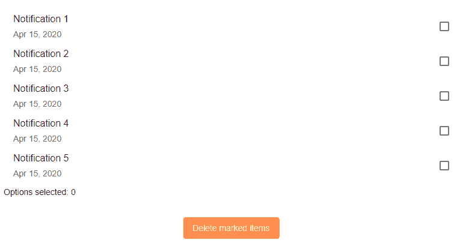
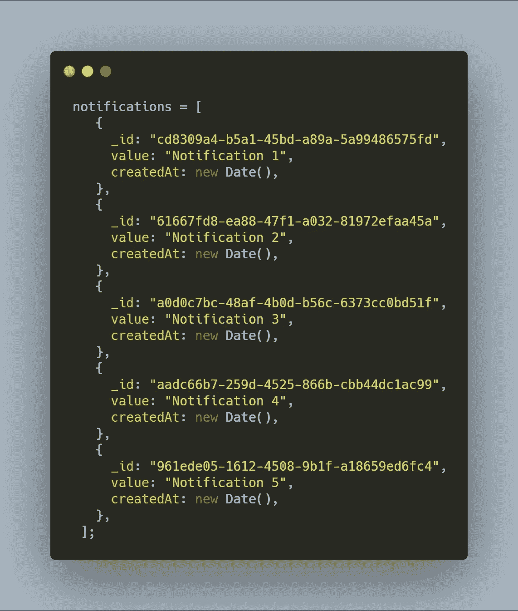
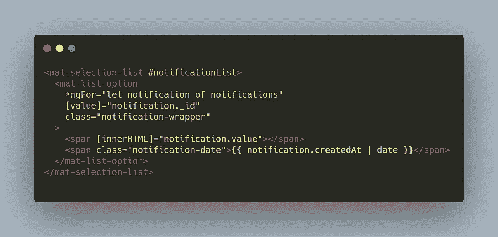
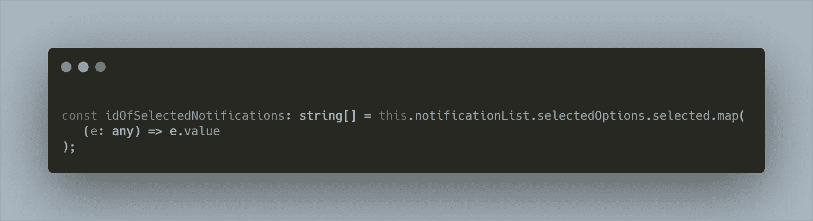
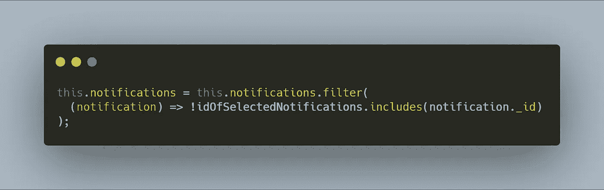
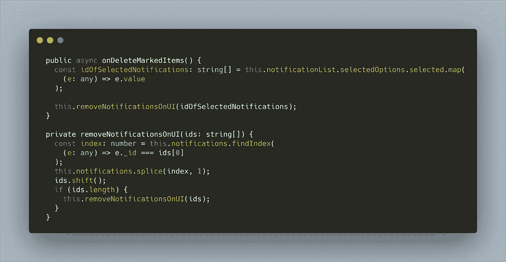

# 如何从数组中 remove🗑multiple 元素— CPAS 1

> 原文：<https://itnext.io/remove-elements-from-an-array-recursively-cpas-1-856cc44613c5?source=collection_archive---------5----------------------->

了解如何使用命令式或声明式编程从数组中移除多个对象。

卢卡·布拉沃在 [Unsplash](https://unsplash.com/s/photos/array-code?utm_source=unsplash&utm_medium=referral&utm_content=creditCopyText) 上的照片

# 序

> 经过多年的编码，我意识到编码，80–90%的时间，涉及解决相同和相同的问题。我可以肯定地说，我创建的 80%的应用程序中，几乎 80%的代码都是相同的。所以我们可以说，我们作为开发人员解决的问题是一样的。考虑到这一点，我决定制作一个名为**的故事系列——常见问题和解决方案。**我将从一个特别常见的情况开始这个系列，从一个数组中删除多个元素。

# 真实案例场景

一个可能的场景是下面的应用程序，其中我们有一个待办事项列表，或者在我们的例子中，有一个通知列表。目标是选择多个元素，然后一次删除它们。

# 问题是

通知对象如下所示:

问题是，我们不仅有一个对象数组，而且有它们唯一的字段， ***_id，*** 是一个 ***UUID。*** 正因为如此，我们不能对它们进行升序或降序排序，这样删除过程会容易得多。

# 解决方案👨‍💻

对于这个问题，我想出了两种不同的解决方案。

*   声明式解决方案
*   迫切的解决办法

你可以在栈溢出文章中读到更多关于它们的不同之处。

## 解决方案 1 —声明式

简单来说，声明性意味着我们编写描述我们想要发生的事情的代码，我们不知道具体的实现以及它在幕后是如何工作的。

因为我们有一个角度应用程序，我们的列表类型是***mat-selection-list***

。超文本标记语言

并且我们在模板中绑定了通知的 ***_id*** ，我们可以使用下面的代码片段简单地得到选中的项目:

现在要从 ***notification*** 对象中删除选中的条目，我们可以利用 ***filter*** 方法删除 id 不在***idsOfSelectedNotifications***数组中的通知。

实现如下所示:

***filter*** 函数将遍历 vector***notifications***并只返回括号内条件为真的元素。

## 解决方案 2 —必要性

在第二个解决方案中，用**命令式**编程来解决它，我们需要一步一步地告诉编译器我们想要发生什么。

为了让事情更有趣，我们将使用递归。

我先展示最终代码，然后再解释。

*   按下删除按钮时，触发功能`**onDeleteMarkedItems**`
*   和前面一样，向量是用要删除的元素的 id 构建的
*   向量被发送到递归函数
*   递归函数将从向量`**ids**`中获取第一个 id；将在`notifications`数组中寻找其对应的位置，然后从该位置删除向量`notifications`中的元素。之后它将移动`ids`向量，然后调用函数，直到数组`ids`为空；

# 结论

如果我们比较这两种变体，第一种解决方案不仅更容易编写和理解，而且在执行速度方面也更胜一筹。递归解决方案的性能随着数组中元素数量的增加而降低。

然而，我也展示了这个解决方案，作为理解递归函数的额外练习。😃