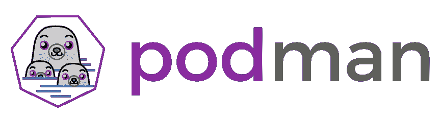
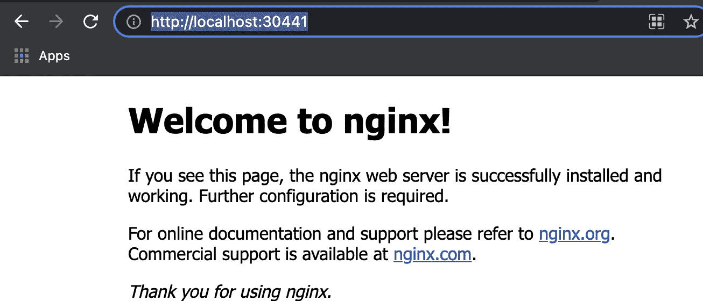

# 删除对 Docker CLI 的依赖

> 原文：<https://itnext.io/removing-dependency-on-docker-cli-94c96fcaa024?source=collection_archive---------3----------------------->

了解如何使用 Lima VM 和 Podman 作为您首选的 OCI 集装箱管理器，消除对 Docker 产品(包括 Docker CLI)的所有依赖。



# 目标

对于这篇文章，我们将重点放在波德曼的建设，包装和拉开放集装箱倡议(OCI)的标准图像。
我们将向希望留在 linux 中进行开发的开发人员展示 lima-vm，他们可以在 linux 来宾操作系统中使用 Podman 来构建映像，将它们托管在 lima 上的本地注册表中，然后在 K3S 上部署它们。

我们使用这些文章来完成这些步骤:

1.  [https://medium . com/@ AbhijeetKasurde/running-pod man-machine-on-MAC OS-1 F3 FB 0 DBF 73d](https://medium.com/@AbhijeetKasurde/running-podman-machine-on-macos-1f3fb0dbf73d)
2.  [https://Marcus noble . co . uk/2021-09-01-从码头工人迁移到搬运工](https://marcusnoble.co.uk/2021-09-01-migrating-from-docker-to-podman)
3.  [https://www . techrepublic . com/article/how-to-setup-a-local-image-repository-with-pod man/](https://www.techrepublic.com/article/how-to-set-up-a-local-image-repository-with-podman/)
4.  [https://cwienczek . com/2020/06/import-images-to-k3s-without-docker-registry/](https://cwienczek.com/2020/06/import-images-to-k3s-without-docker-registry/)

# 波德曼

*   Podman 是一个“无后台容器引擎”,用于构建、打包和提取 OCI 标准映像。
*   Podman 提供了一个 Docker 兼容的命令行界面
*   Podman 可以在 linux 机器上本地使用，也可以通过多种方式远程使用，或者通过 VM 使用，这将在下一节中介绍

在 Mac 电脑上运行 Podman 时，我们探讨了几种选择，每种选择在相互比较时都有优点和局限性:

*   利马虚拟机
*   波德曼-远程
*   波德曼机器

# 利马虚拟机

Lima 用于在终端内部创建一个独立的 Linux 环境，然后可以用来运行 Linux 兼容软件，如 Podman。
这种独立的 shell 提供的好处是，Podman 在其首选操作系统中运行，这允许在遵循 Podman 文档的同时实现相对无缝的流程。

# 波德曼-远程

Podman-Remote 是一种与 Lima VM 配合使用的方法，目的是尝试将工作空间转移回 Mac 终端。使用 Podman-Remote，用户创建一个 linux VM，在这种情况下，使用 Lima VM 进行测试，并启动一个 Podman 服务器实例。然后，Podman-Remote 试图从本地终端 ssh 到 linux 服务器，允许在本地使用 Podman 命令，同时使用 VM 执行实际操作。

# 波德曼机器

Podman Machine 与 Podman-Remote 非常相似，它使用虚拟机来执行其操作，但是使用 Podman Machine 时，Podman 会启动自己的虚拟机，允许所有操作在 Mac 终端中进行，而无需设置单独的虚拟机终端或 Lima VM 等附加软件。

# 安装和设置 Lima 来宾虚拟机

Lima 可通过 brew 获得。一旦安装完毕，limactl 就是用来启动 ubuntu VM 的 CLI，它允许用户通过 shell 进入 ubuntu VM。一旦进入 VM，更新包管理器 apt，然后安装最新的 podman。完成后，安装 k3S

```
$ brew install lima
$ limactl start ubuntu
$ limactl shell ubuntu
lima $ sudo apt update
lima $ sudo apt install -y podman
lima $ curl -sfL [https://get.k3s.io](https://get.k3s.io) | sh -
lima $ GITHUB_URL=https://github.com/kubernetes/dashboard/releases
VERSION_KUBE_DASHBOARD=$(curl -w ‘%{url_effective}’ -I -L -s -S     lima ${GITHUB_URL}/latest -o /dev/null | sed -e ‘s|.*/||’)
sudo k3s kubectl create -f [https://raw.githubusercontent.com/kubernetes/dashboard/${VERSION_KUBE_DASHBOARD}/aio/deploy/recommended.yaml](https://raw.githubusercontent.com/kubernetes/dashboard/${VERSION_KUBE_DASHBOARD}/aio/deploy/recommended.yaml)
lima $ exit
```

# 正在本地启动 Lima 虚拟机

要启动 lima guest 虚拟机的实例，请启动 shell，运行 list 命令(稍后需要从主机连接到 guest 虚拟机),然后 shell 进入之前设置的 ubuntu 虚拟机。

```
$ limactl shell ubuntu systemctl — user start podman.socket
$ limactl ls
$ limactl shell ubuntu
```

# 设置本地容器注册表

```
lima$ sudo vi /etc/containers/registries.conf
```

registries.conf 的*updated*内容如下所示，不同之处在于不安全、拦截和位置行必须取消注释，并且位置必须更新为 localhost:5000

```
[[registry]]
# # The “prefix” field is used to choose the relevant [[registry]] TOML table;
# # (only) the TOML table with the longest match for the input image name
# # (taking into account namespace/repo/tag/digest separators) is used.
# #
# # If the prefix field is missing, it defaults to be the same as the “location” field.
# prefix = “example.com/foo”
#
# # If true, unencrypted HTTP as well as TLS connections with untrusted
# # certificates are allowed.
insecure = true
#
# # If true, pulling images with matching names is forbidden.
blocked = false
#
# # The physical location of the “prefix”-rooted namespace.
# #
# # By default, this equal to “prefix” (in which case “prefix” can be omitted
# # and the [[registry]] TOML table can only specify “location”).
# #
# # Example: Given
# # prefix = “example.com/foo”
# # location = “internal-registry-for-example.net/bar”
# # requests for the image example.com/foo/myimage:latest will actually work with the
# # internal-registry-for-example.net/bar/myimage:latest image.
location = “localhost:5000”
```

现在需要重新启动 Podman 来应用新的配置，并且应该能够使用 localhost。

```
lima$ sudo mkdir -p /var/lib/registry
lima$ sudo podman run — privileged -d — name registry -p 5000:5000 -v /var/lib/registry:/var/lib/registry — restart=always registry:2lima$ sudo systemctl restart podman
lima$ podman pull docker.io/library/hello-world
lima$ podman tag docker.io/library/hello-world localhost:5000/hello-world3lima$ podman push localhost:5000/hello-world3
Getting image source signatures
Copying blob f22b99068db9 done 
Copying config d1165f2212 done 
Writing manifest to image destination
Storing signatureslima$ podman images
REPOSITORY TAG IMAGE ID CREATED SIZE
docker.io/library/hello-world latest d1165f221234 6 months ago 20.4 kB
localhost:5000/hello-world latest d1165f221234 6 months ago 20.4 kB
localhost:5000/hello-world2 latest d1165f221234 6 months ago 20.4 kB
localhost:5000/hello-world3 latest d1165f221234 6 months ago 20.4 kB
```

# 远程连接到 Lima 虚拟机并构建映像

为了从主机 VM 远程调用 podman，podman 需要添加到 podman-remote 的连接。使用从客户机 VM 的 limactl 返回的信息，设置适当的 SSH 地址。

## 利马外壳内部:

```
$ sudo systemctl enable ssh.service
$ systemctl — user enable — now podman.socket
$ podman — remote info
$ ssh-keygen (press enter until keys are generated for default location)
$ ls /run/user/ (take note of the number that appears here)
```

## 主机外壳内部:

```
$ podman-remote system connection add myuser — default ssh://127.0.0.1/run/user/{number retrieved from above}/podman/podman.sock
$ lima podman — remote images (This will confirm if connection worked)
$ lima podman — remote run localhost:5000/hello-world
```

# 将 OCI 容器发布到 K3S 注册表

一旦建立了映像，K3S 需要将映像导入到本地 K3S 容器注册表中。使用先前使用 podman 构建的容器映像，下面将创建一个 tar 文件，然后可以导入到 K3S 中。

## 本地 mac 计算机

```
$ lima podman — remote images
REPOSITORY TAG IMAGE ID CREATED SIZE
localhost/testimage3 latest d6e5f702489e 39 hours ago 167 MB
localhost/testimage2 latest d6e5f702489e 39 hours ago 167 MB
localhost/testimage latest d6e5f702489e 39 hours ago 167 MB
localhost/my-app-buildah latest 1d486b95d2b5 39 hours ago 167 MB
docker.io/library/ubuntu latest fb52e22af1b0 12 days ago 75.2 MB$ lima podman — remote save > testimage.tar localhost/testimage3
$ ls
dashboard.admin-user-role.yml dashboard.admin-user.yml nginx-deployment.yaml testimage.tar
```

## 来宾利马虚拟机

```
lima$ sudo k3s ctr images import k3s/testimage.tar 
unpacking localhost/testimage3:latest (sha256:145e94b8ccfa8f79fd805df090f981d510382184e29dc4da4bb5805fe8ce4bf6)…done
```

# 将应用程序部署到 K3S

为了简单起见，测试中使用的应用程序是一个简单的 nginx 图像，这使得测试更加容易。docker 文件如下所示。因为来宾 Lima 虚拟机是只写的，所以在主机的用户目录中创建这些文件(这些文件对 Lima 虚拟机是只读的)。

## Dockerfile 文件

```
FROM ubuntu:latest 
#
# Update the image to the latest packages
RUN apt-get update && apt-get upgrade -y 
#
# Install NGINX to test.
RUN apt-get install nginx -y
 # Expose port 80
EXPOSE 80

#
# Last is the actual command to start up NGINX within our Container
CMD [“nginx”, “-g”, “daemon off;”]
```

## 部署

```
$ cat nginx-deployment.yaml 
apiVersion: apps/v1
kind: Deployment
metadata:
 name: test-app
 labels:
 name: test-app
spec:
 replicas: 1
 selector:
 matchLabels:
 name: test-app
 template:
 metadata:
 labels:
 name: test-app
 spec:
 containers:
 — name: test-app
 image: localhost/testimage3
 imagePullPolicy: Never
 ports:
 — name: http
 containerPort: 80
 protocol: TCP
```

# 使用 K3S 附带的 kubcetl CLI 部署 nginx

在这一步，K3S 准备好利用本地主机推送版本的测试应用程序来部署应用程序。K3S 包括一个 kubectl 客户端作为安装的一部分，这简化了事情。

```
lima$ sudo k3s kubectl apply -f k3s/nginx-deployment.yaml
deployment.apps/test-app createdlima$ sudo k3s kubectl describe deployments test-app
Name: test-app
Namespace: default
CreationTimestamp: Sun, 12 Sep 2021 10:52:09 +0000
Labels: name=test-app
Annotations: deployment.kubernetes.io/revision: 1
Selector: name=test-app
Replicas: 1 desired | 1 updated | 1 total | 1 available | 0 unavailable
StrategyType: RollingUpdate
MinReadySeconds: 0
RollingUpdateStrategy: 25% max unavailable, 25% max surge
Pod Template:
 Labels: name=test-app
 Containers:
 test-app:
 Image: localhost/testimage3
 Port: 80/TCP
 Host Port: 0/TCP
 Environment: <none>
 Mounts: <none>
 Volumes: <none>
Conditions:
 Type Status Reason
 — — — — — — — — 
 Available True MinimumReplicasAvailable
 Progressing True NewReplicaSetAvailable
OldReplicaSets: <none>
NewReplicaSet: test-app-7d67cfd55b (1/1 replicas created)
Events:
 Type Reason Age From Message
 — — — — — — — — — — — — -
 Normal ScalingReplicaSet 5s deployment-controller Scaled up replica set test-app-7d67cfd55b to 1lima$ sudo k3s kubectl get pods
NAME READY STATUS RESTARTS AGE
test-app-7d67cfd55b-jz6k6 1/1 Running 0 28s
```

一旦部署成功，我们就可以通过节点端口公开部署

```
$sudo kubectl expose deployment test-app — type=NodePort — name=test-app2
service/test-app2 exposed
```

要验证服务现在是否公开，请再次调用 get services CLI 命令并获取 NodePort，然后通过 localhost 进行访问。

```
lima$ sudo kubectl get services
NAME TYPE CLUSTER-IP EXTERNAL-IP PORT(S) AGE
kubernetes ClusterIP 10.43.0.1 <none> 443/TCP 16h
test-app LoadBalancer 10.43.192.220 <pending> 80:30509/TCP 153m
example-service NodePort 10.43.201.53 <none> 8080:31689/TCP 4m23s
test-app2 NodePort 10.43.48.32 <none> 80:30441/TCP 72s

lima$ curl [http://localhost:30441](http://localhost:30441)
<!DOCTYPE html>
<html>
<head>
<title>Welcome to nginx!</title>
<style>
 body {
 width: 35em;
 margin: 0 auto;
 font-family: Tahoma, Verdana, Arial, sans-serif;
 }
</style>
</head>
<body>
<h1>Welcome to nginx!</h1><p>If you see this page, the nginx web server is successfully installed and
working. Further configuration is required.</p><p>For online documentation and support please refer to
<a href=”[http://nginx.org/](http://nginx.org/)">nginx.org</a>.<br/>
Commercial support is available at
<a href=”[http://nginx.com/](http://nginx.com/)">nginx.com</a>.</p><p><em>Thank you for using nginx.</em></p>
</body>
</html>
```



# 使用 kubectl 从外部访问集群

1.  将/etc/rancher/k3s/k3s.yaml 复制到位于集群外部的计算机上，作为~/。kube/配置。
2.  如果尝试从主机虚拟机访问 K3S 群集，则不需要此步骤。然后用 K3s 服务器的 IP 或名称替换“localhost”。
3.  kubectl 现在可以管理您的 K3s 集群了。