# 从 DOM 中移除不可见的视图，同时仍然能够改变它们的状态

> 原文：<https://itnext.io/removing-non-visible-views-from-the-dom-while-still-being-able-to-alter-their-state-dd366ed185ec?source=collection_archive---------3----------------------->

特别是当你的用户界面越来越大的时候，如果你保持最小的 DOM，它可以显著地提高性能→ UX。对于许多用例，您仍然希望更改非活动(不再渲染)视图的状态。

# 内容

1.  介绍
2.  问题是
3.  解决方案
4.  它是如何工作的？
5.  我们能在 Angular、React 或 Vue 中达到同样的效果吗？
6.  在线演示
7.  neo.mjs 是什么？
8.  将单页应用程序扩展到多个浏览器窗口

# 1.介绍

观看视频时，请关注开发工具中的 DOM。我在不同的卡片(活动视图)之间切换，打开设置侧栏，并改变非活动视图的设置。不活动的视图在 DOM 中是**而不是**。当重新激活视图时，会出现最新状态并保持滚动状态。

# 2.问题是

尤其是在我为 Sencha 工作的时候，当客户端应用程序越来越大时，UI 性能一直是一个主要的痛点。

我说的是有 100 多个视图的用户界面，其中许多嵌套在标签页中，或者只是卡片布局。

这总是一种折衷:要么销毁不可见视图的实例，这意味着销毁 JS 实例，并且不再能够访问甚至更改组件状态，要么将所有视图保留在 DOM 中，导致 ui 越大性能越差。

想想选项卡式表单，您希望在不同的选项卡中验证字段而不是其他字段。对于这样的用例，您必须保留所有视图。

例如，让我们看一下近地天体日历(正在进行的工作):

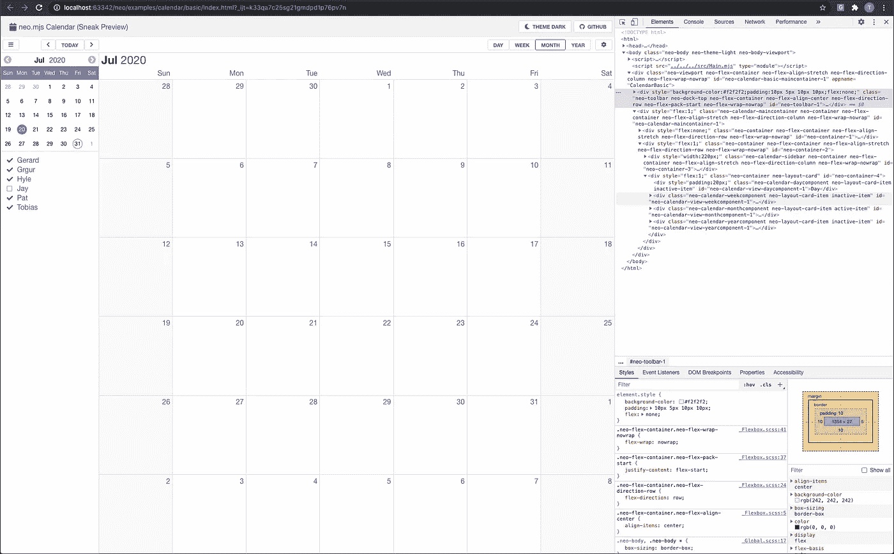

如果您仔细观察:带有“neo-layout-card”类的 div 包含 4 项:日、周、月和年视图。现在想象一下，您将向该日历添加 100 多个事件，同时影响所有视图。

这仍然是一个“小”的例子，对于大规模的 ui 来说，这个问题会变得更加严重。

# 3.解决方案

我们想要的是这样的 DOM 标记:

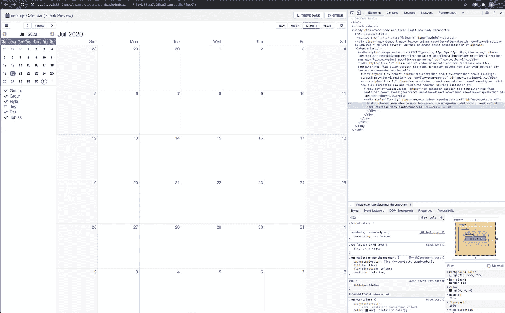

卡片布局现在只包含一项:月视图。如果你仔细观察，你还会注意到设置侧边栏也不在 DOM 中。

显然，您可以通过删除非活动视图的实例来实现这一点，但这不是目标。

现在，我们正在打开(& mounting)设置视图，并激活年视图设置选项卡:

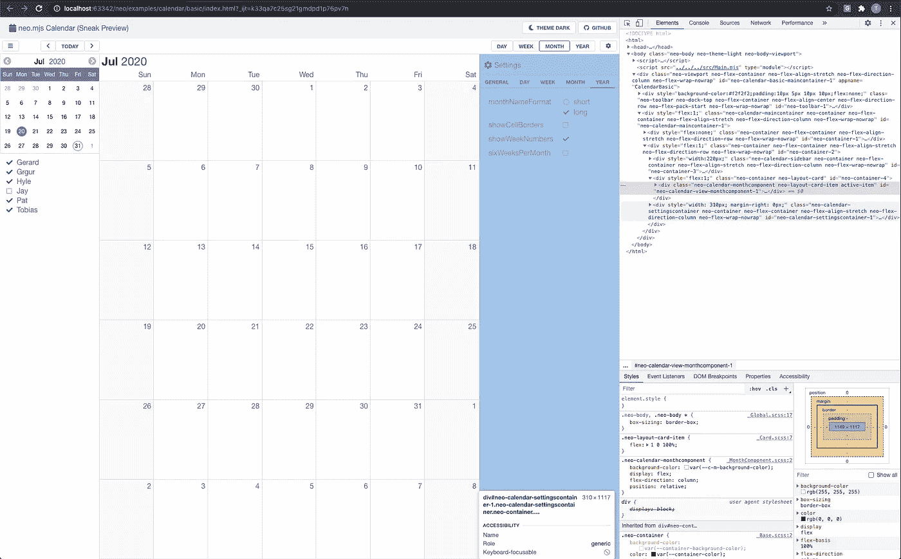

您会注意到，设置视图现在在 DOM 中，卡片布局仍然只包含月视图。

我们选中“showSixWeeksPerMonth”复选框:

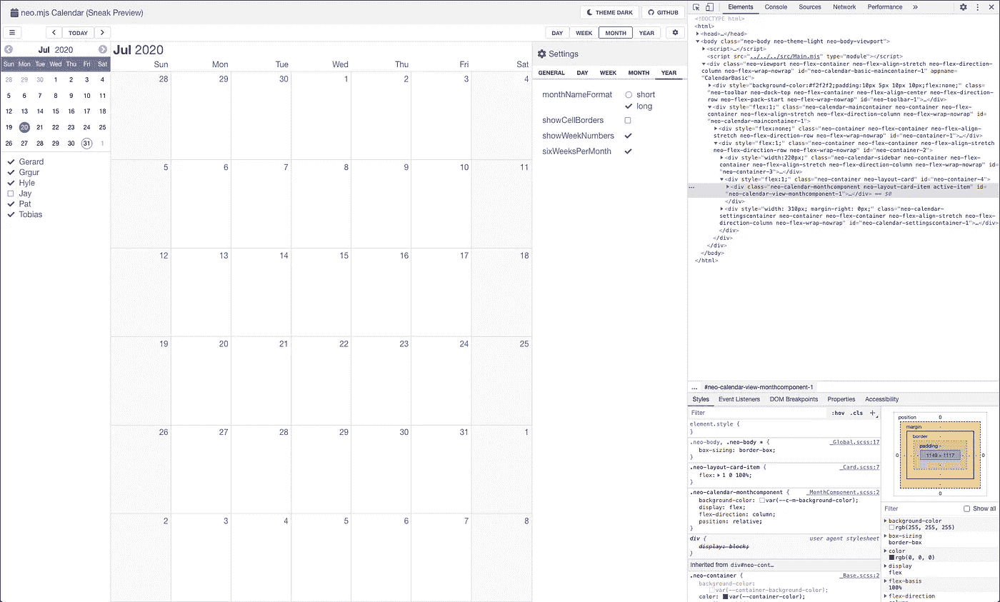

现在我们导航到年视图:

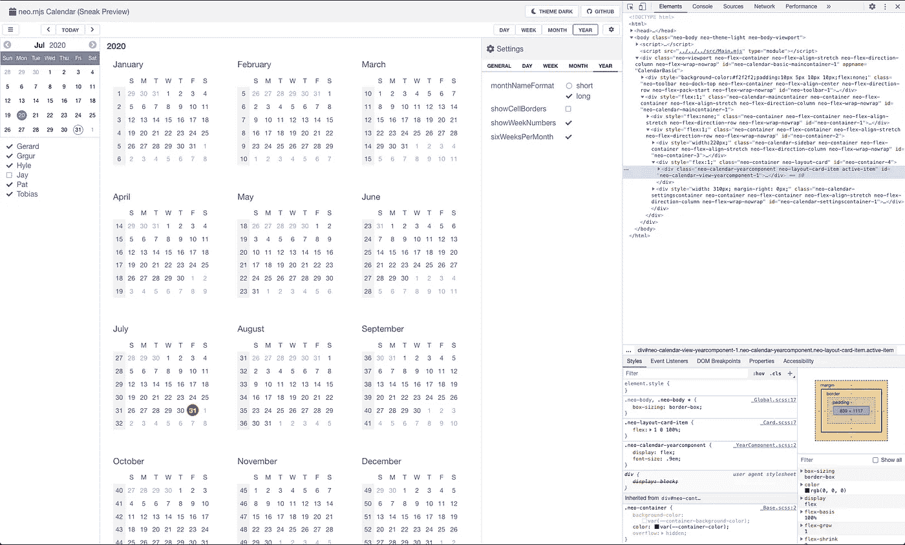

视图每月显示 6 行(这不是默认值)，月视图不再在 DOM 中。

现在你可以说:“这很容易，因为年视图还没有出现！”

公平点。让我们切换到常规设置:

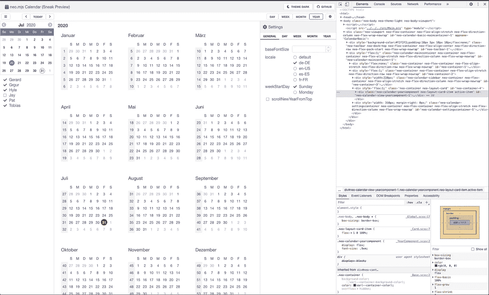

我们将语言切换到德语，这将立即影响活动年视图。现在我们打开月视图设置:

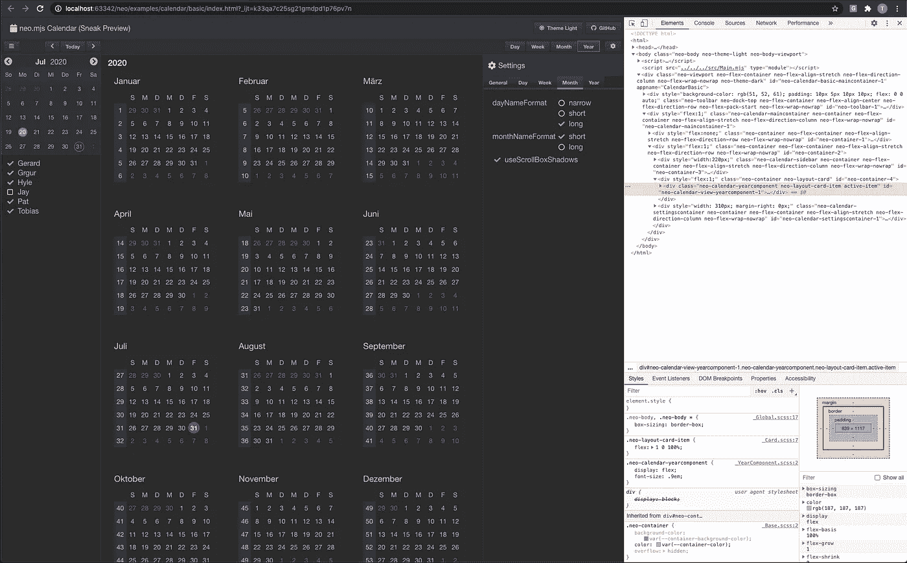

我们将 Dark Theme 格式切换到 long，然后切换到 Dark 主题。

现在，我们将导航回月视图:

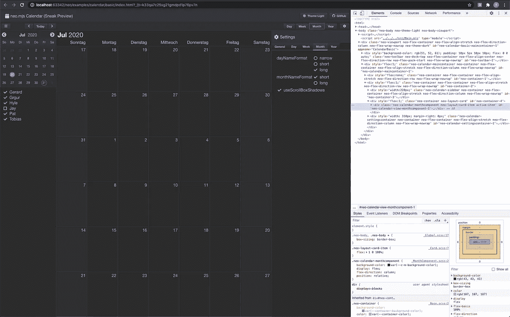

在这一点上，你可能会很兴奋，因为我们的设置更改会立即生效。

让我们关闭设置视图:

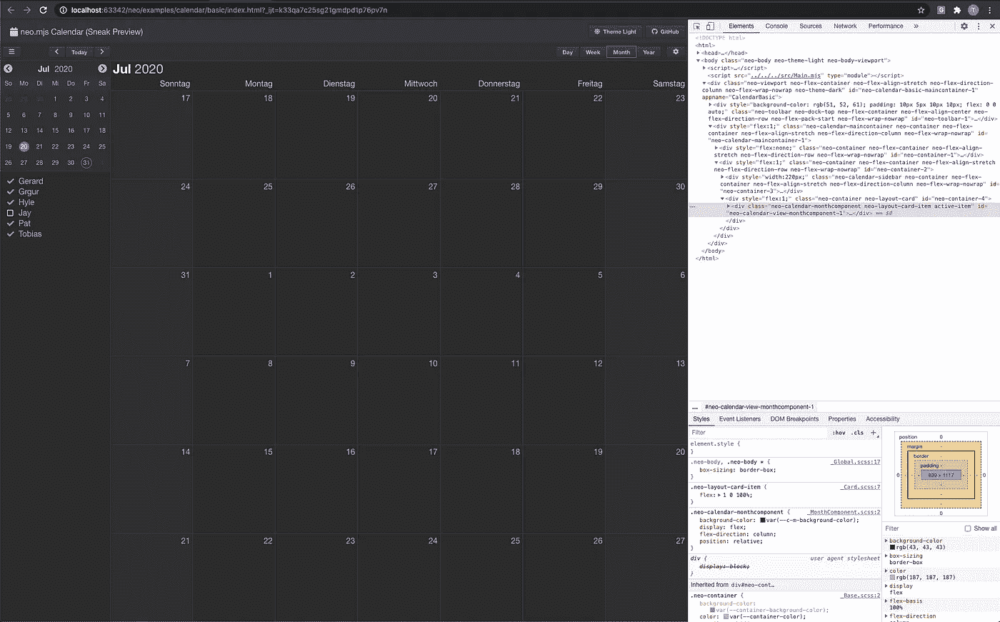

设置侧边栏不再位于 DOM 中。万一我们再打开，看起来还是一样的。

您还可以在月视图中滚动(就像在视频中看到的那样)，导航到不同的视图并返回，滚动状态仍然和以前一样。

# 4.它是如何工作的？

使用 neo.mjs 设置，实际上非常容易。

让我们来看看:

[https://github . com/neom js/neo/blob/dev/src/calendar/main container . mjs](https://github.com/neomjs/neo/blob/dev/src/calendar/MainContainer.mjs)

日历主容器将立即创建所有 4 个视图。

您可以为每个视图传递配置，这允许您以任何方式更改它们的配置。这也包括模块配置，因此您可以扩展子模块类，添加您喜欢的配置和方法，并使用您自己的类。

我将在下一篇博文中更深入地讨论这一部分。

每个视图都将存储在内部引用中:

> myCalendar.monthComponent、myCalendar.yearComponent 等。

下一步，我稍微改进了一下卡片布局:

[https://github . com/neom js/neo/blob/dev/src/layout/card . mjs # L83](https://github.com/neomjs/neo/blob/dev/src/layout/Card.mjs#L83)

这里重要的部分是第 32 行:

我们将 vdom 标志“removeDom: true”添加到每个非活动卡中。

这将从真实的 DOM 中移除卡。

我们仍然为每张卡保留 JS 实例和 vdom。

这允许我们继续更改配置，然后将配置添加到虚拟 DOM 中。一旦我们将非活动卡放回原处，我们就可以从包装盒中获得其 vdom 的最新状态。

让我们来看看几个月来的设置视图:

[https://github . com/neom js/neo/blob/dev/src/calendar/view/month component . mjs # L152](https://github.com/neomjs/neo/blob/dev/src/calendar/view/MonthComponent.mjs#L152)

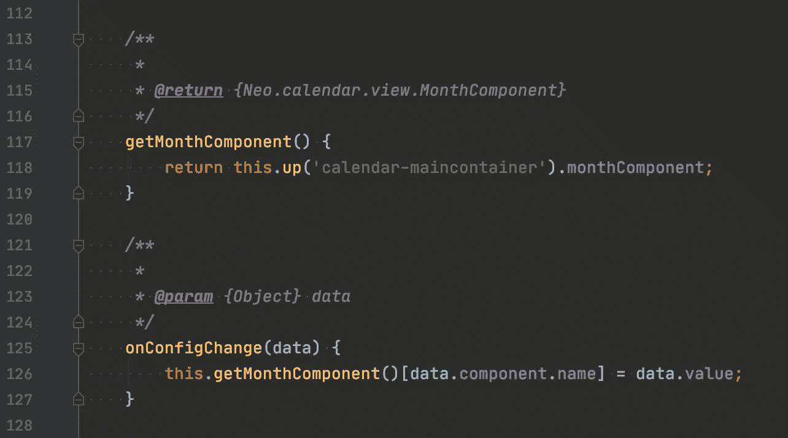

我们在这里基本上做的是:

mycalendarinstance . month component . dayname format = " long "；

在配置驱动的框架中，你只需要改变一个配置。

这将触发:

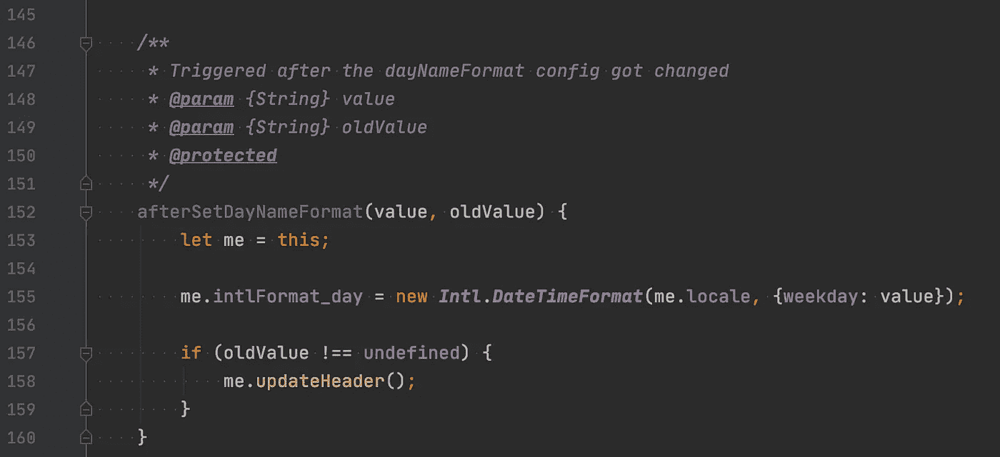

这将改变当前格式并更新虚拟 DOM。

# 5.我们能在 Angular、React 或 Vue 中达到同样的效果吗？

老实说，我已经很久没有研究这些库和框架了。我不知道！

请随意添加评论，我会更新这篇文章。

# 6.在线演示

这是新日历组件的预览版本。

请不要期望它能完全发挥作用。开发正在进行中，最终版本计划在 1.4 版发布。

[https://neom js . github . io/pages/node _ modules/neo . mjs/dist/production/examples/calendar/basic/index . html](https://neomjs.github.io/pages/node_modules/neo.mjs/dist/production/examples/calendar/basic/index.html)

# 7.neo.mjs 是什么？

neo.mjs 是一个开源项目(整个代码库以及所有示例和演示应用程序都使用 MIT 许可证)。

 [## 近地天体

### neo.mjs 使您能够使用一个以上的 CPU 创建可扩展的高性能应用程序，而无需使用…

github.com](https://github.com/neomjs/neo) 

含义:可以免费使用。

它会一直这样。

然而，该项目需要**更多的出资者**以及**的资助者**。

很多(！)路线图上还有更多项目和想法。

如果你想为一个可爱的开源项目做贡献，我会非常感激。

万一这个项目对你的公司有或者将会有商业价值:注册成为赞助商可以让我投入更多的时间，从而加快新事物的交付时间。

# 8.将单页应用程序扩展到多个浏览器窗口

neo.mjs 框架当前的亮点是它能够将整个虚拟 DOM 树移动到不同的浏览器窗口中。

如果你正在考虑在多个屏幕上运行的应用程序，你会喜欢这个:

 [## 将单页应用程序扩展到多个浏览器窗口

### 内容

medium.com](https://medium.com/swlh/expanding-single-page-apps-into-multiple-browser-windows-e6d9bd155d59) 

问候&快乐编码，
托拜厄斯