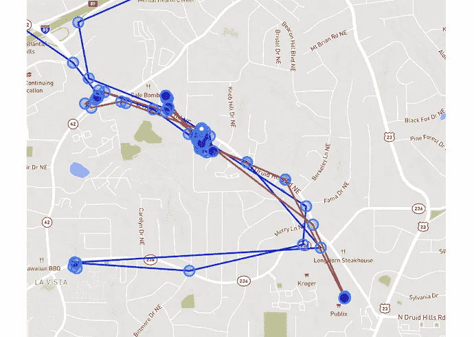
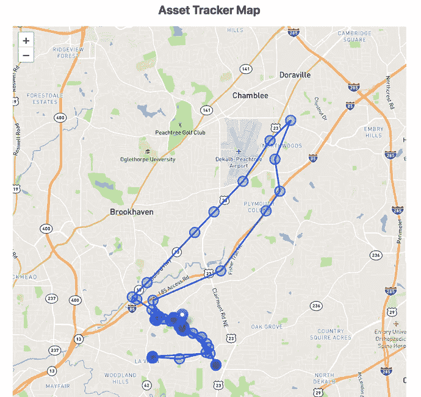
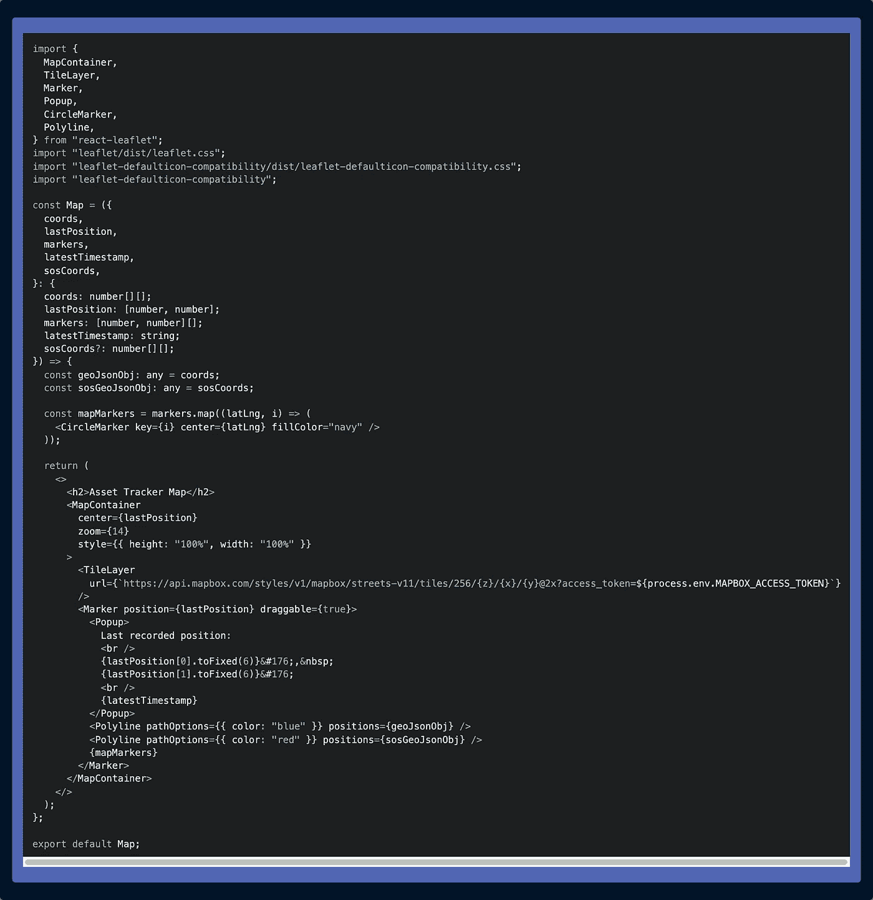
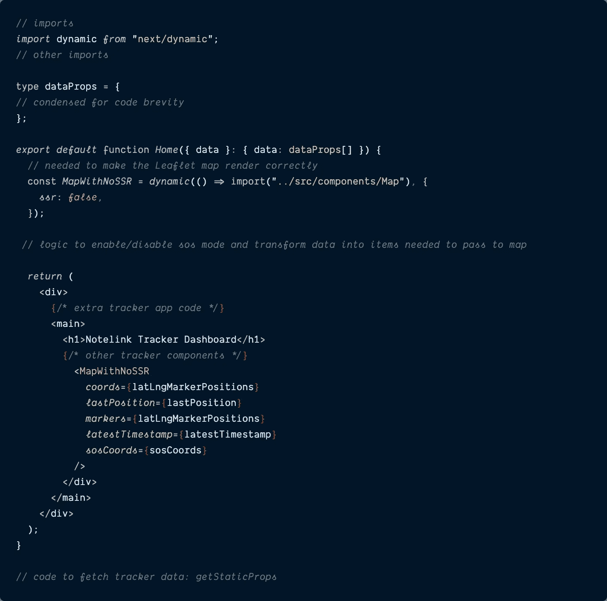
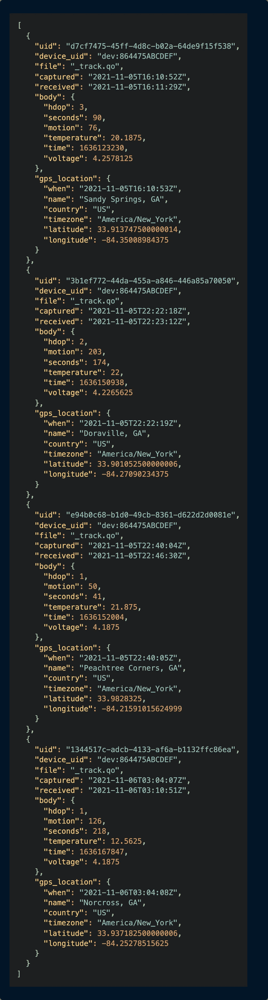
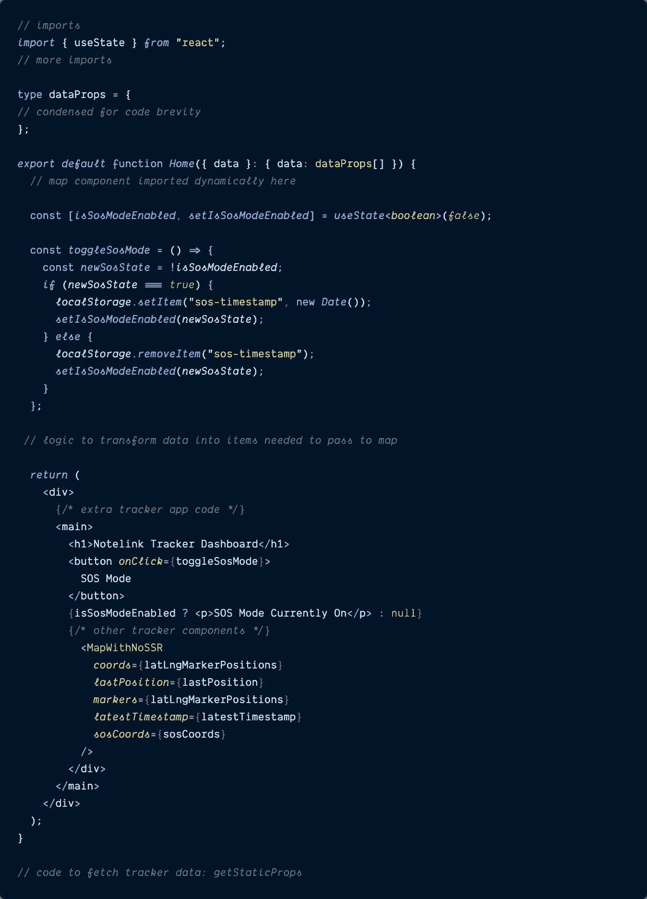
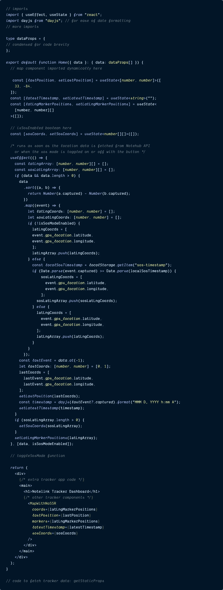

# 使用折线在 React 贴图上渲染多条彩色线

> 原文：<https://itnext.io/render-multiple-colored-lines-on-a-react-map-with-polylines-2bedd8ae5af?source=collection_archive---------3----------------------->

## React 传单地图中需要多种颜色的线条？折线是解决方案。



# 介绍

去年夏天，我开始为一家物联网初创公司 [**Blues Wireless**](https://blues.io/?&utm_source=medium&utm_medium=web&utm_campaign=niedringhaus-effect&utm_content=ep-2) 工作，该公司的目标是通过使用一种 [**Notecard**](https://blues.io/products/notecard/?&utm_source=medium&utm_medium=web&utm_campaign=niedringhaus-effect&utm_content=ep-2) 将传感器数据作为 JSON 传输到安全云 [**Notehub**](https://notehub.io/?&utm_source=medium&utm_medium=web&utm_campaign=niedringhaus-effect&utm_content=ep-2) 来为任何物联网设备提供预付费蜂窝互联网连接，从而使物联网开发变得更加容易。

在之前的一篇[](https://www.paigeniedringhaus.com/blog/create-an-asset-tracker-with-next-js-and-react-leaflet)**文章中，我展示了我如何使用 Next.js 和 React 传单来构建一个资产追踪器地图，以近乎实时的方式显示移动的便笺在哪里(在我的车内)。当感恩节假期我父母的车在车道上被偷的时候，这个练习变得比我想象的更加方便，我在拜访的时候在后座上放了一张卡片。**

**尽管便签卡是在汽车被偷并被扔出窗外后不久被发现的，但在很短的时间内，我们(和警察)能够凭借我的仪表盘地图在镇上跟随汽车，这一经历在几个月后的一次全公司黑客马拉松中启发了我。**

**在汽车被盗期间，如果地图上的点与点之间的线除了标准的蓝色之外，还可以是其他颜色，以便更容易识别汽车被盗后的位置，这将非常有帮助。因此，对于黑客马拉松，我创建了一个具有“SOS 模式”的新仪表板，不仅在启用 SOS 模式后在地图上用红色绘制线条，还增加了笔记卡获取位置读数的频率，以获得更好的准确性。**

****今天，我将向您展示如何使用 Next.js 中的 React 传单创建地图，能够在正常或紧急情况下通过触摸按钮渲染不同颜色的线条来进行资产跟踪。****

# **在 Next.js 应用程序中设置地图组件**

****请注意:**这篇文章不会介绍如何建立一个全新的 Next 项目，也不会深入解释如何从 Blues Wireless Notecard 获取资产跟踪数据，因为我已经在[这篇文章](https://www.paigeniedringhaus.com/blog/create-an-asset-tracker-with-next-js-and-react-leaflet)中介绍过了。**

> ***要看完代码，可以在这里* ***查看我的 GitHub repo* [***。***](https://github.com/paigen11/notelink-tracker-dashboard)****

## **安装地图项目依赖项**

**在本教程中，我们要做的第一件事是将地图添加到下一个项目中。这将需要一些新的 npm 包添加到我们的项目中: [**传单**](https://leafletjs.com/) ，[**react-传单**](https://react-leaflet.js.org/) 和 [**传单-默认-兼容性**](https://github.com/ghybs/leaflet-defaulticon-compatibility) 。**

**在终端中运行以下代码行。**

```
$ npm install leaflet react-leaflet leaflet-defaulticon-compatibility
```

> *****注意:*** *如果* `*react*` *和* `*react-dom*` *还没有出现在您的项目中，您还需要它们作为对等依赖项。***

****打字稿备注:****

**如果您在项目中使用 TypeScript，您还会希望安装以下 dev 依赖项以避免 TypeScript 错误:**

```
$ npm install @types/leaflet --save-dev
```

**安装新的项目依赖项后，我们将设置组件来使用它们。**

## **为地图的显示样式生成地图框标记，并将其添加到工程中**

**对于资产跟踪器将要显示的地图，我选择使用样式。它有多种可供选择，开发者可以创建自己的 [**Mapbox API 令牌**](https://docs.mapbox.com/help/getting-started/access-tokens/) 通过注册一个免费的 [**Mapbox 帐户**](https://account.mapbox.com/auth/signup/) 来访问这些样式。**

**注册并创建新的 API 令牌后，复制令牌值。在项目根目录下的 Next.js 应用程序的`next.config.js`文件中，添加 API 令牌，如下所示:**

**`[**next.config.js**](https://github.com/paigen11/notelink-tracker-dashboard/blob/main/next.config.js)`**

```
/** @type {import('next').NextConfig} */
module.exports = {
  reactStrictMode: true,
  env: {
    MAPBOX_ACCESS_TOKEN:
      "[MAPBOX_TOKEN]",
  },
};
```

**从这个文件中，Next 可以在需要调用 Mapbox API 端点时访问令牌。现在我们可以继续在我们的项目中创建`<Map />`组件。**

## **创建<map>组件</map>**

****

**这是正常情况下显示资产位置的地图外观。**

**因为这是一个 React 项目，单独的、可重用的组件是游戏的名字，所以创建一个名为`Map.tsx`的新文件并粘贴以下代码。**

> ***点击下面的文件标题可获得实际代码。***

**`[**Map.tsx**](https://github.com/paigen11/notelink-tracker-dashboard/blob/main/src/components/Map.tsx)`**

****

**让我们简单讨论一下这里发生了什么。**

**在文件的开头，我们导入所有必要的 React 传单组件、传单 CSS 和传单默认图标兼容性 CSS 和 JS(这是[推荐的](https://www.npmjs.com/package/leaflet-defaulticon-compatibility#usage)以使传单的图标按预期工作)。**

**然后我们看到了`Map`组件期望的道具:**

*   **`**coords**` -具有 GPS 纬度和经度的数组列表:这在地图标记之间绘制连接线。**
*   **`**lastPosition**` -当用户点击地图上的图标时，在弹出窗口中显示的最新 GPS 纬度和经度。**
*   **`**markers**` -另一个具有 GPS 纬度和经度的数组列表，用于显示地图上追踪器过去所在位置的蓝色圆圈。**
*   **`**latestTimestamp**` -收到的 GPS 坐标的最新时间戳(也用于显示在地图的弹出窗口中)。**
*   **`**sosCoords**` -当在应用程序中启用“SOS 模式”时，创建一个单独的 GPS 坐标列表:它将以红色绘制地图标记之间的连接线。**

**现在把你的注意力转向文件中更下面的 JSX。**

**`**<MapContainer />**`组件负责创建传单地图实例。没有这个组件，地图将无法工作，我们还定义了地图的`center`坐标、默认缩放级别和组件的基本样式。**

**组件是我们的 Mapbox 样式和新的 API 令牌的来源。选择适合您的样式，替换字符串的`streets-v11`部分，并确保地图框标记出现在`next.config.js`文件中，我在上一步中已经展示过了。如果没有这个组件，没有坐标的地图背景将会被渲染，取而代之的是一个空白的画布。**

**`**<Marker />**`接受`lastPosition`道具，在地图上显示跟踪器最后记录位置的图标，并包装`<Popup />`组件、`<Polyline />`组件和`<CircleMarker />`组件列表。**

**组件是一个好看的工具提示，可以显示信息。当用户点击时，我的`<Popup />`显示跟踪器的最后 GPS 坐标和报告时间。**

**`**<Polyline />**`组件是传递 GPS 坐标的`coords`列表或`sosCoords`列表以绘制地图标记之间的连接线的地方。`Polyline`对象接受`positions`，在本例中是`geoJsonObj`或`sosGeoJsonObj`，而`pathOptions`决定了所呈现线条的颜色。**

****最后但并非最不重要的是组件，在组件的 JSX 中显示为`{mapMarkers}`。****

> *******注:*** *为了将列表中的所有* `*markers*` *渲染为地图上的单个圆圈，我必须创建这个小函数来迭代列表并生成所有的圆圈，然后将其直接注入 JSX。*****
> 
> ****试图迭代 JSX 中的所有值是行不通的。****

****现在我们的`Map`组件已经被剖析了，让我们继续用数据填充地图，从蓝线到红线，然后再返回。****

## ****在 Next.js 应用程序中渲染地图****

****让这个地图在我们的 Next.js 应用程序中工作的下一步是导入带有`ssr: false`选项的`Map`组件。****

****`react-leaflet`库只在客户端工作，所以 Next 的`[**dynamic import()**](https://nextjs.org/docs/advanced-features/dynamic-import#with-no-ssr)` [**支持没有 SSR**](https://nextjs.org/docs/advanced-features/dynamic-import#with-no-ssr) 特性，必须保证组件不会试图在服务器端渲染。****

****下面是这个组件将在其中显示的`index.tsx`文件的代码，为了清楚起见，进行了压缩。如果你想在 GitHub 中看到完整的代码，点击文件名。****

****`[**pages/index.tsx**](https://github.com/paigen11/notelink-tracker-dashboard/blob/main/pages/index.tsx)`****

********

****现在还不要太担心被传递给组件的道具——我们很快就会设置它们。****

****现在，我们的`<Map />`组件被动态导入，Next 的服务器端渲染被禁用，该组件可以像应用程序中的任何其他组件一样使用。****

# ****为地图提取数据****

****在我之前的 [**资产跟踪仪表板文章**](https://www.paigeniedringhaus.com/blog/create-an-asset-tracker-with-next-js-and-react-leaflet) 中，我详细介绍了如何创建自己的资产跟踪器，使用 Blues 无线硬件为应用程序生成真实数据，并通过 Notehub cloud 的 API 将这些数据提取到应用程序中。****

****如果您想沿着这条路构建自己的跟踪器并将数据发送到 Notehub，请自便。****

****在这篇文章中，我将跳到我们已经通过 Next.js `getStaticProps` API 调用将数据拉入应用程序的部分。第一次到达时，来自 Notehub 云的 JSON 数据如下所示:****

********

****这个数组中的每个 JSON 对象都是一个单独的`_track.qo`运动事件，显示记事卡的当前位置和传感器读数。在这篇文章中，我们关心的对象部分是`gps_location`值:`latitude`、`longitude`和`captured`值。这是我们绘制地图所需的数据。****

****很快，我们将转换这些数据以适应我们的`<Map />`组件的道具——我们将在为应用程序创建 SOS 模式后立即处理这些数据。****

## ****在应用程序中配置 SOS 模式****

********

****SOS 按钮在应用程序中切换 SOS 模式。****

****在转换这个 JSON 数据之前，我们需要为应用程序提供打开或关闭 SOS 模式的选项(这会改变地图中呈现的折线的颜色)。****

****为了构建这个，我们需要在我们的`index.tsx`文件中添加一个新的状态变量、函数和按钮。****

****`[**pages/index.tsx**](https://github.com/paigen11/notelink-tracker-dashboard/blob/main/pages/index.tsx)`****

********

****在上面的文件中，我们添加了一个新的`isSosModeEnabled`布尔值:这将让应用程序知道在紧急跟踪情况下是否有新的位置事件发生。****

****接下来，我们创建一个名为`toggleSosMode()`的新函数。这个函数将改变`isSosModeEnabled`的状态，并在浏览器的本地存储器中存储一个名为`sos-timestamp`的时间戳。我将这个时间戳存储在本地存储中，以便它可以与启用 SOS 模式后到达应用程序的事件进行比较，应用程序将知道它是否需要用红色或蓝色渲染地图上的折线。我们将在下一节讨论这部分的逻辑。****

****最后，在组件的 JSX 中，我们将创建一个新的`<button>`元素，并将`toggleSosMode()`函数附加到它的`onClick()`方法上。我还在按钮下方添加了一个`<p>`标签，以显示 SOS 模式在应用程序中的生效时间。****

****在应用模式后按下按钮将打开它，再次按下它将关闭它。****

******现在我们可以在浏览器中随意打开和关闭 SOS 模式，是时候获取我们的位置数据并将其转换到地图中了。******

## ******重塑跟踪器事件数据******

******我们的`index.tsx`文件将需要更多的状态变量来满足`<Map />`组件需要的所有不同的数据属性。我再次精简了逻辑，使这个文件更容易阅读，但您可以随时单击文件名在线查看其完整内容。******

******`[**pages/index.tsx**](https://github.com/paigen11/notelink-tracker-dashboard/blob/main/pages/index.tsx)`******

********

****在我们的主组件中，一旦从 Notehub 获取了数据，我们就设置以下新的 React `useState`变量来保存要传递给`<Map />`组件的数据。****

****`lastPosition`、`latestTimestamp`、`latLngMarkerPositions`和`sosCoords`，是我们需要的新的状态变量。****

****声明这些状态后，无论何时从 Notehub(在组件挂载时)获取数据或切换应用程序的 SOS 模式，都会运行`useEffect()`函数。在函数内部，来自 Notehub 的事件被排序并遍历。****

****如果`isSosModeEnabled`布尔值为真，则从浏览器的本地存储中取出`sos-timestamp`，并将该时间戳的日期与每个事件的`captured`时间戳进行比较，从而可以将该事件正确分类到`sosLatLngArray`列表或`latLngArray`列表中。****

****一旦这些局部数组被组装到`useEffect()`中，它们就被设置为等于状态变量`latLngMarkerPositions`和`sosCoords`。****

****如果`isSosModeEnabled`为假，那么所有事件都将自动添加到`latLngArray`列表中。****

****其他变量`lastPosition`和`latestTimestamp`通过从排序后的数据数组中取出最后一个事件并从中提取属性来设置。****

****然后所有这些变量被传递给`<Map />`组件，它知道如何处理标记、弹出窗口和线条颜色。****

# ****测试一下****

****好吧！我想我们正在阅读来测试我们的地图和彩色线条！****

****如果你使用的是我们的模拟数据，而不是来自 Notehub cloud 的实时数据流，测试该应用程序最简单的方法是通过浏览器中的按钮打开 SOS 模式，然后将[浏览器的 DevTool 本地存储](https://developer.chrome.com/docs/devtools/storage/localstorage/)中的时间戳调整为至少在某些事件`captured`时间戳之前。****

****如果一切都按计划进行，你应该会看到一个彩色线条的组合，这取决于 SOS 模式的时间设置和事件发生的时间。****

********

****当 SOS 模式开启时，启用后发生的新事件显示为红线。****

> *****请记住，这个应用程序是在一天内完成的，所以它还很粗糙，当然还没有准备好迎接黄金时间。如果你愿意的话，我建议在把它放入 prod 之前，对它进行分叉，并做一些额外的润色和测试。*****

****现在你有了:React 应用程序中地图上的彩色线条。对于一天的工作来说还不算太寒酸。****

# ****结论****

****去年夏天我加入了一家物联网初创公司后，我开始开发 web 应用程序，以反映我们的物联网设备在现实世界中捕获和传输的数据，并将其发送到云端。在一次全公司的黑客马拉松中，我创建了一个仪表板，不仅可以显示位置数据，还可以随意将位置线从蓝色更改为红色。****

****这似乎是一个很好的特性，可以在紧急情况下提高地图的可读性。****

****Next.js 与 React 传单库的结合使这一切成为可能，在这个时间框架内，我有了一个工作原型(虽然非常粗糙)给我的同事看。从事这项工作非常有趣，在此过程中我学到了很多新东西。这是我心目中成功的黑客马拉松。****

****过几周再来看看——我会写更多关于 JavaScript、React、IoT 或其他与 web 开发相关的东西。****

****如果你想确保你不会错过我写的一篇文章，在这里注册我的时事通讯:[https://paigeniedringhaus.substack.com](https://paigeniedringhaus.substack.com/)****

****感谢阅读。我希望看到如何在 Next.js 中设置一个交互式地图，并根据不同的情况在不同的位置点之间呈现多种颜色的旅行线，对您有所帮助。快乐映射！****

# ****参考资料和更多资源****

*   ****[Hackster.io 原始资产跟踪项目](https://www.hackster.io/paige-niedringhaus/low-code-gps-asset-tracker-and-map-display-b10419)****
*   ****[SOS 资产追踪 GitHub 回购](https://github.com/paigen11/notelink-tracker-dashboard)****
*   ****[传单文件](https://leafletjs.com/)****
*   ****[React 传单文件](https://react-leaflet.js.org/)****
*   ****[地图框网站](https://www.mapbox.com/)****
*   ****蓝调无线[网站](https://blues.io/?&utm_source=paigeniedringhaus.com&utm_medium=web&utm_campaign=niedringhaus-effect&utm_content=ep-2)****

*****原载于*[*https://www.paigeniedringhaus.com*](https://www.paigeniedringhaus.com/blog/render-multiple-colored-lines-on-a-react-map-with-polylines)*。*****