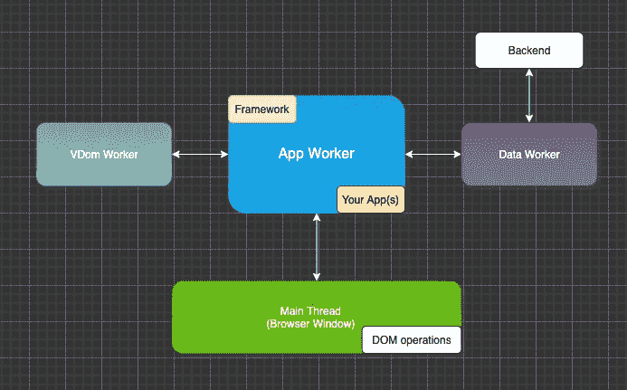
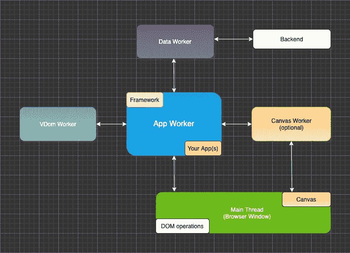
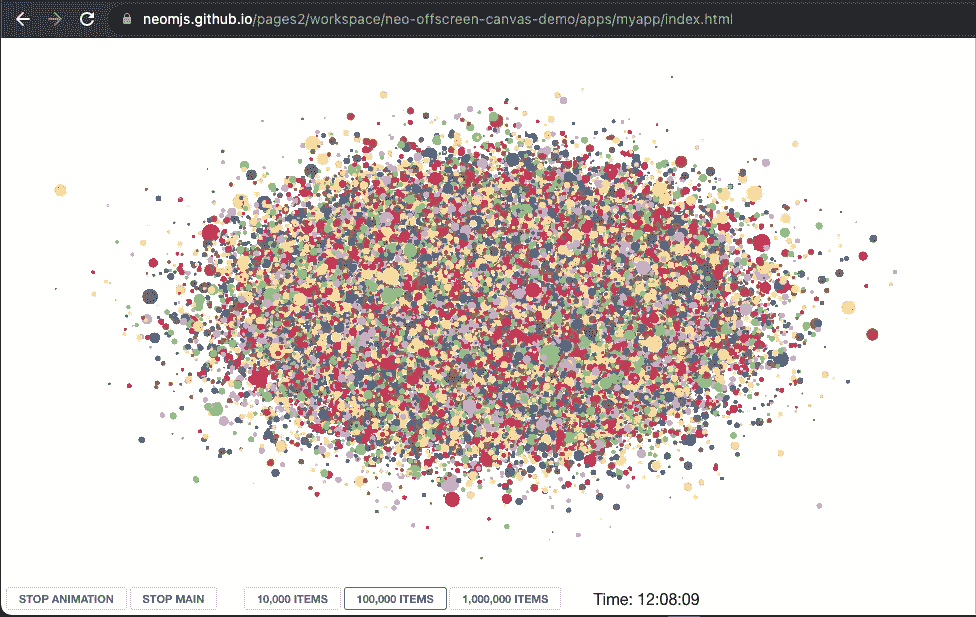
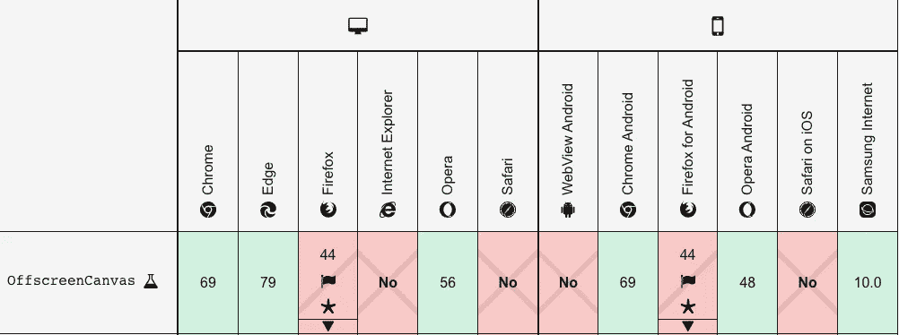
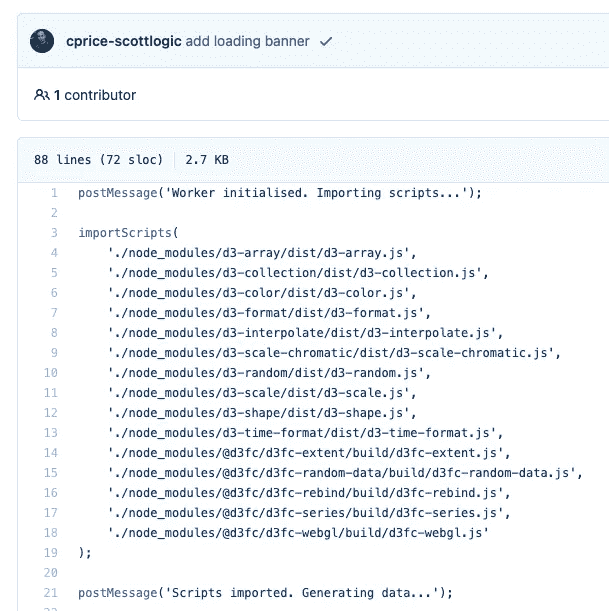
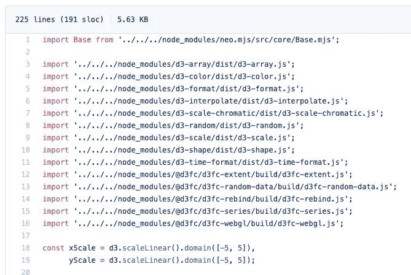

# 在屏幕外渲染 3d:使用 canvas workers 获得最佳性能

> 原文：<https://itnext.io/rendering-3d-offscreen-getting-max-performance-using-canvas-workers-88c207cbcdc2?source=collection_archive---------0----------------------->

[OffscreenCanvas Web API](https://developer.mozilla.org/en-US/docs/Web/API/OffscreenCanvas) 使我们能够将画布 DOM 元素的所有权转移到 [workers](https://developer.mozilla.org/en-US/docs/Web/API/Worker) 中。

由于 workers 在一个单独的线程中运行(如果可能的话，使用您自己的 CPU ),这意味着昂贵的应用程序相关的 JS 逻辑不会降低您的画布渲染性能，反之亦然:您的画布的昂贵逻辑不会影响您的应用程序的其余部分。

好的用例是图像操作以及呈现交互式图表或地图。由于 Canvas 也支持 WebGL，使用屏幕外概念创建游戏引擎也是有意义的。

# 内容

1.  介绍
2.  浏览器支持
3.  与框架相关的增强
4.  荣誉
5.  创建基于 neo.mjs 的演示应用程序
6.  创建自定义 WebGlComponent
7.  看着画布。助手类
8.  直接在浏览器中使用 d3
9.  演示视频
10.  在线演示
11.  最后的想法

# 1.介绍

工人无权访问 DOM → `window`以及`window.document`未定义。

没有这个 API 实现多线程有点棘手。neo.mjs 项目很好地解决了这个问题:



使用应用程序工作者作为主要参与者会使主线程尽可能地空闲。虚拟 DOM 是实现这一点的必要条件，因为您的应用程序(包括您的组件)位于 App worker 内部。

为了充分利用 OffscreenCanvas Web API，我们需要以下列方式增强 workers 设置:



“将屏幕外的画布和应用程序工作者结合起来”也是这篇文章的合适标题，但是我们也将在这个设置中介绍如何创建一个基于 WebGL 的演示应用程序:



# 2.浏览器支持

Chromium (Chrome，Edge)已经很好地支持了新的 API。

虽然兼容性表乍一看很吓人，



重要的是要知道 Mozilla (Firefox)和 Webkit (Safari)团队都在积极推动这个话题。

 [## 1390089 -(屏幕外画布)[meta]屏幕外画布

### 核心画布中的新(没有人):WebGL。最后更新 2021-07-29。

bugzilla.mozilla.org](https://bugzilla.mozilla.org/show_bug.cgi?id=1390089) 

估计:“最理想的是今年”

 [## 183720 -完成屏幕外画布实现

### 错误 183720:完成屏幕外画布实现

bugs.webkit.org](https://bugs.webkit.org/show_bug.cgi?id=183720) 

“现在 [bug 224178](https://bugs.webkit.org/show_bug.cgi?id=224178) 已经登陆，我相信所有主要的屏幕外 Canvas 特性都已经实现，并在 Linux 平台上启用。巩固和优化这个实现还有相当多的工作要做，当然也要在所有平台上实现它，但是基础已经在那里了。万岁！”

我们需要时间来创建令人惊奇的实现，所以现在开始是有意义的。

# 3.与框架相关的增强

我们首先需要的是新的 canvas worker:
[src/worker/canvas . mjs](https://github.com/neomjs/neo/blob/dev/src/worker/Canvas.mjs)

这里的关键部分是使用`afterConnect()`方法创建一个新的`MessageChannel`，它在应用程序和 Canvas workers 之间建立了一个直接连接(postMessages 不需要通过主线程传递)。

我们将画布节点存储在一个`map`配置中，使用
DOM (===组件 id)作为键。

我们还需要创建一个新的组件类:
[src/Component/canvas . mjs](https://github.com/neomjs/neo/blob/dev/src/component/Canvas.mjs)

我们使用默认为`true`的`offscreen`配置。

在一个新的 canvas 组件被挂载后，`afterSetMounted()`方法将被触发。如果`offscreen`设置为 true，它将请求 canvas 节点的所有权并将其传递给 canvas worker(canvas worker 将把它存储在刚才提到的 map 中)。

之后，`offscreenRegistered` config 将被设置为 true，这样我们就可以使用`afterSetOffscreenRegistered()`作为我们自己的组件实现的入口点。

任务完成。

# 4.荣誉

由于我不想涵盖所有关于如何使用 WebGL 的逻辑(离题)，我正在寻找一个很好的和记录良好的演示。

我很幸运！

克里斯·皮尔斯做了这么好的一件作品，真是太棒了！

[](https://blog.scottlogic.com/2020/03/19/offscreen-canvas.html) [## 使用屏幕外画布呈现图表

### 对于浏览器来说，呈现图表可能是一项非常密集的操作，尤其是在上下文中有多个图表小部件的情况下…

blog.scottlogic.com](https://blog.scottlogic.com/2020/03/19/offscreen-canvas.html) 

虽然这篇文章已经发表一年了，但它在许多方面仍然是相关的。

我强烈反对的一点是使用多个消息通道来覆盖不同的消息类别。在 postMessages 上使用自己的 API 是一种方法，并且在 neo.mjs 项目中实现。

您可以在此处找到 Chris demo repo:

[](https://github.com/chrisprice/offscreen-canvas) [## GitHub-Chris price/off screen-canvas:使用 offscreen canvas 呈现图表的示例

### 对于浏览器来说，呈现图表可能是一项非常密集的操作，尤其是在上下文中有多个图表小部件的情况下…

github.com](https://github.com/chrisprice/offscreen-canvas) 

# 5.创建基于 neo.mjs 的演示应用程序

我从使用 CLI 开始，并使用
`npx neo-app`生成了一个新的工作区

你可以在这里找到最终结果:

[](https://github.com/neomjs/offscreen-canvas) [## GitHub - neomjs/offscreen-canvas:使用 worker 的演示应用程序。帆布

### 使用 worker.Canvas 演示应用程序。通过在 GitHub 上创建一个帐户，为 neomjs/offscreen-canvas 开发做出贡献。

github.com](https://github.com/neomjs/offscreen-canvas) 

由于新的 canvas worker 是可选的，我们需要做的第一件事是在我们的`neo-config.json`文件中激活它:

该框架使用一个`app.mjs`文件作为应用工人的入口点:

因此，使用一个名为`canvas.mjs`的文件作为新 canvas worker 的起点是有意义的:

这个也使用了一个`onStart()`方法，一旦工人准备好了，你就可以触发逻辑。

让我们从`MainContainer.mjs`视图开始:

我们正在使用一个带有垂直框(vbox)布局的视口。

因为我们使用 d3，所以我们将自定义`WebGlComponent`映射到一个容器(自定义`d3-fc`标签)中，该容器负责根据需要调整画布节点的大小。

我们将在底部放置一个带有几个按钮的工具栏。

您会注意到一些`MyApp.canvas.Helper.*`方法被触发。这是基于远程方法访问(remotes API)的，我们将在后面更深入地讨论它。

`onStopMainButtonClick()`将触发`Neo.Main.alert()`，因为工人不能自己调用`alert()`。这也是一个远程方法。显示警报将停止与 JS 执行相关的主线程。然而，它并没有停止与 UI 相关的渲染线程，所以我们的 canvas worker 仍然可以继续制作 canvas 节点的动画。

# 6.创建自定义 WebGlComponent

只需要几行代码:

d3 再次要求我们创建一个定制的包装器节点
( `d3fc-canvas`标签)。

我们使用这个节点来应用定制的 d3 `measure` domListener，因此我们可以将我们的 vdom 根保持在顶层。

然而，我们仍然需要内部 canvas 节点的惟一 id，因为我们使用它来请求所有权转移。我在`component.Canvas`层实现了`getCanvasId()`方法，所以我们可以在这里指向我们的第一个子节点。

# 7.看着画布。助手类

希望您还记得，我们的`canvas.mjs`入口点导入了`canvas.Helper`。所以这个文件(singleton)将在 canvas worker 内部运行。

这里最重要的一点是第 55 行:我们将一些类方法名添加到了`remote`配置中。

这将在目标 worker 内部注册名称空间，然后允许我们在新的范围内调用相同的名称空间和函数名作为承诺。

如果你想知道:

```
***MyApp***.***canvas***.Helper.enableAnimation(enableAnimation);
```

在 MainContainer.mjs 文件中，这是它的答案。

在幕后，它将从 app worker 向 canvas worker 发送一个`postMessage`，触发相关的方法，并发回一个包含返回值的回复`postMessage`。

由于我们的方法是一个承诺，我们可以使用`then()`作为回调或者使用`async`和`await`工作。

一旦 d3 和 d3fc 文件被导入，我们将遵循 Chris Scott 的演示应用程序的逻辑。生成数据，系列，一旦画布节点的所有权到达，我们就可以渲染系列。

与原始演示的一个区别是，改变项目(点数)的数量不需要重新加载整个 app(页面)，而是会动态生成一个新的 canvas 系列。我还添加了停止/重新启用动画功能。

这是非常方便的，工人们得到了他们自己的`requestAnimationFrame()`实现。我认为 OffscreenCanvas 是它的第一个也是唯一的用例。

# 8.直接在浏览器中使用 d3

这可能是我花时间最多的项目。

看着 Chris 演示:



[旁注] d3-collection 在此处被弃用→不再需要。

使用基于 JS 模块的 worker 时，不可能/不允许使用`importScripts()`。

```
*new Worker('App.mjs', {type: 'module'})*
```

我尝试的第一件事是:



这在 dev 模式下工作得非常好(意味着直接在你的浏览器中运行，不需要任何编译或转换)。

然而，我也想让它在基于 webpack 的`dist/development`和`dist/production`环境中运行。

使用静态导入创建了一个巨大的分割块，对我来说它不起作用(JS 运行时错误)。

为了解决分块问题，我们需要切换到动态导入。

d3 非常卑鄙，因为每个文件基本上都是一个嵌套函数，它会立即触发一个内部函数。每个内部函数都要求先前的导入已经存在。

作为一个解决方案，我们确实需要动态导入，它作为一个序列被处理。这就是为什么我在画布上添加了以下逻辑。帮助文件:

[旁注]我主要坚持使用“let”和逗号，而不是“const ”,以实现更小的文件大小。

将每个导入打包到一个函数中非常重要，例如`() => import()`以确保导入不会立即执行。然后我们可以对每一个单独的变量使用`await`。肯定会慢一点，但我们别无选择。

虽然 d3 能够将其函数添加到全局 d3 名称空间中，但对于 d3fc lib 来说实际上并不相同。在 dist envs 中，它只是将函数添加到模块中，所以我们需要手动修复它。我将很快创建一个错误报告。

# 9.演示视频

这里有一个好东西在最后:

我们正在将 canvas worker 助手类登录到控制台中。

我们可以在这里直接更改配置，UI 会自动调整。

# 10.在线演示

请记住，演示目前只能在基于 Chromium 的浏览器中运行。

开发模式(按原样运行代码):
[https://neomjs . github . io/pages 2/workspace/neo-off screen-canvas-demo/apps/myapp/index . html](https://neomjs.github.io/pages2/workspace/neo-offscreen-canvas-demo/apps/myapp/index.html)

dist/production(基于 web pack):
[https://neomjs . github . io/pages 2/workspace/neo-off screen-canvas-demo/dist/production/apps/myapp/index . html](https://neomjs.github.io/pages2/workspace/neo-offscreen-canvas-demo/dist/production/apps/myapp/index.html)

我注意到画布动画在 dev 模式下运行起来更加流畅，尤其是当达到 1M 点的时候。

虽然我不是 100%确定为什么。我的猜测是 webpack 创建包装器函数来访问每个模块→总共更多的函数调用，加起来确实有这么多调用。

点击“stop main”按钮会创建一个 alert()来暂停计时器，同时我们的画布保持动画效果。

# 11.最后的想法

如果您没有时间深入研究 neo.mjs 项目，您真的应该:

[](https://github.com/neomjs/neo) [## GitHub - neomjs/neo:应用工人驱动的前端框架

### neo.mjs 使您能够使用一个以上的 CPU 创建可扩展的高性能应用程序。不需要照顾一个…

github.com](https://github.com/neomjs/neo) 

新的 canvas worker 标记了 v2.3 版本(我将很快调整版本号)。

完成日历将被推送到 2.4 版(已经很接近了)。

我们现在已经有了在 neo 项目中创建图像、图表或游戏库的基本设置。

如果有人想成为这部分的贡献者，我们将不胜感激！

我期待着看到演示或真正的应用程序建立了新的屏幕外画布工人！

最诚挚的问候&快乐编码，
托比亚斯