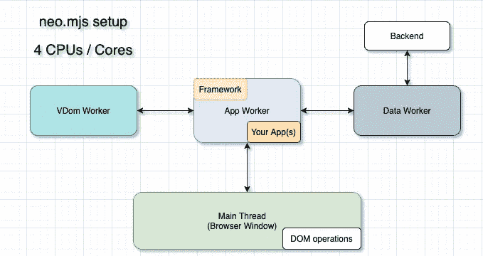
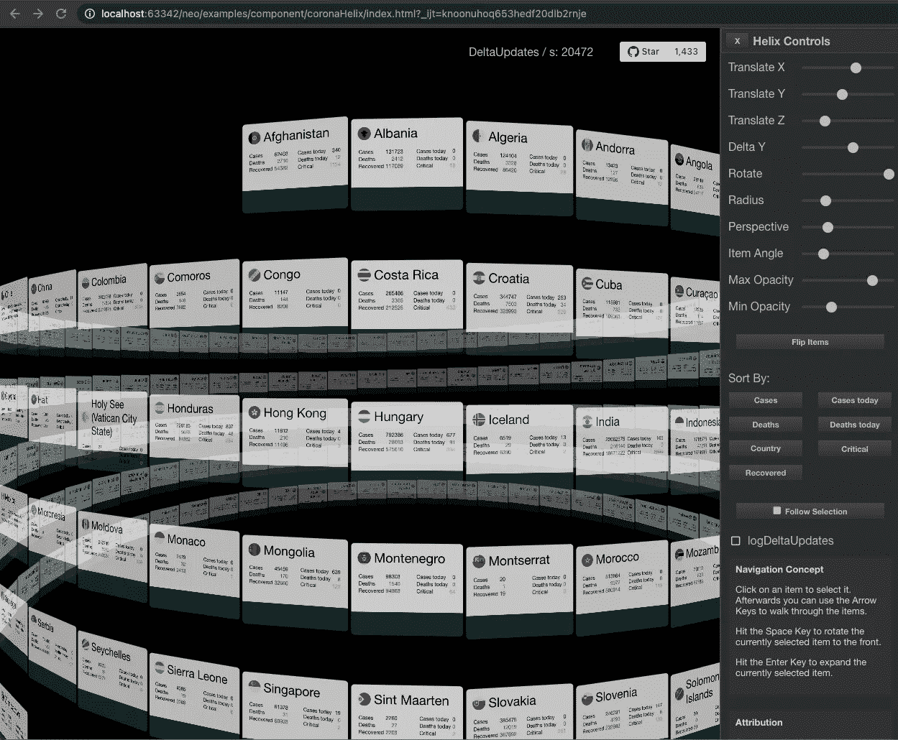
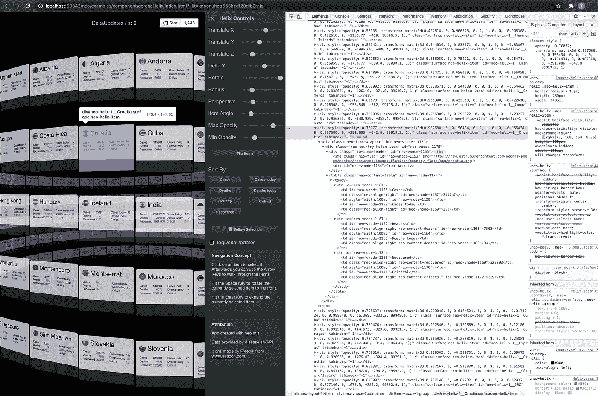
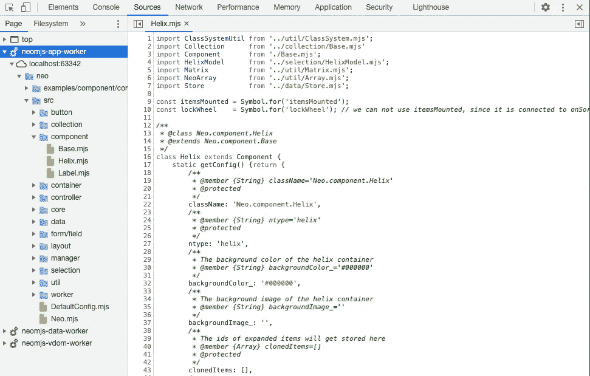
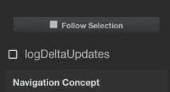
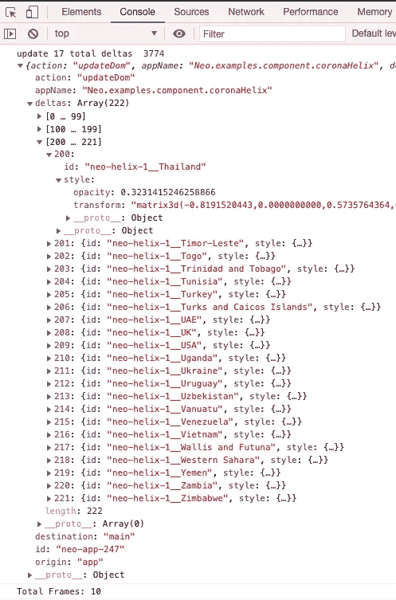

# 渲染性能演示:每秒 20.000 次增量更新

> 原文：<https://itnext.io/rendering-performance-demo-20-000-delta-updates-per-second-6f527d8eb8f5?source=collection_archive---------6----------------------->

为了更好地了解作为主角的应用程序工作人员有多强大，我增强了 helix 演示，为您提供了一个可视化的反馈。

# 内容

1.  介绍
2.  螺旋 DOM 结构
3.  滚动时内部会发生什么？
4.  检查控制台内部的增量
5.  视频来展示它的作用
6.  在线演示
7.  **更新:有 33k 更新的新演示**
8.  最后的想法

# 1.介绍

在 [neo.mjs](https://github.com/neomjs/neo) 中，您的应用程序和组件存在于应用程序工作器中:

最令人印象深刻的性能演示之一是 helix 组件。我给这个增加了一个视觉反馈，这样你就可以实时看到数字:

现在还有一个“logDeltaUpdates”复选框，它将把增量记录到您的开发人员工具控制台中。

# 2.螺旋 DOM 结构

这个演示是为了给你的浏览器增加压力而设计的。我们不使用 WebGL、SVG 或 Canvas，只使用 DOM 节点。

您可以检查控制台内的螺旋项目:

用鼠标滚轮滚动(水平→旋转、垂直→缩放)将更新所有 222 个螺旋项目的`transform: matrix3d()`值。

# 3.滚动时内部会发生什么？

如上所述，helix 组件直接存在于专用的或共享的应用程序工作器中。因为这个例子不是一个多窗口应用程序，“普通”的工作人员就足够了。

[轮事件](https://developer.mozilla.org/en-US/docs/Web/API/Element/wheel_event)显然发生在主线程内部，并且它非常频繁地触发。对于每个事件，主线程将发送一个 [postMessage](https://developer.mozilla.org/en-US/docs/Web/API/Worker/postMessage) 给应用工作器。

应用程序工作人员将把事件委托给我们的 helix 实例。

让我们来看看`refresh()`方法:

我们正在迭代所有的螺旋项目，并使用一点数学来计算新的旋转矩阵。

这里重要的部分是第 75 行:在 vdom worker 中使用虚拟 dom 引擎是可选的。我们可以将所有更改应用到 vdom 对象，并将其传递给引擎，以计算出我们需要的增量更新，但由于我们确实知道应该更改什么，我们可以简单地自行手动构建增量。这样肯定更快。

一旦我们有了所有 helix 项的新转换值，我们就向 main 发送一个 postMessage，将我们的 deltas 应用到真正的 DOM。

在主线程内部，我们的增量将被推入一个队列，该队列将使用 [requestAnimationFrame()](https://developer.mozilla.org/en-US/docs/Web/API/window/requestAnimationFrame) 处理每个增量更新。

重要的是要知道，增量更新可以比真正的 DOM 操作多得多。人眼和屏幕都有其局限性。例如，使用 60 FPS 的屏幕将增量更新的数量限制为 60 次屏幕刷新(使用每个节点的最后“状态”)。

为了显示增量的数量，我每 250 毫秒刷新一次内容 div。一秒钟感觉太慢了。

# 4.检查控制台内部的增量

helix 演示现在有以下复选框:

检查它会给你关于正在发生的事情的详细日志。

# 5.视频来展示它的作用

录制视频已经降低了性能。我在谷歌 Chrome 本地获得的最大值是每秒 20.472 次增量更新。

公平地说，我有一台非常快的电脑。

我在 Safari 中获得了更高的数字，但实际性能感觉更慢。

如果你想知道这是不是我们能得到的最高数字:

是**不是**。

我用更多的螺旋项目或一些表格单元更新演示得到了更大的数字。

# 6.在线演示

请使用**桌面**浏览器。这真的很重要。大多数 neo.mjs 演示尚未针对移动设备进行优化。

伙计们，我真的只说桌面。如果你使用移动设备，你会毁了你的第一印象。我们可以在某些时候调整演示(例如添加[滚动](https://developer.mozilla.org/en-US/docs/Web/API/Document/scroll_event)监听器)。

**分发/制作:**
适用于所有主流浏览器(基于 webpack 的输出)

[neo . mjs/dist/production/examples/component/corona helix/index . html](https://neomjs.github.io/pages/node_modules/neo.mjs/dist/production/examples/component/coronaHelix/index.html)

**devmode:**
在 Chrome 和 Safari Tech 预览版中工作。

[neo.mjs/examples/component/coronaHelix/index.html](https://neomjs.github.io/pages/node_modules/neo.mjs/examples/component/coronaHelix/index.html)

在 devmode 版本中，你可以看到真正的代码(没有构建或编译，没有源代码图)。

# 7.更新:33k 更新的新演示

现在我很好奇，想更进一步。

请使用**桌面**浏览器。这真的很重要。大多数 neo.mjs 演示尚未针对移动设备进行优化。

**地区/生产:**
[neo.mjs/dist/production/examples/component/helix/index.html](https://neomjs.github.io/pages/node_modules/neo.mjs/dist/production/examples/component/helix/index.html)

**devmode:**
[neo.mjs/examples/component/helix/index.html](https://neomjs.github.io/pages/node_modules/neo.mjs/examples/component/helix/index.html)

# 8.最后的想法

您可以在此处找到该项目:

 [## 近地天体

### neo.mjs 使您能够使用一个以上的 CPU 创建可扩展的高性能应用程序，而无需使用…

github.com](https://github.com/neomjs/neo) 

**剧透** : neo.mjs 刚刚获得了“2021 年最令人兴奋的技术应用”的提名，这是一个你绝对熟悉的奖项。我会随时通知你这件事。

总的来说，我真的很好奇你能在你的机器上得到的增量更新的最高数量。欢迎将数字作为评论发布！

如果您自己制作性能演示来强调引擎，那就更好了。我仍然没有弄清楚真正的极限。

感谢并致以最诚挚的问候，
托拜厄斯