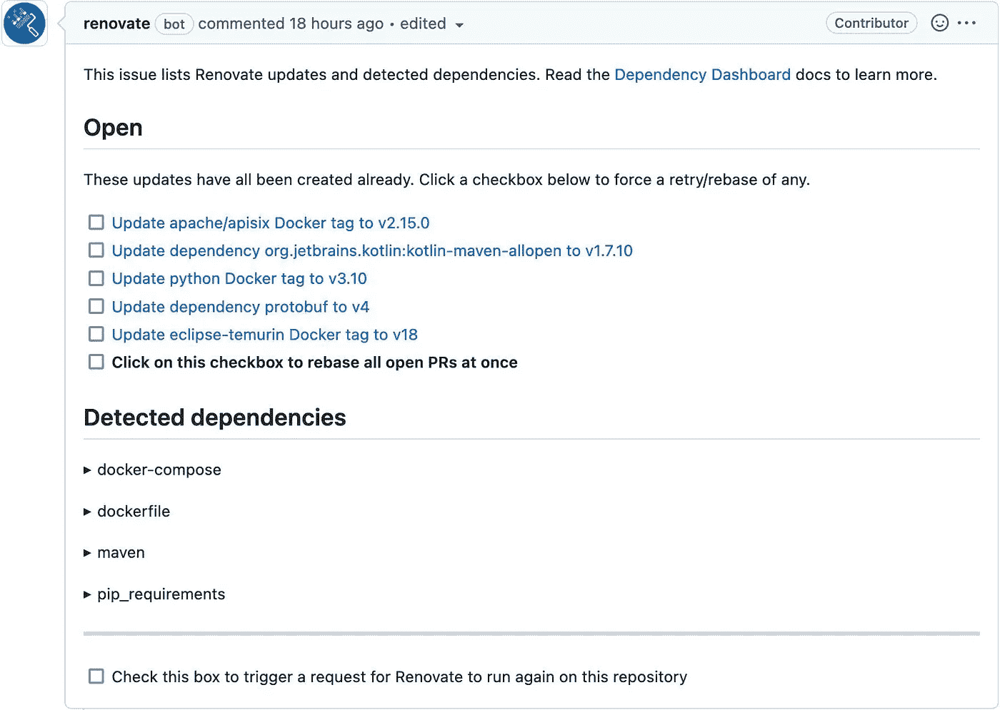

# 翻新，一个可靠的选择

> 原文：<https://itnext.io/renovate-alternative-dependabot-c4c80e6d488d?source=collection_archive---------3----------------------->


我就不介绍[依赖机器人](https://github.com/dependabot)了。很多很多开发者每天都在 GitHub 上使用它。我也用它。然而，它有两个缺点:

*   虽然它与 GitHub 完美集成，但与其他平台的集成却不那么无缝。
*   它被限制在它支持的[生态系统](https://docs.github.com/en/code-security/dependabot/dependabot-version-updates/configuration-options-for-the-dependabot.yml-file#package-ecosystem)的列表中，例如，我通常使用 Docker Compose 文件来制作我的演示。必要的时候，我用 Kubernetes。Dependabot 不支持任何功能。更糟糕的是，dependent bot[不接受添加新生态系统的贡献](https://github.com/dependabot/dependabot-core/blob/main/CONTRIBUTING.md#contributing-new-ecosystems)。

最近，我看了 Viktor Farcic 的[用 renew](https://www.youtube.com/watch?v=l0YH557eIiE)自动化依赖管理。发现[翻新](https://www.mend.io/free-developer-tools/renovate/)超级整洁，想过用用，又……忘了。后来我偶然发现了另一个关于它的说法。这促使我在两个地方实施它:

*   在我的博客上
*   关于使用 Docker Compose 的演示

# 保持我的博客更新

我已经写了很多次关于我的博客的基础设施。在本文中，相关部分包括:

*   它是根据哲基尔改编的。Jekyll 是一个基于 Ruby 的静态站点生成器。为了管理 Ruby gems 的依赖关系，我使用了 [bundler](https://bundler.io/) 。
*   GitLab 上的每次推送都是我生成的网站。我通过标准的`.gitlab-ci.yml`文件配置了构建。
*   最后，为了避免在每次构建时都构建整个基础设施，我依赖 Dockerfile 文件。它提供了 JRuby 基础映像和一些必需的二进制文件，*，例如*、`graphviz`。GitLab 构建从这个映像开始。

翻新提供[指令](https://gitlab.com/renovate-bot/renovate-runner/)为 GitLab 安装产品。因为我必须了解如何翻新工程和如何安装它，我不得不咨询了相当多的网站。

这里总结一下我的理解:

*   您需要在 GitLab 上创建一个专门的项目来运行 renew
*   GitLab 调度程序应每周或每天触发它，*，例如*
*   翻新有两种配置类型:一种适用于转轮本身*和*一种适用于项目。如果您在转轮上设置了参数，它们将应用于“翻新”运行的每个项目。该文档建议每个项目都应该获得其特定的配置。请注意，Renovate 提供了一种跨不同项目分解配置的机制。

最后，我得到了下面的翻新流道配置:

```
variables:
  RENOVATE_GIT_AUTHOR: Renovate Bot <bot@renovate.com>
  RENOVATE_REQUIRE_CONFIG: optionalinclude:
    - project: 'renovate-bot/renovate-runner'
      file: '/templates/renovate-dind.gitlab-ci.yml'              #1
```

1.  [模板](https://gitlab.com/renovate-bot/renovate-runner/-/blob/main/templates/renovate-dind.gitlab-ci.yml)提供了一组可靠的默认值，*例如*，环境变量:平台是 GitLab，日志级别是 info 等。

默认情况下，翻新“嗅探”项目使用的包管理器。在我的博客上，它也检查 HTML 文件。为了缩小范围，我只配置了必要的包管理器:

```
{
  "enabledManagers": ["gitlabci", "dockerfile", "bundler"]
}
```

它只允许管理 GitLab CI、Docker 和 Bundler 的依赖关系。

你可能想把`LOG_LEVEL`环境变量设置为`debug`，尤其是在开始的时候；这对*帮助极大*。例如，我最初的几次跑步因为一个神秘的信息`Repository is disabled - skipping`而停止。通过调试级别的日志记录，我可以理解为什么:`DEBUG: MRs are disabled for the project - throwing error to abort renovation`。

下一步是达到预期的结果。在我的例子中，Renovator 没有打开任何合并请求。

*   GitLab CI:
    构建文件用`latest`提到了我的图像，用`debug`提到了 Kaniko 图像。没有一个是语义上的，None 不能提供任何建议。虽然我不在乎前者，但我在乎后者。给未来的自己一个提示:我需要修复它。
*   docker:
    `Dockerfile`使用`jruby:9.3-jre11`作为父图像。虽然不是语义版本，但是 seen 可以提取出正确的语义版本(如日志中所见:`"currentVersion": "9.3",`)。然而，没有更新的版本和正确翻新做不了什么。
*   Gems:
    我使用的是 Bundler，依赖关系被固定在一个`Gemfile.lock`文件中。默认情况下，renew 不建议任何升级。

对于 GitLab 和 Docker，人们可以预期结果:没有语义版本化，也没有更高的版本。对于宝石，我有点不解。原因在于[renew 如何处理更新](https://docs.renovatebot.com/configuration-options/#rangestrategy)。

默认策略是`replace`:

> *如果新版本不在该范围内，则用新版本替换该范围，否则不更新任何内容*

另一个策略是`update-lockfile`:

> *当范围内更新可用时，更新锁文件，否则，对于范围外的更新，替换锁文件。作品为*`*bundler*`*`*composer*`*`*npm*`*`*yarn*`*`*terraform*`*和* `*poetry*` *至今。*****

**好像合理多了。我更新了 Jekyll 的配置文件:**

```
**{
  "enabledManagers": ["gitlabci", "dockerfile", "bundler"],
  "packageRules": [
    {
      "matchManagers": ["bundler"],                           #2
      "rangeStrategy": "update-lockfile"                      #1
    }
  ]
}**
```

1.  **更新要应用的范围策略**
2.  **仅对 Bundler —对 GitLab 或 Docker 没有任何意义**

**我重新运行了更新工作，这次我已经准备好了合并请求！Renovate 正确地识别了需要更新的依赖项，对它们进行了升级，并创建了 MR。**

```
 **4 |  4 |   | addressable (2.8.0)
 5 |  5 |   |   public_suffix (>= 2.0.2, < 5.0)
 6 |  6 |   | asciidoctor (2.0.17)
 7 |  7 | - | asciidoctor-diagram (2.2.1)
   |  8 | + | asciidoctor-diagram (2.2.3)
 8 |  9 |   |   asciidoctor (>= 1.5.7, < 3.x)
 9 | 10 |   |   asciidoctor-diagram-ditaamini (~> 1.0)
10 | 11 |   |   asciidoctor-diagram-plantuml (~> 1.2021)
11 |    |   |   rexml
12 |    | - | asciidoctor-diagram-ditaamini (1.0.1)
13 |    | - | asciidoctor-diagram-plantuml (1.2022.1)
   | 12 | + | asciidoctor-diagram-ditaamini (1.0.3)
   | 13 | + | asciidoctor-diagram-plantuml (1.2022.5)
14 | 14 |   |   colorator (1.1.0)
15 | 15 |   |   concurrent-ruby (1.1.10)
16 | 16 |   |   cssminify2 (2.0.1)**
```

**这里有一个日志片段展示了这种魔力:**

```
**{
  "depName": "asciidoctor-diagram",
  "managerData": {"lineNumber": 10},
  "datasource": "rubygems",
  "depTypes": ["jekyll_plugins"],
  "lockedVersion": "2.2.1",
  "depIndex": 7,
  "updates": [
    {
      "bucket": "non-major",
      "newVersion": "2.2.3",
      "newMajor": 2,
      "newMinor": 2,
      "updateType": "patch",
      "isRange": true,
      "isLockfileUpdate": true,
      "branchName": "renovate/asciidoctor-diagram-2.x-lockfile"
    }
  ],
  "warnings": [],
  "versioning": "ruby",
  "currentVersion": "2.2.1",
  "isSingleVersion": true,
  "fixedVersion": "2.2.1"
}**
```

# **保持演示最新**

**虽然我把我的博客放在 GitLab 的一个私人存储库上，但我所有的演示都是在 GitHub 上的公共存储库。正如我提到的，Dependabot 在 GitHub 上的集成非常出色。然而，它遗漏了一些我经常使用的包管理器，Docker 编写文件和 Kubernetes 清单。翻新救援！**

**对你的仓库进行改造是轻而易举的事。只需浏览 [GitHub 翻新 app](https://github.com/apps/renovate) ，点击右上角的大格力**安装**按钮。选择您要安装 renewal 的组织和存储库。**

**renew 将在每个匹配的存储库中打开一个 [Pull 请求](https://github.com/nfrankel/opentelemetry-tracing/pull/1)。PR 包含一个文件，即`renovate.json`配置文件。可以根据需要更新:[配置选项](https://docs.renovatebot.com/configuration-options/)很多！**

**从那时起，Renovate 将监控已配置的存储库并发送 PRs，*，例如*，在:**

*   **`[Dockerfile](https://github.com/nfrankel/opentelemetry-tracing/pull/5/files)`**
*   **`[docker-compose.yml](https://github.com/nfrankel/opentelemetry-tracing/pull/2)`**

**更好的是，renew Bot 限制 pr 的数量，以遵守 [GitHub 速率限制](https://docs.github.com/en/rest/overview/resources-in-the-rest-api#rate-limiting)。为了方便起见，它发送了一个名为“依赖仪表板”的[专用问题](https://github.com/nfrankel/opentelemetry-tracing/issues/4)，在那里你可以看到*所有*可用的依赖更新。**

****

**如何与仪表板交互是不言自明的。只需选中相关的复选框，它会打开一个关于依赖关系的 PR。如果低于速率限制，翻新也将打开 PRs。**

# **结论**

**翻新是一个伟大的工具。它可以在 GitHub 上无缝运行；在 GitLab 上，你需要一个专门的跑步者。**

**与 Dependabot 相比，我更喜欢 Renovate 更新 Docker、Docker Compose 和 Kubernetes 文件的能力。我从现在开始使用它。**

****更进一步:****

*   **[更新文档](https://docs.renovatebot.com/)**
*   **[改造管理者](https://docs.renovatebot.com/modules/manager/)**
*   **[GitLab 翻新转轮](https://gitlab.com/renovate-bot/renovate-runner)**

***原载于* [*一个 Java 极客*](https://blog.frankel.ch/renovate-alternative-dependabot/)*2022 年 8 月 21 日***