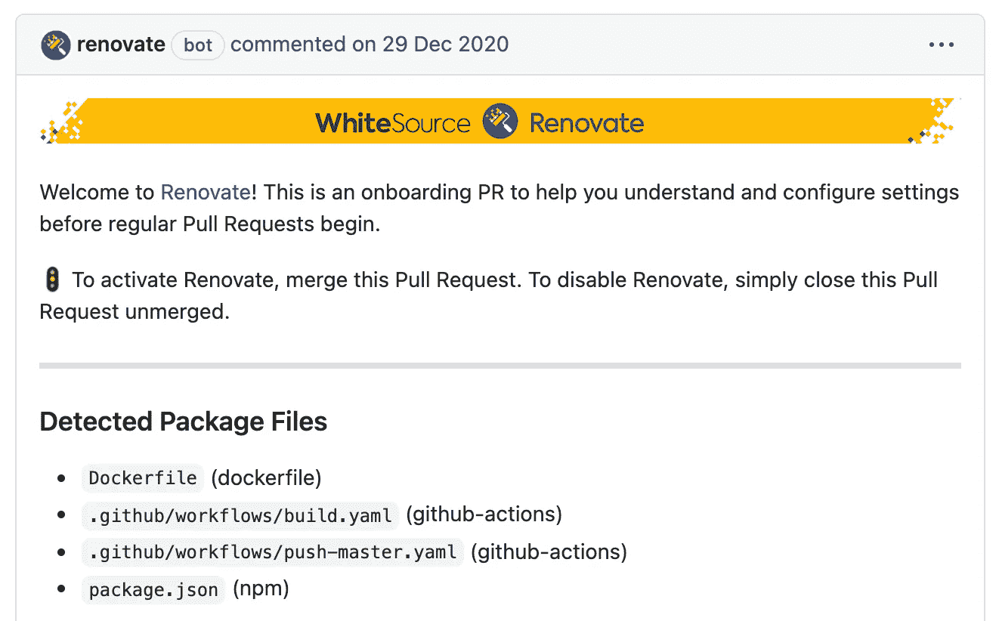

# 更新你的软件

> 原文：<https://itnext.io/renovate-your-software-2d767a48b1f2?source=collection_archive---------6----------------------->


照片由 [David Pisnoy](https://unsplash.com/@davidpisnoy) 在 Unsplash 上拍摄

代码腐烂。当你发布它的时候，你的软件就成为了遗产。有人称之为技术债务。你必须积极维护。本文将向您展示如何做到这一点。

# 问题陈述

今天的软件包含许多依赖项。通常，对于您选择的编程语言，您会使用大量的开源库。您的构建工具将引入额外的依赖项。此外，您可能会使用容器技术来发布您的程序，从而增加更多的依赖性。

这些依赖性带来了核心问题:新版本发布得很快。有不同的驱动因素:缺陷被修复，特性被添加——变化可能是向下兼容的或中断的。您通常不希望总是手动将所有依赖项更新到最新版本，因为这是一项繁琐的工作，会花费太多时间。

然而，严重的错误和安全漏洞需要快速修复。如果您不定期更新您的依赖项，您可能会面临大量的工作，因为差距越来越大，最终导致昂贵的迁移项目。

让我用几个流行的依赖项来说明这一点:

*   棱角分明的**4 年内有了 [9 个主要版本](https://en.wikipedia.org/wiki/Angular_(web_framework)#History)。**
*   **2017 年 Java 切换到半年发布时间表，导致 4 年内 [9 个主要发布](https://en.wikipedia.org/wiki/Java_version_history)。**
*   **Go 在 9 年内有 [17 个主要版本](https://golang.org/doc/devel/release.html)。**

**让我们来看看最近的严重漏洞:**

*   **Lodash 4 有一个原型污染攻击[漏洞](https://nvd.nist.gov/vuln/detail/CVE-2020-8203)。**
*   **HtmlUnit 2 包含代码执行[漏洞](https://nvd.nist.gov/vuln/detail/CVE-2020-5529)。**
*   **Spring Framework 5 容易受到反射文件下载攻击。**

# **解决方案策略**

**那么，你有什么选择？**

> **解决这个问题的最佳策略是自动化依赖性更新。**

**为什么？首先，您要保持依赖关系的最新状态。不再需要为重大更新做额外的计划—您可以持续地做。第二，如果由于依赖项更新而出现问题，您将立即得到反馈(前提是您有足够的自动化测试)。第三，因为你已经更新了，所以你面临的漏洞要少得多。没有任何应用程序安全测试工具会再困扰你了。**

# **革新**

**有什么工具可以帮助你实现这个策略吗？是的，有。[翻新](https://github.com/renovatebot/renovate#readme)就是这样的工具。它帮助您自动化依赖项更新，并且做得非常好。**

## ****第一步:入门****

**基本上有两种方法可以使用翻新:**

*   **[GitHub 应用](https://github.com/marketplace/renovate):要在 GitHub 上激活你的库，使用这个方便的集成。(注意，对于 GitLab.com，您必须使用下面的自托管变体。)**
*   **[自托管](https://docs.renovatebot.com/getting-started/running/#self-hosting-renovate):对于所有其他变体(内部部署，包括 GitLab.com 和本地执行)，renew 被打包为一个节点模块和 Docker 映像，具有针对不同[平台](https://docs.renovatebot.com/modules/platform/)的各种集成。**

## ****第二步:入职****

**当 renew bot 第一次运行时，它会在项目存储库的根目录中寻找一个*renew . JSON*配置文件。如果找不到这样的文件(或其他位置)，它将创建一个 onboarding 拉/合并请求，并建议使用以下默认配置添加这样的文件:**

```
{
    "extends": [
        "config:base"
    ]
}
```

****

**入职公关**

**一旦您合并此 PR，翻新将开始…翻新😃**

## ****第三步:配置****

**翻新是高度可配置的。当你开始使用 renewal 时，这可能有点让人不知所措。你可以浏览所有的[配置选项](https://docs.renovatebot.com/configuration-options/)，甚至还有更多[自托管实例](https://docs.renovatebot.com/self-hosted-configuration/)的选项。**

**注意，可以给*renew . JSON 添加配置选项；自托管选项——包括上面的配置选项——充当中央配置，属于自托管实例*中的*config.js/config.json*。****

## ****步骤 4:重复使用配置****

**您可以通过将通用配置添加到*renew . JSON*的“*extends”*数组中来重用它。以下是如何启用 Docker 主要更新的示例:**

```
{
    "extends": [
        "config:base",
        "docker:enableMajor"
    ]
}
```

**renew 已经配备了丰富的[配置预置](https://docs.renovatebot.com/presets-config/)。此外，您可以定义[您的预置](https://docs.renovatebot.com/config-presets/)，并与您的软件项目共享它们。这里有一个自定义预置用法的例子，位于[github>johanngyger/blog](https://github.com/johanngyger/blog/blob/main/renovate.json)(所有预置托管选项见[命名约定](https://docs.renovatebot.com/config-presets/#preset-hosting)):**

```
{
    "extends": [
        "config:base",
        "github>johanngyger/blog"
    ]
}
```

**对于自托管实例，您还可以在 *config.js* 中添加您的默认配置，这样您就不必将它添加到每个*renew . JSON*的“extends”数组中。**

## ****更新观念****

**在我们深入了解配置选项之前，您必须了解 renew 的一些核心概念:**

**[管理器](https://docs.renovatebot.com/modules/manager/)作为语言相关包管理器的主要抽象，比如 npm (JavaScript)、Maven (Java)、Bundler (Ruby)、Composer (PHP)等等。经理的目标是检测某种依赖类型，在革新术语中称为“包”。**

**[数据源](https://docs.renovatebot.com/modules/datasource/)知道如何更新一个包。一旦管理者识别出一个包，它将被分配给一个相应的数据源，该数据源知道如何获得可用的版本。**

**[版本化](https://docs.renovatebot.com/modules/versioning/)是对不同版本化方案的抽象，比如语义版本化。这是更新过程的最后一步。在识别出软件包并检测到可用版本后，版本化方案将确定新版本。**

## **包装规则**

**range 支持多种语言，并试图反映它们生态系统的特征。rules 有合理的缺省值，但是有时你想覆盖这些缺省值，这就是软件包规则发挥作用的地方。您可以将自己的规则添加到“packageRules”数组中。**

**这里有一些我觉得有用的例子。第一个将启用默认禁用的主要版本的 Docker 更新:**

```
"packageRules": [
    {
        "matchDatasources": ["docker"],
        "matchUpdateTypes": ["major"],
        "enabled": true
    }
]
```

**下一个将自动合并所有 Docker 包。默认情况下，runs 将分两次运行。第一次运行将创建 PR，随后的运行将合并 PR。(对于 GitLab，有一个漂亮的 [gitLabAutomerge](https://docs.renovatebot.com/configuration-options/#gitlabautomerge) 选项，这样当管道成功时，合并请求会自动合并。)**

```
"packageRules": [
    {
        "matchDatasources": ["docker"],
        "automerge": true,
        "gitLabAutomerge": true
    }
]
```

**以下规则将对 Go 模块更新进行分组，以便 PRs 不会淹没您:**

```
"packageRules": [
    {
        "matchDatasources": ["go"],
        "groupName": "Go modules",
        "groupSlug": "gomod",
        "separateMajorMinor": false
    }
]
```

## **正则表达式管理器**

**有时，默认经理不会发现一个包。您可以使用自定义正则表达式添加您的[经理](https://docs.renovatebot.com/modules/manager/regex/)。**

**下面的例子改变了 Docker 储存库的组织方式，即它支持子储存库。此外，还使用了不同的版本控制方案:**

```
"regexManagers": [
    {
        "fileMatch": [
            "(^|/|\\.)Dockerfile$",
            "(^|/)Dockerfile\\.[^/]*$"
        ],
        "matchStrings": ['FROM (?<depName>\\S*):(?<currentValue>\\S*)'],
        "datasourceTemplate": "docker",
        "versioningTemplate": "loose"
    }
]
```

# **结论**

**管理代码中的依赖关系需要时间。renew 可以通过自动更新依赖关系来自动化其中的一部分。翻新在基本配置中已经做得很好了，你应该马上激活它。但是，react 会不断地创建 PRs，所以你必须做出反应。**

**为了从革新中获得最大收益，你必须学习 T4 文件。您还必须了解配置选项，并尝试使用它们。有时你甚至必须研究翻新源代码。但是，一旦 renew 按照你的需求运作，那就是一大乐事。**