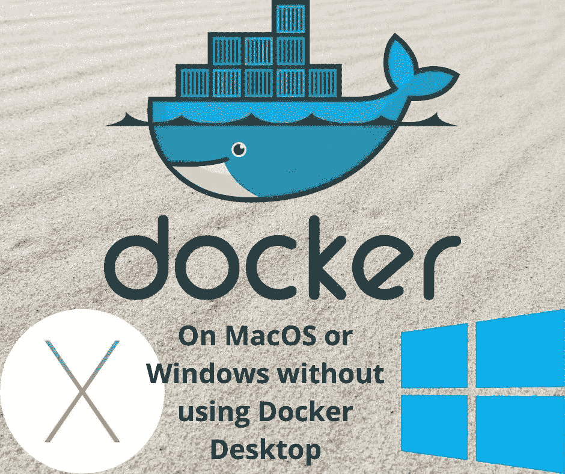

# 用 Multipass 替换 Docker 桌面，以避免 Docker 桌面费用

> 原文：<https://itnext.io/replacing-docker-desktop-with-multipass-to-avoid-docker-desktop-fees-8cbe57b9037f?source=collection_archive---------2----------------------->

## 在不需要 Docker 桌面的情况下，在 macOS 或 Windows 上设置 Docker 的令人惊讶的简单方法



**Docker 是开源软件，Docker Desktop 是一个漂亮的 GUI 应用程序，可以简化在 macOS 或 Windows 机器上安装 Docker。它值得使用，因为使用 Docker 非常容易。然而，Docker Inc .已经转向 Docker 桌面应用的免费增值模式，这将导致一些人避免使用它，而是寻求替代方案来避免支付费用。我们将讨论的是使用 Multipass 或其他虚拟机来避免这些费用。**

在 Docker 的旧时代，将它安装在 macOS 或 Windows 机器上是一项重大成就。由于 Docker 是在 Linux 上本地运行的，因此可以在 Docker Engine for Linux 上安装 Linux 虚拟机。在过去，这意味着使用 VirtualBox，这是一个重量级的虚拟机系统。使用 Docker 桌面是一个巨大的简化，因为 Docker 的一切都是作为一个普通的应用程序安装的。它带有一个很好的 GUI，可以通过鼠标点击来管理本地 Docker 实例。

纵观其历史，Docker Desktop 一直是免费的，但在 2021 年 8 月，Docker Inc 宣布了新的免费增值模式。详情见: [Docker Inc 从 Docker 桌面和其他 Docker 工具中榨取金钱](https://techsparx.com/software-development/docker/docker-desktop/not-free.html)。简而言之，超过一定规模的组织预计每个开发人员每月支付 5 美元左右。费用还包括 Docker Hub 上的服务。

我们中的一些人可能不愿意为 Docker 桌面每月支付 5 美元左右。因为 Docker 提供了极好的商业价值，所以付费是一个很好的理由。但是，我们有些人想知道他们可以用什么来代替 Docker 桌面。

需要注意的是 Docker 并不是不再免费了。Docker 仍然是免费的，但是 Docker 生态系统的一部分需要付费。

选择使用 Docker 桌面受到另一个事实的影响。过去在 macOS 或 Windows 上使用虚拟机设置 Docker 很困难，现在变得非常容易。换句话说，Docker 桌面有一个值得替代的东西，值得探索。

# 不使用 Docker 桌面在 macOS 或 Windows 上运行 Docker 的策略

Docker 桌面产品内部是一个运行虚拟 Linux 实例的轻量级管理程序。Linux 内部是 Docker 引擎的 Linux 版本。Docker Desktop 的神奇之处在于，hypervisor 对我们来说是不可见的。我们坐在命令行上键入`docker pull`或`docker build`，并不知道每个命令都到达虚拟 Linux 实例内部来做所有事情。

为了避免使用 Docker 桌面，我们需要回到安装一个运行 Linux 的虚拟机来安装 Docker 引擎的基础上，然后用某种方式变变魔术。幸运的是，现在一切都比过去简单了。例如，Multipass 是轻量级虚拟机平台，使用它我们可以轻松地设置和运行 Ubuntu 实例。然后我们可以安装 Docker，我们甚至可以配置多个 Linux 虚拟机，每个虚拟机都有一个 Docker 实例，这样我们就可以实现一个多节点集群来试验 Docker Swarm 或 Kubernetes。

我们的计划是这样:

*   使用 Canonical 的轻量级虚拟机系统 *Multipass* ，并在 Ubuntu 实例中安装 Docker 引擎。
*   对于 macOS，通过 MacPorts 或 HomeBrew 安装`docker` CLI。
*   对于 Windows，通过安装`docker` CLI...？看起来 Chocolatey 包管理器是最好的选择。
*   配置 Docker 上下文，以便与托管在 Multipass 实例中的 Docker 引擎进行通信。
*   如果我们想要实现 Docker Swarm，或者 Kubernetes 集群，那么可以通过启动多个 Multipass 实例来实现。

换句话说，这个计划依赖于托管 Docker 实例的显式 Linux 管理程序。这一次更简单了，因为 Docker 上下文特性，以及 Multipass 如何使启动轻量级 Linux 虚拟机变得容易。

# 在 Windows 或 macOS 上为 Docker 设置多通道实例

要安装 Multipass，请前往`https://multipass.run`并下载适用于您的操作系统的安装程序。运行安装程序，您将有一个新的命令，`multipass,`可用。Multipass 网站提供了一些命令示例，帮助您熟悉其用法。

我写过一篇关于使用 Multipass 设置多个 Docker 实例的文章，参见:[在您的笔记本电脑上使用 Multipass 和 Ubuntu 20.04 创建 Docker Swarm](https://techsparx.com/software-development/docker/swarm/multipass.html)…我们这里要做的是该过程的精简版本。

创建`setup-instance.sh`包含:

```
sudo apt-get update 
sudo apt-get upgrade -y 
sudo apt-get -y install \ 
       apt-transport-https \ 
       ca-certificates \ 
       curl \ 
       gnupg-agent \ 
       software-properties-common curl -fsSL https://download.docker.com/linux/ubuntu/gpg | \
       sudo apt-key add - sudo apt-key fingerprint 0EBFCD88 sudo add-apt-repository \ 
     "deb [arch=amd64] https://download.docker.com/linux/ubuntu $(lsb_release -cs) stable" sudo apt-get update 
sudo apt-get upgrade -y 
sudo apt-get install -y docker-ce docker-ce-cli containerd.io sudo groupadd docker 
sudo usermod -aG docker ubuntu 
sudo systemctl enable docker
```

这个脚本来源于在 Ubuntu Linux 上安装 Docker 的官方说明。

接下来，创建一个名为`init-instance.sh`的 shell 脚本，其中包含:

```
NM=$1 multipass launch --name ${NM} focal 
multipass transfer setup-instance.sh ${NM}:/home/ubuntu/setup-instance.sh 
multipass exec ${NM} -- sh -x /home/ubuntu/setup-instance.sh
```

这个脚本在 Multipass 上启动一个新的 Ubuntu 实例。然后它在新实例中执行`setup-instance.sh`。

运行脚本如下:`./init-instance.sh docker1`

它设置了 Multipass 实例，并初始化 Docker。要验证 Docker 是否正在运行，请键入以下命令:

```
multipass exec NAME -- docker run hello-world
```

这为您提供了一个 Docker 实例。我们可以在 Ubuntu 实例中运行 Docker 命令，但是要像 Docker 桌面一样，需要在我们的主机系统的命令行中运行 Docker 命令。为此，我们需要对 Multipass 实例进行无密码的 SSH 访问，然后设置 Docker 上下文。

# 设置对新创建的 Multipass 实例的无密码 SSH 访问

下一步是启用对 Multipass 实例的无密码 SSH 访问。我们需要它来设置一个上下文来控制 Docker 实例。参见:[如何在 Ubuntu 20.04 上启用 Multipass 内的无密码 SSH 登录](https://techsparx.com/linux/multipass/enable-ssh.html)如果您设置了远程 SSH 访问，步骤非常简单。只需将 SSH 密钥从`~/.ssh`(例如`~/.ssh/id_rsa.pub`)复制到 Ubuntu 实例中的`~/.ssh/authorized_keys`文件中。

一旦这些步骤完成，你应该能够运行`ssh -l ubuntu IP-ADDRESS`在 Ubuntu 实例中得到一个 shell 提示。而且，你应该能够运行这个:

```
$ ssh -l ubuntu  192.168.64.21 docker run hello-world
```

要了解 IP 地址，运行`multipass list.` 我们现在准备设置一个 Docker 上下文来简化它，但是首先我们需要在您的主机上安装开源 Docker 命令。

# 在 Windows 和 macOS 上安装开源`docker`命令

我们中有多少人使用 Docker 桌面 GUI？我很少使用它，也不会错过它。命令行`docker`命令足以满足我的需求。

安装 Docker Desktop 会给你命令行`docker`命令。因此，您可能已经安装了它们。但是我们正在探索的是在不依赖 Docker 桌面的情况下安装`docker`命令。

`docker`命令是开源的，并将永远保持开源。这意味着可以从包管理系统如 MacPorts 和 HomeBrew 获得包，提供`docker`命令。

使用 MacPorts:

```
port search docker 
... 
docker @20.10.9 (devel)
    The open-source application container engine docker-compose @1.29.2 (python, devel)
   Define and run multi-container applications with Docker 
... $ sudo port install docker 
Password: 
---> Fetching archive for docker 
---> Attempting to fetch docker-20.10.9_0.darwin_19.x86_64.tbz2 from https://packages.macports.org/docker 
---> Attempting to fetch docker-20.10.9_0.darwin_19.x86_64.tbz2.rmd160 from https://packages.macports.org/docker Installing docker @20.10.9_0 
---> Activating docker @20.10.9_0 
---> Cleaning docker 
---> Updating database of binaries 
---> Scanning binaries for linking errors 
---> No broken files found. 
---> No broken ports found.$ which docker 
/opt/local/bin/docker 
$ docker container ls 
Cannot connect to the Docker daemon at unix:///var/run/docker.sock. Is the docker daemon running?
$ /Applications/Docker.app/Contents/Resources/bin/docker --version
Docker version 20.10.8, build 3967b7d 
$ /Applications/Docker.app/Contents/Resources/bin/docker container ls 
Cannot connect to the Docker daemon at unix:///var/run/docker.sock. Is the docker daemon running?
```

与 MacPorts 管理的其他命令一样，`docker`命令安装在`/opt/local/bin`中。为了比较，我们找到了作为 Docker Desktop 的一部分安装的`docker`命令，并了解到当前版本是 20.10.8，而 MacPorts 安装的版本是 20.10.9。

当使用自制软件时，基本上是一样的:

```
$ brew install docker 
==> Pouring docker--20.10.10.catalina.bottle.tar.gz 
Error: The `brew link` step did not complete successfully The formula built, but is not symlinked into /usr/local 
Could not symlink bin/docker 
Target /usr/local/bin/docker
already exists. You may want to remove it:
  rm '/usr/local/bin/docker'To force the link and overwrite all conflicting files: brew link --overwrite docker 
... 
==> Summary 
🍺 /usr/local/Cellar/docker/20.10.10: 12 files, 56.8MB 
...
$ /usr/local/Cellar/docker/20.10.10/bin/docker --version
Docker version 20.10.10, build b485636f4b 
$ /usr/local/Cellar/docker/20.10.10/bin/docker container ls 
Cannot connect to the Docker daemon at unix:///var/run/docker.sock. Is the docker daemon running?
```

由于 Docker Desktop 安装了现有的`/usr/local/bin/docker`,自制软件安装失败。然而，它仍然被安装在指定位置的地窖中。这与 MacPorts 版本大致相同。注意，这个安装的版本是 20.10.10，这意味着所有三个源代码都是最新的。

在 Windows 上，应该有一个类似的包可以通过 WinGet 命令获得。WinGet 相当于我们刚刚研究过的 macOS 软件包管理系统。但是，似乎没有合适的`docker`包可以通过 WinGet 获得。然而，Docker 桌面和 Multipass 都是通过 WinGet 管理的。

在 Chocolatey 存储库中似乎有一个`docker`包。你可以在 https://chocolatey.org/[了解更多](https://chocolatey.org/)

Windows 上的另一个选项是启动一个 WSL2 实例，并在那里安装`docker`命令。

# 设置 Docker 上下文以控制在 Multipass 中运行的 Docker 实例

我们现在可以进入本文的要点，即将运行在主机系统上的`docker`命令与之前设置的 Ubuntu 实例内部的 Docker 实例连接起来。

2019 年，Docker 团队增加了一个新功能， *Docker Context* 。这是设置 Docker 实例远程控制的最简单、最安全的方式。传统的方法是公开暴露 Docker TCP 点，然后设置一些 TLS 证书和其他复杂的步骤。使用 Docker 上下文，我们可以使用无密码的 SSH 连接来连接远程 Docker 实例。

默认情况下，`docker`命令试图连接到本地主机上运行的 Docker 引擎。但是，除非您的主机上运行了活动的 Docker 桌面，否则以下操作将会失败:

```
$ docker ps 
Cannot connect to the Docker daemon at unix:///var/run/docker.sock. Is the docker daemon running?
```

`docker`命令支持一组连接到远程 Docker 实例的环境变量。连接远程 Docker 实例的典型方式是从远程主机公开 Docker TCP 端口。但这似乎是一个很大的安全问题。

Docker 上下文特性是一种更好的方法。有了 Docker Context，我们可以配置到数十或数百个远程 Docker 实例的连接，甚至可以连接到 AWS 或 Azure 上的 Docker 部署。你可以在我的书 [*使用 Terraform 将 Docker 容器部署到 AWS:在 EC2 或 ECS 上以简单的方式运行 Docker*](https://www.amazon.com/Deploying-Docker-Containers-using-Terraform-ebook/dp/B08WG578L1?pd_rd_w=c2QA4&pf_rd_p=c0296674-5a83-4ad6-b035-0702d2b359df&pf_rd_r=RQGPEJ2N7GT6TGRY6ZBA&pd_rd_r=cd10488f-7d6d-4818-9199-9f3dbca9eb7e&pd_rd_wg=BCIlw&pd_rd_i=B08WG578L1&psc=1&linkCode=ll1&tag=thereikipage&linkId=c30a8498d230dfe9af0c9e8f84146512&language=en_US&ref_=as_li_ss_tl)中了解更多关于使用 AWS 的信息。

要为在 Multipass 中运行的 Ubuntu 设置上下文，请运行以下命令:

```
$ docker context create docker1 \ 
     --docker "host=ssh://ubuntu@192.168.64.21"
docker1 
Successfully created context "docker1"
```

我们已经创建了一个名为`docker1`的上下文，它使用这里显示的 SSH URL 进行连接。这就是我们设置无密码 SSH 访问的原因，这样 Docker 就可以使用这个 SSH URL。

```
$ docker context list 
NAME       DESCRIPTION                               DOCKER
default *  Current DOCKER_HOST based configuration   unix:///var/run/docker.sock
docker1                                           ssh://ubuntu@192.168.64.21
```

该命令列出了您系统上当前可用的 Docker 上下文。`*`标记指示哪个上下文当前是活动的。

```
$ docker context use docker1 
docker1 
Current context is now "docker1" 
$ docker ps 
CONTAINER ID IMAGE COMMAND CREATED STATUS PORTS NAMES 
$ docker run -it alpine sh 
/ # uname -a
Linux a139bc7ff4f4 5.4.0-89-generic 
/ #
```

这表明我们在 Ubuntu 的 Multipass 中运行了 Docker，并且我们可以在台式机/笔记本电脑上使用`docker`命令来控制 Docker 实例。

当`docker`命令连接到`docker1`上下文时，我们这样做了。为了理解这有什么不同，让我们改变我们使用的上下文。

```
$ docker context use default 
default 
Current context is now "default" 
$ docker ps 
Cannot connect to the Docker daemon at unix:///var/run/docker.sock. Is the docker daemon running?
```

`docker context use`命令是我们从一个上下文切换到另一个上下文的方式。`default`上下文应该在主机上。在我的例子中，我安装了 Docker Desktop，但是它目前没有运行。在这种情况下,`default`上下文指的是 Docker 桌面活动时运行的 Docker 引擎。

可以创建其他 Docker 上下文。例如，我在一家虚拟主机提供商那里有一个虚拟专用服务器(VPS ),我在上面安装了 Docker。与 Docker 实例的交互如下所示:

```
$ docker context use host001 
host001 
Current context is now "host001"
```

我的名为`host001`的上下文提供了对一个 VPS 的远程控制，我在这个 VPS 上托管了几个制作网站。这些网站是使用 Docker Swarm 管理的。这意味着我可以运行这个命令:

```
$ docker stack ls 
NAME            SERVICES   ORCHESTRATOR 
backups         1          Swarm 
db              1          Swarm 
proxyman        2          Swarm 
wordpress-ltp   1          Swarm 
...
```

我可以很容易地用它在那台服务器上运行 Docker 命令，即使它位于数百英里之外。即使在这个距离上，响应时间也是极好的。

如果您喜欢总是显式选择上下文，请运行如下命令:

```
$ docker --context CONTEXT-NAME ps
```

然后，如果您想关闭 Docker 服务(在 Multipass 中),只需运行以下命令:

```
$ multipass stop docker1
```

要再次启动，使用`multipass start docker1`。

# 摘要

我们已经了解了一种在 macOS 或 Windows 机器上运行 Docker 的简单方法，无需安装 Docker Desktop。正在使用的 Docker 命令与 Docker 桌面产品提供的命令一样是最新的。使用基于 Multipass 的 Docker 实例和由 Docker Desktop 管理的实例的命令行用户体验是相同的。

如前所述，Multipass 可用于实现多节点 Docker 设置，比如用 Docker Swarm 或 Kubernetes 进行实验。要查看设置 Swarm 集群的说明，请遵循[在您的笔记本电脑上使用 Multipass 和 Ubuntu 20.04 创建 Docker Swarm】中的其余说明](https://techsparx.com/software-development/docker/swarm/multipass.html)

前面使用的指令导致在 Multipass 中安装 Ubuntu 20.04。其他操作系统映像也是可用的，您可以使用以下命令列出它们:

```
$ multipass find 
Image                  Aliases    Version   Description 
18.04                  bionic     20211021  Ubuntu 18.04 LTS 
20.04                  focal,lts  20211021  Ubuntu 20.04 LTS 
21.04                  hirsute    20211025  Ubuntu 21.04 
21.10                  impish     20211014  Ubuntu 21.10 
anbox-cloud-appliance             latest    Anbox Cloud Appliance 
minikube                          latest    minikube is local Kubernetes
```

请注意，Minikube 是可用的。这是一个简化在你的台式机/笔记本电脑上运行 Kubernetes 的工具。

[***大卫·赫伦***](https://techsparx.com/about.html) *:大卫·赫伦是一名作家和软件工程师，专注于技术的明智使用。他对太阳能、风能和电动汽车等清洁能源技术特别感兴趣。David 在硅谷从事了近 30 年的软件工作，从电子邮件系统到视频流，再到 Java 编程语言，他已经出版了几本关于 Node.js 编程和电动汽车的书籍。*

*原载于*[*https://techsparx.com*](https://techsparx.com/software-development/docker/docker-desktop/multipass.html)*。*