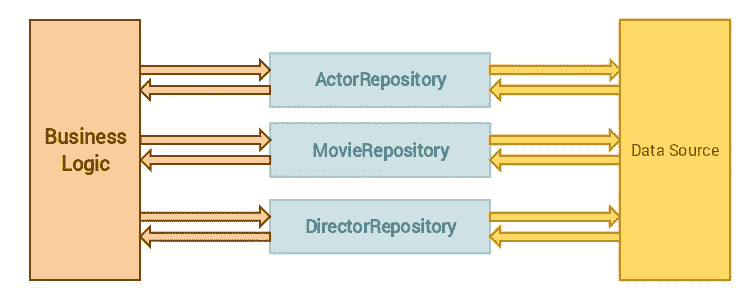

# Laravel 中的存储库设计模式

> 原文：<https://itnext.io/repository-design-pattern-done-right-in-laravel-d177b5fa75d4?source=collection_archive---------0----------------------->


在这篇文章中，我将向你展示如何在 Laravel 中从头开始设置存储库设计模式。我将使用 Laravel 5.8.3 版本，但 Laravel 版本应该不会有太大影响。在我们开始编码之前，您需要了解一些关于存储库设计模式的事情。



存储库设计模式允许您使用对象，而不必知道这些对象是如何持久化的。本质上，它是数据层的抽象。

这意味着您的业务逻辑不需要知道数据是如何检索的或者数据的来源是什么。业务逻辑依赖存储库来检索正确的数据。

关于这种模式，我经常看到一种误解，即存储库是以创建或更新记录的方式实现的。这是**而不是**一个存储库应该做的事情。存储库**不应该**创建或更新数据，但是**应该只使用**来检索数据。

## 理论讲够了，让我们开始编码吧

因为我们将从头开始，所以让我们从创建一个新的 Laravel 项目开始:

```
composer create-project --prefer-dist laravel/laravel repository
```

在本教程中，我将创建一个小型博客应用程序。现在我们已经创建了一个项目，我们需要为博客创建一个控制器和模型。

```
php artisan make:controller BlogController
```

这将在 *app/Http/Controllers* 文件夹中创建 BlogController。

```
php artisan make:model Models/Blog -m
```

*注意:
-m 选项将创建数据库迁移。该文件可以在数据库/迁移文件夹中找到。*

这将创建您的博客模型，并将其存储在 *app/Models* 文件夹中。这只是存储模型的一种方式，这也是我喜欢的方式。

现在我们有了控制器和模型，是时候看看我们创建的迁移文件了。除了默认的 Laravel 时间戳字段，我们的博客现在只需要一个*标题、内容*和 *user_id* 字段。

```
<?php

use Illuminate\Support\Facades\Schema;
use Illuminate\Database\Schema\Blueprint;
use Illuminate\Database\Migrations\Migration;

class CreateBlogsTable extends Migration
{public function up()
    {
        Schema::create('blogs', function (Blueprint $table) {
            $table->bigIncrements('id');
            $table->string('title');
            $table->text('content');
            $table->integer('user_id');
            $table->timestamps();

            $table->foreign('user_id')
                  ->references('id')
                  ->on('users');
        });
    }
public function down()
    {
        Schema::dropIfExists('blogs');
    }
}
```

*注意:
如果您使用的是比 Laravel 5.8 更旧的版本，您应该替换以下行*

```
$table->bigIncrements(‘id’);
```

*同*

```
$table->increments('id');
```

## 设置数据库

对于这个例子，我将使用一个 MySQL 数据库。第一步是创建一个新的数据库。

```
mysql -u root -p 
create database laravel_repository;
```

这将创建一个名为 *laravel_repository* 的数据库。接下来，我们必须将数据库凭证添加到*中。env* 文件。

```
DB_DATABASE=laravel_repository
DB_USERNAME=root
DB_PASSWORD=secret
```

在你改变了*之后。我们必须清除配置缓存:*

```
php artisan config:clear
```

## 运行迁移

现在我们已经设置了数据库，我们可以运行迁移了:

```
php artisan migrate
```

这将创建我们的*博客*表，带有我们在迁移中声明的*标题*、*内容*和*用户 id* 字段。

## 实现存储库设计模式

一切就绪后，我们现在可以开始实现存储库设计模式了。我们将首先在*应用程序*文件夹中创建一个*存储库*文件夹。我们将创建的第二个文件夹是*接口*文件夹。该文件夹将位于我们刚刚创建的*存储库*文件夹中。

在 *Interfaces* 文件夹中，我们创建了一个*BlogRepositoryInterface*类，它现在有两个方法:

1.  将返回所有博客的 *all* 方法。
2.  *getByUser* 方法将返回由特定用户创建的所有博客。

```
<?php

namespace App\Repositories\Interfaces;

use App\User;

interface BlogRepositoryInterface
{
    public function all();

    public function getByUser(User $user);
}
```

我们要创建的最后一个类是 *BlogRepository* ，它将实现*blog repository interface*。我们将坚持一个非常简单的实现。

```
<?php

namespace App\Repositories;

use App\Models\Blog;
use App\User;
use App\Repositories\Interfaces\BlogRepositoryInterface;

class BlogRepository implements BlogRepositoryInterface
{
    public function all()
    {
        return Blog::*all*();
    }

    public function getByUser(User $user)
    {
        return Blog::*where*('user_id'. $user->id)->get();
    }
}
```

您的*存储库*文件夹应该是这样的:

```
app/
└── Repositories/
    ├── BlogRepository.php
    └── Interfaces/
        └── BlogRepositoryInterface.php
```

您现在已经成功创建了您的存储库！但是我们还没有完成。是时候开始使用我们的存储库了。

## 运行中的存储库

开始使用 *BlogRepository* 时，我们应该将它注入 *BlogController* 中。因为存储库将被注入，所以很容易用另一个实现替换它。这是我们的控制器的样子:

```
<?php

namespace App\Http\Controllers;

use App\Repositories\Interfaces\BlogRepositoryInterface;
use App\User;

class BlogController extends Controller
{
    private $blogRepository;

    public function __construct(BlogRepositoryInterface $blogRepository)
    {
        $this->blogRepository = $blogRepository;
    }

    public function index()
    {
        $blogs = $this->blogRepository->all();

        return view('blog')->withBlogs($blogs);
    }

    public function detail($id)
    {
        $user = User::*find*($id);
        $blogs = $this->blogRepository->getByUser($user);

        return view('blog')->withBlogs($blogs);
    }
}
```

正如您所看到的，控制器中的代码很短，因此可读性很强。你不需要十行代码来获得你想要的数据集，所有的事情都可以在一行代码中完成，这多亏了这个库。这对于单元测试来说也很棒，因为存储库的方法很容易被模仿。

存储库设计模式也使数据源之间的转换变得非常容易。在这个例子中，我们使用数据库来检索我们的博客。我们依靠雄辩来为我们做到这一点。但是，假设我们在互联网上的某个地方看到了一个很棒的博客 API，我们想使用这个 API。我们所要做的就是重写 BlogRepository 来使用这个 API，而不是雄辩。

## RepositoryServiceProvider

我们将注入 BlogRepositoryInterface，而不是在 BlogController 中注入 BlogRepository，然后让服务容器决定使用哪个存储库。这可以在 *AppServiceProvider* 的 *boot* 方法中完成，但是我更喜欢为此创建一个新的提供者以保持整洁。

```
php artisan make:provider RepositoryServiceProvider
```

我们为此创建一个新的提供者的原因是，当您的项目开始增长时，事情会变得非常混乱。假设一个项目有超过 10 个模型，每个模型都有自己的存储库。您的*应用服务提供者*将变得不可读。

这是我们的*RepositoryServiceProvider*的样子:

```
<?php

namespace App\Providers;

use App\Repositories\BlogRepository;
use App\Repositories\Interfaces\BlogRepositoryInterface;
use Illuminate\Support\ServiceProvider;

class RepositoryServiceProvider extends ServiceProvider
{
    public function register()
    {
        $this->app->bind(
            BlogRepositoryInterface::class, 
            BlogRepository::class
        );
    }
}
```

请注意，用另一个存储库替换 BlogRepository 是多么容易。

不要忘记将*RepositoryServiceProvider*添加到 *config/app.php* 文件中的提供者列表中。之后，我们必须再次清除配置缓存。

```
php artisan config:clear
```

## 好了

现在，您已经成功地实现了存储库设计模式。没那么难，对吧？

您可以选择通过添加一些路由和视图来扩展您的代码，但是我将在这里结束这篇文章，因为这篇文章是关于实现存储库模式的。

如果你喜欢这篇文章，或者如果这篇文章帮助你建立了存储库设计模式，请务必看看我的其他文章。如果您有任何反馈、问题或希望我写另一个与 Laravel 相关的主题，请随时留下您的评论。